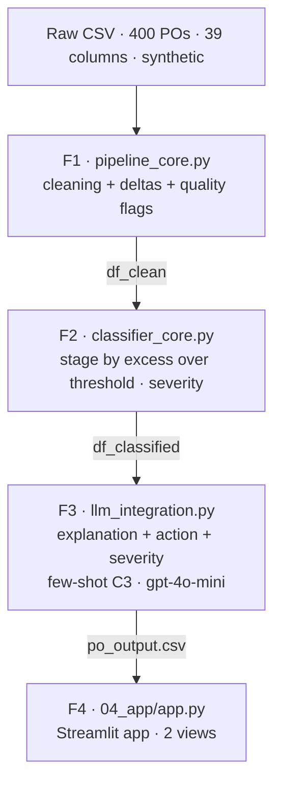

# PO Delay Root Cause Analyzer

[](https://github.com/CCMarv/po-delay-analyzer/actions/workflows/ci.yml)

Root cause analysis tool for delayed Purchase Orders (PO) in the supply chain: it classifies the responsible stage for the delay with deterministic rules regarding lifecycle timestamps and generates, with a LLM, an explanation and a recommended action per PO.

This cover guides and links; the details reside in each document (see the
[documentation index](#documentation-index)).

## Content

- [Objective](#objective)
- [Architecture](#architecture)
- [Quickstart](#quickstart)
- [Phase Status](#phase-status)
- [Repository Structure](#repository-structure)
- [Documentation Index](#documentation-index)
- [Technologies](#technologies)
- [Contribution](#contribution)
- [License](#license)

## Objective

The system receives transactional data from purchase orders, detects operational inconsistencies, and acts as an auditor identifying the root cause of each delay by contrasting the manual annotation of staff (`REASON_DSC`) with the reality of logistical timestamps. Human annotation is approximately 20% incorrect; the temporal computation corrects it, and those discrepancies are project findings, not errors to hide. The attribution is deterministic (not probabilistic): the primary stage is the segment with the highest excess over its threshold.

## Architecture

The data traverses four sequential phases; each consumes the artifact from the previous one and does not recompute what has already been resolved upstream.



| Phase | Module | Does | Produces |
|---|---|---|---|
| F1 | `01_data_pipeline_and_eda/pipeline_core.py` | Parses timestamps, calculates segments (`*_calc`) and marks quality flags without deleting rows. | `df_clean` |
| F2 | `02_clasif_reglas_negocio/classifier_core.py` | Assigns the responsible stage (Vendor / Carrier / DC / Indeterminate) by the highest excess over the mentor's threshold, plus a deterministic severity. | `df_classified` |
| F3 | `03_llm_integration/llm_integration.py` | For delayed PO, generates explanation, action, and severity with few-shot C3 on `gpt-4o-mini`. | `po_output.csv` (contract F3→F4) |
| F4 | `04_app/app.py` | Streamlit app with two views; reads `po_output.csv` and does not recompute previous phases. | individual + aggregated views |

## Quickstart

Deterministic end-to-end path (does not consume API). Requires Python 3.13.

```bash
# Clone and install
git clone https://github.com/CCMarv/po-delay-analyzer.git
cd po-delay-analyzer
python -m venv .venv && source .venv/bin/activate   # Windows: .venv\Scripts\Activate.ps1
pip install -r requirements.txt
cp .env.example .env                                 # Windows: Copy-Item .env.example .env

# Place the raw CSV (gitignored) in the default path — only needed
# to run the F1/F2 pipeline, not to open the app:
#   data/raw/po_root_cause_synthetic.csv

# Run the pipeline and the suite:
python 01_data_pipeline_and_eda/pipeline_core.py     # F1 — cleaning + validation
python 02_clasif_reglas_negocio/classifier_core.py   # F2 — stage classification
pytest                                                # 251 tests, no API

# Open the app (Phase 4). Without running Phase 3 locally, it falls back to the
# versioned sample (data/samples/); the complete artifact resides in
# data/processed/po_output.csv, generated by 03_llm_integration/llm_integration.py:
streamlit run 04_app/app.py
```

The complete detail of setup and execution resides in [CONTRIBUTING.md](CONTRIBUTING.en.md): Phase 3 
(LLM explanations; paid backends consume credits), Phase 4 (Streamlit app), the note
`PYTHONUTF8=1` for Windows consoles, and the workflow with git. The cover does not duplicate those commands.

## Phase Status

| Phase | Status | Summary |
|---|---|---|
| F1 — Data pipeline + EDA | closed | Ingestion pipeline, cleaning, and cross-validation + EDA. Deterministic, no API cost. |
| F2 — Stage Classification | closed | Deterministic classifier by excess over threshold; thresholds externalized in `rules_config.json`. |
| F3 — LLM Integration | closed | Wired production: few-shot C3 on `gpt-4o-mini` (OpenAI, official backend); `po_output.csv` generated. Continues as deferred work: lanes 2 (agentic) and 3 (local judge) of [ADR-16](documentation/decisiones/ARD-16.en.md); scope of the model card under deliberation (Discussion #80). |
| F4 — App + Evaluation | closed | Streamlit app with two views —individual (#163) and aggregated (#164)— rebuilt on the design system of the phase (ARD-17/ARD-22/ARD-23), plus a **Telegram bot** ([ADR-20](documentation/decisiones/ARD-20.en.md)) as a second channel for fixed commands on the same contract. Deferred: the *conversational* chatbot (#160, lane 3 of ADR-16) — distinct capability from the Telegram bot, which is already built. |

Distribution of stages across **247 delayed POs**: Vendor 131 (53.0%) · Carrier 40 (16.2%) ·
DC 37 (15.0%) · Indeterminate 39 (15.8%).

Header results (population, threshold, and reproducible source of each figure in
[metricas-proyecto.md](documentation/metricas-proyecto.en.md)):

| Metric | Value | Mentor Threshold |
|---|---|---|
| Stage accuracy | 100% (208/208) | > 80% ✅ |
| Reason agreement | 88.8% (174/196) | reference (not threshold) |
| LLM Explanation Quality | 5/5 (few-shot C3, revalidated at temp. 0.9) | > 4/5 ✅ |
| Severity Ranking | 100% (14/14) | > 95% ✅ |

## Repository Structure

```text
.
├── 01_data_pipeline_and_eda/     # F1 — pipeline + EDA
│   ├── pipeline_core.py          #   clean_po_data() + cross_validate_deltas() + deltas/flags
│   ├── data_pipeline_and_EDA.ipynb
│   └── README.md
├── 02_clasif_reglas_negocio/     # F2 — stage classification (deterministic)
│   ├── classifier_core.py        #   classify_po_stages() + severity + persistence
│   ├── metrics_core.py           #   stage accuracy + reason agreement + sensitivity
│   ├── rules_config.json         #   externalized thresholds (read by name)
│   ├── clasif_etapa.ipynb
│   └── README.md
├── 03_llm_integration/            # F3 — LLM layer over deterministic base
│   ├── llm_integration.py         #   build_prompt + backends (OpenAI/Claude/DeepSeek/Qwen)
│   ├── llm_integration_network_intelligence_view.py  # synthesis by actor (ADR-19) → agente1_raw.txt
│   ├── fewshot.py                 #   deterministic selection of few-shot C3
│   ├── fewshot_pool.json          #   audited pool of examples (mismatches from F2)
│   ├── scorecard_core.py          #   scorecards by entity (offline, no API)
│   ├── eval_*.py                  #   quality/severity/diversity benchmarks
│   ├── llm_config.json            #   reproducible inference parameters
│   ├── MODEL_CARD.md
│   └── README.md
├── 04_app/                       # F4 — Streamlit app (reads contract F3→F4)
│   ├── app.py                     #   landing
│   ├── config.py                  #   canonical columns + Okabe-Ito palette
│   ├── assets/styles.css
│   ├── components/                #   navbar, metrics_cards, badges, timeline
│   ├── pages/                     #   1 Exception Workbench (Diego) · 2 Network Intelligence (Ravi)
│   ├── services/data_service.py
│   ├── telegram_bot/              #   second consumption channel (ADR-20): bot.py, handlers/, services/
│   └── README.md
├── data/                         # raw/ and processed/ (gitignored; only .gitkeep)
├── documentation/
│   ├── decisiones/               # ADRs (ARD-01 … ARD-23) + README (log index)
│   ├── data_dictionary.md        #   the 39 columns + data card of the dataset
│   ├── metricas-proyecto.md      #   unique table of header metrics
│   ├── validacion-y-qa.md        #   layer validation method
│   ├── hallazgos-ai-vs-humano.md #   narrative: temporal computation vs human annotation
│   ├── user_personas.md          #   profiles that guide the design of Phase 4
│   ├── plan-traduccion.md        #   translation plan ES→EN (deferred)
│   ├── convenciones-issues.md    #   team management agreements
│   ├── SAD.md · SRS.md           #   architecture and requirements specifications
│   └── kickoff_po_root_cause.html
├── tests/                        # pytest suite (251 tests): F1/F2/F3, handoff, few-shot, evals, app
├── CONTRIBUTING.md               # setup, reproducibility, workflow, what not to commit, tests/CI
├── requirements.txt
├── pyproject.toml                # pytest config (pythonpath, testpaths)
├── .env.example                  # environment variables template (empty placeholders)
└── README.md
```

## Documentation Index

Organized by purpose (lens [Diátaxis](https://diataxis.fr)): what is consulted, what explains why, and what resolves a task.

### Reference — consult data and contracts

- [Data dictionary](documentation/data_dictionary.en.md) — the 39 columns of the dataset, types,
  known nulls, and their role in the rules; data card of the synthetic origin.
- [Model card (F3)](03_llm_integration/MODEL_CARD.en.md) — the LLM system: model, intended use,
  input data, evaluation metrics, and known limits.
- [Project metrics](documentation/metricas-proyecto.en.md) — unique table of the five
  header metrics, each with its population and reproducible source.
- Phase READMEs: [F1](01_data_pipeline_and_eda/README.en.md) ·
  [F2](02_clasif_reglas_negocio/README.en.md) · [F3](03_llm_integration/README.en.md) ·
  [F4](04_app/README.en.md) — methodology and "how to run" of each phase.

### Explanation — understand why

- [Project explanation](documentation/explicacion-proyecto.en.md) — narrative synthesis from
  beginning to end, organized by phase: connects the why of each decision (ADRs) with the resulting logic and its implementation. Entry point for reading continuity; does not replace SAD/SRS.
- [Decision log (ADRs)](documentation/decisiones/README.en.md) — historical record of taxonomy,
  thresholds, and contracts; superseded decisions are linked to current ones.
- [Validation and QA](documentation/validacion-y-qa.en.md) — the method of layer validation
  (unit, contract, metric, gate) and how a reviewer reproduces it.
- [Findings: computation vs human annotation](documentation/hallazgos-ai-vs-humano.en.md) — where temporal computation outperforms human reason code, with evidence by case.
- [User personas](documentation/user_personas.en.md) — the two profiles (individual query /
  batch report) that define the views of Phase 4.
- [Translation plan ES→EN](documentation/plan-traduccion.en.md) — scope, order, and trigger of the bilingual 
  translation, deliberately deferred.

### How-to — resolve a task

- [Contribution guide](CONTRIBUTING.en.md) — set up the environment, run the project, what not to
  commit, tests and CI, and the workflow with git.

## Technologies

- Language: Python 3.13.
- Data core: `pandas`, `numpy`.
- App (F4): Streamlit.
- LLM: the deliverable (`po_output.csv`) is generated with `gpt-4o-mini` (OpenAI, official backend);
  `claude-sonnet-4-6` (Anthropic), `deepseek-chat` (DeepSeek), and `qwen2.5:7b` (local via Ollama)
  are alternate backends with the same prompt and parsing interface.
- Testing: `pytest` (251 tests) in CI (GitHub Actions), on every push and every PR.
- Domain variables and columns (`IS_LATE`, `REASON_DSC`, `HOT_PO_FLAG`, lifecycle timestamps, …) are documented in the [data dictionary](documentation/data_dictionary.en.md).

## Contribution

The reproducible setup, workflow, and policy on what not to commit (secrets, CSV,
notebook outputs) are in [CONTRIBUTING.md](CONTRIBUTING.en.md). The agreements on issues,
labels, DoD, and the non-blocking merge rule can be found in
[convenciones-issues.md](documentation/convenciones-issues.en.md).

## License

Academic project (UDG / Blend360). It does not currently include a `LICENSE` file or a formal license. The dataset is synthetic and does not represent real entities.