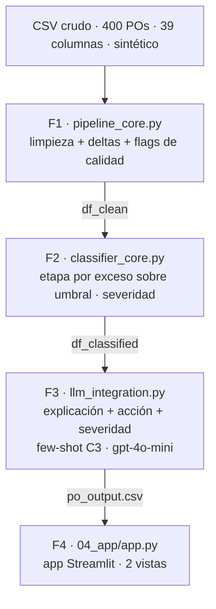

# PO Delay Root Cause Analyzer

[](https://github.com/CCMarv/po-delay-analyzer/actions/workflows/ci.yml)

Herramienta de análisis de causa raíz para Órdenes de Compra (PO) retrasadas de la cadena de
suministro: clasifica la etapa responsable del retraso con reglas deterministas sobre los
timestamps del lifecycle y genera, con un LLM, una explicación y una acción recomendada por PO.

Esta portada orienta y enlaza; el detalle vive en cada documento (ver el
[índice de documentación](#índice-de-documentación)).

## Contenido

- [Objetivo](#objetivo)
- [Arquitectura](#arquitectura)
- [Quickstart](#quickstart)
- [Estado de fases](#estado-de-fases)
- [Estructura del repositorio](#estructura-del-repositorio)
- [Índice de documentación](#índice-de-documentación)
- [Tecnologías](#tecnologías)
- [Contribución](#contribución)
- [Licencia](#licencia)

## Objetivo

El sistema recibe datos transaccionales de órdenes de compra, detecta inconsistencias
operativas y actúa como un auditor que identifica la causa raíz de cada retraso, contrastando
la anotación manual del personal (`REASON_DSC`) con la realidad de los timestamps logísticos.
La anotación humana es aproximadamente 20% incorrecta; el cómputo temporal la corrige, y esas
discrepancias son hallazgos del proyecto, no errores a esconder. La atribución es determinista
(no probabilística): la etapa primaria es el tramo con mayor exceso sobre su umbral.

## Arquitectura

El dato atraviesa cuatro fases secuenciales; cada una consume el artefacto de la anterior y no
recomputa lo ya resuelto aguas arriba.



| Fase | Módulo | Hace | Produce |
|---|---|---|---|
| F1 | `01_data_pipeline_and_eda/pipeline_core.py` | Parsea timestamps, calcula tramos (`*_calc`) y marca flags de calidad sin borrar filas. | `df_clean` |
| F2 | `02_clasif_reglas_negocio/classifier_core.py` | Asigna la etapa responsable (Vendor / Carrier / DC / Indeterminado) por mayor exceso sobre el umbral del mentor, más una severidad determinista. | `df_classified` |
| F3 | `03_llm_integration/llm_integration.py` | Por PO tardío, genera explicación, acción y severidad con few-shot C3 sobre `gpt-4o-mini`. | `po_output.csv` (contrato F3→F4) |
| F4 | `04_app/app.py` | App Streamlit con dos vistas; lee `po_output.csv` y no recomputa las fases anteriores. | vistas individual + agregada |

## Quickstart

Camino determinista de extremo a extremo (no consume API). Requiere Python 3.13.

```bash
# Clonar e instalar
git clone https://github.com/CCMarv/po-delay-analyzer.git
cd po-delay-analyzer
python -m venv .venv && source .venv/bin/activate   # Windows: .venv\Scripts\Activate.ps1
pip install -r requirements.txt
cp .env.example .env                                 # Windows: Copy-Item .env.example .env

# Colocar el CSV crudo (gitignored) en la ruta por defecto — solo hace falta
# para correr el pipeline F1/F2, no para abrir la app:
#   data/raw/po_root_cause_synthetic.csv

# Correr el pipeline y la suite:
python 01_data_pipeline_and_eda/pipeline_core.py     # F1 — limpieza + validación
python 02_clasif_reglas_negocio/classifier_core.py   # F2 — clasificación por etapa
pytest                                                # 249 tests, sin API

# Abrir la app (Fase 4). Sin correr Fase 3 localmente, cae a la muestra
# versionada (data/samples/); el artefacto completo vive en
# data/processed/po_output.csv, generado por 03_llm_integration/llm_integration.py:
streamlit run 04_app/app.py
```

El detalle completo de setup y ejecución vive en [CONTRIBUTING.md](CONTRIBUTING.md): la Fase 3
(explicaciones LLM; los backends de pago gastan créditos), la Fase 4 (app Streamlit), la nota
`PYTHONUTF8=1` para consolas Windows y el flujo de trabajo con git. La portada no duplica esos
comandos.

## Estado de fases

| Fase | Estado | Resumen |
|---|---|---|
| F1 — Data pipeline + EDA | cerrada | Pipeline de ingesta, limpieza y validación cruzada + EDA. Determinista, sin costo de API. |
| F2 — Clasificación por etapa | cerrada | Clasificador determinista por exceso sobre umbral; umbrales externalizados en `rules_config.json`. |
| F3 — Integración LLM | en curso | Producción cableada: few-shot C3 sobre `gpt-4o-mini` (OpenAI, backend oficial); `po_output.csv` generado. Pendiente: evaluación a nivel dataset y juez local ([ADR-16](documentation/decisiones/ARD-16.md)); alcance del model card en deliberación (Discussion #80). |
| F4 — App + evaluación | en curso | App Streamlit; dos vistas —individual (#163) y agregada (#164)— reconstruidas sobre el sistema de diseño de la fase. Chatbot diferido. |

Reparto de etapas sobre los **247 POs tardíos**: Vendor 131 (53.0%) · Carrier 40 (16.2%) ·
DC 37 (15.0%) · Indeterminado 39 (15.8%).

Resultados cabecera (población, umbral y fuente reproducible de cada cifra en
[metricas-proyecto.md](documentation/metricas-proyecto.md)):

| Métrica | Valor | Umbral del mentor |
|---|---|---|
| Stage accuracy | 100% (208/208) | > 80% ✅ |
| Reason agreement | 88.8% (174/196) | referencia (no umbral) |
| LLM Explanation Quality | 4.75/5 (few-shot C3) | > 4/5 ✅ |
| Severity Ranking | 100% (14/14) | > 95% ✅ |

## Estructura del repositorio

```text
.
├── 01_data_pipeline_and_eda/     # F1 — pipeline + EDA
│   ├── pipeline_core.py          #   clean_po_data() + cross_validate_deltas() + deltas/flags
│   ├── data_pipeline_and_EDA.ipynb
│   └── README.md
├── 02_clasif_reglas_negocio/     # F2 — clasificación por etapa (determinista)
│   ├── classifier_core.py        #   classify_po_stages() + severidad + persistencia
│   ├── metrics_core.py           #   stage accuracy + reason agreement + sensibilidad
│   ├── rules_config.json         #   umbrales externalizados (leídos por nombre)
│   ├── clasif_etapa.ipynb
│   └── README.md
├── 03_llm_integration/           # F3 — capa LLM sobre la base determinista
│   ├── llm_integration.py        #   build_prompt + backends (OpenAI/Claude/DeepSeek/Qwen)
│   ├── fewshot.py                 #   selección determinista del few-shot C3
│   ├── fewshot_pool.json          #   pool auditado de ejemplos (mismatches de F2)
│   ├── scorecard_core.py          #   scorecards por entidad (offline, sin API)
│   ├── eval_*.py                  #   benchmarks de calidad/severidad/diversidad
│   ├── llm_config.json            #   parámetros de inferencia reproducibles
│   ├── MODEL_CARD.md
│   └── README.md
├── 04_app/                       # F4 — app Streamlit (lee el contrato F3→F4)
│   ├── app.py
│   ├── config.py
│   └── README.md
├── data/                         # raw/ y processed/ (gitignored; solo .gitkeep)
├── documentation/
│   ├── decisiones/               # ADRs (ARD-01 … ARD-18) + README (log índice)
│   ├── data_dictionary.md        #   las 39 columnas + data card del dataset
│   ├── metricas-proyecto.md      #   tabla única de métricas cabecera
│   ├── validacion-y-qa.md        #   método de validación por capas
│   ├── hallazgos-ai-vs-humano.md #   narrativa: cómputo temporal vs anotación humana
│   ├── user_personas.md          #   perfiles que guían el diseño de la Fase 4
│   ├── plan-traduccion.md        #   plan de traducción ES→EN (diferido)
│   ├── convenciones-issues.md    #   acuerdos de gestión del equipo
│   ├── SAD.md · SRS.md           #   especificaciones de arquitectura y requisitos
│   └── kickoff_po_root_cause.html
├── tests/                        # suite pytest (244 tests): F1/F2/F3, handoff, few-shot, evals
├── CONTRIBUTING.md               # setup, reproducibilidad, flujo, qué no se commitea, tests/CI
├── requirements.txt
├── pyproject.toml                # config de pytest (pythonpath, testpaths)
├── .env.example                  # plantilla de variables de entorno (placeholders vacíos)
└── README.md
```

## Índice de documentación

Organizado por propósito (lente [Diátaxis](https://diataxis.fr)): qué se consulta, qué explica
el porqué y qué resuelve una tarea.

### Referencia — consultar datos y contratos

- [Data dictionary](documentation/data_dictionary.md) — las 39 columnas del dataset, tipos,
  nulos conocidos y su rol en las reglas; data card del origen sintético.
- [Model card (F3)](03_llm_integration/MODEL_CARD.md) — el sistema LLM: modelo, uso previsto,
  datos de entrada, métricas de evaluación y límites conocidos.
- [Métricas del proyecto](documentation/metricas-proyecto.md) — tabla única de las cinco
  métricas cabecera, cada una con su población y su fuente reproducible.
- READMEs de fase: [F1](01_data_pipeline_and_eda/README.md) ·
  [F2](02_clasif_reglas_negocio/README.md) · [F3](03_llm_integration/README.md) ·
  [F4](04_app/README.md) — metodología y "cómo correr" de cada fase.

### Explicación — entender el porqué

- [Registro de decisiones (ADRs)](documentation/decisiones/README.md) — el rastro histórico de
  taxonomía, umbrales y contratos; las decisiones superadas se encadenan a las vigentes.
- [Validación y QA](documentation/validacion-y-qa.md) — el método de validación por capas
  (unitario, contrato, métrica, gate) y cómo un revisor lo reproduce.
- [Hallazgos: cómputo vs anotación humana](documentation/hallazgos-ai-vs-humano.md) — dónde el
  cómputo temporal supera al reason code humano, con la evidencia por caso.
- [User personas](documentation/user_personas.md) — los dos perfiles (consulta individual /
  reporte por lote) que definen las vistas de la Fase 4.
- [Plan de traducción ES→EN](documentation/plan-traduccion.md) — alcance, orden y disparador de
  la traducción bilingüe, diferida de forma deliberada.

### How-to — resolver una tarea

- [Guía de contribución](CONTRIBUTING.md) — montar el entorno, correr el proyecto, qué no se
  commitea, tests y CI, y el flujo de trabajo con git.

## Tecnologías

- Lenguaje: Python 3.13.
- Core de datos: `pandas`, `numpy`.
- App (F4): Streamlit.
- LLM: el entregable (`po_output.csv`) se genera con `gpt-4o-mini` (OpenAI, backend oficial);
  `claude-sonnet-4-6` (Anthropic), `deepseek-chat` (DeepSeek) y `qwen2.5:7b` (local vía Ollama)
  son backends alternos con la misma interfaz de prompt y parseo.
- Pruebas: `pytest` (244 tests) en CI (GitHub Actions), en cada push y cada PR.
- Las variables y columnas del dominio (`IS_LATE`, `REASON_DSC`, `HOT_PO_FLAG`, los timestamps
  del lifecycle, …) se documentan en el [data dictionary](documentation/data_dictionary.md).

## Contribución

El setup reproducible, el flujo de trabajo y la política de qué no se commitea (secrets, CSV,
outputs de notebook) están en [CONTRIBUTING.md](CONTRIBUTING.md). Los acuerdos de issues,
labels, DoD y la regla de merge no bloqueante, en
[convenciones-issues.md](documentation/convenciones-issues.md).

## Licencia

Proyecto académico (UDG / Blend360). No incluye un archivo `LICENSE` ni una licencia formal por
ahora. El dataset es sintético y no representa entidades reales.
