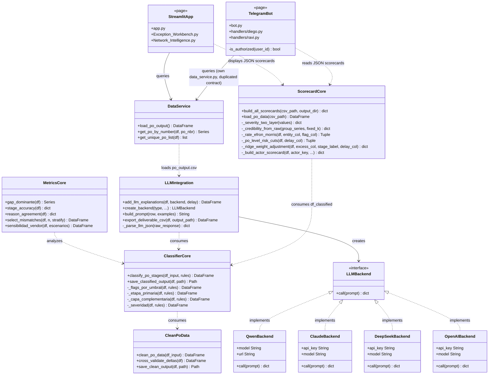
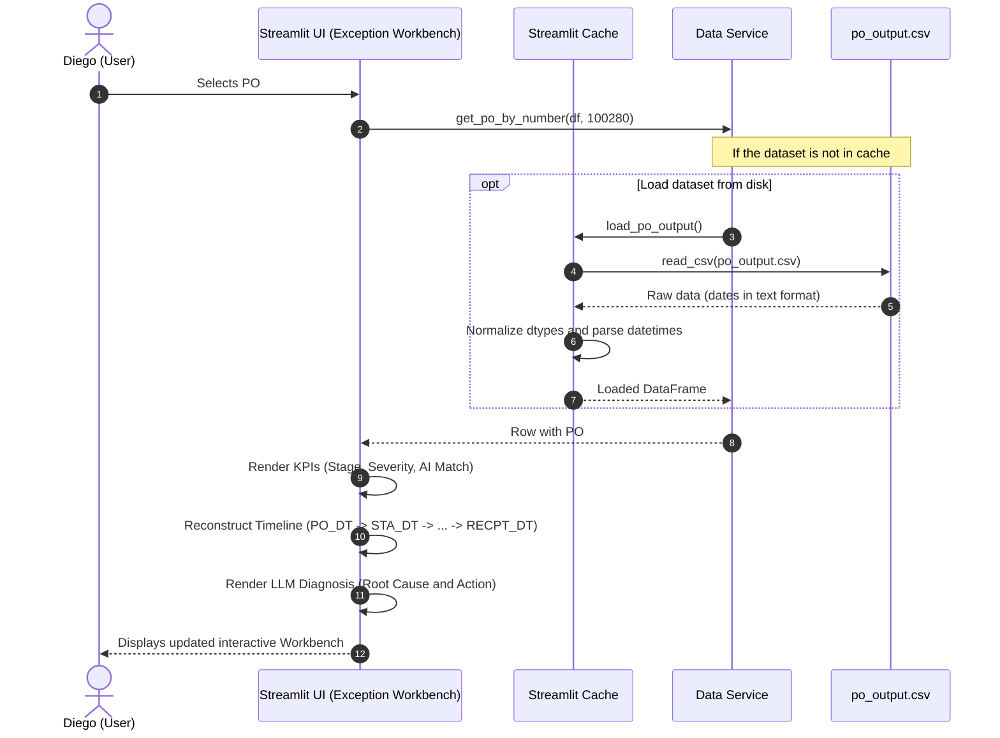
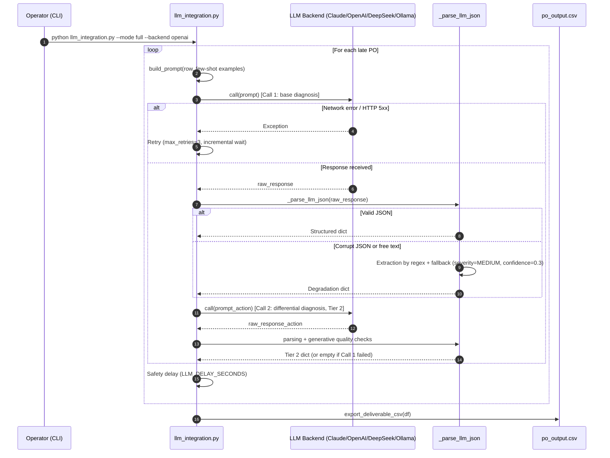
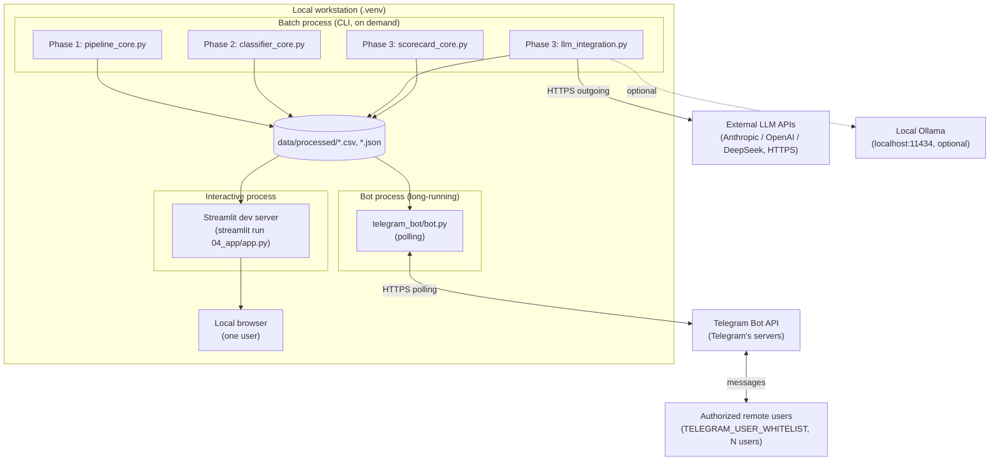

# Software Architecture Document (SAD)
## System: PO Delay Root Cause Analyzer

> `SAD.md` is the versioned source of truth for this document; `exports/SAD.docx` is a derived/exported copy for delivery, not edited directly.

---

### Table of Contents
1. [Introduction and Objectives](#1-introduction-and-objectives)
2. [Architectural Representation](#2-architectural-representation)
3. [Architectural Views (4+1 Model)](#3-architectural-views-41-model)
4. [Architectural Decisions](#4-architectural-decisions)
5. [Quality Tactics and Patterns](#5-quality-tactics-and-patterns)
6. [External Interfaces and Dependencies](#6-external-interfaces-and-dependencies)

---

### 1. Introduction and Objectives

#### 1.1 Purpose and Architectural Scope
This Software Architecture Document (SAD) provides a description of the architecture of the **PO Delay Root Cause Analyzer** system. It clearly and formally outlines the fundamental design decisions, architectural styles, the physical and logical organization of the code, and the technical justification of the solutions implemented in the repository. The scope ranges from the initial data ingestion pipeline to the user-oriented Streamlit interface.

#### 1.2 Quality Goals
The architecture addresses and guarantees the following quality goals through the structuring of its code:
*   **Maintainability (Maintainability and Modularity Index):** The solution is structured under a highly decoupled scheme of "Phases" (1 to 4). Each stage of the operational life cycle resides in its own subdirectory and interacts through well-defined data contracts (CSV files). Business logic thresholds and AI inference parameters are segregated from execution scripts in JSON files (`rules_config.json` and `llm_config.json`). Additionally, the scorecards engine (`scorecard_core.py`) encapsulates the statistical and mathematical profiling of actors in isolation, reducing coupling with the main orchestration of the LLM.
*   **Security:** The handling of environment variables and third-party API keys is done according to industry standards (Twelve-Factor App). The system natively blocks hardcoding credentials and includes protections to prevent leaks of operational information in the cloud when operating offline.
*   **Performance and Efficiency:** The separation between the batch generation of the AI narrative diagnosis (Phase 3), the statistical pre-calculation of scorecards (Phase 3), and the loading of visual data in Streamlit (Phase 4) ensures that the dashboard delivers information instantly to the business user.

#### 1.3 Architectural Constraints
*   **Base Technology:** Exclusive implementation in Python 3.x.
*   **Persistence:** Persistence is limited to flat files (CSV and JSON) read and structured using the `pandas` library, which restricts the use of complex concurrent transactional operations at the hot record level.
*   **Inference Dependencies:** Dependency on external HTTP/REST endpoints for consuming cloud models.
*   **Scientific and ML Dependencies:** Requirement for the `scikit-learn` and `scipy` libraries in the runtime environment to support dynamic regularizations (Ridge), probabilistic segmentation (GMM), and mathematical smoothing in the scorecards engine.

---

### 2. Architectural Representation

#### 2.1 Architectural Style(s) Used
The system is designed under the **Layered Architecture** style coupled with a **Decoupled Data Pipeline** approach. The project topology is subdivided into 4 sequential execution layers that communicate exclusively through file exchanges on disk in the `data/processed/` folder:

```
┌──────────────────────────────┐
│  Layer 1: Ingestion and      │ (01_data_pipeline_and_eda/pipeline_core.py)
│          Cleaning             │
└──────────────┬───────────────┘
               │ (df_clean.csv)
               ▼
┌──────────────────────────────┐
│ Layer 2: Rule Classifier     │ (02_clasif_reglas_negocio/classifier_core.py)
└──────────────┬───────────────┘
               │ (df_classified.csv)
               ├──────────────────────────────────────────────┐
               ▼                                              ▼
┌──────────────────────────────┐              ┌──────────────────────────────┐
│     Layer 3: AI Audit       │ (llm_int.py) │ Layer 3: Scorecards Engine   │ (scorecard_core.py)
└──────────────┬───────────────┘              └──────────────┬───────────────┘
               │ (po_output.csv)                             │ (reporte_*.json)
               ▼                                              ▼
               └───────────────────────┬──────────────────────┘
                                       ▼ (Handoff F3->F4)
┌──────────────────────────────┐                ┌──────────────────────────────┐
│ Layer 4: Streamlit Dashboard  │ (04_app/app.py)│  Layer 4: Telegram Bot       │ (telegram_bot/bot.py)
└──────────────────────────────┘                └──────────────────────────────┘
```

The Telegram bot ([ADR-20](decisiones/ARD-20.en.md)) is a second consumer of Layer 4, in parallel with the Streamlit dashboard: it reads the same F3→F4 handoff (`po_output.csv`, scorecards) without recomputing anything or invoking the LLM at query time, and without depending on the dashboard being open.

This decoupling allows any component to be executed or tested independently using automated tests (isolation of handoff boundaries).

#### 2.2 Applied Design Patterns
1.  **Factory Pattern:** Implemented in `create_backend` within `03_llm_integration/llm_integration.py`. The factory reads the user's selection and the `llm_config.json` configuration file to dynamically return the corresponding backend instance (`QwenBackend`, `ClaudeBackend`, `DeepSeekBackend`, `OpenAIBackend`).
2.  **Strategy/Adapter Pattern:** LLM backend classes encapsulate the complexity of REST requests specific to each API (Anthropic, OpenAI, DeepSeek, Ollama), implementing a unified contract through the `.call(prompt)` method.
3.  **Facade Pattern:** The `data_service.py` module acts as a data access facade for the Streamlit application pages, simplifying the loading, encoding, and indexing of individual purchase order records.
4.  **Contract / Dual Contract Pattern:** Applied in the test suite via `test_handoff_contract.py` to ensure that the in-memory DataFrame before persistence is functionally identical in values and columns to the DataFrame retrieved from the disk's CSV file.
5.  **Estimator Pattern:** `scorecard_core.py` encapsulates the analytical estimation logic (Bayesian smoothing, Ridge regression, and GMM), providing a unified execution interface through the public method `build_all_scorecards`.

---

### 3. Architectural Views (4+1 Model)

#### 3.1 Logical View
The logical view describes the object-oriented and functional decomposition of the solution. The core processing classes and components are detailed in the following diagram:



#### 3.2 Process View
The process view describes how data and control flow at runtime. 

The critical flow of **batch generation** processes the cleaning and classification chain in one direction. In Layer 3, the execution of the AI cognitive audit (`llm_integration.py`) and the statistical modeling of scorecards (`scorecard_core.py`) occur sequentially by reading the common intermediate artifact `df_classified.csv`. 

The critical flow of **interactive query** in Streamlit (when Diego selects and reviews a PO) is detailed in the following sequence diagram:



The critical flow of **batch generation in Phase 3**, including the retry path and degradation in the event of LLM failures (RNF-03), is detailed in the following sequence diagram:



#### 3.3 Development View
The physical organization of the source code follows a structured order by the phases of the project's life cycle:

*   `01_data_pipeline_and_eda/`: Extraction, typing, and cleaning of timestamps layer. Contains the core script for Phase 1.
*   `02_clasif_reglas_negocio/`: Logical layer of deterministic rules and analytical validation metrics. Contains the active rules in JSON and precision calculations.
*   `03_llm_integration/`: Semantic auditing layer and statistical modeling. Contains the LLM backend factories, the pool of few-shot examples for discrepancies, and the **scorecards performance and risk engine (`scorecard_core.py`)**. It also includes `llm_integration_network_intelligence_view.py`, the generator of the executive network synthesis by actor (Vendor/Carrier/DC) based on the statistical scorecards of `scorecard_core.py`, governed by [ADR-19](decisiones/ARD-19.en.md): it uses a different SDK (`openai-agents`, a multi-agent architecture of three specialized agents in sequence) and consolidates its output in `data/processed/agente1_raw.txt`, which the `Network Intelligence` page (`04_app/pages/2_📊_Network_Intelligence.py`) consumes in production. It is a real dependency from Phase 3→Phase 4, not an isolated component (corrected as per [ARD-21](decisiones/ARD-21.en.md), which pointed out the previous characterization of this document as incorrect).
*   `04_app/`: Interactive user interface. Divided into assets (CSS), reusable components (Navbar), the Landing Page (`app.py`), data services, and user pages. Also includes `telegram_bot/` ([ADR-20](decisiones/ARD-20.en.md)): a second consumption channel for the same F3→F4 contract, with its own `bot.py`, `handlers/` (one per persona, `diego.py`/`ravi.py`), and `services/` (fail-closed authentication, data loading) — today a parallel, unshared copy of `04_app/`'s data layer, a debt documented in the ADR itself.
*   `tests/`: Global pytest suite for unit validation and data contract validation.
*   `requirements.txt`: Explicitly stated and pinned declaration of dependent libraries, including pandas, numpy, streamlit, plotly, requests, tqdm, pytest, and implicitly linked scorecard dependencies (`scikit-learn` and `scipy`).
*   `pyproject.toml`: Configuration for pytest execution and root directories to include in the Python path.

#### 3.4 Physical / Deployment View
The repository does not contain containerization artifacts (`Dockerfile`, `docker-compose`) or cloud deployment configuration — the current execution is a single local process:

*   **Execution Environment:** A virtual Python environment (`.venv`) on a single machine (analyst's workstation or laptop). There is no separation of processes by phase: the batch pipeline (F1-F3) and the app (F4) run as manually launched scripts/processes in sequence, not as persistent services.
*   **Batch Component (F1-F3):** Executed on demand via CLI (`python 01_data_pipeline_and_eda/pipeline_core.py`, etc.), relying on the scientific libraries `pandas`, `numpy`, `scikit-learn`, and `scipy` installed in the same environment.
*   **Interactive Component (F4):** Served locally by the Streamlit development server (`streamlit run 04_app/app.py`), exposed by default on `localhost` to a single user at a time; it is not designed for multi-user concurrency or load balancing.
*   **Bot Component (F4, [ADR-20](decisiones/ARD-20.en.md)):** Independent long-running process (`python 04_app/telegram_bot/bot.py`, `python-telegram-bot` with polling against the Telegram API), a materially different deployment shape from the dashboard: it is not confined to a single local user — any user whose Telegram ID is in `TELEGRAM_USER_WHITELIST` can reach it remotely, in parallel, from outside the workstation, through Telegram's own servers. It shares the same virtual environment and the same `data/processed/` files as the rest of F4, but runs as a process separate from the Streamlit server.
*   **Persistence:** Flat files in `data/processed/` (CSV and JSON), shared by direct read/write between batch processes, the app, and the bot — there is no independent data service layer.
*   **Known State:** Elevating this configuration to a production-quality deployment (packaging, hosting, multi-user dashboard) is identified as pending work, not implemented as of the date of this document. The bot already operates with multiple remote users by design (via Telegram), but as a manually launched local process, with no process supervision (systemd, container) or automatic restart on crash.



#### 3.5 Scenario View
1.  **Scenario 1: Diego routes an exception (Discrepancy Case):** Diego opens the Exception Workbench. He selects an order marked as "Disagreement" (e.g., the human blamed "Yard congestion" but the temporal classifier marks "Carrier" due to excess transit of 30h). Diego reads the LLM's explanation ("The excess is concentrated on the carrier, contradicting the recorded reason..."). Diego opens a ticket with transportation and marks the exception as resolved.
2.  **Scenario 2: Ravi audits quarterly network reliability:** Ravi accesses Network Intelligence. He views the distribution chart and notes that 56% of delays come from Vendors. He analyzes the AI's aggregated agreement rate (of 88.7%) and extracts the list of POs in disagreement. This gives him reproducible evidence to negotiate penalties with vendors in the next meeting.
3.  **Scenario 3: Supplier Scorecard Evaluation by Ravi:** Ravi enters the aggregated panel in Network Intelligence. The system reads the file `reporte_vendors.json` (calculated by `scorecard_core.py`). Ravi sees that the supplier 'MEDIQ' has a normalized risk score of 85.5 (High Risk). Ravi observes that the Average Delay is 5.5 days, and that their reschedule rate is 10%. This gives Ravi solid scientific arguments to summon the vendor to a review meeting, knowing that the metric is protected against the noise of small samples.
4.  **Scenario 4: Diego checks a PO from the Telegram bot outside the browser:** Diego is on a call with the carrier and does not have the dashboard open. He sends `/po 100280` to the bot. The bot checks his ID against the whitelist, reads `po_output.csv` (the same artifact Streamlit consumes, without recomputing anything or invoking the LLM) and replies in text with the diagnosis, the recommended action, and the agreement with the human reason — the same information he would see in the Exception Workbench, without opening the browser.

---

### 4. Architectural Decisions

The following are the architectural decisions that significantly impact the views and tactics of this document, following the MADR (Markdown Architecture Decision Records) standard. Sections 4.1, 4.2, and 4.4-4.8 have their own ADR in `documentation/decisiones/`; section 4.3 is documented here for not having one.

#### 4.1 [ADR-01] Lifecycle timestamps as the only operational source of truth
*   **Status:** Accepted / Current.
*   **Context:** The input dataset holds both lifecycle timestamps and pre-calculated columns (`DELAY_DAYS`, `DOCK_HRS`, etc.). The latter exhibit numerical inconsistencies and incorrect human classifications (~20%).
*   **Decision:** Use the native timestamps as the only source of truth. All time delta and key metric is recalculated from scratch in Phase 1 of the pipeline to ensure consistency and analytical integrity.
*   **Consequences:** Greater precision in metrics. Need to manage anomalies in timestamps (time reversals). The pre-calculated columns are restricted solely to cross-validation audit tasks.

#### 4.2 [ADR-02] Primary stage attribution by the highest excess (`argmax`) with complementary multi-cause vector
*   **Status:** Accepted / Current.
*   **Context:** A single PO can accumulate excess time in more than one segment (Vendor, Carrier, DC) simultaneously. Forcing a single cause through fixed priorities would obscure the real friction of secondary segments.
*   **Decision:** The primary stage is dynamically assigned using `argmax` over the excess hours of each segment against its own threshold. A multi-cause vector (`stage_multi`) is additionally attached that preserves the record of all activated excess flags, instead of discarding them by only retaining the winner.
*   **Consequences:** The model accurately reflects the relative severity of the impact of each actor. Aggregation in reports must consider the multi-cause vector for advanced analyses, which adds complexity to queries.
*   **Note:** This decision assumes the broader design criterion already established since the project brief, which is to use deterministic business rules (fixed and auditable thresholds) instead of black-box probabilistic models (e.g., Random Forest or neural networks) — this general criterion is not documented as a separate ADR.

#### 4.3 Persistence and handoff via CSV files and JSON reports on disk (Decoupled Batch Pipeline)
*   **Status:** Architectural decision documented in this SAD. It does not have its own ADR in `documentation/decisiones/`: the current log does not record the choice of CSV/JSON against a database engine as a separately discussed decision.
*   **Context:** The system runs in development environments and interactive interfaces where loading and resources are local, and the pipeline runs in batch mode.
*   **Decision:** Utilize flat CSV files and structured JSON reports in conventional directories (`data/processed/`) with validated handoff contracts, rather than an active relational database engine (PostgreSQL/MySQL) or a monolithic in-memory pipeline.
*   **Consequences:** Simplicity in deployment, ease of auditing the intermediate data of each phase, and absolute decoupling of phases (the pipeline and classifier do not require active calls to the LLM to run). Limits continuous real-time processing, which is acceptable given the retrospective nature of the business.

The following are other decisions from the log (`documentation/decisiones/`) with direct architectural weight on the views and tactics described in this document:

#### 4.4 [ADR-07] Indeterminate Taxonomy
*   **Status:** Accepted / Current.
*   **Context:** Late purchase orders without a cause attributable to Vendor, Carrier, or DC cannot be forced into one of those three categories without reintroducing bias.
*   **Decision:** The addition of the column `indeterminado_substage` with two mutually exclusive subcategories: `sin_datos` (measurable delay but lacking audit timestamps, e.g., no trailer record) and `sin_causa_dominante` (complete data, but no segment exceeds its threshold).
*   **Consequences:** The classifier evaluates 100% of the dataset without blind discards; Phase 3 receives an explicit distinction between "lack of information" and "operation within tolerance."

#### 4.5 [ADR-09] User personas as a design criterion for Phase 4
*   **Status:** Accepted / Current (closed 2026-06-27).
*   **Context:** Phase 4 needed a defensible design axis beyond organizing the app by chain entity (Vendor/Carrier/DC).
*   **Decision:** Define two personas per consumption mode — Diego (individual PO inquiry) and Ravi (aggregated report by batch) — and derive the two views of the app (`Exception Workbench`, `Network Intelligence`), instead of organizing by measured entity.
*   **Consequences:** Traceability persona → view → contract columns from F3→F4. The previous placeholder organized by entity was discarded as a design criterion.

#### 4.6 [ADR-10] Hybrid severity: the LLM emits it, the Phase 2 rule audits it
*   **Status:** Accepted / Current (closed 2026-06-27).
*   **Context:** There were two conflicting sources of severity: the LLM (kickoff from the mentor) and a deterministic Phase 2 rule (`_severidad`), with a prompt threshold that also did not match either.
*   **Decision:** The official severity column of the deliverable (`severity` in `po_output.csv`) is issued by the LLM. The deterministic Phase 2 rule is retained as an auditing column (not exposed in the deliverable) and feeds the Severity Ranking metric. The prompt threshold is corrected to `hot PO + delay > 3 days ⇒ HIGH`.
*   **Consequences:** The deliverable meets the mentor's guidelines without losing auditability; the LLM-vs-rule discrepancy becomes a reportable finding instead of remaining hidden.

#### 4.7 [ADR-16] The LLM as an analytical layer over the validated deterministic base
*   **Status:** 🔵 Draft (active decision, not yet closed by the team; already implemented in `main`).
*   **Context:** After validating the deterministic logic of Phases 1-2, the mentor requested to enrich the LLM explanation beyond restating what was already decided by the rules, applying domain knowledge, reasoning, and synthesis.
*   **Decision:** The LLM operates in two chained calls: the first issues the base diagnosis (`causa_raiz`, `severidad`, `coincide_con_reason_code`, `confianza`); the second, conditioned on the first, issues a differential diagnosis (`razonamiento`, main hypothesis with evidence and tiered action plan, alternative hypothesis with its discriminative step, and a second specific confidence of the hypothesis). The factual premises remain anchored to the data (ADR-14); domain generalizations are enabled and marked as such.
*   **Consequences:** Recommended actions shift from generic meta-actions to actionable plans with business decisions, at the cost of increased variance between runs and duplicating the output scheme consumed by Phase 4 (see contract Tier 1/Tier 2 in the SRS, §3.4).

#### 4.8 [ADR-17] Visual language and color coding of the taxonomy
*   **Status:** Accepted / Current (closed 2026-07-14).
*   **Context:** The app exposes stage (nominal), severity (ordinal), and confidence of the LLM (grouped scalar) in both views, with a prior arbitrary palette that is not safe for color blindness.
*   **Decision:** Stage is coded with the Okabe-Ito categorical palette (safe for all three types of color blindness); severity and confidence are coded with a chromatic luminance ramp reinforced with shape/icon and text label, without competing for the color channel of the stage. Light/dark theme variants are defined with the same hue and verified WCAG contrast (`04_app/config.py`, `04_app/assets/styles.css`).
*   **Consequences:** Unique and accessible coding by construction throughout the app, defensible by a published framework (Munzner, Cleveland-McGill, Okabe-Ito, WCAG 2.1) instead of aesthetics. The native Streamlit *chrome* (sidebar, some widgets) falls outside this scope and does not respond to the theme.

---

### 5. Quality Tactics and Patterns

*   **Security:**
    *   **Secrets Isolation:** Use of the `python-dotenv` library to load sensitive variables from the local `.env` file.
    *   **Git Security:** Prevention of accidental uploads of credentials or datasets through the `.gitignore` file which strictly excludes the `data/` folders (except placeholders) and the `.env` file.
*   **Fault Tolerance:**
    *   **Fallback JSON Parser:** If the LLM returns free text or corrupt JSON, the function `_parse_llm_json` extracts the usable part using regular expressions (`\{[\s\S]*\}`) and applies an emergency degradation dictionary to prevent processing failures.
    *   **Error Coercion:** Use of `errors='coerce'` when formatting dates so that garbage values are transformed into `NaT` (Not a Time) handled cleanly through quality logical flags.
    *   **Resiliency on API:** Automatic retries (`max_retries = 3`) on HTTP 5xx connection failures and safety delays to avoid Rate Limit blocks.

*   **Performance:**
    *   **Visual-Inference Separation:** The Streamlit interface does not make hot calls to LLM APIs. It reads texts already calculated in the Phase 3 batch process, reducing dashboard load latency to milliseconds.
    *   **Streamlit Caching:** Application of `@st.cache_data` in `04_app/services/data_service.py` to cache the output dataset in memory, avoiding repetitive parsing of strings to datetime on each page render.

*   **Observability (current state, not aspirational):**
    *   **Logging:** The batch process of Phase 3 (`llm_integration.py`) reports its progress via `print()` statements to stdout; there is no `logging` module with levels, structured format, or file persistence. There is no standardized logging strategy among phases.

*   **Usability and Accessibility:**
    *   **Consistent visual coding ([ADR-17](decisiones/ARD-17.en.md)):** Stage, severity, and LLM confidence share a single visual language (Okabe-Ito palette for stage, luminance ramp + icon + text for severity/confidence) defined just once in `04_app/config.py`/`04_app/assets/styles.css`, with contrast verified against WCAG 2.1 and light/dark theme variants.

---

### 6. External Interfaces and Dependencies

The system integrates and depends on the following third-party APIs and interfaces:

1.  **Anthropic Claude API:** Endpoint `https://api.anthropic.com/v1/messages`. Requires the environment variable `ANTHROPIC_API_KEY` and consumes the model `claude-sonnet-4-6`.
2.  **OpenAI API:** Endpoint `https://api.openai.com/v1/chat/completions`. Requires `OPENAI_API_KEY` and consumes by default `gpt-4o-mini`.
3.  **DeepSeek API:** Endpoint `https://api.deepseek.com/v1/chat/completions`. Requires `DEEPSEEK_API_KEY` and consumes the model `deepseek-chat`.
4.  **Ollama Local Engine:** Local HTTP service at `http://localhost:11434/api/generate`. Consumes by default the local model `qwen2.5:7b`.
5.  **Local Scientific Libraries:** Dependency on the local Python runtime for the `scikit-learn` and `scipy` libraries to perform weight calibration (Ridge), gaussian clustering (GMM), and normalizations.
6.  **Telegram Bot API ([ADR-20](decisiones/ARD-20.en.md)):** External messaging service via `python-telegram-bot`, with outgoing polling (no exposed webhook). Requires `TELEGRAM_BOT_TOKEN` (obtained from `@BotFather`). It is the only external F4 dependency that exposes the system to remote users outside the local workstation.

From the 4 supported backends, the **current production configuration** (`03_llm_integration/llm_config.json`) sets: backend **OpenAI**, model `gpt-4o-mini`, `temperature=0.9`, `seed=42` (best-effort reproducibility), `max_tokens=512` (base diagnosis) / `max_tokens_action=1536` (Tier 2 differential diagnosis), `timeout_seconds=60`, `max_retries=3`, with selection of few-shot examples in the variant "C3" of the curated pool (`fewshot_pool.json`).

#### Environment Variables and Operational Control (read from `.env`):
*   `PO_CSV_PATH`: Path to the original raw CSV.
*   `PO_CLEAN_OUTPUT_PATH`: Output path for processed data in Phase 1.
*   `PO_OUTPUT_PATH`: Output path for classified data in Phase 2.
*   `LLM_DELAY_SECONDS`: Safety delay between calls to the LLM API.
*   `LLM_RETRY_SLEEP_SECONDS`: Wait before retrying a failed call.
*   `LLM_SAVE_EVERY`: Partial save interval in batch processing.
*   `TELEGRAM_BOT_TOKEN`: Bot token, obtained from `@BotFather` (secret).
*   `TELEGRAM_BOT_USERNAME`: Public bot handle (not secret), used in the landing page's link.
*   `TELEGRAM_USER_WHITELIST`: Comma-separated authorized Telegram IDs; empty = fail-closed, no one authorized.
*   `TELEGRAM_RAVI_USER_IDS`: Telegram IDs with the Ravi profile; the rest default to Diego.
*   `DEMO_MODE`: Explicit bypass of the authorization gate, for demonstrations only (empty/false by default).