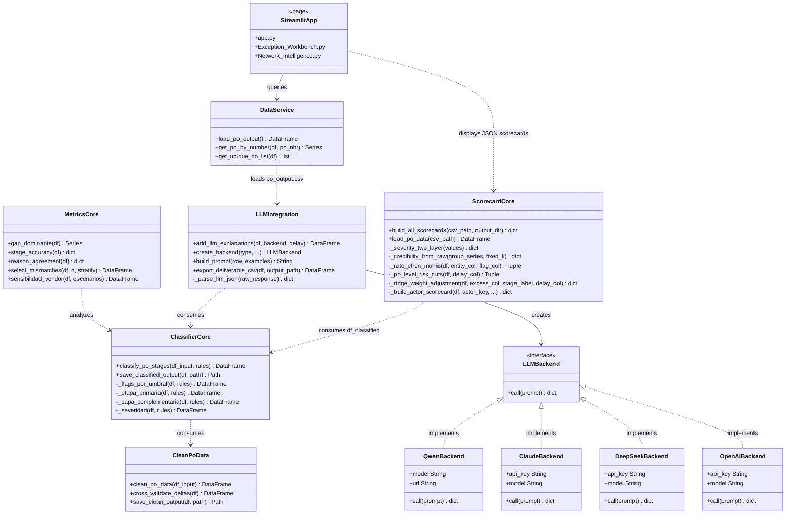
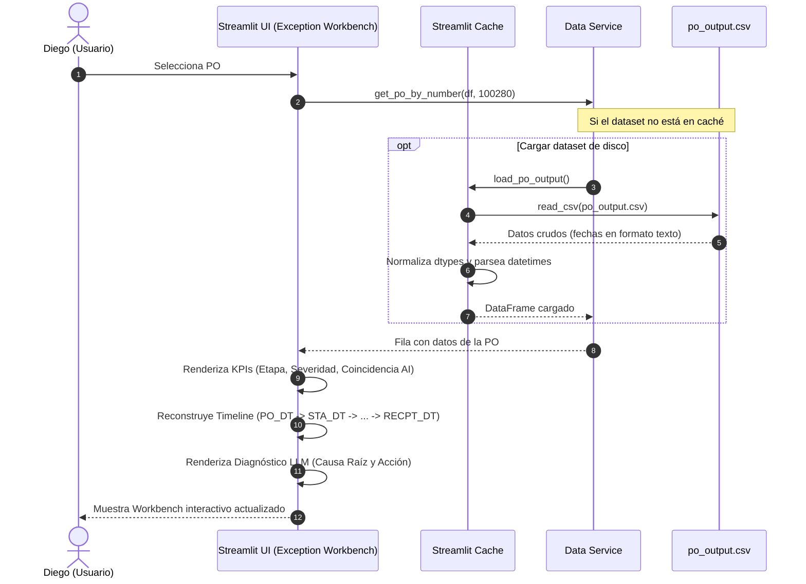

# Documento de Arquitectura de Software (SAD)
## Sistema: PO Delay Root Cause Analyzer

---

### 1. Introducción y Objetivos

#### 1.1 Propósito y alcance arquitectónico
Este Documento de Arquitectura de Software (SAD) proporciona una descripción de la arquitectura del sistema **PO Delay Root Cause Analyzer**. Expone de manera clara y formal las decisiones de diseño fundamentales, los estilos arquitectónicos, la organización física y lógica del código, y la justificación técnica de las soluciones implementadas en el repositorio. El alcance abarca desde el pipeline inicial de ingesta de datos hasta la interfaz Streamlit orientada al usuario de negocio.

#### 1.2 Metas de calidad
La arquitectura aborda y garantiza las siguientes metas de calidad a través de la estructuración de su código:
*   **Mantenibilidad (Mantenibilidad e Indice de Modularidad):** La solución está estructurada bajo un esquema altamente desacoplado de "Fases" (1 a 4). Cada etapa del ciclo de vida operativa vive en su propio subdirectorio e interactúa mediante contratos bien definidos de datos (archivos CSV). Los umbrales de lógica empresarial y los parámetros de inferencia de IA están segregados de los scripts de ejecución en archivos JSON (`rules_config.json` y `llm_config.json`). Adicionalmente, el motor de scorecards (`scorecard_core.py`) encapsula de forma aislada el perfilado estadístico y matemático de actores, reduciendo el acoplamiento con la orquestación principal del LLM.
*   **Seguridad:** El manejo de variables de entorno y claves de API de terceros se realiza de acuerdo a los estándares de la industria (Twelve-Factor App). El sistema bloquea de forma nativa la inserción en código duro de credenciales y cuenta con protecciones para evitar fugas de información operacional en la nube en caso de operar de forma offline.
*   **Rendimiento y Eficiencia:** La separación entre la generación batch del diagnóstico narrativo de IA (Fase 3), el pre-cálculo estadístico de scorecards (Fase 3) y la carga de datos visuales en Streamlit (Fase 4) garantiza que el dashboard sirva la información de forma instantánea al usuario de negocio. 

#### 1.3 Restricciones arquitectónicas
*   **Tecnología Base:** Implementación exclusiva en Python 3.x.
*   **Persistencia:** La persistencia se restringe a archivos planos (CSV y JSON) leídos y estructurados mediante la biblioteca `pandas`, lo que limita el uso de transaccionalidad concurrente compleja a nivel de registro en caliente.
*   **Dependencias de Inferencia:** Dependencia de endpoints HTTP/REST externos para el consumo de modelos cloud.
*   **Dependencias Científicas y de ML:** Requisito de la biblioteca `scikit-learn` y `scipy` en el entorno de ejecución para soportar regularizaciones dinámicas (Ridge), segmentación probabilística (GMM) y suavizados matemáticos en el motor de scorecards.

---

### 2. Representación Arquitectónica

#### 2.1 Estilo(s) arquitectónico(s) utilizados
El sistema está diseñado bajo el estilo **Layered Architecture (Arquitectura en Capas)** acoplado a un enfoque de **Decoupled Data Pipeline (Tubería de Datos Desacoplada)**. La topología del proyecto se subdivide en 4 capas de ejecución secuencial que se comunican exclusivamente a través del intercambio de archivos en disco en la carpeta `data/processed/`:

```
┌──────────────────────────────┐
│  Capa 1: Ingesta y Limpieza  │ (01_data_pipeline_and_eda/pipeline_core.py)
└──────────────┬───────────────┘
               │ (df_clean.csv)
               ▼
┌──────────────────────────────┐
│ Capa 2: Clasificador Reglas  │ (02_clasif_reglas_negocio/classifier_core.py)
└──────────────┬───────────────┘
               │ (df_classified.csv)
               ├──────────────────────────────────────────────┐
               ▼                                              ▼
┌──────────────────────────────┐              ┌──────────────────────────────┐
│     Capa 3: Auditoría AI     │ (llm_int.py) │ Capa 3: Motor de Scorecards  │ (scorecard_core.py)
└──────────────┬───────────────┘              └──────────────┬───────────────┘
               │ (po_output.csv)                             │ (reporte_*.json)
               ▼                                              ▼
               └───────────────────────┬──────────────────────┘
                                       ▼ (Handoff F3->F4)
┌──────────────────────────────┐
│  Capa 4: Dashboard Streamlit │ (04_app/app.py)
└──────────────────────────────┘
```

Este desacoplamiento permite ejecutar de manera aislada cualquier componente o probarlo de forma independiente mediante tests automatizados (aislamiento de fronteras de handoff).

#### 2.2 Patrones de diseño aplicados
1.  **Factory Pattern (Patrón Fábrica):** Implementado en `create_backend` dentro de `03_llm_integration/llm_integration.py`. La fábrica lee la selección del usuario y el archivo de configuración `llm_config.json` para retornar dinámicamente la instancia del backend correspondiente (`QwenBackend`, `ClaudeBackend`, `DeepSeekBackend`, `OpenAIBackend`).
2.  **Strategy/Adapter Pattern (Patrón Estrategia / Adaptador):** Las clases del backend de LLM encapsulan la complejidad de las peticiones REST específicas de cada API (Anthropic, OpenAI, DeepSeek, Ollama), implementando un contrato unificado a través del método `.call(prompt)`.
3.  **Facade Pattern (Patrón Fachada):** El módulo `data_service.py` actúa como una fachada de acceso a datos para las páginas de la aplicación Streamlit, simplificando la carga, codificación e indexación de registros individuales de órdenes de compra.
4.  **Contract / Dual Contract Pattern (Contrato de Handoff):** Se aplica en la suite de pruebas mediante `test_handoff_contract.py` para asegurar que el DataFrame en memoria antes de la persistencia es funcionalmente idéntico en valores y columnas al DataFrame recuperado desde el archivo CSV de disco.
5.  **Estimator Pattern (Patrón Estimador / Modelado):** `scorecard_core.py` encapsula la lógica de estimación analítica (suavizado bayesiano, regresión Ridge y GMM), ofreciendo una interfaz de ejecución unificada a través del método público `build_all_scorecards`.

---

### 3. Vistas Arquitectónicas (Modelo 4+1)

#### 3.1 Vista lógica
La vista lógica describe la descomposición orientada a objetos y funcional de la solución. Las clases y componentes de procesamiento fundamentales se detallan en el siguiente diagrama:



#### 3.2 Vista de proceso
La vista de proceso describe cómo fluyen los datos y el control en tiempo de ejecución. 

El flujo crítico de **generación batch** de datos procesa en una sola dirección la cadena de limpieza y clasificación. En la Capa 3, la ejecución de la auditoría cognitiva de IA (`llm_integration.py`) y del modelado estadístico de scorecards (`scorecard_core.py`) se realizan secuencialmente leyendo el artefacto intermedio común `df_classified.csv`. 

El flujo crítico de **consulta interactiva** en Streamlit (cuando Diego selecciona y revisa un PO) se detalla en el siguiente diagrama de secuencia:



#### 3.3 Vista de desarrollo
La organización física del código fuente sigue un orden estructurado por fases del ciclo de vida del proyecto:

*   `01_data_pipeline_and_eda/`: Capa de extracción, tipado y limpieza de timestamps. Contiene el script core de Fase 1.
*   `02_clasif_reglas_negocio/`: Capa lógica de reglas determinísticas y métricas de validación analítica. Contiene las reglas vigentes en JSON y los cálculos de precisión.
*   `03_llm_integration/`: Capa de auditoría semántica y modelado estadístico. Contiene las fábricas de backends de LLM, el pool de ejemplos few-shot de discrepancias, y el **motor de scorecards de desempeño y riesgo (`scorecard_core.py`)**.
*   `04_app/`: Interfaz interactiva de usuario. Dividida en assets (CSS), componentes reutilizables (Navbar), la Landing Page (`app.py`), servicios de datos y páginas de usuario.
*   `tests/`: Suite global de pytest para validación unitaria y de contratos de datos.
*   `requirements.txt`: Declaración explícita y fijada de las librerías dependientes, incluyendo pandas, numpy, streamlit, plotly, requests, tqdm, pytest y las dependencias de scorecards implicitamente vinculadas (`scikit-learn` y `scipy`).
*   `pyproject.toml`: Configuración de ejecución de pytest y de directorios raíces a incluir en el Python path.

#### 3.4 Vista física / despliegue
El sistema se ejecuta en un entorno físico de servidor web ligero local o contenedorizado. 
#### 3.5 Vista de escenarios
1.  **Escenario 1: Diego enruta una excepción (Caso de discrepancia):** Diego abre el Exception Workbench. Selecciona una orden marcada en "Desacuerdo" (ej: el humano culpó a "Yard congestion" pero el clasificador temporal marca "Carrier" por exceso de tránsito de 30h). Diego lee la explicación del LLM ("El exceso se concentra en el transportista, contradiciendo el motivo registrado..."). Diego abre un ticket con transporte y marca la excepción como resuelta.
2.  **Escenario 2: Ravi audita el reliability trimestral de la red:** Ravi accede a Network Intelligence. Visualiza el gráfico de distribución y nota que el 53% de los retrasos provienen de Vendor. Analiza la tasa agregada de acuerdo de la AI (del 80%) y extrae el listado de las POs en desacuerdo. Esto le da evidencia reproducible para negociar penalizaciones con los proveedores en la próxima junta.
3.  **Escenario 3: Evaluación de Scorecard de Proveedores por Ravi:** Ravi ingresa al panel de agregados en Network Intelligence. El sistema lee el archivo `reporte_vendors.json` (calculado por `scorecard_core.py`). Ravi visualiza que el proveedor 'MEDIQ' tiene un score normalizado de riesgo de 85.5 (Riesgo Alto). Ravi observa que el Delay Promedio es de 5.5 días, y que su tasa de reschedule es del 10%. Esto le da a Ravi argumentos científicos sólidos para citar al proveedor a una reunión de revisión, sabiendo que la métrica está protegida contra el ruido de muestras pequeñas.

---

### 4. Decisiones Arquitectónicas

A continuación se detallan tres decisiones de arquitectura críticas bajo el estándar MADR (Markdown Architecture Decision Records):

#### 4.1 [ADR-01] Timestamps del lifecycle como única fuente de verdad operativa
*   **Estado:** Aceptado / Vigente.
*   **Contexto:** El dataset de entrada posee tanto timestamps del ciclo de vida como columnas precalculadas (`DELAY_DAYS`, `DOCK_HRS`, etc.). Estas últimas presentan inconsistencias numéricas y clasificaciones humanas incorrectas (~20%).
*   **Decisión:** Utilizar los timestamps nativos como la única fuente de verdad. Todo delta de tiempo y métrica clave se re-calcula desde cero en la Fase 1 del pipeline para asegurar consistencia e integridad analítica.
*   **Consecuencias:** Mayor precisión en las métricas. Necesidad de gestionar anomalías en timestamps (inversión de tiempos). Los precalculados se restringen únicamente a tareas de auditoría cruzada (Cross-Validation).

#### 4.2 [ADR-02] Atribución determinística de etapa primaria por reglas sobre modelos de Machine Learning probabilisticos
*   **Estado:** Aceptado / Vigente.
*   **Contexto:** Se requiere clasificar el responsable del retraso (Vendor, Carrier, DC) de forma clara y defendible ante reclamos y disputas comerciales.
*   **Decisión:** Implementar un clasificador determinístico basado en reglas de negocio duras (excesos de tiempo sobre umbrales fijos) en lugar de modelos probabilísticos de caja negra (ej: Random Forest o Redes Neuronales).
*   **Consecuencias:** Atribuciones 100% reproducibles y explicables matemáticas que cumplen con las auditorías logísticas. Mayor facilidad para calibrar umbrales y robustez ante datos limitados.

#### 4.3 [ADR-03] Persistencia y handoff mediante archivos CSV y reportes JSON en disco (Decoupled Batch Pipeline)
*   **Estado:** Aceptado / Vigente.
*   **Contexto:** El sistema se ejecuta en entornos de desarrollo e interfaces interactivas donde la carga y los recursos son locales, y el pipeline se ejecuta en batch.
*   **Decisión:** Utilizar archivos CSV planos y reportes JSON estructurados en directorios convencionales (`data/processed/`) con contratos de handoff validados, en lugar de un motor de bases de datos relacional activo (PostgreSQL/MySQL) o un pipeline monolítico en memoria.
*   **Consecuencias:** Simplicidad en el despliegue, facilidad para auditar los datos intermedios de cada fase y desacoplamiento absoluto de las fases (el pipeline y el clasificador no requieren llamadas activas al LLM para ejecutarse). Limita el procesamiento en tiempo real continuo, lo cual es aceptable para la naturaleza retrospectiva del negocio.

---

### 5. Tácticas y Patrones de Calidad

*   **Seguridad:**
    *   **Secrets Isolation:** Uso de la librería `python-dotenv` para cargar variables sensibles del archivo `.env` local.
    *   **Git Security:** Bloqueo de subidas accidentales de credenciales o datasets a través del archivo `.gitignore` que excluye de forma estricta las carpetas `data/` (excepto placeholders) y el archivo `.env`.
*   **Tolerancia a Fallos:**
    *   **Fallback JSON Parser:** Si el LLM retorna texto libre o un JSON corrupto, la función `_parse_llm_json` extrae la parte utilizable mediante expresiones regulares (`\{[\s\S]*\}`) y aplica un diccionario de degradación de emergencia para evitar caídas en el procesamiento.
    *   **Error Coercion:** Uso de `errors='coerce'` al formatear fechas para que valores basura se transformen en `NaT` (Not a Time) manejados limpiamente mediante flags lógicas de calidad.
    *   **Resiliency on API:** Reintentos automáticos (`max_retries = 3`) ante fallos de conexión HTTP 5xx y delays de seguridad para evitar bloqueos por Rate Limit.

*   **Rendimiento:**
    *   **Visual-Inference Separation:** La interfaz de Streamlit no realiza llamadas en caliente a APIs de LLM. Lee los textos ya calculados en el proceso batch de Fase 3, reduciendo la latencia de carga del dashboard a milisegundos.
    *   **Streamlit Caching:** Aplicación de `@st.cache_data` en `04_app/services/data_service.py` para almacenar en caché de memoria el dataset de salida, evitando el parsing repetitivo de strings a datetime en cada renderización de la página.

---

### 6. Interfaces y Dependencias Externas

El sistema integra y depende de las siguientes APIs e interfaces de terceros:

1.  **Anthropic Claude API:** Endpoint `https://api.anthropic.com/v1/messages`. Requiere la variable de entorno `ANTHROPIC_API_KEY` y consume el modelo `claude-sonnet-4-6`.
2.  **OpenAI API:** Endpoint `https://api.openai.com/v1/chat/completions`. Requiere `OPENAI_API_KEY` y consume por defecto `gpt-4o-mini`.
3.  **DeepSeek API:** Endpoint `https://api.deepseek.com/v1/chat/completions`. Requiere `DEEPSEEK_API_KEY` y consume el modelo `deepseek-chat`.
4.  **Ollama Local Engine:** Servicio HTTP local en `http://localhost:11434/api/generate`. Consume por defecto el modelo local `qwen2.5:7b`.
5.  **Bibliotecas Científicas locales:** Dependencia del runtime local de Python de las librerías `scikit-learn` y `scipy` para realizar la calibración de pesos (Ridge), agrupaciones gaussianas (GMM) y normalizaciones.

#### Variables de Entorno y Control Operativo (leídas desde `.env`):
*   `PO_CSV_PATH`: Ruta al CSV crudo original.
*   `PO_CLEAN_OUTPUT_PATH`: Ruta de salida para los datos procesados en la Fase 1.
*   `PO_OUTPUT_PATH`: Ruta de salida para los datos clasificados en la Fase 2.
*   `LLM_DELAY_SECONDS`: Delay de seguridad entre llamadas a la API del LLM.
*   `LLM_RETRY_SLEEP_SECONDS`: Espera antes de volver a intentar una llamada fallida.
*   `LLM_SAVE_EVERY`: Intervalo de guardado parcial en el procesamiento batch.
