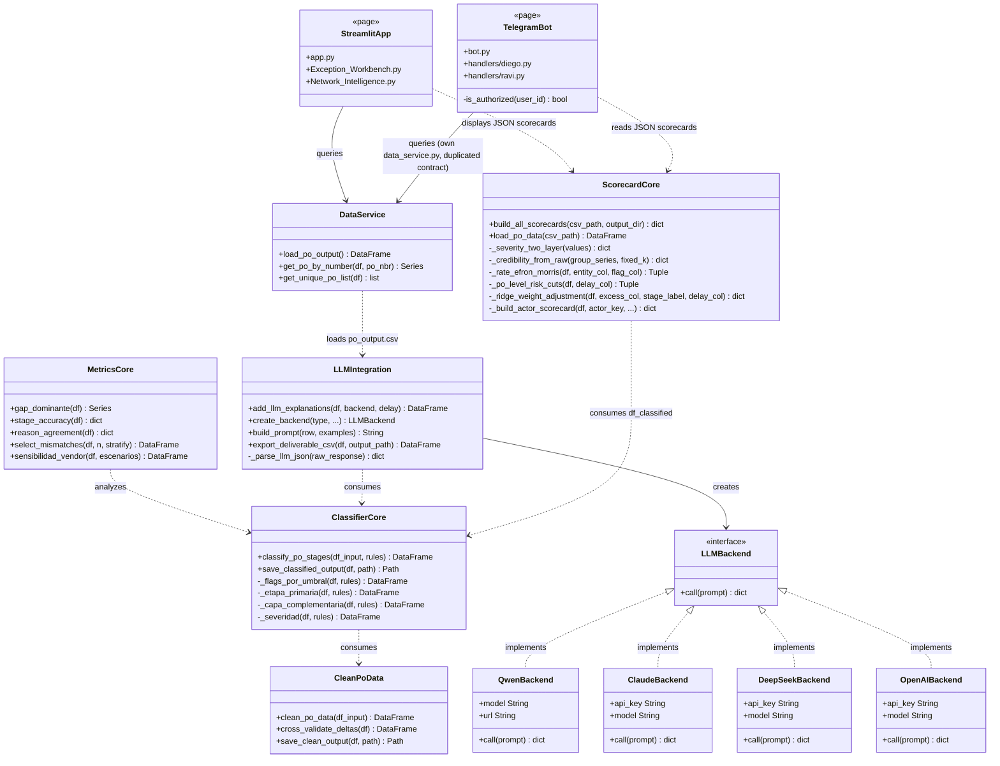
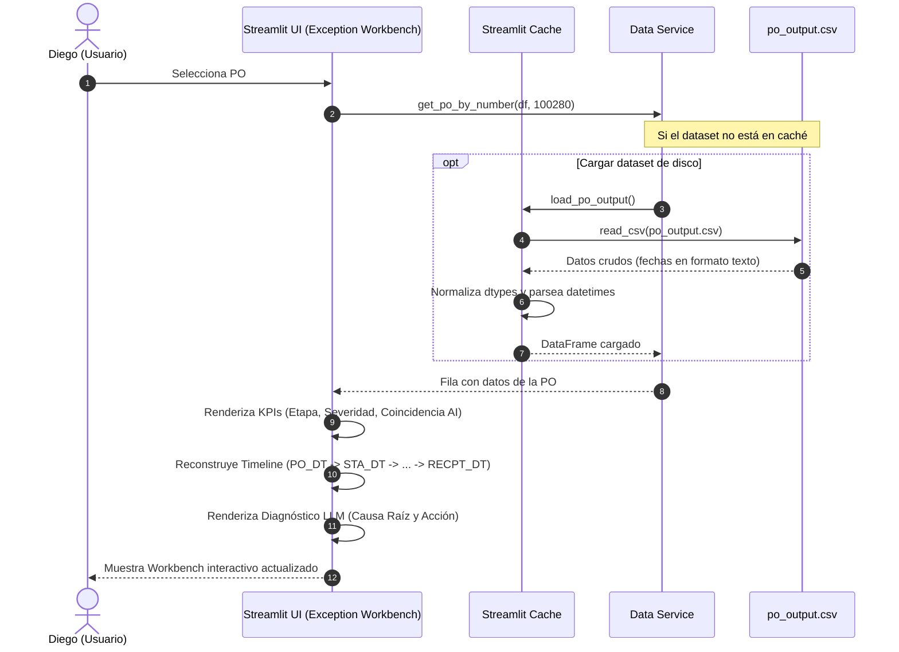
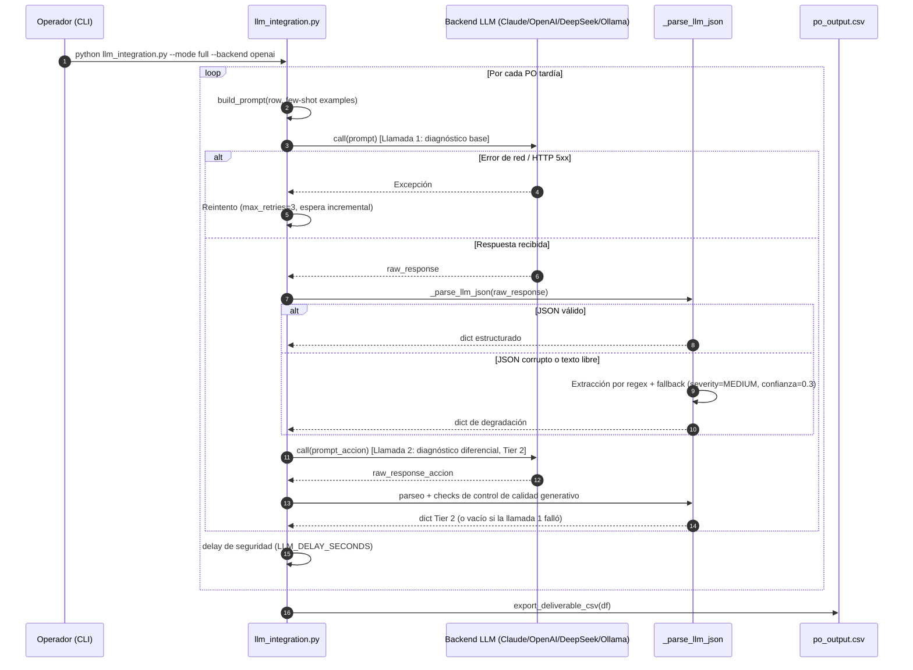
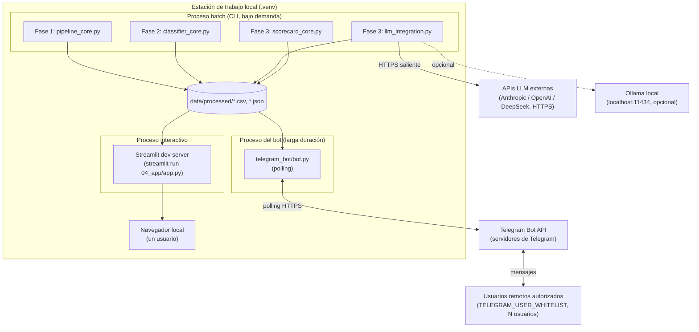

# Documento de Arquitectura de Software (SAD)
## Sistema: PO Delay Root Cause Analyzer

> `SAD.md` es la fuente de verdad versionada de este documento; `exports/SAD.docx` es una copia
> derivada/exportada para entrega, no se edita directamente.

---

### Índice
1. [Introducción y Objetivos](#1-introducción-y-objetivos)
2. [Representación Arquitectónica](#2-representación-arquitectónica)
3. [Vistas Arquitectónicas (Modelo 4+1)](#3-vistas-arquitectónicas-modelo-41)
4. [Decisiones Arquitectónicas](#4-decisiones-arquitectónicas)
5. [Tácticas y Patrones de Calidad](#5-tácticas-y-patrones-de-calidad)
6. [Interfaces y Dependencias Externas](#6-interfaces-y-dependencias-externas)

---

### 1. Introducción y Objetivos

#### 1.1 Propósito y alcance arquitectónico
Este Documento de Arquitectura de Software (SAD) proporciona una descripción de la arquitectura del sistema **PO Delay Root Cause Analyzer**. Expone de manera clara y formal las decisiones de diseño fundamentales, los estilos arquitectónicos, la organización física y lógica del código, y la justificación técnica de las soluciones implementadas en el repositorio. El alcance abarca desde el pipeline inicial de ingesta de datos hasta la interfaz Streamlit orientada al usuario de negocio.

#### 1.2 Metas de calidad
La arquitectura aborda y garantiza las siguientes metas de calidad a través de la estructuración de su código:
*   **Mantenibilidad (Mantenibilidad e Indice de Modularidad):** La solución está estructurada bajo un esquema altamente desacoplado de "Fases" (1 a 4). Cada etapa del ciclo de vida operativa vive en su propio subdirectorio e interactúa mediante contratos bien definidos de datos (archivos CSV). Los umbrales de lógica empresarial y los parámetros de inferencia de IA están segregados de los scripts de ejecución en archivos JSON (`rules_config.json` y `llm_config.json`). Adicionalmente, el motor de scorecards (`scorecard_core.py`) encapsula de forma aislada el perfilado estadístico y matemático de actores, reduciendo el acoplamiento con la orquestación principal del LLM.
*   **Seguridad:** El manejo de variables de entorno y claves de API de terceros se realiza de acuerdo a los estándares de la industria (Twelve-Factor App). El sistema bloquea de forma nativa la inserción en código duro de credenciales y cuenta con protecciones para evitar fugas de información operacional en la nube en caso de operar de forma offline.
*   **Rendimiento y Eficiencia:** La separación entre la generación batch del diagnóstico narrativo de IA (Fase 3), el pre-cálculo estadístico de scorecards (Fase 3) y la carga de datos visuales en Streamlit (Fase 4) garantiza que el dashboard sirva la información de forma instantánea al usuario de negocio. 

#### 1.3 Restricciones arquitectónicas
*   **Tecnología Base:** Implementación exclusiva en Python 3.x.
*   **Persistencia:** La persistencia se restringe a archivos planos (CSV y JSON) leídos y estructurados mediante la biblioteca `pandas`, lo que limita el uso de transaccionalidad concurrente compleja a nivel de registro en caliente.
*   **Dependencias de Inferencia:** Dependencia de endpoints HTTP/REST externos para el consumo de modelos cloud.
*   **Dependencias Científicas y de ML:** Requisito de la biblioteca `scikit-learn` y `scipy` en el entorno de ejecución para soportar regularizaciones dinámicas (Ridge), segmentación probabilística (GMM) y suavizados matemáticos en el motor de scorecards.

---

### 2. Representación Arquitectónica

#### 2.1 Estilo(s) arquitectónico(s) utilizados
El sistema está diseñado bajo el estilo **Layered Architecture (Arquitectura en Capas)** acoplado a un enfoque de **Decoupled Data Pipeline (Tubería de Datos Desacoplada)**. La topología del proyecto se subdivide en 4 capas de ejecución secuencial que se comunican exclusivamente a través del intercambio de archivos en disco en la carpeta `data/processed/`:

```
┌──────────────────────────────┐
│  Capa 1: Ingesta y Limpieza  │ (01_data_pipeline_and_eda/pipeline_core.py)
└──────────────┬───────────────┘
               │ (df_clean.csv)
               ▼
┌──────────────────────────────┐
│ Capa 2: Clasificador Reglas  │ (02_clasif_reglas_negocio/classifier_core.py)
└──────────────┬───────────────┘
               │ (df_classified.csv)
               ├──────────────────────────────────────────────┐
               ▼                                              ▼
┌──────────────────────────────┐              ┌──────────────────────────────┐
│     Capa 3: Auditoría AI     │ (llm_int.py) │ Capa 3: Motor de Scorecards  │ (scorecard_core.py)
└──────────────┬───────────────┘              └──────────────┬───────────────┘
               │ (po_output.csv)                             │ (reporte_*.json)
               ▼                                              ▼
               └───────────────────────┬──────────────────────┘
                                       ▼ (Handoff F3->F4)
┌──────────────────────────────┐                ┌──────────────────────────────┐
│  Capa 4: Dashboard Streamlit │ (04_app/app.py)│  Capa 4: Bot de Telegram     │ (telegram_bot/bot.py)
└──────────────────────────────┘                └──────────────────────────────┘
```

El bot de Telegram ([ADR-20](decisiones/ARD-20.md)) es un segundo consumidor de la Capa 4, en paralelo al dashboard Streamlit: lee el mismo handoff F3→F4 (`po_output.csv`, scorecards) sin recomputar nada ni invocar al LLM en tiempo de consulta, y sin depender de que el dashboard esté abierto.

Este desacoplamiento permite ejecutar de manera aislada cualquier componente o probarlo de forma independiente mediante tests automatizados (aislamiento de fronteras de handoff).

#### 2.2 Patrones de diseño aplicados
1.  **Factory Pattern (Patrón Fábrica):** Implementado en `create_backend` dentro de `03_llm_integration/llm_integration.py`. La fábrica lee la selección del usuario y el archivo de configuración `llm_config.json` para retornar dinámicamente la instancia del backend correspondiente (`QwenBackend`, `ClaudeBackend`, `DeepSeekBackend`, `OpenAIBackend`).
2.  **Strategy/Adapter Pattern (Patrón Estrategia / Adaptador):** Las clases del backend de LLM encapsulan la complejidad de las peticiones REST específicas de cada API (Anthropic, OpenAI, DeepSeek, Ollama), implementando un contrato unificado a través del método `.call(prompt)`.
3.  **Facade Pattern (Patrón Fachada):** El módulo `data_service.py` actúa como una fachada de acceso a datos para las páginas de la aplicación Streamlit, simplificando la carga, codificación e indexación de registros individuales de órdenes de compra.
4.  **Contract / Dual Contract Pattern (Contrato de Handoff):** Se aplica en la suite de pruebas mediante `test_handoff_contract.py` para asegurar que el DataFrame en memoria antes de la persistencia es funcionalmente idéntico en valores y columnas al DataFrame recuperado desde el archivo CSV de disco.
5.  **Estimator Pattern (Patrón Estimador / Modelado):** `scorecard_core.py` encapsula la lógica de estimación analítica (suavizado bayesiano, regresión Ridge y GMM), ofreciendo una interfaz de ejecución unificada a través del método público `build_all_scorecards`.

---

### 3. Vistas Arquitectónicas (Modelo 4+1)

#### 3.1 Vista lógica
La vista lógica describe la descomposición orientada a objetos y funcional de la solución. Las clases y componentes de procesamiento fundamentales se detallan en el siguiente diagrama:



#### 3.2 Vista de proceso
La vista de proceso describe cómo fluyen los datos y el control en tiempo de ejecución. 

El flujo crítico de **generación batch** de datos procesa en una sola dirección la cadena de limpieza y clasificación. En la Capa 3, la ejecución de la auditoría cognitiva de IA (`llm_integration.py`) y del modelado estadístico de scorecards (`scorecard_core.py`) se realizan secuencialmente leyendo el artefacto intermedio común `df_classified.csv`. 

El flujo crítico de **consulta interactiva** en Streamlit (cuando Diego selecciona y revisa un PO) se detalla en el siguiente diagrama de secuencia:



El flujo crítico de **generación batch en Fase 3**, incluyendo el camino de reintento y degradación ante fallos del LLM (RNF-03), se detalla en el siguiente diagrama de secuencia:



#### 3.3 Vista de desarrollo
La organización física del código fuente sigue un orden estructurado por fases del ciclo de vida del proyecto:

*   `01_data_pipeline_and_eda/`: Capa de extracción, tipado y limpieza de timestamps. Contiene el script core de Fase 1.
*   `02_clasif_reglas_negocio/`: Capa lógica de reglas determinísticas y métricas de validación analítica. Contiene las reglas vigentes en JSON y los cálculos de precisión.
*   `03_llm_integration/`: Capa de auditoría semántica y modelado estadístico. Contiene las fábricas de backends de LLM, el pool de ejemplos few-shot de discrepancias, y el **motor de scorecards de desempeño y riesgo (`scorecard_core.py`)**. Incluye además `llm_integration_network_intelligence_view.py`, el generador de la síntesis ejecutiva de red por actor (Vendor/Carrier/DC) sobre los scorecards estadísticos de `scorecard_core.py`, gobernado por [ADR-19](decisiones/ARD-19.md): usa un SDK distinto (`openai-agents`, arquitectura multi-agente de tres agentes especializados en secuencia) y consolida su salida en `data/processed/agente1_raw.txt`, que consume en producción la página `Network Intelligence` (`04_app/pages/2_📊_Network_Intelligence.py`). Es una dependencia real de Fase 3→Fase 4, no un componente aislado (corregido conforme a [ARD-21](decisiones/ARD-21.md), que señaló la caracterización anterior de este documento como incorrecta).
*   `04_app/`: Interfaz interactiva de usuario. Dividida en assets (CSS), componentes reutilizables (Navbar), la Landing Page (`app.py`), servicios de datos y páginas de usuario. Incluye además `telegram_bot/` ([ADR-20](decisiones/ARD-20.md)): un segundo canal de consumo del mismo contrato F3→F4, con su propio `bot.py`, `handlers/` (uno por persona, `diego.py`/`ravi.py`) y `services/` (autenticación fail-closed, carga de datos) — hoy una copia paralela de la capa de datos de `04_app/`, no compartida, deuda documentada en el propio ADR.
*   `tests/`: Suite global de pytest para validación unitaria y de contratos de datos.
*   `requirements.txt`: Declaración explícita y fijada de las librerías dependientes, incluyendo pandas, numpy, streamlit, plotly, requests, tqdm, pytest y las dependencias de scorecards implicitamente vinculadas (`scikit-learn` y `scipy`).
*   `pyproject.toml`: Configuración de ejecución de pytest y de directorios raíces a incluir en el Python path.

#### 3.4 Vista física / despliegue
El repositorio no contiene artefactos de containerización (`Dockerfile`, `docker-compose`) ni configuración de despliegue en la nube — la ejecución actual es un proceso único local:

*   **Entorno de ejecución:** Un entorno virtual de Python (`.venv`) sobre un solo equipo (estación de trabajo o laptop del analista). No hay separación de procesos por fase: el pipeline batch (F1-F3) y la app (F4) corren como scripts/procesos independientes lanzados manualmente en secuencia, no como servicios persistentes.
*   **Componente batch (F1-F3):** Se ejecuta bajo demanda vía CLI (`python 01_data_pipeline_and_eda/pipeline_core.py`, etc.), con dependencia de las bibliotecas científicas `pandas`, `numpy`, `scikit-learn` y `scipy` instaladas en el mismo entorno.
*   **Componente interactivo (F4):** Servido localmente por el servidor de desarrollo de Streamlit (`streamlit run 04_app/app.py`), expuesto por defecto en `localhost` a un único usuario a la vez; no está diseñado para concurrencia multi-usuario ni balanceo de carga.
*   **Componente bot (F4, [ADR-20](decisiones/ARD-20.md)):** Proceso independiente de larga duración (`python 04_app/telegram_bot/bot.py`, `python-telegram-bot` con polling contra la API de Telegram), de forma de despliegue materialmente distinta al dashboard: no está acotado a un único usuario local — cualquier usuario cuyo ID de Telegram esté en `TELEGRAM_USER_WHITELIST` puede alcanzarlo de forma remota, en paralelo y desde fuera de la estación de trabajo, a través de los servidores de Telegram. Comparte el mismo entorno virtual y los mismos archivos de `data/processed/` que el resto de F4, pero corre como un proceso separado del servidor de Streamlit.
*   **Persistencia:** Archivos planos en `data/processed/` (CSV y JSON), compartidos por lectura/escritura directa entre los procesos batch, la app y el bot — no hay una capa de servicio de datos independiente.
*   **Estado conocido:** Elevar esta configuración a un despliegue de calidad de producción (empaquetado, hosting, multi-usuario del dashboard) es trabajo identificado como pendiente, no implementado a la fecha de este documento. El bot ya opera con múltiples usuarios remotos por diseño (vía Telegram), pero como proceso local lanzado a mano, sin supervisión de proceso (systemd, contenedor) ni reinicio automático ante caída.



#### 3.5 Vista de escenarios
1.  **Escenario 1: Diego enruta una excepción (Caso de discrepancia):** Diego abre el Exception Workbench. Selecciona una orden marcada en "Desacuerdo" (ej: el humano culpó a "Yard congestion" pero el clasificador temporal marca "Carrier" por exceso de tránsito de 30h). Diego lee la explicación del LLM ("El exceso se concentra en el transportista, contradiciendo el motivo registrado..."). Diego abre un ticket con transporte y marca la excepción como resuelta.
2.  **Escenario 2: Ravi audita el reliability trimestral de la red:** Ravi accede a Network Intelligence. Visualiza el gráfico de distribución y nota que el 56% de los retrasos provienen de Vendor. Analiza la tasa agregada de acuerdo de la AI (del 88.7%) y extrae el listado de las POs en desacuerdo. Esto le da evidencia reproducible para negociar penalizaciones con los proveedores en la próxima junta.
3.  **Escenario 3: Evaluación de Scorecard de Proveedores por Ravi:** Ravi ingresa al panel de agregados en Network Intelligence. El sistema lee el archivo `reporte_vendors.json` (calculado por `scorecard_core.py`). Ravi visualiza que el proveedor 'MEDIQ' tiene un score normalizado de riesgo de 85.5 (Riesgo Alto). Ravi observa que el Delay Promedio es de 5.5 días, y que su tasa de reschedule es del 10%. Esto le da a Ravi argumentos científicos sólidos para citar al proveedor a una reunión de revisión, sabiendo que la métrica está protegida contra el ruido de muestras pequeñas.
4.  **Escenario 4: Diego consulta un PO desde el bot de Telegram fuera del navegador:** Diego está en una llamada con el transportista y no tiene el dashboard abierto. Envía `/po 100280` al bot. El bot verifica su ID contra la whitelist, lee `po_output.csv` (mismo artefacto que consume Streamlit, sin recomputar nada ni invocar al LLM) y responde en texto el diagnóstico, la acción recomendada y la concordancia con el motivo humano — la misma información que vería en el Exception Workbench, sin abrir el navegador.

---

### 4. Decisiones Arquitectónicas

A continuación se detallan las decisiones de arquitectura con mayor peso sobre las vistas y tácticas de este documento, bajo el estándar MADR (Markdown Architecture Decision Records). Las secciones 4.1, 4.2 y 4.4-4.8 tienen ADR propio en `documentation/decisiones/`; la 4.3 se documenta aquí por no contar con uno.

#### 4.1 [ADR-01] Timestamps del lifecycle como única fuente de verdad operativa
*   **Estado:** Aceptado / Vigente.
*   **Contexto:** El dataset de entrada posee tanto timestamps del ciclo de vida como columnas precalculadas (`DELAY_DAYS`, `DOCK_HRS`, etc.). Estas últimas presentan inconsistencias numéricas y clasificaciones humanas incorrectas (~20%).
*   **Decisión:** Utilizar los timestamps nativos como la única fuente de verdad. Todo delta de tiempo y métrica clave se re-calcula desde cero en la Fase 1 del pipeline para asegurar consistencia e integridad analítica.
*   **Consecuencias:** Mayor precisión en las métricas. Necesidad de gestionar anomalías en timestamps (inversión de tiempos). Los precalculados se restringen únicamente a tareas de auditoría cruzada (Cross-Validation).

#### 4.2 [ADR-02] Atribución de etapa primaria por el mayor exceso (`argmax`) con vector multicausa complementario
*   **Estado:** Aceptado / Vigente.
*   **Contexto:** Un mismo PO puede acumular exceso de tiempo en más de un tramo (Vendor, Carrier, DC) simultáneamente. Forzar una causa única mediante prioridades fijas ocultaría la fricción real de los tramos secundarios.
*   **Decisión:** La etapa primaria se asigna dinámicamente mediante `argmax` sobre el exceso en horas de cada tramo frente a su propio umbral. Se anexa además un vector multicausa (`stage_multi`) que preserva el registro de todas las flags de exceso activadas, en vez de descartarlas al quedarse solo con el ganador.
*   **Consecuencias:** El modelo refleja con precisión la severidad relativa del impacto de cada actor. La agregación en reportes debe considerar el vector multicausa para análisis avanzados, lo que añade complejidad a las consultas.
*   **Nota:** Esta decisión asume el criterio de diseño más amplio, ya establecido desde el brief del proyecto, de usar reglas de negocio deterministas (umbrales fijos y auditables) en lugar de modelos probabilísticos de caja negra (p. ej. Random Forest o redes neuronales) — ese criterio general no está documentado como un ADR aparte.

#### 4.3 Persistencia y handoff mediante archivos CSV y reportes JSON en disco (Decoupled Batch Pipeline)
*   **Estado:** Decisión de arquitectura documentada en este SAD. No cuenta con un ADR propio en `documentation/decisiones/`: el log actual no registra la elección de CSV/JSON frente a un motor de base de datos como una decisión discutida aparte.
*   **Contexto:** El sistema se ejecuta en entornos de desarrollo e interfaces interactivas donde la carga y los recursos son locales, y el pipeline se ejecuta en batch.
*   **Decisión:** Utilizar archivos CSV planos y reportes JSON estructurados en directorios convencionales (`data/processed/`) con contratos de handoff validados, en lugar de un motor de bases de datos relacional activo (PostgreSQL/MySQL) o un pipeline monolítico en memoria.
*   **Consecuencias:** Simplicidad en el despliegue, facilidad para auditar los datos intermedios de cada fase y desacoplamiento absoluto de las fases (el pipeline y el clasificador no requieren llamadas activas al LLM para ejecutarse). Limita el procesamiento en tiempo real continuo, lo cual es aceptable para la naturaleza retrospectiva del negocio.

A continuación, otras decisiones del log (`documentation/decisiones/`) con peso arquitectónico directo sobre las vistas y tácticas descritas en este documento:

#### 4.4 [ADR-07] Taxonomía de Indeterminado
*   **Estado:** Aceptado / Vigente.
*   **Contexto:** Pedidos tardíos sin causa imputable a Vendor, Carrier o DC no pueden forzarse a una de esas tres categorías sin reintroducir sesgo.
*   **Decisión:** Se agrega la columna `indeterminado_substage` con dos subcategorías mutuamente excluyentes: `sin_datos` (retraso medible pero faltan timestamps de auditoría, p. ej. sin registro de tráiler) y `sin_causa_dominante` (datos completos, pero ningún tramo supera su umbral).
*   **Consecuencias:** El clasificador evalúa el 100% del dataset sin descartes ciegos; la Fase 3 recibe una distinción explícita entre "falta de información" y "operación dentro de tolerancia".

#### 4.5 [ADR-09] User personas como criterio de diseño de la Fase 4
*   **Estado:** Aceptado / Vigente (cerrado 2026-06-27).
*   **Contexto:** La Fase 4 necesitaba un eje de diseño defendible más allá de organizar la app por entidad de la cadena (Vendor/Carrier/DC).
*   **Decisión:** Definir dos personas por modo de consumo — Diego (consulta individual de un PO) y Ravi (reporte agregado por lote) — y derivar de ellas las dos vistas de la app (`Exception Workbench`, `Network Intelligence`), en vez de organizar por entidad medida.
*   **Consecuencias:** Trazabilidad persona → vista → columnas del contrato F3→F4. El placeholder previo organizado por entidad quedó descartado como criterio de diseño.

#### 4.6 [ADR-10] Severidad híbrida: el LLM la emite, la regla de Fase 2 la audita
*   **Estado:** Aceptado / Vigente (cerrado 2026-06-27).
*   **Contexto:** Existían dos fuentes de severidad en conflicto: el LLM (kickoff del mentor) y una regla determinística de Fase 2 (`_severidad`), con un umbral de prompt que además no coincidía con ninguna de las dos.
*   **Decisión:** La columna oficial de severidad del entregable (`severity` en `po_output.csv`) es la que emite el LLM. La regla determinística de Fase 2 se conserva como columna de auditoría (no se expone en el entregable) y alimenta la métrica Severity Ranking. El umbral del prompt se corrige a `hot PO + delay > 3 días ⇒ HIGH`.
*   **Consecuencias:** El entregable cumple el lineamiento del mentor sin perder auditabilidad; la discrepancia LLM-vs-regla se convierte en un hallazgo reportable en vez de quedar oculta.

#### 4.7 [ADR-16] El LLM como capa analítica sobre la base determinista validada
*   **Estado:** 🔵 Borrador (decisión activa, aún no cerrada por el equipo; ya implementada en `main`).
*   **Contexto:** Tras validar la lógica determinista de Fases 1-2, el pedido del mentor fue enriquecer la explicación del LLM más allá de redactar lo ya decidido por las reglas, aplicando conocimiento de dominio, razonamiento y síntesis.
*   **Decisión:** El LLM opera en dos llamadas encadenadas: la primera emite el diagnóstico base (`causa_raiz`, `severidad`, `coincide_con_reason_code`, `confianza`); la segunda, condicionada a la primera, emite un diagnóstico diferencial (`razonamiento`, hipótesis principal con evidencia y plan de acción escalonado, hipótesis alternativa con su paso discriminante, y una segunda confianza específica de la hipótesis). Las premisas factuales siguen ancladas a los datos (ADR-14); las generalizaciones de dominio quedan habilitadas y marcadas como tales.
*   **Consecuencias:** Las acciones recomendadas pasan de meta-acciones genéricas a planes ejecutables con decisión de negocio, a costa de mayor variancia entre corridas y de duplicar el esquema de salida consumido por la Fase 4 (ver contrato Tier 1/Tier 2 en el SRS, §3.4).

#### 4.8 [ADR-17] Lenguaje visual y codificación de color de la taxonomía
*   **Estado:** Aceptado / Vigente (cerrado 2026-07-14).
*   **Contexto:** La app expone etapa (nominal), severidad (ordinal) y confianza del LLM (escalar agrupado) en ambas vistas, con una paleta previa arbitraria y no seguro para daltonismo.
*   **Decisión:** Etapa se codifica con la paleta categórica Okabe-Ito (segura para los tres tipos de daltonismo); severidad y confianza se codifican con una rampa de luminancia acromática reforzada con forma/ícono y etiqueta de texto, sin competir por el canal de color de la etapa. Se definen variantes de tema claro/oscuro con el mismo hue y contraste WCAG verificado (`04_app/config.py`, `04_app/assets/styles.css`).
*   **Consecuencias:** Codificación única y accesible por construcción en toda la app, defendible por un marco publicado (Munzner, Cleveland-McGill, Okabe-Ito, WCAG 2.1) en vez de la estética. El *chrome* nativo de Streamlit (sidebar, algunos widgets) queda fuera de este alcance y no responde al tema.

---

### 5. Tácticas y Patrones de Calidad

*   **Seguridad:**
    *   **Secrets Isolation:** Uso de la librería `python-dotenv` para cargar variables sensibles del archivo `.env` local.
    *   **Git Security:** Bloqueo de subidas accidentales de credenciales o datasets a través del archivo `.gitignore` que excluye de forma estricta las carpetas `data/` (excepto placeholders) y el archivo `.env`.
*   **Tolerancia a Fallos:**
    *   **Fallback JSON Parser:** Si el LLM retorna texto libre o un JSON corrupto, la función `_parse_llm_json` extrae la parte utilizable mediante expresiones regulares (`\{[\s\S]*\}`) y aplica un diccionario de degradación de emergencia para evitar caídas en el procesamiento.
    *   **Error Coercion:** Uso de `errors='coerce'` al formatear fechas para que valores basura se transformen en `NaT` (Not a Time) manejados limpiamente mediante flags lógicas de calidad.
    *   **Resiliency on API:** Reintentos automáticos (`max_retries = 3`) ante fallos de conexión HTTP 5xx y delays de seguridad para evitar bloqueos por Rate Limit.

*   **Rendimiento:**
    *   **Visual-Inference Separation:** La interfaz de Streamlit no realiza llamadas en caliente a APIs de LLM. Lee los textos ya calculados en el proceso batch de Fase 3, reduciendo la latencia de carga del dashboard a milisegundos.
    *   **Streamlit Caching:** Aplicación de `@st.cache_data` en `04_app/services/data_service.py` para almacenar en caché de memoria el dataset de salida, evitando el parsing repetitivo de strings a datetime en cada renderización de la página.

*   **Observabilidad (estado actual, no aspiracional):**
    *   **Logging:** El proceso batch de Fase 3 (`llm_integration.py`) reporta su progreso mediante sentencias `print()` a stdout; no hay un módulo `logging` con niveles, formato estructurado o persistencia a archivo. No existe una estrategia de logging estandarizada entre fases.

*   **Usabilidad y Accesibilidad:**
    *   **Codificación visual consistente ([ADR-17](decisiones/ARD-17.md)):** Etapa, severidad y confianza del LLM comparten un único lenguaje visual (paleta Okabe-Ito para etapa, rampa de luminancia + ícono + texto para severidad/confianza) definido una sola vez en `04_app/config.py`/`04_app/assets/styles.css`, con contraste verificado contra WCAG 2.1 y variantes de tema claro/oscuro.

---

### 6. Interfaces y Dependencias Externas

El sistema integra y depende de las siguientes APIs e interfaces de terceros:

1.  **Anthropic Claude API:** Endpoint `https://api.anthropic.com/v1/messages`. Requiere la variable de entorno `ANTHROPIC_API_KEY` y consume el modelo `claude-sonnet-4-6`.
2.  **OpenAI API:** Endpoint `https://api.openai.com/v1/chat/completions`. Requiere `OPENAI_API_KEY` y consume por defecto `gpt-4o-mini`.
3.  **DeepSeek API:** Endpoint `https://api.deepseek.com/v1/chat/completions`. Requiere `DEEPSEEK_API_KEY` y consume el modelo `deepseek-chat`.
4.  **Ollama Local Engine:** Servicio HTTP local en `http://localhost:11434/api/generate`. Consume por defecto el modelo local `qwen2.5:7b`.
5.  **Bibliotecas Científicas locales:** Dependencia del runtime local de Python de las librerías `scikit-learn` y `scipy` para realizar la calibración de pesos (Ridge), agrupaciones gaussianas (GMM) y normalizaciones.
6.  **Telegram Bot API ([ADR-20](decisiones/ARD-20.md)):** Servicio externo de mensajería vía `python-telegram-bot`, con polling saliente (sin webhook expuesto). Requiere `TELEGRAM_BOT_TOKEN` (obtenido de `@BotFather`). Es la única dependencia externa de F4 que expone el sistema a usuarios remotos fuera de la estación de trabajo local.

De los 4 backends soportados, la **configuración de producción vigente** (`03_llm_integration/llm_config.json`) fija: backend **OpenAI**, modelo `gpt-4o-mini`, `temperature=0.9`, `seed=42` (reproducibilidad best-effort), `max_tokens=512` (diagnóstico base) / `max_tokens_action=1536` (diagnóstico diferencial Tier 2), `timeout_seconds=60`, `max_retries=3`, con selección de ejemplos few-shot en la variante "C3" del pool curado (`fewshot_pool.json`).

#### Variables de Entorno y Control Operativo (leídas desde `.env`):
*   `PO_CSV_PATH`: Ruta al CSV crudo original.
*   `PO_CLEAN_OUTPUT_PATH`: Ruta de salida para los datos procesados en la Fase 1.
*   `PO_OUTPUT_PATH`: Ruta de salida para los datos clasificados en la Fase 2.
*   `LLM_DELAY_SECONDS`: Delay de seguridad entre llamadas a la API del LLM.
*   `LLM_RETRY_SLEEP_SECONDS`: Espera antes de volver a intentar una llamada fallida.
*   `LLM_SAVE_EVERY`: Intervalo de guardado parcial en el procesamiento batch.
*   `TELEGRAM_BOT_TOKEN`: Token del bot, obtenido de `@BotFather` (secreto).
*   `TELEGRAM_BOT_USERNAME`: Handle público del bot (no secreto), usado en el enlace de la landing.
*   `TELEGRAM_USER_WHITELIST`: IDs de Telegram autorizados, separados por coma; vacía = fail-closed, nadie autorizado.
*   `TELEGRAM_RAVI_USER_IDS`: IDs de Telegram con perfil Ravi; el resto son Diego por default.
*   `DEMO_MODE`: Bypass explícito del gate de autorización, solo para demostraciones (vacío/false por default).
