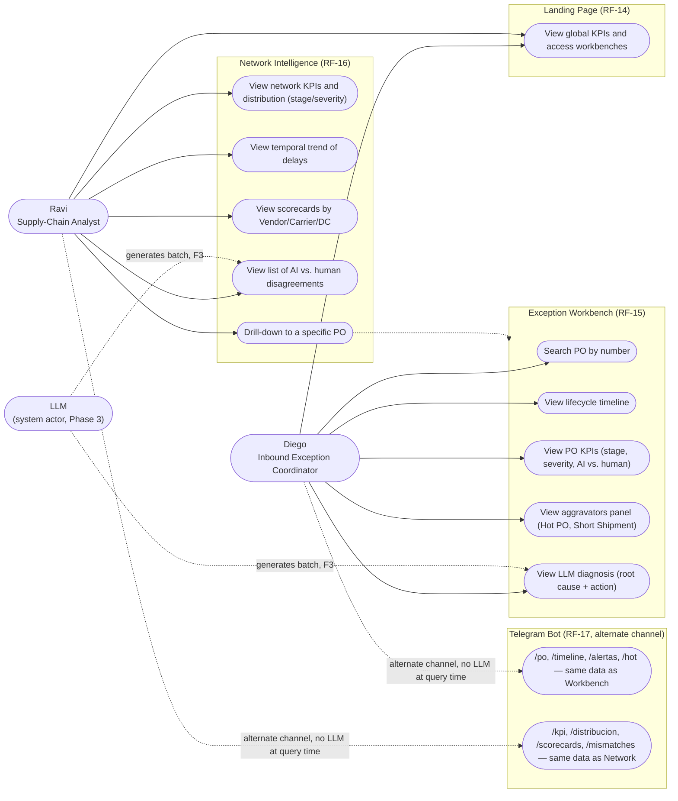

# Software Requirements Specification (SRS)
## System: PO Delay Root Cause Analyzer

> `SRS.md` is the versioned source of truth for this document; `exports/SRS.docx` is a derived/exported copy for delivery and is not edited directly.

---

### Index
1. [Introduction](#1-introduction)
2. [General Description](#2-general-description)
3. [Specific Requirements](#3-specific-requirements)
   - 3.1 [Functional Requirements](#31-functional-requirements)
   - 3.2 [Non-functional Requirements](#32-non-functional-requirements)
   - 3.3 [Interface Requirements](#33-interface-requirements)
   - 3.4 [Database Requirements](#34-database-requirements)
   - 3.5 [UML Entity-Relationship Diagram (ERD)](#35-uml-entity-relationship-diagram-erd)
4. [Appendices](#4-appendices)

---

### 1. Introduction

#### 1.1 Purpose of the document
The purpose of this Software Requirements Specification (SRS) is to formally and comprehensively define and document the functional, non-functional, interface, and database requirements for the **PO Delay Root Cause Analyzer** system. This document is directed toward operational exception coordinators, supply chain analysts, software developers, QA engineers, and solution architects, providing a unified vision.

#### 1.2 Scope of the software
The **PO Delay Root Cause Analyzer** is an auditing and AI decision support tool designed to identify, classify, and explain delays in Purchase Orders (PO) within the inbound supply chain.

*   **Actual system capabilities (mapped in code):**
    *   **Data Pipeline (Phase 1):** Ingestion of logistics transaction datasets in CSV format, typing and cleaning of timestamps, calculation of cycle time metrics (yard wait, dock time, carrier lag, etc.), and quality data auditing via flags.
    *   **Business Rules Classifier (Phase 2):** Deterministic classification of the primary delay stage (Vendor, Carrier, DC, or Indeterminate) based on excess time measured against configurable thresholds in `rules_config.json`. Additionally, it categorizes logistics severity and manages contextual modifiers (reschedule, short ship, short lead).
    *   **Cognitive Auditing and Entity Scorecard Generation (Phase 3):** Advanced prompt engineering using structured few-shot techniques to generate narrative explanations of root causes, propose concrete operational actions to the responsible party for the measured stage, assess contextual severities, and audit the veracity of the reason code manually recorded by operators (mismatch analysis). Additionally, an **analytical core engine (`scorecard_core.py`)** is implemented to assess, profile, and classify the relative and absolute risk of vendors, carriers, and distribution centers. A second LLM surface, batch and separate from the per-PO explanation ([ADR-19](decisiones/ARD-19.en.md)), interprets those scorecards with three specialized agents (one per actor) and consolidates an executive network synthesis in `agente1_raw.txt`, consumed by the Network Intelligence view.
    *   **Web User Interface (Phase 4):** Streamlit dashboard providing two specialized consumption views based on user profiles: detailed individual exception query (Exception Workbench) and aggregated intelligence of the logistics network (Network Intelligence).
    *   **Additional Channel: Telegram Bot (Phase 4, [ADR-20](decisiones/ARD-20.en.md)):** Fixed, read-only commands (`/po`, `/timeline`, `/kpi`, `/scorecards`, among others) that expose the same already-computed artifacts (`po_output.csv`, scorecards) to Diego and Ravi from Telegram, without invoking the LLM at query time. It is not the deferred conversational chatbot (issue #160, lane 3 of [ADR-16](decisiones/ARD-16.en.md)): there is no free-form reasoning or open Q&A, only structured reading of already-resolved data.
*   **System boundaries:**
    *   The system is **retrospective and audit-oriented**, it does not make predictions or forecasting of future delays.
    *   Originally operated in batch processing using CSV files as the source of persistence. With the inclusion of `scorecard_core.py`, it introduces structured intermediate analytical outputs in JSON format for profiling actors.
    *   The quality of the LLM's narrative inference depends on provisioning the corresponding API keys and the performance/latency of the cloud vendor (Anthropic, OpenAI, DeepSeek) or the local Ollama service.

#### 1.3 Definitions, acronyms, and abbreviations
*   **PO (Purchase Order):** Purchase Order.
*   **STA (Scheduled Time of Arrival):** Promised arrival date at the Distribution Center (DC).
*   **DC (Distribution Center):** Distribution Center.
*   **RCA (Root Cause Analysis):** Root Cause Analysis.
*   **LLM (Large Language Model):** Large Language Model.
*   **Carrier Lag:** Time elapsed between the appointment approval and the physical arrival of the truck at the DC yard (`TRAILER_ARRIVE_DT - APPROVED_DT`).
*   **Yard Wait:** Waiting time in the yard before entering the dock (`CHECKIN_DT - TRAILER_ARRIVE_DT`).
*   **Dock Time:** Processing and unloading time in the dock (`CHECKOUT_DT - CHECKIN_DT`).
*   **STA Push (Vendor Signal):** Signal indicating that the appointment approval occurred after the promised delivery date (`APPROVED_DT > STA_DT`), operationally pushing the start of the flow.
*   **Short Ship:** Condition of incomplete shipment, where the shipped boxes are less than 90% of the ordered (`NUM_CASES_SHIPPED / NUM_CASES_ORDERED < 0.90`).
*   **Reschedule:** Rescheduling of logistics appointment (`DT_APPT_CURRENT_APPROVED != DT_APPT_FIRST_APPROVED`).
*   **Mismatch:** Identified discrepancy between the delay stage mathematically computed via timestamps and the reason code recorded by human personnel (`REASON_DSC`).
*   **Scorecard:** Dashboard or performance report of entities in the supply network.
*   **Shrinkage (Bayesian Smoothing):** Statistical technique used to stabilize and smooth averages and rates of small samples (e.g., actors with few POs) attracting their estimators towards the global mean.

#### 1.4 References and overview of the document
*   **ADR Log (Architecture Decision Records):** Located in `documentation/decisiones/`. Defines critical decisions such as the priority of timestamps over pre-calculated fields (ADR-01), vendor asymmetry (ADR-06b), the hybrid architecture of severities (ADR-10), the executive network synthesis (ADR-19), and the Telegram bot as an additional channel (ADR-20).
*   **Data Dictionary:** Located in `documentation/data_dictionary.md`. Details the 39 columns of the input CSV.
*   **User Personas:** Located in `documentation/user_personas.md`. Describes practical use cases for Diego and Ravi.

The remainder of this document is organized into the general description of the system (Section 2), specific operational requirements and UML Mermaid diagrams (Section 3), and finally the technical and execution appendices (Section 4).

---

### 2. General Description

#### 2.1 Product perspective
The **PO Delay Root Cause Analyzer** system acts as a decoupled autonomous auditing module that interacts with its operational environment as follows:

```
[ Input CSV (400 POs) ]
           │
           ▼
┌─────────────────────────────────────────────────────────┐
│              Pipeline & Classifier Core                 │ <── Thresholds (rules_config.json)
└──────────────────────────┬──────────────────────────────┘
                           ├──────────────────────────────┐
                           ▼ (Handoff F2->F3)             ▼ (df_classified.csv)
┌─────────────────────────────────────────────────────────┐ ┌──────────────────────────────┐
│                  LLM Integration Core                   │ │     Scorecard Core Engine    │ <── Ridge Regularization / GMM
└──────────────────────────┬──────────────────────────────┘ └──────────────┬───────────────┘
                           │                                               │ (report_*.json)
                           │                                               ▼
                           └───────────────┬───────────────────────────────┘
                                           ▼ (Handoff F3->F4: po_output.csv + JSON reports)
┌─────────────────────────────────────────────────────────┐
│               Streamlit Interface (App)                 │
│  - Diego (Exception Workbench)                          │
│  - Ravi (Network Intelligence with Scorecards)          │
│  - Telegram Bot (additional channel, same data)         │
└─────────────────────────────────────────────────────────┘
```

The system does not connect directly to an ERP or WMS in real-time; instead, it consumes an analytical extract of 39 columns of transactional data, performs deterministic calculations in Python, enriches late transactions through external LLM APIs, conducts statistical risk analyses for network actors, and serves results through an interactive local web application.

The current attribution breakdown in production, after applying the thresholds from the ADRs (`documentation/decisiones/`), over 247 delayed POs is: **Vendor** 53.0% (131), **Carrier** 16.2% (40), **DC** 15.0% (37), **Indeterminate** 15.8% (39 — divided into 15 `sin_datos` + 24 `sin_causa_dominante`, see [ADR-07](decisiones/ARD-07.en.md)).

#### 2.2 Main product functions
The macro-functionalities implemented in the code include:
1.  **Reliable Cleaning and Ingestion:** Conversion and normalization of 13 transactional timestamps. Detection of temporal sequence problems (time inversions) and analytical exclusion of non-operational fields (physical exit from yard post-receipt).
2.  **Responsibility Classification in 4 Stages:** Attribution of the primary delay culprit through excesses over thresholds:
    *   **Vendor:** By excess push over the STA (>24h).
    *   **Carrier:** By excess in transit (>8h).
    *   **DC:** By aggregated excess in yard and dock (>4h in yard and >6h in dock).
    *   **Indeterminate:** Subdivided into `sin_datos` (missing key timestamps such as trailer arrival) and `sin_causa_dominante` (complete data but no segment exceeds its respective threshold).
3.  **Severity Calculation and Modifiers:** Assignment of base severities (LOW, MEDIUM, HIGH) and impact through operational aggravators (short shipment and short placement lead time).
4.  **AI vs Human Auditing and Validation:** Semantic evaluation performed by the LLM to contrast the physical verdict of times against operator annotations, identifying the error percentage of the network analysis.
5.  **Entity Risk Scorecard Engine (`scorecard_core.py`):** Generation of analytical profiles and the reliability of Vendor, Carrier, and DC applying statistical regularizations to auditable estimate absolute and relative risks.
6.  **Bifocal Visual Presentation:** Interactive screens optimized independently for daily tracking of individual exceptions and for quarterly statistical analysis of the supply network.
7.  **Additional Consumption Channel via Telegram Bot:** Fixed read-only commands serving the same two personas outside the browser, over the same data contract as the Streamlit app, with fail-closed whitelist authentication.

#### 2.3 User characteristics and profiles
According to the design specifications implemented in `documentation/user_personas.md` and in the app routes (`04_app/pages/`), two main roles are identified:

1.  **Diego (Inbound Exception Coordinator):** 
    *   **Focus:** Individual exceptions, case by case.
    *   **Need:** Analyze a specific late PO, reconstruct its detailed timeline, read the narrative diagnosis drafted by the AI, verify the suggested corrective action, check for disagreement with the human reason, and route tasks to the corresponding area.
    *   **Usage in App:** `pages/1_🔍_Exception_Workbench.py`.
    *   **Usage in Bot:** `04_app/telegram_bot/handlers/diego.py` (`/po`, `/timeline`, `/alertas`, `/hot`).
2.  **Ravi (Supply-Chain Analyst / Network RCA):**
    *   **Focus:** Aggregations, trends, entity scorecards.
    *   **Need:** Identify systemic patterns across the network, evaluate which vendors or carriers accumulate the most days of delay or high severities, analyze the aggregated human error rate (disagreement rate of the AI), evaluate risk scorecards by vendor/carrier/DC, and export reports for executive meetings.
    *   **Usage in App:** `pages/2_📊_Network_Intelligence.py`.
    *   **Usage in Bot:** `04_app/telegram_bot/handlers/ravi.py` (`/kpi`, `/distribucion`, `/tendencia`, `/scorecards`, `/mismatches`, `/mismatches_chart`).

#### 2.4 UML Use Case Diagram
The following diagram details how Diego, Ravi, and the LLM (system actor, in its role as batch generator of the diagnostics consumed by both) interact with the main functions of the application, constructed from the personas (§2.3) and the functional requirements RF-14 to RF-16 (§3.1). The Telegram bot (RF-17) is represented as an alternate access channel to a subset of the same use cases, without invoking the LLM at query time:



#### 2.5 General constraints
*   **Development Language:** Written in Python 3.x (compatible with `.venv` virtual environments).
*   **Data Infrastructure:** Structured in-memory processing with `pandas` and `numpy`. No active SQL engines in the service layer.
*   **Graphical Interface:** Restricted to the native capabilities of the Streamlit web framework, using interactive graphs provided by Plotly.
*   **Security and Keys:** Secrets restricted using the `.env` standard excluded from version control. API keys from external LLM vendors must not be hardcoded.

#### 2.6 Assumptions and dependencies
*   **Data Quality from Source:** The system assumes that the raw CSV may come with nulls and temporal inconsistencies, and designs them as part of the contract (RF-02): `TRAILER_ARRIVE_DT` with 6.8% nulls, `REASON_CD` with 32.8% nulls, `PREVIOUS_REQUEST_DT` with 84.2% nulls, and 12 POs with timestamp inversions (`_ts_issue`). Of 400 source POs, 361 are marked as `_data_reliable`. The system does not assume clean data; it assumes the need to audit and flag them.
*   **Input Format:** The raw CSV in `data/raw/` must possess the 39 columns and exact names detailed in the data dictionary. Otherwise, the input contract validation will fail, throwing a controlled error.
*   **Network Connection:** An active internet connection is assumed for calls to Cloud backends (Claude from Anthropic, GPT from OpenAI, DeepSeek). In offline mode, it depends on a local instance of Ollama listening on `http://localhost:11434` with the `qwen2.5:7b` model installed.
*   **Data Handoff:** It is assumed that the Phase 3 batch process generates the `po_output.csv` file and the `reporte_vendors.json`, `reporte_carriers.json`, and `reporte_dcs.json` files in `data/processed/` before starting the Streamlit application.
*   **Bot Authorization:** It is assumed that `TELEGRAM_USER_WHITELIST` (environment variable) defines the authorized Telegram IDs. Empty by default: the model is fail-closed, no one is authorized until it is explicitly configured. `DEMO_MODE` is a documented exception that disables the gate entirely, intended only for demonstrations.

---

### 3. Specific Requirements

#### 3.1 Functional Requirements

##### Phase 1: Ingestion, Cleaning, and Validation
*   **RF-01 (Date Cleaning):** The system must automatically parse the 13 timestamps specified in the `_DATE_INPUT_COLUMNS` constant in the `01_data_pipeline_and_eda/pipeline_core.py` file using `pd.to_datetime` with the option `errors='coerce'`. Erroneous or null values must be converted to `NaT`.
*   **RF-02 (Quality Flags):** The system must identify data quality inconsistencies using boolean flags:
    *   `_trailer_arrive_null`: True if `TRAILER_ARRIVE_DT` is null (`NaT`).
    *   `_ts_issue`: True if temporal inversion occurs (e.g. `CHECKIN_DT < TRAILER_ARRIVE_DT` or `CHECKOUT_DT < CHECKIN_DT`).
    *   `_data_reliable`: True only if there are no timestamp issues and the arrival of the truck is complete (`~_ts_issue & ~_trailer_arrive_null`).
*   **RF-03 (Delta/Lead Time Calculation):** The system must calculate operational time deltas expressed in hours or days:
    *   `yard_wait_calc_hrs` = `CHECKIN_DT - TRAILER_ARRIVE_DT` (in hours, clipped to $\ge 0$).
    *   `dock_calc_hrs` = `CHECKOUT_DT - CHECKIN_DT` (in hours, clipped to $\ge 0$).
    *   `carrier_lag_hrs` = `TRAILER_ARRIVE_DT - APPROVED_DT` (in hours).
    *   `appt_lead_days` = `STA_DT - APPROVED_DT` (in days).
    *   `delay_days_calc` = `RECPT_DT - STA_DT` (in days, clipped to $\ge 0$).
*   **RF-04 (Cross-Validation of Deltas):** The system must perform a cross-check between deltas calculated from the actual timestamps and the pre-calculated fields from the source (`YARD_WAIT_HRS`, `DOCK_HRS`, `DELAY_DAYS`), reporting any discrepancy greater than 1.0 hour via the flags `_yard_discrepancy` and `_dock_discrepancy`.

##### Phase 2: Operational Classification by Business Rules
*   **RF-05 (Measurability Masks):** Before classifying stages, the system must determine if the segments are measurable based on the completeness of the information:
    *   `_carrier_medible`: True if `_trailer_arrive_null` is False.
    *   `_dc_medible`: True if the truck arrived and there is no temporal inversion (`~_trailer_arrive_null & ~_ts_issue`).
*   **RF-06 (Calculation of Threshold Excess):** The system must calculate the excess in hours for each stage based on the thresholds configured in `02_clasif_reglas_negocio/rules_config.json`:
    *   `excess_carrier_hrs` = $\max(0, \text{carrier\_lag\_hrs} - \text{thr\_carrier})$ (if measurable; otherwise 0).
    *   `excess_yard_hrs` = $\max(0, \text{yard\_wait\_calc\_hrs} - \text{thr\_yard})$ (if measurable; otherwise 0).
    *   `excess_dock_hrs` = $\max(0, \text{dock\_calc\_hrs} - \text{thr\_dock})$ (if measurable; otherwise 0).
    *   `excess_dc_hrs` = `excess_yard_hrs + excess_dock_hrs`.
    *   `excess_vendor_hrs` = $\max(0, (-\text{appt\_lead\_days} \times 24) - \text{thr\_vendor})$ (where the push in hours is $-\text{appt\_lead\_days} \times 24$, applying the vendor threshold of 24h).
*   **RF-07 (Primary Stage Attribution):** For delayed POs (`delay_days_calc > 0`), the system must assign the deterministic winner via the `argmax` of excesses among `{Vendor, Carrier, DC}`. If there are no excesses greater than zero:
    *   If the order is undecidable (not measurable due to lack of data), it is classified as `Indeterminate` with subclass `sin_datos`.
    *   If it is decidable but no excess exceeded the threshold, it is classified as `Indeterminate` with subclass `sin_causa_dominante`.
*   **RF-08 (Supplementary and Multicausal Layer):** The system must calculate:
    *   `stage_multi`: Text label combining the stages that present excesses $> 0$ (e.g., "Vendor + Carrier"). If there are no excesses, it is labeled as "None".
    *   `reason_group_manual`: Strict mapping of the original human reason (`REASON_DSC`) to the simplified categories Vendor/Carrier/DC for contrasts.
    *   `is_rescheduled`, `is_short_ship`, and `is_short_lead`: Boolean flags of operational context.
*   **RF-09 (Deterministic Severity):** The system must assess the base severity level of the delayed PO:
    *   `HIGH` if it is a Hot PO (`flag_hot_late`) and the delay exceeds 3 days (`delay_days_calc > 3.0`).
    *   `LOW` if the delay is less than 1 day (`delay_days_calc < 1.0`).
    *   `MEDIUM` in any other case of delay.
    *   **Aggravator:** If `is_short_ship` or `is_short_lead` are true, the system must increase the severity by one level (LOW $\rightarrow$ MEDIUM, MEDIUM $\rightarrow$ HIGH, HIGH remains HIGH).


##### Phase 3: LLM Integration and Cognitive Auditing
*   **RF-10 (Dynamic Prompt Construction):** The system must build a structured prompt by injecting the PO data, timeline, calculated metrics, and deterministic classification. It must include a block of few-shot examples curated from the discrepancy pool if configured, and guidelines to avoid overfitting and enforce the exact use of provided numeric figures.
*   **RF-11 (Multi-Backend Calls):** The system must support concurrent or serialized calls to four language processing backends: Claude API, OpenAI API, DeepSeek API, and local Ollama.
*   **RF-12 (Robust JSON Parsing across Two Calls):** The system performs the diagnosis in two chained calls to the LLM:
    *   **Call 1 (base diagnosis):** Extracts a JSON with `causa_raiz`, `accion_recomendada`, `severidad`, `coincide_con_reason_code`, and `confianza`.
    *   **Call 2 (differential diagnosis, Tier 2 — [ADR-16](decisiones/ARD-16.en.md)):** Conditioned on the result of Call 1, extracts `razonamiento`, `hipotesis_principal` (with `hipotesis`, `evidencia`, and a plan for `accion_inmediata`/`accion_correctiva`/`accion_preventiva`), `hipotesis_alternativa` (with `hipotesis` and `paso_discriminante`), and `confianza_hipotesis`.

    In case of a format failure in either of the two responses, the system must apply a structured fallback mechanism per call.
*   **RF-13 (Export of Deliverable F3$\rightarrow$F4):** The system must filter only delayed POs and export the deliverable CSV consolidating the contractor's contract (the 5 main columns) with the supporting columns required by the Streamlit dashboard.

##### Phase 4: Streamlit Visualization
*   **RF-14 (Landing Page and Navigation):** The system must present a main page with global aggregated KPIs (total delays, percentage of high severity) and direct access cards to Diego's and Ravi's workspaces.
*   **RF-15 (Exception Workbench - Diego):** The system must allow searching and selecting a PO by number (`PO_NBR`) and graphically render:
    *   PO KPIs (Stage, Severity, AI vs. Human Validation, Human Reason).
    *   Visual horizontal timeline of the lifecycle marking recorded dates and omitting nulls.
    *   Aggravators panel (Hot PO, Short Shipment).
    *   Narrative Root Cause and Recommended Action detailed by the LLM.
*   **RF-16 (Network Intelligence - Ravi):** The system must show macro behavior:
    *   Network KPIs (Total Delays, Main Stage, Percentage of High Severity, Aggregated AI vs. Human Agreement Rate).
    *   Interactive Plotly charts of Stage Distribution and Severity Distribution, in **horizontal/bar format** ([ADR-17](decisiones/ARD-17.en.md) prohibits pie, donut, treemap, and 3D).
    *   Severity detail table with count and percentage calculation.
    *   Temporal trend of delayed POs by week (line with direct labeling on `PO_DT`).
    *   Interactive tabular listing of POs with disagreements between the temporal classifier verdict and human annotation for auditing.
    *   Scorecards by entity (Vendor/Carrier/DC), read from `data/processed/scorecards/reporte_*.json` (generated offline by `scorecard_core.py`, without API cost).
    *   Drill-down master-detail: from a scorecard or record, navigate directly to that specific PO's Exception Workbench (`st.switch_page`).

##### Phase 4 (additional channel): Telegram Bot
*   **RF-17 (Telegram Bot — Additional Consumption Channel, [ADR-20](decisiones/ARD-20.en.md)):** The system must expose fixed Telegram commands that read the same already-computed Phase 3 artifacts (`po_output.csv`, scorecards), without invoking the LLM at query time:
    *   Diego profile: `/po`, `/timeline`, `/alertas`, `/hot`.
    *   Ravi profile: `/kpi`, `/distribucion`, `/tendencia`, `/scorecards`, `/mismatches`, `/mismatches_chart`.
    *   Common: `/start`, `/help`.
    *   Fail-closed authentication via Telegram ID whitelist (`TELEGRAM_USER_WHITELIST`): empty, no user authorized. `DEMO_MODE` is an explicit bypass for demonstrations only.
    *   Explicit distinction from the deferred conversational chatbot (issue #160, lane 3 of [ADR-16](decisiones/ARD-16.en.md)): the bot does not reason in free-form language or hold open Q&A, it only reads already-computed data through fixed commands.

##### Traceability of Functional Requirements to Tests
Each RF block is validated through a dedicated test file in `tests/` (pytest suite, run in CI on every push/PR):

| Requirements | Test File |
| :--- | :--- |
| RF-01 – RF-04 (Ingestion and Cleaning) | `tests/test_pipeline_core.py` |
| RF-05 – RF-09 (Classification by Rules) | `tests/test_classifier_core.py`, `tests/test_metrics_core.py` |
| RF-10 (Prompt Construction, Few-Shot Examples) | `tests/test_fewshot.py` |
| RF-11 – RF-12 (Backends, Parsing, and LLM Response Quality) | `tests/test_llm_integration.py`, `tests/test_eval_quality.py`, `tests/test_eval_diversity.py` |
| RF-13 (Export and Contract F3→F4) | `tests/test_handoff_contract.py`, `tests/test_handoff_f3.py`, `tests/test_sample_artifact.py` (shape of the versioned fallback sample) |
| RF-14 – RF-16 (Streamlit Interface) | `tests/test_app_smoke.py` (smoke test of both pages via `streamlit.testing.v1.AppTest`, no exception); complementary manual validation of content/layout (see §4.1 for execution commands). |
| RF-17 (Telegram Bot) | `tests/test_telegram_auth.py` (fail-closed authentication and demo bypass), `tests/test_qr_service.py` (landing QR service) |

#### 3.2 Non-functional Requirements

*   **RNF-01 (Performance and Latency):** 
    *   The ingestion, cleaning, and classification of the 400 orders in memory must complete in less than **2.0 seconds** (standard local CPU).
    *   Processing calls to LLM must incorporate a configurable delay (`LLM_DELAY_SECONDS`, default 0.5s) to avoid blocking due to Rate Limit from the provider, and a maximum call timeout of **60 seconds**.
    *   The statistical generation of scorecards via GMM and Ridge Regression must complete in less than **1.5 seconds** locally.
*   **RNF-02 (Security and Privacy):**
    *   All API keys (`ANTHROPIC_API_KEY`, `OPENAI_API_KEY`, `DEEPSEEK_API_KEY`) and local network settings must be read from environment variables. It is strictly prohibited to version `.env` files or log keys in public repositories.
*   **RNF-03 (Availability and Fault Tolerance):**
    *   The LLM module must integrate a retry policy (`max_retries = 3`) with exponential backoff (`RETRY_SLEEP_SECONDS = 2s`) upon encountering network or HTTP 5xx errors.
    *   If the JSON returned by the LLM is invalid, the system must not break; it will apply emergency degradation by filling with predefined default values (`FALLBACK_SEVERITY = "MEDIUM"`, `FALLBACK_CONFIDENCE = 0.3`).
    *   The scorecard engine must include exception handling and fallback to predefined business weights in case of failure in regression convergence or standardization.
*   **RNF-04 (Maintainability and Modularity):**
    *   The design must maintain separation of responsibilities (Decoupled Pipeline): the Pipeline (F1), Classifier (F2), LLM Integration / Statistical Analysis (F3), and Streamlit UI (F4) communicate exclusively via validated CSV data contracts and JSON reports stored on disk.
    *   The logistical business thresholds must be externalized in the JSON `rules_config.json`, so that a change in business criteria does not require modifications in the classification source code.
*   **RNF-05 (Reproducibility and Inference Cost Control):**
    *   Inference parameters must be externalized in `03_llm_integration/llm_config.json` (not hardcoded): `temperature`, `seed` (best-effort reproducibility of the API), `max_tokens` (512, base diagnosis), and `max_tokens_action` (1536, differential diagnosis Tier 2).
    *   The partial save interval during batch processing must be configurable (`LLM_SAVE_EVERY`) to limit work loss in case of an interruption, without requiring the entire batch to be reprocessed.
    *   Any run that triggers real calls to a paid LLM API must declare the expected call count and obtain explicit authorization before execution, regardless of the mode (`test`/`custom`/`full`).
*   **RNF-06 (Validated Quality Criteria):** Metrics measured and published as acceptance evidence (see `README.md`, phase status section):
    *   Stage accuracy: 100% (208/208) — contractor target > 80%.
    *   Reason agreement (AI vs. human): 88.8% (174/196) — reference, no acceptance threshold.
    *   LLM Explanation Quality: 5/5 (20/20), few-shot C3 revalidated at production temperature (0.9) — contractor target > 4/5. (4.75/5 was the initial benchmark figure that selected C3 configuration over C1/C2, not the final deliverable figure; see `documentation/validacion-y-qa.md`.)
    *   Severity Ranking: 100% (14/14) — contractor target > 95%.

#### 3.3 Interface Requirements

*   **User Interface (UI):**
    *   Developed under Streamlit 1.30+.
    *   Custom styles injected from a centralized CSS file (`04_app/assets/styles.css`) to control typography, card shadows, severity colors, and premium design borders.
*   **Software Interfaces and APIs:**
    *   HTTP/REST integration with Claude API services (Anthropic), Chat Completions API (OpenAI/DeepSeek), and Ollama HTTP Server (`/api/generate`).
*   **Required Hardware:**
    *   Standard workstation with dual-core CPU, $\ge 8$ GB of RAM, and $\ge 500$ MB of available disk storage. Dependency on scientific Machine Learning libraries: `scikit-learn` (for Ridge, GaussianMixture, and StandardScaler). If running Qwen 2.5:7B locally, a dedicated GPU with $\ge 8$ GB of VRAM is recommended.

#### 3.4 Database Requirements
The system operates on a conceptual database based on structured flat files. Persistence on disk is performed in CSV and JSON format. The logical models represented in the dataset are defined below:

##### Field Schema and Logical Integrity (Contract F3$\rightarrow$F4)
The actual contract is defined centrally in `04_app/config.py` (canonical columns `COL_*`), organized in a base core and two levels of enrichment added at different times in the project.

**Base core:**
1.  **PO_NBR:** 64-bit integer. Unique key identifier (Logical Primary Key). Does not allow nulls.
2.  **stage:** Text. Primary classification of the delay (`stage_primary` remapped). Restricted to: `Vendor`, `Carrier`, `DC`, or `Indeterminate`.
3.  **severity:** Text. Priority level assessed by the LLM. Restricted to: `HIGH`, `MEDIUM`, `LOW`.
4.  **explanation:** Text. Detailed narrative root cause.
5.  **action:** Text. Suggested action to the responsible party.
6.  **Cycle Timestamps (PO_DT, STA_DT, APPROVED_DT, TRAILER_ARRIVE_DT, CHECKIN_DT, CHECKOUT_DT, RECPT_DT):** Formatted datetime values. Require logical sequential consistency (except those marked under `_ts_issue`). `TRAILER_ARRIVE_DT` may be null, forcing the classification `Indeterminate` with subclass `sin_datos`.
7.  **HOT_PO_FLAG:** Integer (0 or 1). Exogenous flag of commercial priority.
8.  **is_short_ship:** Boolean. Flag denoting incomplete fill rate.
9.  **REASON_DSC:** Text. Manual annotation of root cause written by the originating DC (may be null).
10. **llm_coincide_con_reason:** Boolean. Validation flag of AI agreement.

**Tier 1 Enrichment (issues #158/#167):**
11. **llm_confianza:** Real (0.0–1.0). Certainty of the LLM about the base diagnosis (core).
12. **VENDOR_NAME, CARRIER_PARTY_NAME, DC_LOC_NAME:** Text. Identifiers of the entities in the network associated with the PO (vendor, carrier, distribution center).
13. **delay_days_calc:** Real. Calculated days of delay in Phase 1 (`RECPT_DT - STA_DT`, clipped to $\ge 0$).
14. **excess_vendor_hrs, excess_carrier_hrs, excess_dc_hrs:** Real. Excess in hours per segment over its respective threshold, calculated in Phase 2.

**Tier 2 Enrichment — differential diagnosis (issues #161/#175, [ADR-16](decisiones/ARD-16.en.md)):**
Hybrid output defined by ADR-16 (status: 🔵 Draft in decision log, though already implemented in `main`). Adds a second level of explicit reasoning on the base diagnosis:
15. **llm_razonamiento:** Text. Reasoning supporting the diagnosis.
16. **llm_hipotesis:** Text. Main hypothesis of root cause.
17. **llm_hipotesis_evidencia:** Text. Evidence (data, segments, magnitudes) supporting the main hypothesis.
18. **llm_hipotesis_alt:** Text. Alternative hypothesis considered by the LLM.
19. **llm_paso_discriminante:** Text. Data or verification that would allow discrimination between the main hypothesis and the alternative.
20. **llm_accion_inmediata, llm_accion_correctiva, llm_accion_preventiva:** Text. Action plan escalated by temporal horizon (as opposed to the single `action` field of the base core).
21. **llm_confianza_hipotesis:** Real (0.0–1.0). Specific confidence of the Tier 2 diagnosis hypothesis — distinct and complementary from `llm_confianza` (Tier 1).

##### Entity Scorecard Schema (reporte_*.json)
1.  **report_date:** Text. Date of report generation.
2.  **entity_name:** Identifier of the evaluated entity (Logical primary key of the sub-object).
3.  **Delay_Prom:** Real. Average days of delay.
4.  **Tasa_Reschedule:** Real. Percentage of rescheduled appointments.
5.  **Excess_por_PO:** Real. Average hours of excess.
6.  **Score_Riesgo_Normalizado:** Real. Composite value between 0.0 and 100.0 based on group percentiles.
7.  **Nivel_Riesgo_Absoluto / Nivel_Riesgo_Relativo / Nivel_Riesgo:** Text. Risk labels (`Low`, `Medium`, `High`, `No data`).
8.  **n_POs_total:** Integer. Total orders associated with the entity.
9. **n_POs_causa_raiz:** Integer. Number of orders where the entity was classified as the primary cause of the delay.

#### 3.5 UML Entity-Relationship Diagram (ERD)
Although the physical storage is in CSV and JSON files, the logical structure of the system's logistics and analytical domain is represented by the following Entity-Relationship diagram:

```mermaid
erDiagram
    PURCHASE_ORDER ||--|| VENDOR : "belongs to"
    PURCHASE_ORDER ||--|| CARRIER : "transported by"
    PURCHASE_ORDER ||--|| DISTRIBUTION_CENTER : "destination at"
    PURCHASE_ORDER ||--|| LLM_ANALYSIS : "has"
    VENDOR ||--|| VENDOR_SCORECARD : "evaluated in"
    CARRIER ||--|| CARRIER_SCORECARD : "evaluated in"
    DISTRIBUTION_CENTER ||--|| DC_SCORECARD : "evaluated in"

    PURCHASE_ORDER {
        int PO_NBR PK "Unique PO number (Identifier)"
        datetime PO_DT "PO placement date"
        datetime STA_DT "Promised arrival date (Scheduled Arrival)"
        datetime APPROVED_DT "Appointment approval date"
        datetime DT_APPT_FIRST_APPROVED "First appointment approval date"
        datetime DT_APPT_CURRENT_APPROVED "Current appointment approval date"
        datetime TRAILER_ARRIVE_DT "Truck arrival at DC (may be NaT)"
        datetime CHECKIN_DT "Truck entry at dock"
        datetime CHECKOUT_DT "Truck exit from dock"
        datetime RECPT_DT "Publication of reception in the system"
        datetime REQUESTED_DT "Vendor request date"
        datetime FIRST_SUBMITTED_DT "Vendor first submission date"
        datetime PREVIOUS_REQUEST_DT "Previous request date"
        datetime TRAILER_DEPART_DT "Physical exit from the yard"
        int NUM_CASES_ORDERED "Number of ordered boxes"
        int NUM_CASES_SHIPPED "Number of boxes shipped"
        int TOT_ORG_QTY "Total original quantity"
        int TOT_RCVD_QTY "Total quantity received"
        int TOT_ON_ORD_QTY "Total quantity in active order"
        int TOT_ADJ_QTY "Total quantity of adjustments"
        int HOT_PO_FLAG "Urgent PO flag (0/1)"
        int HOT_APPT_FL "Urgent appointment flag (0/1)"
        float DELAY_DAYS "Calculated days of delay from origin"
        float YARD_WAIT_HRS "Calculated hours of wait from origin"
        float DOCK_HRS "Calculated hours of unloading from origin"
        string IS_LATE "Arrived late at origin (Y/N)"
        string REASON_CD "Manual reason code"
        string REASON_DSC "Manual recorded reason for delay"
        string TRAILER_NBR "Trailer license plate"
        int YARD_DROP_FL "Truck left in yard (0/1)"
        string PO_STATUS_CD "PO status code"
        boolean _trailer_arrive_null "Quality flag: trailer arrive NaT"
        boolean _ts_issue "Quality flag: temporal inversions"
        boolean _data_reliable "Quality flag: reliable data"
        boolean _rescheduled "Operational: appointment rescheduled"
        float _fill_rate "Operational: fill rate of boxes"
        boolean _short_ship "Operational: fill rate less than 90%"
        float lead_time_days "Lead time PO to STA"
        float carrier_lag_hrs "Deltas: Carrier lag"
        float yard_wait_calc_hrs "Deltas: Wait in yard"
        float dock_calc_hrs "Deltas: Dock unloading time"
        float total_dc_hrs "Deltas: Total time in DC"
        float appt_lead_days "Deltas: Appointment lead time"
        float delay_days_calc "Deltas: Days of delay"
        boolean flag_yard_congestion "Preliminary flag: yard congestion"
        boolean flag_dock_backlog "Preliminary flag: dock backlog"
        boolean flag_carrier_miss "Preliminary flag: carrier miss"
        boolean flag_short_lead_time "Preliminary flag: short lead time"
        boolean flag_hot_late "Preliminary flag: hot late"
        boolean _carrier_medible "Mask: carrier measurable"
        boolean _dc_medible "Mask: DC measurable"
        boolean flag_carrier_calc "Flag: carrier exceeds threshold"
        boolean flag_yard_calc "Flag: yard exceeds threshold"
        boolean flag_dock_calc "Flag: dock exceeds threshold"
        float excess_carrier_hrs "Excess: carrier"
        float excess_yard_hrs "Excess: yard"
        float excess_dock_hrs "Excess: dock"
        float excess_dc_hrs "Excess: DC"
        float excess_vendor_hrs "Excess: vendor"
        string stage_primary "Primary attribution of the delay"
        string dc_substage "Sub-stage of the DC (Yard/Dock)"
        string indeterminado_substage "Indeterminate sub-stage"
        string reason_group_manual "Manual mapping of REASON_DSC"
        boolean is_rescheduled "Alias: appointment rescheduled"
        boolean is_short_ship "Alias: short shipment"
        boolean is_short_lead "Alias: short lead time"
        string stage_multi "Multicausal attribution"
        string severity "Severity of the case"
    }

    VENDOR {
        string VENDOR_NAME PK "Commercial name of the Vendor"
        int PAY_VENDOR_NBR "Payment financial code"
        string PAY_VENDOR_NAME "Legal name of the Vendor"
    }

    CARRIER {
        string CARRIER_PARTY_NAME PK "Name of the carrier company"
    }

    DISTRIBUTION_CENTER {
        int DC_ID PK "Unique identifier of the branch"
        string DC_LOC_NAME "Location of the DC"
        string DC_FACILITY_CD_ABBREV "Abbreviation of the building"
    }

    LLM_ANALYSIS {
        int PO_NBR PK, FK "Associated PO number (1:1)"
        string explanation "Narrative root cause generated (base core)"
        string action "Corrective recommendation generated (base core)"
        string severity "Level of severity assigned by the LLM (base core)"
        boolean llm_coincide_con_reason "Consistency vs manual code (base core)"
        float llm_confianza "Certainty of the base diagnosis (Tier 1, #158/#167)"
        string llm_razonamiento "Reasoning of the diagnosis (Tier 2, ADR-16)"
        string llm_hipotesis "Main hypothesis of root cause (Tier 2)"
        string llm_hipotesis_evidencia "Evidence of the main hypothesis (Tier 2)"
        string llm_hipotesis_alt "Alternative hypothesis considered (Tier 2)"
        string llm_paso_discriminante "Step that discriminates between hypotheses (Tier 2)"
        string llm_accion_inmediata "Immediate action (Tier 2)"
        string llm_accion_correctiva "Corrective action (Tier 2)"
        string llm_accion_preventiva "Preventive action (Tier 2)"
        float llm_confianza_hipotesis "Confidence of the hypothesis, distinct from llm_confianza (Tier 2)"
    }

    VENDOR_SCORECARD {
        string VENDOR_NAME PK, FK "Name of the Vendor"
        float Delay_Prom "Average days of delay with credibility"
        float Tasa_Reschedule "Smoothing Efron-Morris rescheduling rate"
        float Excess_por_PO "Average excess hours with credibility"
        float Score_Riesgo_Normalizado "Final composite score (0-100)"
        string Nivel_Riesgo_Absoluto "Risk level vs network"
        string Nivel_Riesgo_Relativo "Risk level vs competitors"
        float Percentil_Delay_vs_Red "Global delay percentile"
        int n_POs_total "Total orders"
        int n_POs_causa_raiz "Orders attributed as root cause"
    }

    CARRIER_SCORECARD {
        string CARRIER_PARTY_NAME PK, FK "Name of the Carrier"
        float Delay_Prom "Average days of delay with credibility"
        float Tasa_Reschedule "Smoothing Efron-Morris rescheduling rate"
        float Excess_por_PO "Average excess hours with credibility"
        float Score_Riesgo_Normalizado "Final composite score (0-100)"
        string Nivel_Riesgo_Absoluto "Risk level vs network"
        string Nivel_Riesgo_Relativo "Risk level vs competitors"
        float Percentil_Delay_vs_Red "Global delay percentile"
        int n_POs_total "Total orders"
        int n_POs_causa_raiz "Orders attributed as root cause"
    }

    DC_SCORECARD {
        string DC_LOC_NAME PK, FK "Location of the DC"
        float Delay_Prom "Average days of delay with credibility"
        float Tasa_Reschedule "Smoothing Efron-Morris rescheduling rate"
        float Excess_por_PO "Average Dwell Time Net with credibility"
        float Score_Riesgo_Normalizado "Final composite score (0-100)"
        string Nivel_Riesgo_Absoluto "Risk level vs network"
        string Nivel_Riesgo_Relativo "Risk level vs competitors"
        float Percentil_Delay_vs_Red "Global delay percentile"
        int n_POs_total "Total orders"
        int n_POs_causa_raiz "Orders attributed as root cause"
    }
```



---

### 4. Appendices

#### 4.1 Execution Markers for Reference Prototypes

To start and test the entire solution from the local environment, the following commands must be followed in the terminal (Windows Shell / Powershell):

1.  **Install dependencies and configure the environment:**
    ```powershell
    # Activate virtual environment
    .venv\Scripts\Activate.ps1
    # Install requirements (ensure scikit-learn is installed)
    pip install -r requirements.txt
    ```
2.  **Run Cleaning and Classification Pipeline (Phase 1 and 2):**
    ```powershell
    # Run the Phase 1 core pipeline
    python 01_data_pipeline_and_eda\pipeline_core.py
    # Run the Phase 2 business rules classifier
    python 02_clasif_reglas_negocio\classifier_core.py
    ```
3.  **Run Statistical Scorecard Engine (Phase 3):**
    ```powershell
    # Calculate risk scorecards and print confirmation
    python 03_llm_integration\scorecard_core.py
    ```
4.  **Run LLM Integration in Test Mode (Phase 3):**
    ```powershell
    # Run the local backend (Qwen) for 10 test records
    python 03_llm_integration\llm_integration.py --mode test --backend local
    ```
5.  **Run the Test Suite (pytest):**
    ```powershell
    # Run all unit tests in the repository
    pytest
    ```
6.  **Run the interactive visualization application (Phase 4):**
    ```powershell
    # Launch the Streamlit application in the local web browser
    streamlit run 04_app\app.py
    ```