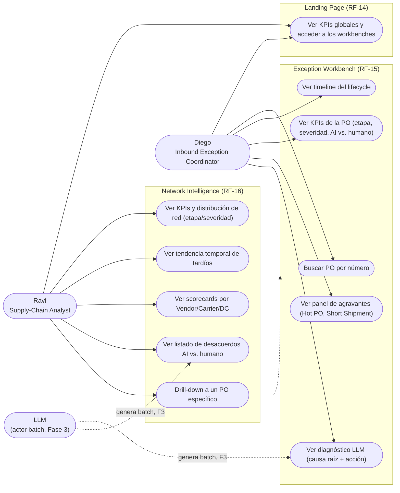

# Especificación de Requisitos de Software (SRS)
## Sistema: PO Delay Root Cause Analyzer

---

### Índice
1. [Introducción](#1-introducción)
2. [Descripción General](#2-descripción-general)
3. [Requisitos Específicos](#3-requisitos-específicos)
   - 3.1 [Requisitos funcionales](#31-requisitos-funcionales)
   - 3.2 [Requisitos no funcionales](#32-requisitos-no-funcionales)
   - 3.3 [Requisitos de interfaz](#33-requisitos-de-interfaz)
   - 3.4 [Requisitos de base de datos](#34-requisitos-de-base-de-datos)
   - 3.5 [Diagrama UML de Entidad-Relación (ERD)](#35-diagrama-uml-de-entidad-relación-erd)
4. [Apéndices](#4-apéndices)

---

### 1. Introducción

#### 1.1 Propósito del documento
El propósito de esta Especificación de Requisitos de Software (SRS) es definir y documentar de manera formal y exhaustiva los requisitos funcionales, no funcionales, de interfaz y de base de datos para el sistema **PO Delay Root Cause Analyzer**. Este documento está dirigido a coordinadores de excepciones operativas, analistas de cadena de suministro (supply chain), desarrolladores de software, ingenieros de QA y arquitectos de soluciones, proporcionando una visión unificada.

#### 1.2 Alcance del software
El **PO Delay Root Cause Analyzer** es una herramienta de auditoría y soporte a decisiones de Inteligencia Artificial diseñada para identificar, clasificar y explicar los retrasos en las Órdenes de Compra (PO - Purchase Orders) dentro de la cadena de suministro inbound. 

*   **Capacidades reales del sistema (mapeadas en el código):**
    *   **Pipeline de Datos (Fase 1):** Ingesta de datasets de transacciones logísticas en formato CSV, tipado y limpieza de timestamps, cálculo de métricas de tiempo de ciclo (yard wait, dock time, carrier lag, etc.) y auditoría de calidad de datos mediante flags.
    *   **Clasificador por Reglas de Negocio (Fase 2):** Clasificación determinística de la etapa de retraso primaria (Vendor, Carrier, DC o Indeterminado) basada en el exceso de tiempo medido sobre umbrales configurables en `rules_config.json`. Además, categoriza severidades logísticas y gestiona modificadores contextuales (reschedule, short ship, short lead).
    *   **Auditoría Cognitiva y Generación de Scorecards de Entidades (Fase 3):** Prompt engineering avanzado con técnicas few-shot estructuradas para generar explicaciones narrativas de causa raíz, proponer acciones operativas concretas al responsable de la etapa medida, evaluar severidades contextuales y auditar la veracidad del código de motivo registrado manualmente por operadores (mismatch analysis). Adicionalmente, implementa un **motor analítico de Scorecards (`scorecard_core.py`)** para evaluar, perfilar y clasificar el riesgo relativo y absoluto de proveedores (`vendors`), transportistas (`carriers`) y centros de distribución (`dcs`).
    *   **Interfaz de Usuario Web (Fase 4):** Dashboard en Streamlit que ofrece dos vistas de consumo especializadas basadas en perfiles de usuario: consulta individual detallada de excepciones (Exception Workbench) e inteligencia agregada de la red logística (Network Intelligence).
*   **Límites del sistema:**
    *   El sistema es **retrospectivo y de auditoría**, no realiza predicciones o forecasting de futuros retrasos.
    *   Operaba originalmente en procesamiento por lotes (batch) utilizando archivos CSV como fuente de persistencia. Con la inclusión de `scorecard_core.py`, introduce salidas analíticas intermedias estructuradas en formato JSON para el perfilado de actores.
    *   La calidad de la inferencia narrativa del LLM depende del aprovisionamiento de las API keys correspondientes y del rendimiento/latencia del proveedor cloud (Anthropic, OpenAI, DeepSeek) o del servicio Ollama local.

#### 1.3 Definiciones, acrónimos y abreviaturas
*   **PO (Purchase Order):** Orden de Compra.
*   **STA (Scheduled Time of Arrival):** Fecha prometida de llegada en el Centro de Distribución (DC).
*   **DC (Distribution Center):** Centro de Distribución.
*   **RCA (Root Cause Analysis):** Análisis de Causa Raíz.
*   **LLM (Large Language Model):** Modelo de Lenguaje de Gran Escala.
*   **Carrier Lag:** Tiempo transcurrido entre la aprobación de la cita y la llegada física del camión al patio del DC (`TRAILER_ARRIVE_DT - APPROVED_DT`).
*   **Yard Wait:** Tiempo de espera en patio antes de entrar a muelle (`CHECKIN_DT - TRAILER_ARRIVE_DT`).
*   **Dock Time:** Tiempo de procesamiento y descarga en muelle (`CHECKOUT_DT - CHECKIN_DT`).
*   **STA Push (Vendor Signal):** Señal que indica que la aprobación de la cita se realizó después de la fecha prometida de entrega (`APPROVED_DT > STA_DT`), empujando operativamente el inicio del flujo.
*   **Short Ship:** Condición de envío incompleto, donde las cajas enviadas son menores al 90% de las ordenadas (`NUM_CASES_SHIPPED / NUM_CASES_ORDERED < 0.90`).
*   **Reschedule:** Re-programación de cita logística (`DT_APPT_CURRENT_APPROVED != DT_APPT_FIRST_APPROVED`).
*   **Mismatch:** Discrepancia identificada entre la etapa de retraso computada matemáticamente por timestamps y el código de motivo registrado por personal humano (`REASON_DSC`).
*   **Scorecard:** Cuadro de mando o reporte de desempeño de entidades de la red de suministro.
*   **Shrinkage (Suavizado Bayesiano):** Técnica estadística utilizada para estabilizar y suavizar promedios y tasas de muestras pequeñas (ej: actores con pocas POs) atrayendo sus estimadores hacia la media global.


#### 1.4 Referencias y visión general del documento
*   **ADR Log (Architecture Decision Records):** Ubicado en `documentation/decisiones/`. Define decisiones críticas como la prioridad de timestamps frente a campos precalculados (ADR-01), asimetría de vendor (ADR-06b) y la arquitectura híbrida de severidades (ADR-10).
*   **Data Dictionary:** Ubicado en `documentation/data_dictionary.md`. Detalla las 39 columnas del CSV de entrada.
*   **User Personas:** Ubicado en `documentation/user_personas.md`. Describe los casos de uso prácticos para Diego y Ravi.

El resto de este documento está organizado en la descripción general del sistema (Sección 2), requisitos específicos de funcionamiento y diagramas UML Mermaid (Sección 3), y finalmente los apéndices técnicos y de ejecución (Sección 4).

---

### 2. Descripción General

#### 2.1 Perspectiva del producto
El sistema **PO Delay Root Cause Analyzer** actúa como un módulo auditor autónomo y desacoplado que interactúa de la siguiente forma con su entorno operativo:

```
[ CSV de Entrada (400 POs) ]
           │
           ▼
┌─────────────────────────────────────────────────────────┐
│              Pipeline & Classifier Core                 │ <── Umbrales (rules_config.json)
└──────────────────────────┬──────────────────────────────┘
                           ├──────────────────────────────┐
                           ▼ (Handoff F2->F3)             ▼ (df_classified.csv)
┌─────────────────────────────────────────────────────────┐ ┌──────────────────────────────┐
│                  LLM Integration Core                   │ │     Scorecard Core Engine    │ <── Regularización Ridge / GMM
└──────────────────────────┬──────────────────────────────┘ └──────────────┬───────────────┘
                           │                                               │ (reporte_*.json)
                           │                                               ▼
                           └───────────────┬───────────────────────────────┘
                                           ▼ (Handoff F3->F4: po_output.csv + reportes JSON)
┌─────────────────────────────────────────────────────────┐
│               Interfaz Streamlit (App)                  │
│  - Diego (Exception Workbench)                          │
│  - Ravi (Network Intelligence con Scorecards)           │
└─────────────────────────────────────────────────────────┘
```

El sistema no se conecta directamente a un ERP o WMS en tiempo real; en su lugar, consume un extracto analítico de 39 columnas de datos transaccionales, realiza cálculos determinísticos en Python, enriquece las transacciones tardías mediante APIs de LLM externas, ejecuta análisis estadísticos de riesgo para los actores de la red, y sirve los resultados mediante una app web local interactiva.

El reparto de atribución vigente en producción, tras aplicar los umbrales de los ADRs (`documentation/decisiones/`), sobre 247 POs tardías es: **Vendor** 53.0% (131), **Carrier** 16.2% (40), **DC** 15.0% (37), **Indeterminado** 15.8% (39 — dividido en 15 `sin_datos` + 24 `sin_causa_dominante`, ver [ADR-07](decisiones/ARD-07.md)).

#### 2.2 Funciones principales del producto
Las macro-funcionalidades implementadas en el código son:
1.  **Limpieza e Ingestión Confiable:** Conversión y normalización de 13 timestamps transaccionales. Detección de problemas de secuencia temporal (inversión de tiempos) y exclusión analítica de campos no operativos (salida física del patio post-recepción).
2.  **Clasificación de Responsabilidad en 4 Etapas:** Atribución del culpable principal del retraso a través de excesos sobre umbral:
    *   **Vendor (Proveedor):** Por exceso de push sobre el STA (>24h).
    *   **Carrier (Transportista):** Por exceso en tránsito (>8h).
    *   **DC (Centro de Distribución):** Por excesos agregados en patio y muelle (>4h en yard y >6h en dock).
    *   **Indeterminado:** Subdividido en `sin_datos` (faltan timestamps clave como llegada del tráiler) y `sin_causa_dominante` (datos completos pero ningún tramo supera su umbral respectivo).
3.  **Cálculo de Severidad y Modificadores:** Asignación de severidades base (LOW, MEDIUM, HIGH) y afectación mediante agravantes operativos (short shipment y lead time de colocación corto).
4.  **Auditoría y Validación AI vs Humano:** Evaluación semántica realizada por el LLM para contrastar el veredicto físico de tiempos contra la anotación de los operadores, identificando el porcentaje de error analítico de la red.
5.  **Motor de Scorecards de Riesgo de Entidades (`scorecard_core.py`):** Generación de perfiles analíticos y de confiabilidad de Vendor, Carrier y DC aplicando regularizaciones estadísticas para estimar riesgos absolutos y relativos de forma auditable.
6.  **Presentación Visual Bifocal:** Pantallas interactivas optimizadas independientemente para el seguimiento diario de excepciones individuales y para el análisis estadístico trimestral de la red de suministro.

#### 2.3 Características y perfiles de usuarios
Según las especificaciones de diseño implementadas en `documentation/user_personas.md` y en las rutas de la app (`04_app/pages/`), se identifican dos roles principales:

1.  **Diego (Inbound Exception Coordinator):** 
    *   **Foco:** Excepciones individuales, caso por caso.
    *   **Necesidad:** Analizar un PO tardío específico, reconstruir su timeline detallado, leer el diagnóstico narrativo redactado por la AI, verificar la acción correctiva sugerida, comprobar el desacuerdo con el motivo humano y enrutar las tareas al área correspondiente.
    *   **Consumo en App:** `pages/1_🔍_Exception_Workbench.py`.
2.  **Ravi (Supply-Chain Analyst / Network RCA):**
    *   **Foco:** Agregaciones, tendencias, scorecards de entidades.
    *   **Necesidad:** Identificar patrones sistémicos en toda la red, evaluar qué proveedores o carriers acumulan más días de retraso o severidades altas, analizar la tasa de error humana agregada (tasa de desacuerdo de la AI), evaluar scorecards de riesgo por proveedor/carrier/DC y exportar reportes para juntas ejecutivas.
    *   **Consumo en App:** `pages/2_📊_Network_Intelligence.py`.

#### 2.4 Diagrama UML de Casos de Uso
El siguiente diagrama detalla cómo interactúan Diego, Ravi y el LLM (actor del sistema, en su rol de generador batch de los diagnósticos que ambos consumen) con las funciones principales de la aplicación, construidas a partir de las personas (§2.3) y los requisitos funcionales RF-14 a RF-16 (§3.1):



#### 2.5 Restricciones generales
*   **Lenguaje de Desarrollo:** Escrito en Python 3.x (compatible con entornos virtuales `.venv`).
*   **Infraestructura de Datos:** Procesamiento in-memory estructurado con `pandas` y `numpy`. Sin motores SQL activos en la capa de servicios.
*   **Interfaz Gráfica:** Restringida a las capacidades nativas del framework web Streamlit, utilizando gráficos interactivos provistos por Plotly.
*   **Seguridad y Claves:** Restricción de Secrets mediante el estándar `.env` excluido del control de versiones. Las API keys de proveedores externos de LLM no deben integrarse en código duro.

#### 2.6 Supuestos y dependencias
*   **Calidad de datos del origen:** El sistema asume que el CSV crudo puede llegar con nulos e inconsistencias temporales, y las diseña como parte del contrato (RF-02): `TRAILER_ARRIVE_DT` con 6.8% de nulos, `REASON_CD` con 32.8% de nulos, `PREVIOUS_REQUEST_DT` con 84.2% de nulos, y 12 POs con inversión de timestamps (`_ts_issue`). De 400 POs de origen, 361 quedan marcadas como `_data_reliable`. El sistema no asume datos limpios; asume la necesidad de auditarlos y flaggearlos.
*   **Formato de entrada:** El CSV crudo en `data/raw/` debe poseer las 39 columnas y los nombres exactos detallados en el diccionario de datos. De lo contrario, la validación del contrato de entrada fallará arrojando un error controlado.
*   **Conexión de red:** Se asume conexión activa a internet para llamadas a backends Cloud (Claude de Anthropic, GPT de OpenAI, DeepSeek). En modo sin conexión, se depende de una instancia local de Ollama escuchando en `http://localhost:11434` con el modelo `qwen2.5:7b` instalado.
*   **Handoff de datos:** Se asume que el proceso batch de Fase 3 genera el archivo `po_output.csv` y los archivos `reporte_vendors.json`, `reporte_carriers.json` y `reporte_dcs.json` en `data/processed/` antes de iniciar la aplicación Streamlit.

---

### 3. Requisitos Específicos

#### 3.1 Requisitos funcionales

##### Fase 1: Ingestión, Limpieza y Validación
*   **RF-01 (Limpieza de Fechas):** El sistema debe parsear automáticamente los 13 timestamps especificados en la constante `_DATE_INPUT_COLUMNS` del archivo `01_data_pipeline_and_eda/pipeline_core.py` utilizando `pd.to_datetime` con la opción `errors='coerce'`. Los valores erróneos o nulos deben convertirse a `NaT`.
*   **RF-02 (Flags de Calidad):** El sistema debe identificar inconsistencias de calidad de datos mediante flags booleanas:
    *   `_trailer_arrive_null`: True si `TRAILER_ARRIVE_DT` es nulo (`NaT`).
    *   `_ts_issue`: True si se presenta inversión temporal (ej. `CHECKIN_DT < TRAILER_ARRIVE_DT` o `CHECKOUT_DT < CHECKIN_DT`).
    *   `_data_reliable`: True únicamente si no hay problemas de timestamp y el arribo del camión está completo (`~_ts_issue & ~_trailer_arrive_null`).
*   **RF-03 (Cálculo de Tramos / Lead Times):** El sistema debe calcular los deltas de tiempo operativos expresados en horas o días:
    *   `yard_wait_calc_hrs` = `CHECKIN_DT - TRAILER_ARRIVE_DT` (en horas, recortado a $\ge 0$).
    *   `dock_calc_hrs` = `CHECKOUT_DT - CHECKIN_DT` (en horas, recortado a $\ge 0$).
    *   `carrier_lag_hrs` = `TRAILER_ARRIVE_DT - APPROVED_DT` (en horas).
    *   `appt_lead_days` = `STA_DT - APPROVED_DT` (en días).
    *   `delay_days_calc` = `RECPT_DT - STA_DT` (en días, recortado a $\ge 0$).
*   **RF-04 (Cross-Validation de Deltas):** El sistema debe realizar un contraste cruzado entre los deltas calculados a partir de los timestamps reales y los campos precalculados de origen (`YARD_WAIT_HRS`, `DOCK_HRS`, `DELAY_DAYS`), reportando cualquier discrepancia mayor a 1.0 hora mediante las flags `_yard_discrepancy` y `_dock_discrepancy`.

##### Fase 2: Clasificación Operativa por Reglas de Negocio
*   **RF-05 (Máscaras de Medibilidad):** Antes de clasificar las etapas, el sistema debe establecer si los tramos son evaluables en base a la completitud de la información:
    *   `_carrier_medible`: True si `_trailer_arrive_null` es False.
    *   `_dc_medible`: True si el camión llegó y no hay inversión temporal (`~_trailer_arrive_null & ~_ts_issue`).
*   **RF-06 (Cálculo de Excesos sobre Umbral):** El sistema debe calcular el exceso en horas para cada etapa basándose en los umbrales configurados en `02_clasif_reglas_negocio/rules_config.json`:
    *   `excess_carrier_hrs` = $\max(0, \text{carrier\_lag\_hrs} - \text{thr\_carrier})$ (si es medible; de lo contrario 0).
    *   `excess_yard_hrs` = $\max(0, \text{yard\_wait\_calc\_hrs} - \text{thr\_yard})$ (si es medible; de lo contrario 0).
    *   `excess_dock_hrs` = $\max(0, \text{dock\_calc\_hrs} - \text{thr\_dock})$ (si es medible; de lo contrario 0).
    *   `excess_dc_hrs` = `excess_yard_hrs + excess_dock_hrs`.
    *   `excess_vendor_hrs` = $\max(0, (-\text{appt\_lead\_days} \times 24) - \text{thr\_vendor})$ (donde el push en horas es $-\text{appt\_lead\_days} \times 24$, aplicando el umbral vendor de 24h).
*   **RF-07 (Atribución de Etapa Primaria):** Para los pedidos tardíos (`delay_days_calc > 0`), el sistema debe asignar el ganador determinístico mediante el `argmax` de excesos entre `{Vendor, Carrier, DC}`. Si no hay excesos mayores a cero:
    *   Si el pedido no es decidible (no medible por falta de datos), se clasifica como `Indeterminado` con subclase `sin_datos`.
    *   Si es decidible pero ningún exceso superó el umbral, se clasifica como `Indeterminado` con subclase `sin_causa_dominante`.
*   **RF-08 (Capa Complementaria y Multicausa):** El sistema debe calcular:
    *   `stage_multi`: Etiqueta textual que combina las etapas que presentan excesos $> 0$ (ej: "Vendor + Carrier"). Si no hay excesos, se etiqueta como "Ninguno".
    *   `reason_group_manual`: Mapeo estricto del motivo humano original (`REASON_DSC`) a las categorías simplificadas Vendor/Carrier/DC para realizar contrastes.
    *   `is_rescheduled`, `is_short_ship` e `is_short_lead`: Flags booleanas de contexto operacional.
*   **RF-09 (Severidad Determinística):** El sistema debe evaluar el nivel de severidad base de la PO tardía:
    *   `HIGH` si es Hot PO (`flag_hot_late`) y el retraso supera los 3 días (`delay_days_calc > 3.0`).
    *   `LOW` si el retraso es menor a 1 día (`delay_days_calc < 1.0`).
    *   `MEDIUM` en cualquier otro caso de retraso.
    *   **Agravante:** Si `is_short_ship` o `is_short_lead` son verdaderos, el sistema debe aumentar la severidad un nivel (LOW $\rightarrow$ MEDIUM, MEDIUM $\rightarrow$ HIGH, HIGH se mantiene en HIGH).


##### Fase 3: Integración LLM y Auditoría Cognitiva
*   **RF-10 (Construcción del Prompt Dinámico):** El sistema debe construir un prompt estructurado inyectando los datos de la PO, el timeline, las métricas calculadas y la clasificación determinística. Debe incluir un bloque de ejemplos few-shot curados a partir del pool de discrepancias si se configuran, y directrices para evitar el overfitting y forzar el uso exacto de cifras numéricas provistas.
*   **RF-11 (Llamadas Multi-Backend):** El sistema debe soportar llamadas concurrentes o serializadas a cuatro backends de procesamiento de lenguaje: Claude API, OpenAI API, DeepSeek API y Ollama local.
*   **RF-12 (Parseo Robusto de JSON en dos llamadas):** El sistema realiza el diagnóstico en dos llamadas encadenadas al LLM:
    *   **Llamada 1 (diagnóstico base):** Extrae un JSON con `causa_raiz`, `accion_recomendada`, `severidad`, `coincide_con_reason_code` y `confianza`.
    *   **Llamada 2 (diagnóstico diferencial, Tier 2 — [ADR-16](decisiones/ARD-16.md)):** Condicionada al resultado de la llamada 1, extrae `razonamiento`, `hipotesis_principal` (con `hipotesis`, `evidencia` y un plan de `accion_inmediata`/`accion_correctiva`/`accion_preventiva`), `hipotesis_alternativa` (con `hipotesis` y `paso_discriminante`) y `confianza_hipotesis`.

    En caso de fallo de formato en cualquiera de las dos respuestas, el sistema debe aplicar un mecanismo de fallback estructurado por llamada.
*   **RF-13 (Exportación de Entregable F3$\rightarrow$F4):** El sistema debe filtrar únicamente las POs tardías y exportar el CSV entregable consolidando el contrato del mentor (las 5 columnas principales) con las columnas de soporte requeridas por el dashboard Streamlit.

##### Fase 4: Visualización Streamlit
*   **RF-14 (Landing Page y Navegación):** El sistema debe presentar una página principal con KPIs agregados globales (total de tardíos, porcentaje de severidad alta) y tarjetas de acceso directo a los espacios de trabajo Diego y Ravi.
*   **RF-15 (Exception Workbench - Diego):** El sistema debe permitir buscar y seleccionar una PO por número (`PO_NBR`) y renderizar de forma gráfica:
    *   KPIs del PO (Etapa, Severidad, Validación AI vs Humano, Motivo Humano).
    *   Timeline horizontal visual del lifecycle marcando las fechas registradas y omitiendo las nulas.
    *   Panel de agravantes (Hot PO, Short Shipment).
    *   Causa Raíz narrativa y Acción Recomendada detalladas por el LLM.
*   **RF-16 (Network Intelligence - Ravi):** El sistema debe mostrar el comportamiento macro:
    *   KPIs de red (Total de tardíos, Etapa principal, Porcentaje de severidad alta, Tasa agregada de acuerdo AI vs Humano).
    *   Gráficos interactivos de Plotly de Distribución de Etapas y Distribución de Severidad, en **barra horizontal/ordenada** ([ADR-17](decisiones/ARD-17.md) prohíbe pastel, dona, treemap y 3D).
    *   Tabla de detalle de severidades con conteo y cálculo de porcentajes.
    *   Tendencia temporal de POs tardíos por semana (línea con etiquetado directo sobre `PO_DT`).
    *   Listado tabular interactivo de las POs que presentan desacuerdo entre el veredicto del clasificador temporal y la anotación humana para auditoría.
    *   Scorecards por entidad (Vendor/Carrier/DC), leídos de `data/processed/scorecards/reporte_*.json` (generados offline por `scorecard_core.py`, sin costo de API).
    *   Drill-down master-detail: desde un scorecard o registro, navegar directamente al Exception Workbench de esa PO específica (`st.switch_page`).

##### Trazabilidad de Requisitos Funcionales a Pruebas
Cada bloque de RF se valida mediante un archivo de pruebas dedicado en `tests/` (suite pytest, ejecutada en CI en cada push/PR):

| Requisitos | Archivo de prueba |
| :--- | :--- |
| RF-01 – RF-04 (Ingestión y limpieza) | `tests/test_pipeline_core.py` |
| RF-05 – RF-09 (Clasificación por reglas) | `tests/test_classifier_core.py`, `tests/test_metrics_core.py` |
| RF-10 (Construcción del prompt, ejemplos few-shot) | `tests/test_fewshot.py` |
| RF-11 – RF-12 (Backends, parseo y calidad de la respuesta LLM) | `tests/test_llm_integration.py`, `tests/test_eval_quality.py`, `tests/test_eval_diversity.py` |
| RF-13 (Exportación y contrato F3→F4) | `tests/test_handoff_contract.py`, `tests/test_handoff_f3.py` |
| RF-14 – RF-16 (Interfaz Streamlit) | Sin suite de pruebas automatizada dedicada; validación manual (ver §4.1 para los comandos de ejecución). |

#### 3.2 Requisitos no funcionales

*   **RNF-01 (Rendimiento y Latencia):** 
    *   La ingesta, limpieza y clasificación de las 400 órdenes en memoria debe completarse en un tiempo inferior a **2.0 segundos** (CPU local estándar).
    *   El procesamiento de llamadas a LLM debe incorporar un delay configurable (`LLM_DELAY_SECONDS`, default 0.5s) para evitar bloqueos por Rate Limit del proveedor, y un timeout máximo de llamada de **60 segundos**.
    *   La generación estadística de los scorecards mediante GMM y Regresión Ridge debe completarse en un tiempo inferior a **1.5 segundos** locales.
*   **RNF-02 (Seguridad y Privacidad):**
    *   Toda clave API (`ANTHROPIC_API_KEY`, `OPENAI_API_KEY`, `DEEPSEEK_API_KEY`) y configuraciones locales de red deben ser leídas desde variables de entorno. Está estrictamente prohibido versionar archivos `.env` o registrar claves en repositorios públicos.
*   **RNF-03 (Disponibilidad y Tolerancia a Fallos):**
    *   El módulo de LLM debe integrar una política de reintentos (`max_retries = 3`) con espera incremental (`RETRY_SLEEP_SECONDS = 2s`) ante errores de red o HTTP 5xx.
    *   Si el JSON retornado por el LLM es inválido, el sistema no debe romperse; aplicará una degradación de emergencia rellenando con valores por defecto predefinidos (`FALLBACK_SEVERITY = "MEDIUM"`, `FALLBACK_CONFIDENCE = 0.3`).
    *   El motor de scorecards debe incluir manejos de excepciones y recaídas a pesos predefinidos de negocio en caso de fallos en la convergencia de la regresión o de la estandarización.
*   **RNF-04 (Mantenibilidad y Modularidad):**
    *   El diseño debe mantener la separación de responsabilidades (Decoupled Pipeline): el Pipeline (F1), el Clasificador (F2), la Integración LLM / Análisis Estadístico (F3) y la UI Streamlit (F4) se comunican exclusivamente por contratos de datos CSV e informes JSON validados en disco.
    *   Los umbrales de negocio logísticos deben estar externalizados en el JSON `rules_config.json`, de forma que un cambio en los criterios del negocio no exija modificaciones en el código fuente de clasificación.
*   **RNF-05 (Reproducibilidad y control de costo de inferencia):**
    *   Los parámetros de inferencia deben estar externalizados en `03_llm_integration/llm_config.json` (no en código duro): `temperature`, `seed` (reproducibilidad best-effort de la API), `max_tokens` (512, diagnóstico base) y `max_tokens_action` (1536, diagnóstico diferencial Tier 2).
    *   El intervalo de guardado parcial durante el procesamiento batch debe ser configurable (`LLM_SAVE_EVERY`) para acotar la pérdida de trabajo ante una interrupción, sin exigir reprocesar el lote completo.
    *   Toda corrida que dispare llamadas reales a una API de LLM de pago debe declarar el conteo de llamadas esperadas y obtener autorización explícita antes de ejecutarse, independientemente del modo (`test`/`custom`/`full`).
*   **RNF-06 (Criterios de calidad validados):** Métricas medidas y publicadas como evidencia de aceptación (ver `README.md`, sección de estado de fases):
    *   Stage accuracy: 100% (208/208) — meta del mentor > 80%.
    *   Reason agreement (AI vs. humano): 88.8% (174/196) — referencia, sin umbral de aceptación.
    *   LLM Explanation Quality: 5/5 (20/20), few-shot C3 revalidado a la temperatura de producción (0.9) — meta del mentor > 4/5. (4.75/5 fue la cifra del benchmark inicial que seleccionó la configuración C3 frente a C1/C2, no la cifra final del entregable; ver `documentation/validacion-y-qa.md`.)
    *   Severity Ranking: 100% (14/14) — meta del mentor > 95%.

#### 3.3 Requisitos de interfaz

*   **Interfaz de Usuario (UI):**
    *   Desarrollada bajo Streamlit 1.30+.
    *   Estilos personalizados inyectados desde un archivo CSS centralizado (`04_app/assets/styles.css`) para controlar tipografía, sombras de tarjetas, colores de severidad y bordes de diseño premium.
*   **Interfaces de Software y APIs:**
    *   Integración HTTP/REST con los servicios de Claude API (Anthropic), Chat Completions API (OpenAI/DeepSeek) y Ollama HTTP Server (`/api/generate`).
*   **Hardware Requerido:**
    *   Estación de trabajo estándar con CPU dual-core, $\ge 8$ GB de RAM y $\ge 500$ MB de almacenamiento en disco disponible. Dependencia de bibliotecas científicas de Machine Learning: `scikit-learn` (para Ridge, GaussianMixture y StandardScaler). En caso de ejecutar Qwen 2.5:7B de forma local, se recomienda tarjeta gráfica GPU dedicada con $\ge 8$ GB de VRAM.

#### 3.4 Requisitos de base de datos
El sistema opera sobre una base de datos conceptual basada en archivos planos estructurados. La persistencia en disco se realiza en formato CSV y JSON. Los modelos lógicos representados en el dataset se definen a continuación:

##### Esquema de Campos e Integridad Lógica (Contrato F3$\rightarrow$F4)
El contrato real, definido de forma centralizada en `04_app/config.py` (columnas canónicas `COL_*`), se organiza en un núcleo base más dos niveles de enriquecimiento agregados en distintos momentos del proyecto.

**Núcleo base:**
1.  **PO_NBR:** Entero de 64 bits. Identificador clave único (Primary Key lógica). No admite nulos.
2.  **stage:** Texto. Clasificación primaria del retraso (`stage_primary` remapeado). Restringido a: `Vendor`, `Carrier`, `DC` o `Indeterminado`.
3.  **severity:** Texto. Nivel de prioridad evaluado por el LLM. Restringido a: `HIGH`, `MEDIUM`, `LOW`.
4.  **explanation:** Texto. Causa raíz narrativa detallada.
5.  **action:** Texto. Acción sugerida al responsable.
6.  **Timestamps de Ciclo (PO_DT, STA_DT, APPROVED_DT, TRAILER_ARRIVE_DT, CHECKIN_DT, CHECKOUT_DT, RECPT_DT):** Valores datetime formateados. Exigen consistencia secuencial lógica (salvo las marcadas bajo `_ts_issue`). `TRAILER_ARRIVE_DT` puede ser nulo, forzando la clasificación `Indeterminado` con la subclase `sin_datos`.
7.  **HOT_PO_FLAG:** Entero (0 o 1). Flag exógena de prioridad comercial.
8.  **is_short_ship:** Booleano. Flag que denota fill rate incompleto.
9.  **REASON_DSC:** Texto. Anotación manual de causa raíz escrita por el DC origen (admite nulos).
10. **llm_coincide_con_reason:** Booleano. Flag de validación de acuerdo de la AI.

**Enriquecimiento Tier 1 (issues #158/#167):**
11. **llm_confianza:** Real (0.0–1.0). Certidumbre del LLM sobre el diagnóstico base (núcleo).
12. **VENDOR_NAME, CARRIER_PARTY_NAME, DC_LOC_NAME:** Texto. Identificadores de las entidades de la red asociadas a la PO (proveedor, transportista, centro de distribución).
13. **delay_days_calc:** Real. Días de retraso calculados en Fase 1 (`RECPT_DT - STA_DT`, recortado a $\ge 0$).
14. **excess_vendor_hrs, excess_carrier_hrs, excess_dc_hrs:** Reales. Exceso en horas por tramo sobre su umbral respectivo, calculado en Fase 2.

**Enriquecimiento Tier 2 — diagnóstico diferencial (issues #161/#175, [ADR-16](decisiones/ARD-16.md)):**
Salida híbrida definida por ADR-16 (estado: 🔵 Borrador en el log de decisiones, aunque ya implementada en `main`). Añade un segundo nivel de razonamiento explícito sobre el diagnóstico base:
15. **llm_razonamiento:** Texto. Razonamiento que sustenta el diagnóstico.
16. **llm_hipotesis:** Texto. Hipótesis principal de causa raíz.
17. **llm_hipotesis_evidencia:** Texto. Evidencia (datos, tramos, magnitudes) que sustenta la hipótesis principal.
18. **llm_hipotesis_alt:** Texto. Hipótesis alternativa considerada por el LLM.
19. **llm_paso_discriminante:** Texto. Dato o verificación que permitiría discriminar entre la hipótesis principal y la alternativa.
20. **llm_accion_inmediata, llm_accion_correctiva, llm_accion_preventiva:** Texto. Plan de acción escalonado por horizonte temporal (a diferencia del campo único `action` del núcleo base).
21. **llm_confianza_hipotesis:** Real (0.0–1.0). Confianza específica de la hipótesis del diagnóstico tier 2 — distinta y complementaria de `llm_confianza` (tier 1).

##### Esquema de Scorecards de Entidades (reporte_*.json)
1.  **report_date:** Texto. Fecha de generación del reporte.
2.  **entity_name:** Identificador de la entidad evaluada (Llave primaria lógica del sub-objeto).
3.  **Delay_Prom:** Real. Promedio de días de retraso.
4.  **Tasa_Reschedule:** Real. Porcentaje de citas reprogramadas.
5.  **Excess_por_PO:** Real. Promedio de horas de exceso.
6.  **Score_Riesgo_Normalizado:** Real. Valor compuesto entre 0.0 y 100.0 basado en percentiles de grupo.
7.  **Nivel_Riesgo_Absoluto / Nivel_Riesgo_Relativo / Nivel_Riesgo:** Texto. Etiquetas de riesgo (`Bajo`, `Medio`, `Alto`, `Sin datos`).
8.  **n_POs_total:** Entero. Total de órdenes asociadas a la entidad.
9. **n_POs_causa_raiz:** Entero. Cantidad de órdenes donde la entidad fue clasificada como causa raíz primaria del retraso.

#### 3.5 Diagrama UML de Entidad-Relación (ERD)
Aunque el almacenamiento físico es en archivos CSV y JSON, la estructura lógica del dominio logístico y analítico del sistema se representa mediante el siguiente diagrama de Entidad-Relación:

```mermaid
erDiagram
    PURCHASE_ORDER ||--|| VENDOR : "pertenece a"
    PURCHASE_ORDER ||--|| CARRIER : "transportado por"
    PURCHASE_ORDER ||--|| DISTRIBUTION_CENTER : "destino en"
    PURCHASE_ORDER ||--|| LLM_ANALYSIS : "tiene"
    VENDOR ||--|| VENDOR_SCORECARD : "evaluado en"
    CARRIER ||--|| CARRIER_SCORECARD : "evaluado en"
    DISTRIBUTION_CENTER ||--|| DC_SCORECARD : "evaluado en"

    PURCHASE_ORDER {
        int PO_NBR PK "Número único de PO (Identificador)"
        datetime PO_DT "Fecha de colocación de la PO"
        datetime STA_DT "Fecha prometida de llegada (Scheduled Arrival)"
        datetime APPROVED_DT "Fecha de aprobación de cita vigente"
        datetime DT_APPT_FIRST_APPROVED "Fecha de aprobación de primera cita"
        datetime DT_APPT_CURRENT_APPROVED "Fecha de aprobación de cita actual"
        datetime TRAILER_ARRIVE_DT "Llegada del camión al DC (puede ser NaT)"
        datetime CHECKIN_DT "Entrada del camión al muelle"
        datetime CHECKOUT_DT "Salida del camión del muelle"
        datetime RECPT_DT "Publicación de recepción en sistema"
        datetime REQUESTED_DT "Fecha de solicitud del vendor"
        datetime FIRST_SUBMITTED_DT "Fecha de primera sumisión del vendor"
        datetime PREVIOUS_REQUEST_DT "Fecha de solicitud previa"
        datetime TRAILER_DEPART_DT "Salida física del patio"
        int NUM_CASES_ORDERED "Cantidad de cajas ordenadas"
        int NUM_CASES_SHIPPED "Cantidad de cajas enviadas"
        int TOT_ORG_QTY "Cantidad total original"
        int TOT_RCVD_QTY "Cantidad total recibió"
        int TOT_ON_ORD_QTY "Cantidad total en orden activa"
        int TOT_ADJ_QTY "Cantidad total de ajustes"
        int HOT_PO_FLAG "Bandera de PO urgente (0/1)"
        int HOT_APPT_FL "Bandera de cita urgente (0/1)"
        float DELAY_DAYS "Días de retraso precalculados origen"
        float YARD_WAIT_HRS "Horas de espera precalculadas origen"
        float DOCK_HRS "Horas de descarga precalculadas origen"
        string IS_LATE "Llegó tarde en origen (Y/N)"
        string REASON_CD "Código de motivo manual"
        string REASON_DSC "Motivo manual de retraso registrado"
        string TRAILER_NBR "Placa del contenedor"
        int YARD_DROP_FL "Camión dejado en patio (0/1)"
        string PO_STATUS_CD "Código de estado de la PO"
        boolean _trailer_arrive_null "Flag calidad: trailer arrive NaT"
        boolean _ts_issue "Flag calidad: inversiones temporales"
        boolean _data_reliable "Flag calidad: datos confiables"
        boolean _rescheduled "Operativo: cita reprogramada"
        float _fill_rate "Operativo: fill rate de cajas"
        boolean _short_ship "Operativo: fill rate menor a 90%"
        float lead_time_days "Lead time PO a STA"
        float carrier_lag_hrs "Deltas: Carrier lag"
        float yard_wait_calc_hrs "Deltas: Espera en patio"
        float dock_calc_hrs "Deltas: Descarga en muelle"
        float total_dc_hrs "Deltas: Tiempo total en DC"
        float appt_lead_days "Deltas: Lead time de cita"
        float delay_days_calc "Deltas: Días de retraso"
        boolean flag_yard_congestion "Flag preliminar: yard congestion"
        boolean flag_dock_backlog "Flag preliminar: dock backlog"
        boolean flag_carrier_miss "Flag preliminar: carrier miss"
        boolean flag_short_lead_time "Flag preliminar: short lead time"
        boolean flag_hot_late "Flag preliminar: hot late"
        boolean _carrier_medible "Máscara: carrier evaluable"
        boolean _dc_medible "Máscara: DC evaluable"
        boolean flag_carrier_calc "Flag: carrier supera umbral"
        boolean flag_yard_calc "Flag: yard supera umbral"
        boolean flag_dock_calc "Flag: dock supera umbral"
        float excess_carrier_hrs "Exceso: carrier"
        float excess_yard_hrs "Exceso: yard"
        float excess_dock_hrs "Exceso: dock"
        float excess_dc_hrs "Exceso: DC"
        float excess_vendor_hrs "Exceso: vendor"
        string stage_primary "Etapa primaria del retraso"
        string dc_substage "Subetapa del DC (Yard/Dock)"
        string indeterminado_substage "Subetapa Indeterminado"
        string reason_group_manual "Mapeo manual de REASON_DSC"
        boolean is_rescheduled "Alias: cita reprogramada"
        boolean is_short_ship "Alias: short shipment"
        boolean is_short_lead "Alias: lead time corto"
        string stage_multi "Atribución multicausa"
        string severity "Severidad del caso"
    }

    VENDOR {
        string VENDOR_NAME PK "Nombre comercial del Proveedor"
        int PAY_VENDOR_NBR "Código financiero de pago"
        string PAY_VENDOR_NAME "Razón social del Proveedor"
    }

    CARRIER {
        string CARRIER_PARTY_NAME PK "Nombre de la empresa transportista"
    }

    DISTRIBUTION_CENTER {
        int DC_ID PK "Identificador único de la sucursal"
        string DC_LOC_NAME "Ubicación del DC"
        string DC_FACILITY_CD_ABBREV "Abreviación del edificio"
    }

    LLM_ANALYSIS {
        int PO_NBR PK, FK "Número de PO asociada (1:1)"
        string explanation "Narrativa de causa raíz generada (núcleo base)"
        string action "Recomendación correctiva generada (núcleo base)"
        string severity "Nivel de severidad asignado por el LLM (núcleo base)"
        boolean llm_coincide_con_reason "Consistencia vs código manual (núcleo base)"
        float llm_confianza "Certidumbre del diagnóstico base (Tier 1, #158/#167)"
        string llm_razonamiento "Razonamiento del diagnóstico (Tier 2, ADR-16)"
        string llm_hipotesis "Hipótesis principal de causa raíz (Tier 2)"
        string llm_hipotesis_evidencia "Evidencia de la hipótesis principal (Tier 2)"
        string llm_hipotesis_alt "Hipótesis alternativa considerada (Tier 2)"
        string llm_paso_discriminante "Paso que discrimina entre hipótesis (Tier 2)"
        string llm_accion_inmediata "Acción de horizonte inmediato (Tier 2)"
        string llm_accion_correctiva "Acción de horizonte correctivo (Tier 2)"
        string llm_accion_preventiva "Acción de horizonte preventivo (Tier 2)"
        float llm_confianza_hipotesis "Confianza de la hipótesis, distinta de llm_confianza (Tier 2)"
    }

    VENDOR_SCORECARD {
        string VENDOR_NAME PK, FK "Nombre del Proveedor"
        float Delay_Prom "Días de retraso promedio con credibilidad"
        float Tasa_Reschedule "Tasa de reprogramación suavizada Efron-Morris"
        float Excess_por_PO "Exceso promedio de horas con credibilidad"
        float Score_Riesgo_Normalizado "Score compuesto compuesto final (0-100)"
        string Nivel_Riesgo_Absoluto "Nivel de riesgo vs red"
        string Nivel_Riesgo_Relativo "Nivel de riesgo vs competidores"
        float Percentil_Delay_vs_Red "Percentil de retraso global"
        int n_POs_total "Total de órdenes"
        int n_POs_causa_raiz "Órdenes atribuidas como causa raíz"
    }

    CARRIER_SCORECARD {
        string CARRIER_PARTY_NAME PK, FK "Nombre del Transportista"
        float Delay_Prom "Días de retraso promedio con credibilidad"
        float Tasa_Reschedule "Tasa de reprogramación suavizada Efron-Morris"
        float Excess_por_PO "Exceso promedio de horas con credibilidad"
        float Score_Riesgo_Normalizado "Score compuesto compuesto final (0-100)"
        string Nivel_Riesgo_Absoluto "Nivel de riesgo vs red"
        string Nivel_Riesgo_Relativo "Nivel de riesgo vs competidores"
        float Percentil_Delay_vs_Red "Percentil de retraso global"
        int n_POs_total "Total de órdenes"
        int n_POs_causa_raiz "Órdenes atribuidas como causa raíz"
    }

    DC_SCORECARD {
        string DC_LOC_NAME PK, FK "Ubicación del DC"
        float Delay_Prom "Días de retraso promedio con credibilidad"
        float Tasa_Reschedule "Tasa de reprogramación suavizada Efron-Morris"
        float Excess_por_PO "Dwell Time Net promedio con credibilidad"
        float Score_Riesgo_Normalizado "Score compuesto compuesto final (0-100)"
        string Nivel_Riesgo_Absoluto "Nivel de riesgo vs red"
        string Nivel_Riesgo_Relativo "Nivel de riesgo vs competidores"
        float Percentil_Delay_vs_Red "Percentil de retraso global"
        int n_POs_total "Total de órdenes"
        int n_POs_causa_raiz "Órdenes atribuidas como causa raíz"
    }
```



---

### 4. Apéndices

#### 4.1 Marcadores de ejecución para prototipos de referencia

Para iniciar y probar la solución completa desde el entorno local, se deben seguir los siguientes comandos en la terminal (Shell de Windows / Powershell):

1.  **Instalar dependencias y configurar entorno:**
    ```powershell
    # Activar entorno virtual
    .venv\Scripts\Activate.ps1
    # Instalar requerimientos (asegura scikit-learn instalado)
    pip install -r requirements.txt
    ```
2.  **Correr Pipeline de Limpieza y Clasificación (Fase 1 y 2):**
    ```powershell
    # Ejecuta el pipeline core de Fase 1
    python 01_data_pipeline_and_eda\pipeline_core.py
    # Ejecuta el clasificador por reglas de Fase 2
    python 02_clasif_reglas_negocio\classifier_core.py
    ```
3.  **Ejecutar Motor Estadístico de Scorecards (Fase 3):**
    ```powershell
    # Calcula scorecards de riesgo e imprime confirmación
    python 03_llm_integration\scorecard_core.py
    ```
4.  **Ejecutar Integración LLM en modo Test (Fase 3):**
    ```powershell
    # Ejecuta el backend local (Qwen) para 10 registros de prueba
    python 03_llm_integration\llm_integration.py --mode test --backend local
    ```
5.  **Ejecutar la Suite de Pruebas (pytest):**
    ```powershell
    # Corre todos los unit tests del repositorio
    pytest
    ```
6.  **Correr la aplicación de visualización interactiva (Fase 4):**
    ```powershell
    # Lanza la aplicación Streamlit en el navegador web local
    streamlit run 04_app\app.py
    ```
