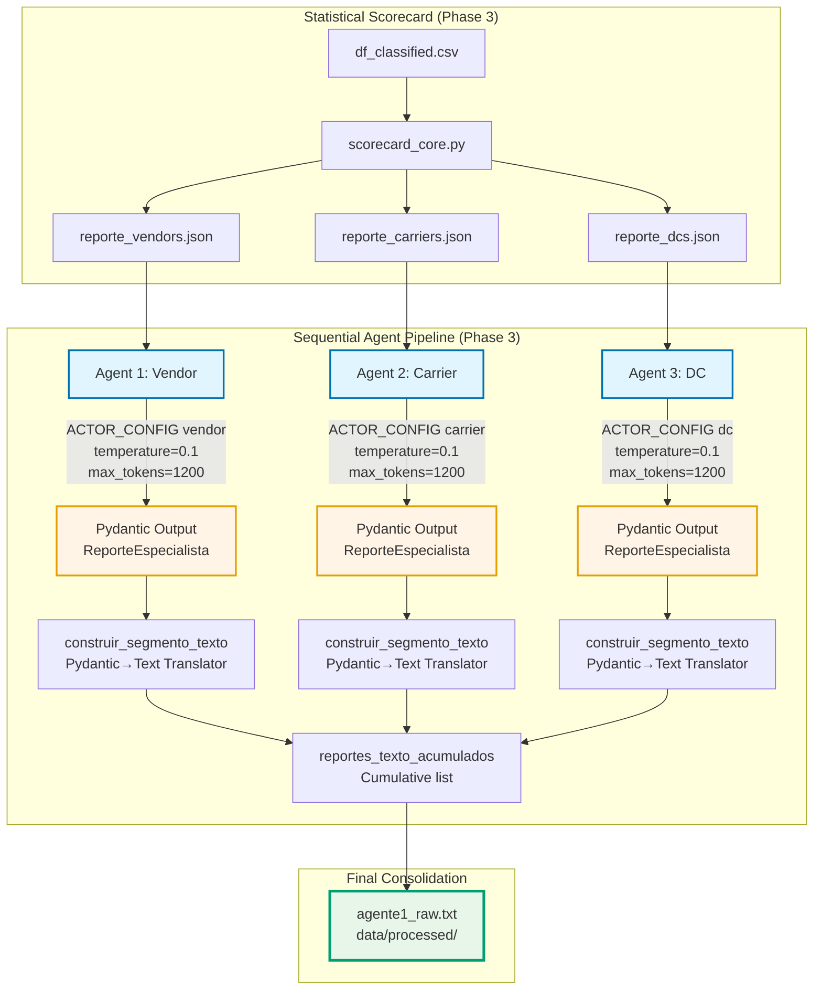

# LLM Integration for Holistic Root Cause Analysis and Enrichment with Statistical Scorecard

* **Status:** 🟢 **Current** (closed 2026-07-17; reconciled with [ARD-16](ARD-16.en.md) and with the code on 2026-07-19)
* **Technical Context:** Phase 3 / LLM Integration — holistic root cause analysis pipeline by actor (Vendor / Carrier / DC), enriched with input via statistical scorecard
* **References:** Feedback from mentors (post-validation of main); [ARD-16](ARD-16.en.md) (track 3 — this decision delivers a part, see Relationship with other decisions); ADR-09 (people of Phase 4), ADR-10 (severity); `03_llm_integration/llm_integration_network_intelligence_view.py`, `03_llm_integration/scorecard_core.py`; artifacts `data/processed/df_classified.csv` (input), `data/processed/scorecards/reporte_{vendors,carriers,dcs}.json` (scorecard, resolved via `REPO_ROOT`, does not depend on CWD), `data/processed/agente1_raw.txt` (consolidated output)

## Context and Problem
Phase 3 introduces a network intelligence consumption surface that must answer a unique directive question: *where is the root cause of the delay and what does it imply operationally?* The answer cannot be a raw list of POs or an unaggregated output without interpretation; it must be an executive, actionable analysis prioritized by risk zones (High / Medium / Low) for each of the three actors in the chain (Vendor, Carrier, DC).

The underlying problem has two layers that cannot be resolved separately:

**Layer 1 — Who analyzes?** A general-purpose LLM, fed with the raw JSON of POs, produces generic narratives, invents correlations, ignores the sample size (`n_POs_total`), and treats insignificant differences as patterns. Without a role structure, without guiding references by actor, and without explicit writing rules, the output is not defensible in front of a logistics director.

**Layer 2 — With what input?** Feeding the LLM solely with raw POs is providing it with data without prior diagnosis. Risk metrics (delay, excess hours, reschedule, accountability) have skewed distributions, unequal sample sizes among actors, and statistical noise. A vendor with 3 POs and a vendor with 300 cannot be compared in raw form; a DC with inflated dwell time due to yard drops is not comparable to one without them. Without rigorous statistical preprocessing, the LLM inherits all biases from the data and amplifies them with hallucination.

The solution is not *either* LLM *or* statistics: it is a pipeline where statistics produce the structured diagnosis (scorecard) and the LLM provides the executive interpretation of that diagnosis. The scorecard is the *ground truth numeric*; the LLM is the *analyst reading it*. Separating these responsibilities makes the system defensible.

## Considered Options

**Agent architecture — a monolithic agent for all three actors (discarded).** A single prompt that analyzes vendors, carriers, and DCs in the same call produces superficial analyses: operational health thresholds differ by actor (a 5-day delay is critical for a carrier, acceptable for a vendor), and mixing them in the same context forces the model to average criteria. Moreover, it comfortably exceeds the useful context window and degrades quality by actor.

**Agent architecture — three specialized agents in sequence (chosen).** One agent per actor, each with its own `ACTOR_CONFIG` (guiding thresholds, singular, title, input/output file), executed sequentially and accumulated in `agente1_raw.txt`. Pros: each agent operates with calibrated references to its actor, the context remains focused, the output is reproducible by actor, and the pipeline fails in isolation (an error in carriers does not take down vendors). Cons: increased total latency (3 sequential calls) and higher token consumption; mitigated with `temperature=0.1`, `max_tokens=1200`, and structured output via Pydantic.

**Recorded debt (closure, 2026-07-19).** The isolation argument holds for the primary references each agent receives first (`view:118-127`, specific to its actor), but the prompt of each agent also injects a second comparative table with thresholds of all **three** actors (`view:142-146`), which dilutes the strict separation this paragraph claims. That table is not removed here — it is code/prompt change (qualifiable core) and is outside the scope of this document reconciliation.

**Input enrichment — raw POs as the sole input (discarded).** Delivering the JSON of POs directly to the LLM without statistical preprocessing. Pros: simple. Cons: the LLM has to calculate averages, detect outliers, and weigh sample sizes on the fly, resulting in unreproducible and biased outcomes influenced by extreme POs.

**Input enrichment — statistical scorecard as enriched input (chosen).** `scorecard_core.py` produces, for each entity, a set of validated metrics using different statistical techniques. Pros: the LLM receives a statistically robust diagnosis, with explicit sample sizes (`n_POs_total`, `n_POs_causa_raiz`) and quantified credibility (`Credibilidad_Z_*`). Cons: complexity of implementation and the need to keep the scorecard synchronized with the Phase 2 pipeline that generates `df_classified.csv`.

**Prompt design — open prompt type "analyze these data" (discarded).** Produces unstructured narratives, mentions internal thresholds, describes the table instead of interpreting it, and gives generic recommendations ("improve processes").

**Prompt design — prompt with role, internal guides not to be mentioned, explicit prohibitions, and Pydantic output (chosen).** The prompt explicitly separates what the model must *think* (8-step methodology, homogeneity rules, range interpretation) from what it must *write* (executive bullet points, concrete actions with time/who/how). Internal threshold guides are marked as "DO NOT MENTION IN OUTPUT". Prohibitions are listed explicitly. The output is enforced via `output_type=ReporteEspecialista` with Pydantic, ensuring the structure is parseable by the Streamlit frontend.

**Output structure — free text (discarded).** Impossible to parse robustly in the frontend; any format variation breaks rendering.

**Output structure — Pydantic with `AnalisisBloqueRiesgo` + `ReporteEspecialista` (chosen).** The schema requires a list with **at least 1 risk block** (`nivel_riesgo` ∈ {High, Medium, Low}), with no fixed cap — the number of blocks emitted by the model depends on how many distinct risk levels it observes (the reference run produced 4 blocks distributed among the 3 actors, none "Low"). Each block carries `entidades` (UPPERCASE), `analisis` (bullet points), and `accion` (with A/B scenarios if info is missing). Pros: the translator `construir_segmento_texto` produces the exact format Streamlit expects; validation fails quickly if the model deviates from the schema; the `Score_Riesgo_Normalizado` remains anchored in the analysis as verifiable closure.

**Recorded debt (closure, 2026-07-19).** The description of the `bloques` field in the code states "Critical, Medium or Low" while `nivel_riesgo` literally demands "High, Medium or Low" — inconsistent vocabulary between two fields of the same Pydantic schema. Fixing this is a code change, outside the scope of this document reconciliation.

**Homogeneity handling — forcing differentiation among similar entities (discarded).** When all entities of a block operate in a healthy and homogeneous zone, forcing differences produces spurious findings.

**Homogeneity handling — treating homogeneity as a key finding (chosen).** The prompt explicitly instructs that if all entities are practically equal (variation < 30% in all metrics), this is the main finding: it is assessed whether the `Nivel_Riesgo_Absoluto` reflects that reality and recalibration of the scale is recommended if applicable.

## Decision

**Sequential pipeline of three specialized agents.** Each actor (Vendor, Carrier, DC) has its own agent with independent `ACTOR_CONFIG`: input file (`reporte_{actor}.json`), output prefix, title, singular, and calibration references by actor. All three are executed in sequence within `main()` and accumulated in `reportes_texto_acumulados`, which is eventually consolidated into `data/processed/agente1_raw.txt` when invoked with `--actor all`.

**Prompt with explicit separation of thought/output.** The prompt for each agent includes:

1. **Role**: "Logistics Risk Analyst specialized in {title}".
2. **Internal guides** (threshold table by actor) marked as "DO NOT MENTION IN OUTPUT".
3. **Column dictionary** for the model to know what each field means.
4. **8-step methodology** (general behavior, drivers, relationships, consistency, operational implications, business impact, recommendations, homogeneity detection) explicitly marked as "internal reasoning, do not show".
5. **Writing rules**: executive analysis in bullet points (compact paragraph prohibited), without describing the table, without mentioning thresholds, without inventing correlations.
6. **Enumerated prohibitions**: 12 points covering failure modes observed in testing (mentioning thresholds, ignoring `n_POs_total`, treating `Nivel_Riesgo_Absoluto` as absolute truth, forcing non-existent differences, etc.).
7. **Homogeneity exception**: when all entities are practically equal, that is the key finding.
8. **Output format**: strict adherence to the Pydantic schema.

**Temperature and tokens.** `temperature=0.1` to minimize variability and hallucination; `max_tokens=1200` per agent to force executive synthesis without truncating the analysis.

## Diagram

## Consequences

**Positive:**

- **Defensibility**: each LLM analysis relies on a scorecard with statistical methodology, not on the raw judgment of the model on noisy POs.
- **Reproducibility**: the same `df_classified.csv` produces the same scorecard (`report_date` is derived from the data, not from the execution date, thus the JSON is byte-identical between runs). The LLM narrative is stable in tone and structure thanks to `temperature=0.1`, but **is not anchored with `seed`** — unlike the PO-level surface (`llm_config.json`, `seed: 42`, ADR-13) — so the byte-to-byte reproducibility of the text is not guaranteed. **Minor debt (closure, 2026-07-19):** add `seed` to `ModelSettings` if that guarantee is required; no evidence has been measured that text variation changes diagnosis.
- **Separation of responsibilities**: statistics diagnose, the LLM interprets. If the scorecard is wrong, it is fixed in `scorecard_core.py` without touching prompts; if the analysis is poor, it is fixed in the prompt without touching statistics.
- **Stable frontend**: the Pydantic → text translator ensures Streamlit always receives the expected format, even if the model varies the content.

**Negative:**

- **Latency**: three sequential calls to the LLM add response time; this can be mitigated with parallelism (`asyncio.gather`) if needed, at the cost of losing the current accumulation order.
- **Dependency on the scorecard**: if `df_classified.csv` does not have the required columns (`REQUIRED_COLUMNS`), the pipeline fails in `load_po_data` with an explicit `ValueError`. This is intentional (fail fast > mask), but requires the Phase 2 pipeline to be stable.
- **Threshold calibration**: the `referencias` of `ACTOR_CONFIG` are business priors; if SLAs change, they need to be updated manually. They do not auto-calibrate from the data.

## Relationship with other decisions

- **Does not supersede any prior ARD**: it is a new layer of holistic analysis that consumes outputs of current decisions (Phase 2 scorecard) and orchestrates them into an executive narrative.
- **Delivers part of track 3 of [ARD-16](ARD-16.en.md)** ("The LLM as an analytical layer over the validated deterministic baseline"), which reserved that track for "executive synthesis of the delay portfolio and Q&A about the dataset". This decision covers the executive synthesis by actor (Vendor/Carrier/DC); it does not cover conversational Q&A (see [ARD-20](ARD-20.en.md), which distinguishes it from the deferred chatbot of #160). It does not supersede ARD-16: the agentic track 2 and local judge calibration remain open there.
- Indirectly reuses the output of **ADR-10** (audited severity) via `df_classified.csv`, and serves the people of **ADR-09** (Diego/Ravi) as one of the two production views for Phase 4.