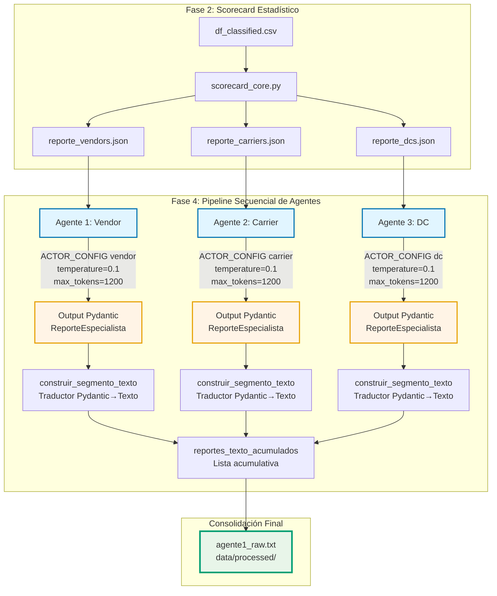

# Integración LLM para análisis holístico de root cause y enriquecimiento con scorecard estadístico
Estatus: 🟢 VIGENTE (cerrado 2026-07-17).

Contexto Técnico: Fase 3 / Integración LLM — pipeline de análisis holístico de root cause por actor (Vendor / Carrier / DC), con enriquecimiento del input vía scorecard estadístico; implementación asociada a `03_llm_integration/llm_integration_network_intelligence_view.py` y `03_llm_integration/scorecard_core.py`
`data/processed/df_classified.csv`; `data/processed/agente1_raw.txt`; `data/processed/reporte_{vendors,carriers,dcs}.json`

## Contexto y Problema
La Fase 3 introduce una superficie de consumo de inteligencia de red que debe responder a una pregunta directiva única: *¿dónde está la causa raíz del retraso y qué implica operativamente?* La respuesta no puede ser una lista cruda de POs ni un agregado sin interpretación; tiene que ser un análisis ejecutivo, accionable y jerarquizado por zonas de riesgo (Alto / Medio / Bajo) para cada uno de los tres actores de la cadena (Vendor, Carrier, DC).

El problema de fondo tiene dos capas que no pueden resolverse por separado:

**Capa 1 — ¿Quién analiza?** Un LLM de propósito general, alimentado con el JSON crudo de POs, produce narrativas genéricas, inventa correlaciones, ignora el tamaño de muestra (`n_POs_total`) y trata diferencias no significativas como patrones. Sin una estructura de rol, sin referencias orientativas por actor y sin reglas de redacción explícitas, la salida no es defendible ante un director de logística.

**Capa 2 — ¿Con qué input?** Alimentar al LLM únicamente con POs crudas es entregarle datos sin diagnóstico previo. Las métricas de riesgo (delay, exceso de horas, reschedule, responsabilidad) tienen distribuciones sesgadas, tamaños de muestra desiguales entre actores y ruido estadístico. Un vendor con 3 POs y un vendor con 300 no pueden compararse en crudo; un DC con dwell time inflado por yard drops no es comparable con uno que no los tiene. Sin un pre-procesamiento estadístico riguroso, el LLM hereda todos los sesgos del dato y los amplifica con alucinación.

La solución no es *o* LLM *o* estadística: es un pipeline donde la estadística produce el diagnóstico estructurado (scorecard) y el LLM produce la interpretación ejecutiva sobre ese diagnóstico. El scorecard es el *ground truth numérico*; el LLM es el *analista que lo lee*. Separar ambas responsabilidades es lo que hace el sistema defendible.

## Opciones Consideradas

**Arquitectura de agentes — un agente monolítico para los tres actores (descartada).** Un solo prompt que analice vendors, carriers y DCs en la misma llamada produce análisis superficiales: los umbrales de salud operativa son distintos por actor (un delay de 5 días es crítico para un carrier, aceptable para un vendor), y mezclarlos en un mismo contexto fuerza al modelo a promediar criterios. Además, excede cómodamente el ventana de contexto útil y degrada la calidad por actor.

**Arquitectura de agentes — tres agentes especializados en secuencia (elegida).** Un agente por actor, cada uno con su propio `ACTOR_CONFIG` (umbrales orientativos, singular, título, archivo de entrada/salida), ejecutados secuencialmente y acumulados en `agente1_raw.txt`. Pros: cada agente opera con referencias calibradas a su actor, el contexto se mantiene enfocado, la salida es reproducible por actor, y el pipeline falla de forma aislada (un error en carriers no tumba vendors). Contras: mayor latencia total (3 llamadas secuenciales) y mayor consumo de tokens; mitigado con `temperature=0.1`, `max_tokens=1200` y salida estructurada Pydantic.

**Enriquecimiento del input — POs crudas como único input (descartada).** Entregar el JSON de POs directamente al LLM sin pre-procesamiento estadístico. Pros: simple. Contras: el LLM tiene que calcular promedios, detectar outliers y ponderar tamaños de muestra sobre la marcha, con resultados no reproducibles y sesgados por POs extremas.

**Enriquecimiento del input — scorecard estadístico como input enriquecido (elegido).** `scorecard_core.py` produce, por cada entidad, un conjunto de métricas validadas con diferentes técnicas estadísticas. Pros: el LLM recibe diagnóstico ya robustecido estadísticamente, con tamaños de muestra explícitos (`n_POs_total`, `n_POs_causa_raiz`) y credibilidad cuantificada (`Credibilidad_Z_*`). Contras: complejidad de implementación y necesidad de mantener el scorecard sincronizado con el pipeline de Fase 2 que genera `df_classified.csv`.

**Diseño del prompt — prompt abierto tipo "analiza estos datos" (descartado).** Produce narrativas desestructuradas, menciona umbrales internos, describe la tabla en lugar de interpretarla, y da recomendaciones genéricas ("mejorar procesos").

**Diseño del prompt — prompt con rol, guías internas no mencionables, prohibiciones explícitas y salida Pydantic (elegido).** El prompt separa explícitamente lo que el modelo debe *pensar* (metodología de 8 pasos, reglas de homogeneidad, interpretación de rangos) de lo que debe *escribir* (viñetas ejecutivas, acciones concretas con tiempo/quién/cómo). Las guías internas de umbrales están marcadas como "NO MENCIONAR EN OUTPUT". Las prohibiciones están enumeradas explícitamente. La salida se fuerza vía `output_type=ReporteEspecialista` con Pydantic, lo que garantiza estructura parseable por el frontend de Streamlit.

**Estructura de salida — texto libre (descartada).** Imposible de parsear de forma robusta en el frontend; cualquier variación de formato rompe el render.

**Estructura de salida — Pydantic con `AnalisisBloqueRiesgo` + `ReporteEspecialista` (elegida).** Tres bloques obligatorios por actor (Alto / Medio / Bajo), cada uno con `nivel_riesgo`, `entidades` (MAYÚSCULAS), `analisis` (viñetas) y `accion` (con escenarios A/B si falta info). Pros: el traductor `construir_segmento_texto` produce el formato exacto que Streamlit espera; la validación falla rápido si el modelo se sale del esquema; el `Score_Riesgo_Normalizado` queda anclado en el análisis como cierre verificable.

**Manejo de homogeneidad — forzar diferenciación entre entidades similares (descartado).** Cuando todas las entidades de un bloque operan en zona saludable y homogénea, forzar diferencias produce hallazgos espurios.

**Manejo de homogeneidad — tratar la homogeneidad como hallazgo clave (elegido).** El prompt instruye explícitamente que si todas las entidades son prácticamente iguales (variación < 30% en todas las métricas), eso es el hallazgo principal: se evalúa si el `Nivel_Riesgo_Absoluto` refleja esa realidad y se recomienda recalibración de escala si aplica.

## Decisión

**Pipeline secuencial de tres agentes especializados.** Cada actor (Vendor, Carrier, DC) tiene su propio agente con `ACTOR_CONFIG` independiente: archivo de entrada (`reporte_{actor}.json`), prefijo de salida, título, singular y referencias orientativas calibradas por actor. Los tres se ejecutan en secuencia dentro de `main()` y se acumulan en `reportes_texto_acumulados`, que al final se consolidan en `data/processed/agente1_raw.txt` cuando se invoca con `--actor all`.

**Prompt con separación explícita pensamiento / salida.** El prompt de cada agente incluye:

1. **Rol**: "Analista de Riesgo Logístico especializado en {titulo}".
2. **Guías internas** (tabla de umbrales por actor) marcadas como "NO MENCIONAR EN OUTPUT".
3. **Diccionario de columnas** para que el modelo sepa qué significa cada campo.
4. **Metodología de 8 pasos** (comportamiento general, impulsores, relaciones, consistencia, implicaciones operativas, impacto de negocio, recomendaciones, detección de homogeneidad) explícitamente marcada como "razonamiento interno, no mostrar".
5. **Reglas de redacción**: análisis ejecutivo en viñetas (prohibido párrafo compacto), sin describir la tabla, sin mencionar umbrales, sin inventar correlaciones.
6. **Prohibiciones enumeradas**: 14 puntos que cubren los modos de falla observados en pruebas (mencionar umbrales, ignorar `n_POs_total`, tratar el `Nivel_Riesgo_Absoluto` como verdad absoluta, forzar diferencias inexistentes, etc.).
7. **Excepción de homogeneidad**: cuando todas las entidades son prácticamente iguales, ese es el hallazgo clave.
8. **Formato de salida**: apego estricto al esquema Pydantic.

**Temperature y tokens.** `temperature=0.1` para minimizar variabilidad y alucinación; `max_tokens=1200` por agente para forzar síntesis ejecutiva sin cortar el análisis.

## Diagrama

## Consecuencias

**Positivas:**

- **Defendibilidad**: cada análisis del LLM se apoya en un scorecard con metodología estadística, no en el juicio crudo del modelo sobre POs ruidosas.
- **Reproducibilidad**: el mismo `df_classified.csv` produce el mismo scorecard; el mismo scorecard con `temperature=0.1` produce narrativas muy estables.
- **Separación de responsabilidades**: la estadística diagnostica, el LLM interpreta. Si el scorecard está mal, se arregla en `scorecard_core.py` sin tocar prompts; si el análisis es malo, se arregla en el prompt sin tocar estadística.
- **Frontend estable**: el traductor Pydantic → texto garantiza que Streamlit recibe siempre el formato esperado, incluso si el modelo varía el contenido.

**Negativas:**

- **Latencia**: tres llamadas secuenciales al LLM suman tiempo de respuesta; mitigable con paralelismo (`asyncio.gather`) si se requiere, a costa de perder el orden de acumulación actual.
- **Dependencia del scorecard**: si `df_classified.csv` no tiene las columnas requeridas (`REQUIRED_COLUMNS`), el pipeline falla en `load_po_data` con un `ValueError` explícito. Esto es intencional (fallar rápido > enmascarar), pero exige que el pipeline de Fase 2 esté estable.
- **Calibración de umbrales**: los `referencias` de `ACTOR_CONFIG` son priors de negocio; si cambian los SLAs, hay que actualizarlos manualmente. No se auto-calibran desde los datos.

## Relación con otras decisiones

- **No supera ningún ARD previo**: es una capa nueva de análisis holístico que consume salidas de decisiones vigentes (scorecard de Fase 2) y las orquesta en una narrativa ejecutiva.