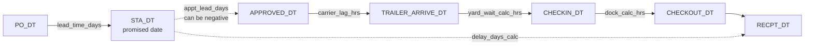
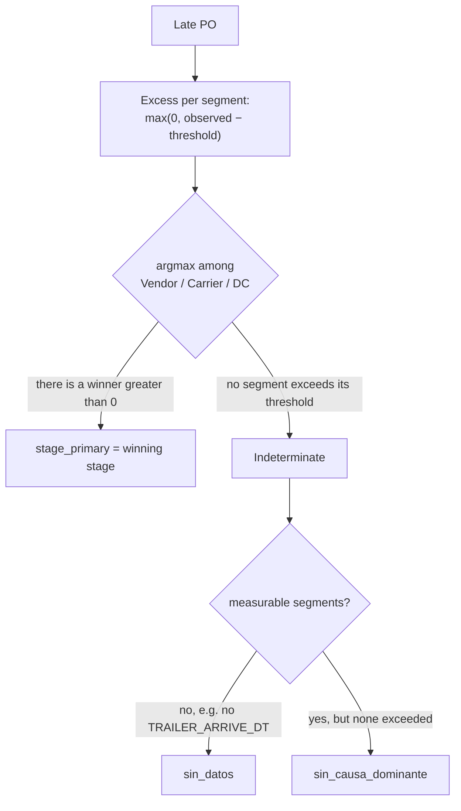
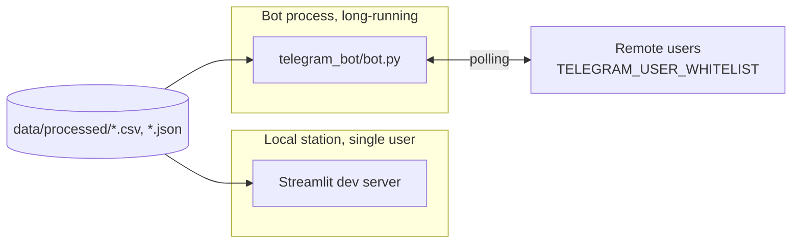
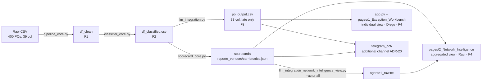

# Project Explanation — PO Delay Root Cause Analyzer

This document is the narrative synthesis of the project, organized by phase and meant to be read
start to finish: it connects the reason behind each decision —recorded in the ADRs— with the
resulting logic and its implementation in the code. It does not replace the repository's formal
documents, the Software Requirements Specification ([SRS.md](SRS.en.md)) and the Software
Architecture Document ([SAD.md](SAD.en.md)), which exhaustively and auditably enumerate what the
system must do and how it is built; this document is the narrative entry point, the reference with
which the project is explained and defended from beginning to end.

## Executive Summary

The project analyzes Purchase Orders (POs) that arrived late at a distribution center and answers,
for each one, three questions: at what stage of the life cycle the delay originated, how severe it
is, and what concrete action corrects it. The dataset is synthetic: 400 POs and 39 columns, of
which 247 turn out to be late and form the population the system explains.

The thesis behind the method is that the life-cycle timestamps are the source of truth, not the
human annotation. Each PO carries a `REASON_DSC` written by an operator, but that annotation is
roughly 20% incorrect. The system computes the responsible stage from the dates and contrasts it
against `REASON_DSC`: when they differ, the discrepancy is not an error of the method but evidence
that the temporal computation corrects the inherited annotation.

A concrete finding illustrates the thesis with a figure that earlier project documents did not
cite: the Phase 1 EDA notebook itself
([`data_pipeline_and_EDA.ipynb`](../01_data_pipeline_and_eda/data_pipeline_and_EDA.ipynb)), working
on the precalculated `IS_LATE` column (not on the timestamp computation), reports a lateness rate
of 41.25% (~165 POs) and a 48.5% mismatch against `REASON_DSC` (80 of 165). Those figures are never
explicitly reconciled in the notebook's text with Phase 2's canonical figures (247 late via
`delay_days_calc>0`, 88.8% agreement) — unintentionally, it is a second demonstration of the
project's thesis: the precalculated source and the timestamp computation produce different
populations and rates, and it is the computation that gets used downstream.

The solution combines deterministic rules and a language model, with a strict division of labor.
The rules resolve all the arithmetic —which segment exceeded its threshold, by how much, at what
severity— and the LLM interprets that already-resolved diagnosis to draft the explanation and the
action, without recalculating or inventing figures. The work is organized into four phases chained
by data contracts: Phase 1 cleans the data and isolates its anomalies; Phase 2 classifies the
responsible stage and assigns severity; Phase 3 generates the natural-language explanation (and, in
a parallel surface, an executive synthesis by actor); Phase 4 presents the results across two
consumption surfaces — a multipage Streamlit app and a Telegram bot as an additional reading
channel.

The figures that summarize the project's validated state, all traceable to their real artifact or
count:

- Breakdown of the 247 late POs by responsible stage: Vendor 56.3% (139), Carrier 16.2% (40), DC
  15.0% (37), Indeterminate 12.6% (31, broken down into 7 `sin_datos` + 24 `sin_causa_dominante`).
- Stage accuracy 100% (216/216 evaluable) against the mentor's threshold of >80%.
- Reason agreement 88.7% (180/203 classifiable): the <100% is expected and desired.
- LLM Explanation Quality 5/5 (20/20) in the quality benchmark, few-shot C3 at temperature 0.9.
- Severity ranking 100% (14/14) against the threshold of >95%.
- Test suite: 267 cases collected by `pytest --collect-only -q` — 231 `def test_` functions across
  13 files under [`tests/`](../tests/), some parametrized.
- Decision record: 28 ADRs ([ADR-01](decisiones/ARD-01.en.md) through
  [ADR-25](decisiones/ARD-25.en.md), with three numbers carrying two chained variants: 03a/03b,
  04a/04b, 06a/06b), of which 17 are Current, 5 Superseded, and 6 in Draft — full record in
  [documentation/decisiones/README.md](decisiones/README.en.md).

## Phase 1 — Ingestion, Data Quality, and EDA

### Design

The decision that governs the entire phase is to treat the life-cycle timestamps as the sole
source of truth, and to relegate the source CSV's precalculated columns (`DELAY_DAYS`,
`YARD_WAIT_HRS`, `DOCK_HRS`, `IS_LATE`) to mere cross-checks ([ADR-01](decisiones/ARD-01.en.md)).
The evidence backing this is concrete: `DOCK_HRS` disagrees with the actual computation in 11 POs,
by up to 8.2 hours, because the source system recorded time inversions as negative values.

The second design decision is not to delete rows. Records with inconsistent or incomplete dates
are not removed; they are isolated with quality flags.

### Logic

Date column parsing uses `errors='coerce'`: an invalid value becomes `NaT` instead of breaking the
pipeline — the rest of the code has to anticipate that `NaT` explicitly in every calculation that
depends on a date that might be missing. Three quality flags that do not destroy rows are injected
on top of the already-typed data:

- `_ts_issue` marks the 12 orders with a time inversion (four distinct conditions: `CHECKIN <
  TRAILER_ARRIVE`, `CHECKOUT < CHECKIN`, `RECPT < CHECKIN`, `STA < PO`).
- `_trailer_arrive_null` marks the 27 orders without `TRAILER_ARRIVE_DT`.
- `_data_reliable` identifies the 361 fully clean records out of 400 (the conjunction of neither of
  the two previous flags being true).

The 39 unreliable orders are the exact sum of those two groups —12 inversions + 27 without
trailer— with no overlap, and the baseline metrics are reported over the remaining 361.

The pipeline formally computes six segments from the native dates:

| Segment | Formula | Truncation |
|---|---|---|
| `lead_time_days` | `PO_DT → STA_DT` (purchase lead time) | ≥ 0 |
| `carrier_lag_hrs` | `APPROVED_DT → TRAILER_ARRIVE_DT` (carrier transit) | keeps sign |
| `yard_wait_calc_hrs` | `TRAILER_ARRIVE_DT → CHECKIN_DT` (yard dwell) | ≥ 0 |
| `dock_calc_hrs` | `CHECKIN_DT → CHECKOUT_DT` (dock unloading) | ≥ 0 |
| `delay_days_calc` | `RECPT_DT − STA_DT` (final delay) | ≥ 0 |
| `appt_lead_days` | `STA_DT − APPROVED_DT` (appointment booking window) | keeps sign |
| `total_dc_hrs` | `TRAILER_ARRIVE_DT → CHECKOUT_DT` (total DC dwell, yard + dock) | ≥ 0 |



A detail of the implementation worth calling out: **not everything is truncated to zero**.
`carrier_lag_hrs` and `appt_lead_days` deliberately keep their negative sign — a negative value in
`appt_lead_days` (the appointment was approved after the promised date) is exactly the signal Phase
2 uses to detect the vendor's "STA push"; truncating it to zero would destroy that signal. The
other four deltas are bounded to `≥ 0` because they represent physical durations that cannot be
negative except through a capture error. The `TRAILER_DEPART_DT` column is formally excluded from
every segment calculation: it occurs on average ~27 hours after receiving in 99.8% of cases,
outside the receiving operational cycle that these segments measure.

`total_dc_hrs` does not appear as its own edge in the flow diagram because it is a composition of
two segments already shown (yard + dock, from `TRAILER_ARRIVE_DT` to `CHECKOUT_DT`), not an
additional discrete step. It is not dead computation: Phase 3 consumes it in the DC scorecard to
derive `Dwell_Time_Net` — the net-dwell metric for excess yard time that feeds Ravi's view for the
DC actor. The code has a primary path (`total_dc_hrs − excess_yard_hrs`) and a fallback path that
composes `total_dc_hrs` as `excess_yard_hrs + excess_dock_hrs` when the column is not present in
the input.

This phase's exploratory classification flags (`flag_yard_congestion`, `flag_dock_backlog`,
`flag_carrier_miss`) have a subtle asymmetry, verified by tests: the first two compare against the
**precalculated** CSV columns (`YARD_WAIT_HRS`, `DOCK_HRS`), not against the newly computed
deltas — deliberately, because in this exploratory phase the goal is to compare against the
precalculated source to detect where it diverges, not to replace it yet. `flag_carrier_miss`, by
contrast, does use the computed delta. None of these three flags is the production classification:
they are exploratory, with preliminary thresholds (carrier 4h, yard 4h, dock 6h) that Phase 2
supersedes with its own thresholds (carrier 8h, final).

### Implementation

The logic lives in [`pipeline_core.py`](../01_data_pipeline_and_eda/pipeline_core.py), with two
core functions: `clean_po_data()` (parsing, quality flags, deltas, exploratory flags) and
`cross_validate_deltas()` (audits the calculated segments against the precalculated columns and
reports discrepancies). Both functions explicitly validate their input contract
(`_REQUIRED_INPUT_COLUMNS`): if a column is missing, they raise a `KeyError` that names it, instead
of failing deeper in with an opaque message — a "fail fast with a useful message" pattern applied
consistently.

The module runs with:

```
python 01_data_pipeline_and_eda/pipeline_core.py
```

It consumes `data/raw/po_root_cause_synthetic.csv` (outside version control) and produces, via
`save_clean_output()`, the `data/processed/df_clean.csv` CSV that Phase 2 consumes — the handoff's
"dual contract": the persisted CSV is identical to the in-memory DataFrame (all columns, same
order), so re-reading it reconstructs exactly what the monolithic chain would leave in memory.

The [`data_pipeline_and_EDA.ipynb`](../01_data_pipeline_and_eda/data_pipeline_and_EDA.ipynb)
notebook (7 sections, from load/inventory to saving the output) only presents and narrates the EDA;
all reusable logic lives in the module, which the notebook imports without reimplementing — this
avoids the logic living duplicated between notebook and module.

The phase's coverage is in [`tests/test_pipeline_core.py`](../tests/test_pipeline_core.py) (31
functions), organized in blocks (smoke, date parsing, quality flags, deltas, classification flags,
operational metrics, cross-validation, robustness against nulls). One test in particular
(`test_flag_carrier_miss_silent_false_on_null_trailer`) documents a real finding in detail: when
`TRAILER_ARRIVE_DT` is null, `carrier_lag_hrs` is `NaN`, and `NaN > 4.0` evaluates to `False` in
pandas — so a PO with a real carrier miss ends up silently flagged as "no carrier problem." This is
exactly the kind of "silent NaN" that Phase 2 explicitly guards against with the `sin_datos`
subclass of Indeterminate.

## Phase 2 — Stage Classification (Business Rules)

### Design

This phase assigns each late PO a responsible stage and a severity, and validates both against
independent references. Six decisions order it: four stages —Vendor, Carrier, DC, and Indeterminate
(#39)—, Vendor measured by STA push rather than by residual
([ADR-03b](decisiones/ARD-03b.en.md), supersedes [ADR-03a](decisiones/ARD-03a.en.md)), the carrier
threshold at 8 hours rather than 4 ([ADR-04b](decisiones/ARD-04b.en.md), supersedes
[ADR-04a](decisiones/ARD-04a.en.md)), rescheduling and short-ship as context/aggravating factor
rather than a stage ([ADR-05](decisiones/ARD-05.en.md)), a dedicated vendor threshold of 24 hours
([ADR-06b](decisiones/ARD-06b.en.md), supersedes [ADR-06a](decisiones/ARD-06a.en.md)), and DC
consolidating Yard and Dock with an informative subclass (`dc_substage`).

One rule external to the method deserves explicit mention: the mentor's original repository README
defined "Late Shipment" as a vendor cause via `VENDOR_SHIP_DT > STA_DT`. That column does not exist
among the 39 in the real CSV, and the only proxy tested (`STA_DT − PO_DT < 3 days`, issue #17)
fired on 0% of the cases on the real dataset — it does not discriminate anything.
[ADR-24](decisiones/ARD-24.en.md) formally documents the discard: vendor responsibility is already
covered by STA push (ADR-03b/06b), which does not depend on either of the two columns in question.
The discard is not total: ADR-24 keeps `lead_time_days` (`STA_DT − PO_DT`) as a future severity
candidate, not a stage candidate — it is not implemented in the current severity function, but it
is noted as a lever to evaluate if the team decides to weight it.

### Logic

The primary stage is decided by **excess over threshold**, not by raw duration — a central
distinction: a segment that lasts a long time but is within normal range does not win merely for
being long in absolute terms. For every measurable segment, the excess is `max(0, observed −
threshold)` in hours, with the mentor's thresholds externalized in
[`rules_config.json`](../02_clasif_reglas_negocio/rules_config.json) (version 3):

```json
{
  "version": 3,
  "vendor_gap_hrs": 24.0,
  "carrier_lag_hrs": 8.0,
  "yard_wait_hrs": 4.0,
  "dock_hrs": 6.0,
  "short_ship_fill_rate": 0.9,
  "severity_delay_days": 3.0,
  "severity_low_days": 1.0
}
```

Vendor is folded into the same schema with a transformation: its excess is

```python
exceso_vendor_hrs = max(0, -appt_lead_days * 24 - vendor_gap_hrs)
```

negative when the appointment was approved after the promised date, so the push in hours is
positive, and only counts as excess above its own threshold. The primary stage is the `argmax`
among {Vendor, Carrier, DC}; when a segment is not measurable (for example, carrier without
`TRAILER_ARRIVE_DT`), its excess is forced to 0 via a "measurability" mask (`_carrier_medible`,
`_dc_medible`) — that mask is what allows, further down, distinguishing "not measurable" from
"measurable but with no excess" instead of collapsing both into the same value of 0.



A detail that is only explained outside the production module: `excesos.idxmax(axis=1)` breaks an
excess tie by the order of the DataFrame's columns (`{"Vendor", "Carrier", "DC"}`), that is, in
favor of Vendor. `classifier_core.py` does not comment on that rule where it happens; the business
justification —a late push is a probable cause of the downstream disruption, which propagates
pressure onto carrier and DC— lives only in `metrics_core.py`, the sensitivity-analysis module, not
the production one.

When no segment applies, the PO falls into Indeterminate, with a subclass that states why:
`sin_datos` (late but not measurable) or `sin_causa_dominante` (measurable but no segment exceeds
its threshold) — [ADR-07](decisiones/ARD-07.en.md) documents that the discarded option was to send
these cases to Vendor "by elimination," which would silently reintroduce bias.

The resulting breakdown over the 247 late POs is Vendor 139 (56.3%), Carrier 40 (16.2%), DC 37
(15.0%), and Indeterminate 31 (12.6%, 7 `sin_datos` + 24 `sin_causa_dominante`). Severity allocates
MEDIUM 131, LOW 82, HIGH 34: HIGH when the PO is hot and the delay exceeds 3 days, LOW when the
delay is under 1 day, MEDIUM otherwise; the aggravating factors (`is_short_lead`, `is_short_ship`)
raise a level without exceeding HIGH.

The sensitivity analysis behind the 24h vendor threshold is not just a table in an ADR: it is a
complete block of functions in
[`metrics_core.py`](../02_clasif_reglas_negocio/metrics_core.py) (`_simular_corte`,
`distribucion_gap_vendor`, `sensibilidad_vendor`, `destino_migracion_vendor`, `robustez_vendor`,
`agreement_por_umbral`, `umbral_vs_mismo_dia`) that reproduces the classification arithmetic with a
variable vendor threshold, without touching the real classifier, and sweeps a grid of candidates
(0/6/12/18/24/48/72h), tabulating how the breakdown changes. It confirms that the POs that stop
being Vendor as the threshold rises migrate exclusively to `sin_causa_dominante`, never to Carrier
or DC — the threshold does not reassign blame, it only isolates the pushes that fall short of being
a signal.

Two tables summarize that grid for the two sensitivities that support the mentor's thresholds:

**Carrier threshold sensitivity (4/6/8/12h)** — Vendor/Carrier/DC/Indeterminate breakdown in % of
late POs, with `vendor_gap_hrs`=24 active:

| Carrier threshold | `flag_carrier_calc` | Vendor / Carrier / DC / Indeterminate breakdown |
|---|---|---|
| 4 h | 25.8% (103) | 56.3 / 17.4 / 15.0 / 11.3 |
| 6 h | 12.8% (51) | 56.3 / 16.2 / 15.0 / 12.6 |
| 8 h | 12.8% (51) | 56.3 / 16.2 / 15.0 / 12.6 |
| 12 h | 11.2% (45) | 56.3 / 14.6 / 15.0 / 14.2 |

The carrier threshold moves the raw flag significantly but barely moves `stage_primary`, because
the vendor signal dominates the argmax and the carrier threshold only reorders the few cases where
carrier competes closely.

**Vendor threshold sensitivity (0/6/12/18/24/48/72h)** — counts over the 247 late POs:

| Vendor threshold | Vendor | % Vendor | Vendor / Carrier / DC / sin_datos / sin_causa_dominante breakdown |
|---|---|---|---|
| 0 (no threshold) | 151 | 61.1 | 151 / 40 / 37 / 5 / 14 |
| 6–18 h | 141 | 57.1 | 141 / 40 / 37 / 7 / 22 |
| 24 h | 139 | 56.3 | 139 / 40 / 37 / 7 / 24 |
| 48 h | 121 | 49.0 | 121 / 40 / 37 / 8 / 41 |
| 72 h | 81 | 32.8 | 81 / 40 / 37 / 10 / 79 |

The contrast against human annotation is the project's thesis in its most measurable form: reason
agreement 88.7% over 203 classifiable. `select_mismatches()` extracts the mismatches ranked by
"signal strength" (the excess of the stage the computation chose), with a `stratify=True` mode that
spreads the selection across the three attributable stages instead of taking the strongest ones
outright (which would be almost all Vendor) — this mode is what feeds Phase 3's few-shot pool.

The mapping that supports this comparison, `_REASON_DSC_MAP` (the basis of `reason_group_manual`),
is a fixed dictionary of 10 keys that must match `REASON_DSC`'s text character for character:
without normalization, any wording variant silently falls into `"Unknown"`. It is not an active
risk on the current, already-audited synthetic dataset, but it is a real fragility if the source
were to change.

### Implementation

The logic lives in
[`02_clasif_reglas_negocio/classifier_core.py`](../02_clasif_reglas_negocio/classifier_core.py),
orchestrated by `classify_po_stages()` in four chained steps: `_flags_por_umbral` (#44) →
`_etapa_primaria` (#45) → `_capa_complementaria` (multi-cause labels, context flags) →
`_severidad` (#48, which needs the context flags and therefore runs last). The validations live in
[`metrics_core.py`](../02_clasif_reglas_negocio/metrics_core.py): `gap_dominante()` computes,
**independently** of `stage_primary`, which segment had the greatest raw duration over a bounded
sequence of milestones (excluding the purchase lead time and everything past checkout);
`stage_accuracy()` compares both metrics over the evaluable population — 100% (216/216) is not
circular: it converges because when there is an STA push that segment spans days (it dominates the
duration) and is simultaneously the vendor excess signal, but a disagreement would be
multicausality, not a method error.

The module produces `data/processed/df_classified.csv` (dual contract, all columns). Coverage is in
[`tests/test_classifier_core.py`](../tests/test_classifier_core.py) (31 functions) and
[`tests/test_metrics_core.py`](../tests/test_metrics_core.py) (14 functions).

## Phase 3 — LLM Integration

Phase 3 generates the root-cause explanation in natural language. The project operates **three
surfaces** worth distinguishing precisely:

1. **Per PO** (the explanation + action of the deliverable evaluated by the mentor).
2. **Holistic by actor** (executive network synthesis, statistical scorecards).
3. **Differential diagnosis tier-2** (an opt-in second call, a hybrid hypothesis-and-staged-plan
   contract).

It is, by a wide margin, the largest block of code in the repository:
[`llm_integration.py`](../03_llm_integration/llm_integration.py) exceeds 2500 lines and
concentrates 98 of the suite's 231 test functions (42.4%).

### Per PO Surface — the Evaluated Deliverable

#### Design

The guiding principle is that the LLM interprets, it does not recalculate (#91,
[ADR-14](decisiones/ARD-14.en.md)): the prompt explicitly forbids recalculating dates or hours and
inventing figures, and requires quoting verbatim the ones it is given. Severity is hybrid
([ADR-10](decisiones/ARD-10.en.md)): the LLM issues it and Phase 2's deterministic rule audits it;
the deliverable's official severity is the LLM's.

The prompt has a single source, `build_prompt()` ([ADR-12](decisiones/ARD-12.en.md)): an earlier
plain-text draft was removed because it had diverged (an obsolete six-stage taxonomy, instructions
that invited recalculation, a contradictory severity threshold). The production configuration is
few-shot C3, three examples that teach the reasoning (one per stage: Vendor, Carrier, DC),
validated at temperature 0.9 ([ADR-13](decisiones/ARD-13.en.md)). An instruction block called HOW
TO REASON (ADR-14, #143) hardens the prompt against a measured, concrete problem: without that
block, the model learned from the three few-shot examples —all cases of human↔computation
discrepancy— that "there is always a discrepancy," and copied that shape as a template even when
the actual PO agreed with the human annotation. The block fixes that `stage_primary` is the source
of truth and that `REASON_DSC` is only for contrast, never to replace the stage.

#### Logic

The prompt is assembled in blocks in a fixed order: DATA → TIMELINE → CALCULATED METRICS →
AUTOMATIC CLASSIFICATION → ADDITIONAL CONTEXT → [optional domain block, #151] → [optional few-shot
examples] → INSTRUCTIONS → HOW TO REASON → JSON format. A subtle but important detail: the "excess
by stage" lines in CALCULATED METRICS are **omitted** when the stage is Indeterminate, because
showing a raw excess (for example, a vendor push that survives inside a `sin_datos`) would invite
the model to override Phase 2's verdict.

The conditional domain context (#151, `domain_kb.json`) is a mechanism against a different,
measured problem: the LLM produced correct but homogeneous actions within the same stage. The
solution is not RAG with embeddings —explicitly discarded— but a **deterministic lookup**: since
`stage_primary` is already the routing key computed in Phase 2, a dictionary indexed by actor
suffices, with conditions that filter which context "levers" apply to this PO according to the
magnitude band of its excess (normalized by that segment's own Phase 2 threshold) and its flags.
With `kb=None` (the historical default), the prompt is byte-identical to the original zero-shot
version.

The response is a five-key JSON, parsed by `_parse_llm_json()` (centralized to avoid duplicating
logic among the four backends):

```json
{
  "causa_raiz": "...",
  "accion_recomendada": "...",
  "severidad": "LOW | MEDIUM | HIGH",
  "coincide_con_reason_code": true,
  "confianza": 0.0
}
```

`create_backend()` — a Factory Pattern in terms of [SAD.md](SAD.en.md) §2.2 — instantiates one of
four backends according to the configuration:

| Backend | Model | Cost | Fallback if JSON does not parse |
|---|---|---|---|
| `openai` | `gpt-4o-mini` | paid — the deliverable's official backend | none, strict JSON expected |
| `claude` | `claude-sonnet-4-6` | paid — comparison | none, strict JSON expected |
| `deepseek` | `deepseek-chat` | paid — comparison | none, strict JSON expected |
| `local` | `qwen2.5:7b` via Ollama | no cost | emergency regex dict (`fallback=True`) |

The decision to fix the temperature at 0.9 (ADR-13) comes from a two-round sweep over C3 (3
few-shot examples), backend `gpt-4o-mini`, the same 20 benchmark POs (seed 42), at
0.3/0.5/0.7/0.9. The first round, with the un-hardened prompt (pre-ADR-14/#143), showed no
measurable effect of temperature on diversity. After the HOW TO REASON block, the second round did
measure it: the lexical diversity of Vendor actions rises monotonically, 0.312 (0.3) → 0.375 (0.5)
→ 0.458 (0.7) → 0.567 (0.9), with the automatic check at 20/20 except 19/20 at 0.7 (one
Indeterminate PO copied the stage from `REASON_DSC`, the failure mode ADR-14 corrects, and
transiently relapsed). The diversity gain lives in the cited cause, not in the action's structure:
the template "Request a recovery plan from the vendor..." persists across all eight Vendor actions
at every temperature.

This surface's figures: LLM Explanation Quality 5/5 (20/20) with C3 at temperature 0.9 and seed 42;
severity ranking 100% (14/14). The divergence between the LLM's severity and Phase 2's rule is a
documented finding: they agree on 213 of 247 (86.2%) and diverge on 34 (13.8%), always escalating
—30 cases LOW→MEDIUM and 4 MEDIUM→HIGH— none downscales.

There is a second AI-vs-human disagreement metric, distinct from Phase 2's reason agreement.
`llm_coincide_con_reason` is a binary judgment the LLM itself issues per PO, comparing its
diagnosis against `REASON_DSC`. Over the 247 rows of `po_output.csv`: 149 `True` / 98 `False`,
39.7% disagreement. It is a correlated but not interchangeable figure with Phase 2's reason
agreement (88.7% over 203 classifiable): a different method (the LLM's judgment vs.
`metrics_core.py`'s deterministic rule), a different denominator (247 vs. 203), and a different
source.

#### Implementation

The logic lives in [`llm_integration.py`](../03_llm_integration/llm_integration.py):
`build_prompt`, `add_llm_explanations`, `export_deliverable_csv`, `create_backend`, and
`_parse_llm_json`, with the inference configuration in
[`llm_config.json`](../03_llm_integration/llm_config.json) (temperature 0.9, seed 42). The
`--mode` (test / full / custom), `--backend`, and `--zero-shot` flags control the run:

```
python 03_llm_integration/llm_integration.py --mode test --backend openai
```

The module consumes `df_classified.csv` and produces two artifacts: the internal
`df_with_llm_*.csv`, which carries Phase 2's severity alongside the LLM's for audit purposes, and
the deliverable CSV `po_output.csv`. Coverage is in
[`tests/test_llm_integration.py`](../tests/test_llm_integration.py) (98 functions, the largest file
in the suite) and [`tests/test_fewshot.py`](../tests/test_fewshot.py) (8 functions).

### Differential Diagnosis Tier-2 (ADR-16, Lane 1)

Under the `--action-call` flag, each PO receives a **second call** with `build_action_prompt()`: a
"supply planner with decision authority" role (not an "advising analyst" — the direct antidote to
the model delegating the action instead of deciding it) that receives the call-1 diagnosis as a
fixed input and produces a hybrid contract with keys in mandatory order:

```
razonamiento
→ hipotesis_principal { hipotesis, evidencia, plan { inmediata, correctiva, preventiva } }
→ hipotesis_alternativa { hipotesis, paso_discriminante }
→ confianza
```

Reducing this to "goes through a rules-based quality gate" undersells it: it is in fact a system of
**seven deterministic checks** (`run_action_checks`), not an LLM judge: a complete schema, key
order verified on the raw text, the absence of "meta verbs" (review/analyze/investigate/monitor) as
the main action, that every figure cited in the output exists among the figures in the prompt
(regex extraction and set comparison), that the hypothesis's evidence cites at least one figure,
that a short-ship has an explicit decision about the shortfall, and that the named stage matches
`stage_primary` (with Spanish aliases and explicit recognition of Indeterminate). If there are
defects, the loop (`call_action_with_qa`) re-calls citing **exactly** which checks failed, up to two
regenerations; if they persist, it does not block — it returns the last usable output with its
`qa_flags` visible, instead of failing the whole run over one problematic PO.

It populates the nine tier-2 columns of `po_output.csv`; without the flag, those columns come out
**empty, not absent** (the column contract is stable with or without it). The complete contract is
formalized in [ADR-21](decisiones/ARD-21.en.md) (still in Draft).

### Holistic Actor Surface — Network Executive Synthesis

#### Design

It answers a different directive question: where is the root cause of the delay by actor
(Vendor/Carrier/DC) and what it implies operationally. The problem has two layers: who analyzes (an
LLM fed raw POs produces generic narratives and ignores sample size) and with what input (feeding
it raw POs is handing it data without a diagnosis). The solution is a pipeline where statistics
produce the structured diagnosis —the scorecard— and the LLM interprets it as an analyst
([ADR-19](decisiones/ARD-19.en.md)).

A scope nuance worth stating: this surface and the per-PO surface operate on different populations
under the same entity name. `scorecard_core.py` reads `df_classified.csv` by default —400 POs,
including the 153 On-Time ones—, while `po_output.csv` —consumed by Diego and the tier-1/tier-2
contract— only carries the 247 late ones. A vendor/carrier/DC scorecard in Ravi's view can reflect
on-time deliveries from that entity that Diego's view never sees. This is consistent with each
surface serving a different purpose —aggregated diagnosis by actor vs. explanation by late
exception— but it is a real scope asymmetry worth making explicit.

#### Logic

[`scorecard_core.py`](../03_llm_integration/scorecard_core.py) produces, per entity, metrics made
robust with two non-trivial statistical techniques — in terms of [SAD.md](SAD.en.md) §2.2, an
Estimator Pattern that exposes `build_all_scorecards` as a single interface over both: an
**empirical-Bayes shrinkage estimator** (`_credibility_from_raw`, `_rate_efron_morris`) that
"pulls" a low-data entity's average toward the group mean (with a weight `z = n/(n+k)` that depends
on sample size), preventing a vendor with 2 POs from having an average as credible as one with
300; and a **weight adjustment via Ridge regression** (`_ridge_weight_adjustment`) that combines a
fixed business prior (40/30/15/15 across Delay/Excess/Reschedule/Responsibility) with what the data
suggests, bounded to ±30% of the prior — a "prior + bounded evidence" hybrid. The risk cutoffs
(low/medium/high) are derived from a 3-component Gaussian mixture over the `delay_days_calc`
distribution, with a fallback to fixed percentiles if the fit does not converge.

`llm_integration_network_intelligence_view.py` uses the `openai-agents` SDK for three specialized
agents in sequence (one per actor), each with its own table of guiding reference thresholds
explicitly marked "DO NOT MENTION IN OUTPUT." The output is forced into a Pydantic schema
(`ReporteEspecialista` with `AnalisisBloqueRiesgo` blocks). A notable design detail: the prompt
treats **homogeneity across entities as a finding, not a flaw to correct** — if all the entities in
a block are practically the same, the prompt requires saying so explicitly ("do not force
differentiation where none exists"), an active defense against a known hallucination pattern
(inventing variation where there is none). The three agents run **sequentially** despite using
`asyncio` — an unexploited opportunity for parallelism, since they are independent of one another.

#### Implementation

[`scorecard_core.py`](../03_llm_integration/scorecard_core.py) takes `df_classified.csv` and
produces `reporte_{vendors,carriers,dcs}.json`;
[`llm_integration_network_intelligence_view.py`](../03_llm_integration/llm_integration_network_intelligence_view.py),
with `--actor all`, runs the three agents and consolidates `agente1_raw.txt`. Neither module has a
dedicated test file in `tests/` (unlike `pipeline_core.py`, `classifier_core.py`, and
`llm_integration.py`) — this is the project's most significant coverage gap, given that
`scorecard_core.py` contains the repository's only non-trivial statistical-adjustment logic.

The `eval_*.py` scripts (`eval_quality.py`, `eval_severity_ranking.py`, `eval_diversity.py`,
`eval_differentiation.py`, `eval_mismatches.py`) are this phase's validation instrument, not
production code: they deliberately separate **generating** the artifact (costs API calls) from
**measuring** on the already-generated artifact (costs nothing, only reads CSV/markdown from disk)
— this allows iterating on the metric without repeating LLM calls. Two of these scripts have their
own coverage: [`tests/test_eval_diversity.py`](../tests/test_eval_diversity.py) (9 functions) and
[`tests/test_eval_quality.py`](../tests/test_eval_quality.py) (15 functions).

## Phase 4 — App (Demo + Final Evaluation) and Telegram Bot

### Design

Phase 4 presents the results and does not produce new analysis. The design is organized by
consumption mode, not by entity in the chain ([ADR-09](decisiones/ARD-09.en.md)): Diego queries an
individual PO, Ravi reviews the portfolio by batch — the full comparison of both personas,
including their trust criteria, lives in [`user_personas.md`](user_personas.en.md). The rule
underpinning the architecture is that the app **reads, it does not recompute** (F3→F4 contract): it
does not recalculate the Phase 1/2 rules nor call the LLM again. The visual language follows the
Okabe-Ito palette with a channel separation by variable type
([ADR-17](decisiones/ARD-17.en.md)): the stage —a **nominal** variable, with no order— uses
categorical hue; severity and confidence —**ordinal**— use an achromatic luminance ramp plus
icon/shape plus text, without competing for the color channel with the stage. ADR-17 anchors that
choice in three frameworks: Munzner (*What–Why–How*, choosing the channel by the task) over the
Cleveland–McGill hierarchy of channel effectiveness (position and length decode with less error
than color or area), and WCAG 2.1 §1.4.3/§1.4.11 for the contrast requirements of text and
non-text objects, respectively. The confidence ramp's cutoffs are High 0.80-1.00, Medium
0.50-0.79, and Low 0.00-0.49. The app is locked to the light theme in this phase (dark mode already
exists in the code, dormant, deferred to a future static export).

Diego trusts the explanation when it respects the order of timestamps, the evidence is complete,
and the cause is consistent with how the process operates; he distrusts vague outputs, a single
event carrying the whole conclusion, or missing data — hence why the timeline is primary evidence
in his view and the confidence indicator is visible. Ravi trusts the attribution when it is
repeatable across many orders and the disagreement looks systematic, not random; he distrusts it
when the labels look noisy or the disagreement seems like chance — hence why his view elevates the
disagreement rate with `REASON_DSC` to a first-class metric.

An additional channel, the **Telegram bot** ([ADR-20](decisiones/ARD-20.en.md), in Draft but
functionally complete), offers fixed read commands over the same contract — it is not a
conversational chat nor a new analytical surface; the conversational chatbot (#160) remains
deferred, distinct from this bot. The app and the bot differ in deployment topology, not only in
surface: the Streamlit dashboard is a local, single-user process with no concurrency; the bot is an
independent, long-running process, reachable remotely and simultaneously by any user in
`TELEGRAM_USER_WHITELIST`, with no process supervision (no automatic restart on crash). Both read
the same flat files in `data/processed/` with no intermediate data-service layer (full detail in
[SAD.md](SAD.en.md) §3.4):



### Logic

**The app is natively multipage**, not a single monolithic `app.py` as a superficial reading of the
entry file's name might suggest: `app.py` is only the landing page (two persona cards + the
Telegram channel), and the two real surfaces live in `pages/1_🔍_Exception_Workbench.py` (Diego)
and `pages/2_📊_Network_Intelligence.py` (Ravi) — Streamlit detects the `pages/` folder and
generates the navigation automatically.

The data contract lives in
[`shared/data_contract.py`](../04_app/shared/data_contract.py), shared between the app and the
Telegram bot. Its history is documented right in the code: before this module, `04_app/config.py`
and `telegram_bot/config.py` each kept **two manual copies** of the contract's columns that had
already diverged (the bot was missing the excess-by-stage columns). The bot resolves the name
collision (`config`/`services` exist in both trees) by loading the shared module via an **explicit
file path** (`importlib.util.spec_from_file_location`), without touching `sys.path` — a more
advanced technique than the `sys.path.insert()` used in the rest of the repo, necessary because the
collision scenario had already manifested in practice.

Diego's individual view consumes the per-PO prose from `po_output.csv`: a 7-event timeline, the
diagnosis (stage/severity/confidence/concordance with `REASON_DSC`), the excess for the assigned
stage, and —conditionally, if `llm_hipotesis` is populated— the tier-2 differential diagnosis panel
(main hypothesis + evidence, alternative hypothesis + discriminating step, a three-step staged
plan). Ravi's aggregated view combines KPIs and distributions in pure HTML/CSS
([`services/data_service.py`](../04_app/services/data_service.py) acts as a Facade in terms of
[SAD.md](SAD.en.md) §2.2: it simplifies loading, encoding, and indexing for both pages), a Plotly
time trend with data-driven granularity (weekly if the date range fits in ~half a year, monthly
otherwise) and direct labeling without a legend, and a "Strategic Diagnosis" section that parses
`agente1_raw.txt` with a regex parser (`parse_informe_completo`) — the code itself is
self-described as "PARSER ULTRA-ROBUSTO" and "REGEX MAESTRA CORREGIDA" (ultra-robust parser,
corrected master regex), a sign that it has already gone through several rounds of fixes against
formats that did not match; it is, by a clear margin, Phase 4's most fragile point: it has no unit
test of its own, and the page's only smoke test explicitly runs in the scenario where
`agente1_raw.txt` does not exist, so the parser is never exercised in CI.

The Telegram bot reuses exactly the same `po_output.csv` and the same scorecards, with
**fail-closed** authentication (an empty whitelist means nobody is authorized, not that everyone
is) and two profiles (Diego/Ravi) that determine which commands it answers. An explicit
`DEMO_MODE` allows a full bypass meant only for presentations, with a log warning if it is left
active.

### Implementation

The F3→F4 contract is `po_output.csv` with 33 columns, only for late POs, split into three blocks
([ADR-21](decisiones/ARD-21.en.md), in Draft): a base contract of 16 columns (identity, mentor
diagnosis, timeline, aggravating factors, concordance), a tier-1 of 8 columns (confidence,
entities, excess by stage), and a tier-2 of 9 columns (differential diagnosis). `agente1_raw.txt`
is a parallel derived artifact: it shares Phase 3's lineage but is not part of `po_output.csv`.

[`04_app/config.py`](../04_app/config.py) centralizes the design system;
[`assets/styles.css`](../04_app/assets/styles.css) the visual tokens;
[`services/data_service.py`](../04_app/services/data_service.py) the loading (`@st.cache_data`),
delegating CSV reading to [`shared/data_loader.py`](../04_app/shared/data_loader.py) —shared with
the Telegram bot—: it tries the real `po_output.csv` and falls back to
`data/samples/po_output_sample.csv` if Phase 3 was not run locally; if neither exists, the error
gives both paths it searched and the exact command to regenerate the artifact; it tries encodings
in order `utf-8`/`cp1252`/`latin-1`/`iso-8859-1`, with `errors="replace"` as a last resort, for a
CSV that can be regenerated on different team members' machines; `components/` holds the reusable
UI fragments (badges, timeline, navbar, metric cards). The bot lives in
[`04_app/telegram_bot/`](../04_app/telegram_bot/) with its own parallel structure (`bot.py`,
`handlers/{common,diego,ravi}.py`, `services/{auth,chart_service,data_service}.py`).

```
streamlit run 04_app/app.py
python 04_app/telegram_bot/bot.py
```

Phase 4's coverage is the thinnest in the project:
[`tests/test_app_smoke.py`](../tests/test_app_smoke.py) (1 function parametrized into 2 cases, one
per page) only verifies that each page loads without raising an exception, asserting nothing about
content or layout; [`tests/test_sample_artifact.py`](../tests/test_sample_artifact.py) (5
functions) locks the shape of the versioned sample;
[`tests/test_qr_service.py`](../tests/test_qr_service.py) (2 functions) and
[`tests/test_telegram_auth.py`](../tests/test_telegram_auth.py) (4 functions, fail-closed
authentication and the demo bypass) cover specific pieces of the bot. There is no test for the
bot's command handlers (`cmd_po`, `cmd_kpi`, etc.) nor for the Network Intelligence parser.

## End-to-End Data Contract



Every boundary between phases is a contract, not an assumption: the CSV a phase produces is
functionally identical to the DataFrame that phase leaves in memory — identity is functional, not
typed (a CSV writes dates as text), so the contract is fulfilled when the value is the same, not
when the dtype matches. In terms of [SAD.md](SAD.en.md) §2.2, this is the project's Contract /
Dual Contract Pattern, verified with tests dedicated to each boundary:
[`tests/test_handoff_contract.py`](../tests/test_handoff_contract.py) (4 functions, F1→F2 and
F2→F3) explicitly normalizes typing differences (re-parsed dates, missing values unified to a
common sentinel) before comparing; [`tests/test_handoff_f3.py`](../tests/test_handoff_f3.py) (9
functions) does the same for F3→F4, also verifying that the mentor's five columns come first and in
order.

A limit case of that golden rule is the `"Ninguno"` sentinel in `stage_multi`: it is neither the
literal `"None"` nor the empty string, because both are read from the CSV as NaN — `"Ninguno"` is a
real value that survives the round-trip intact.

## Validation and Quality

The project guarantees its results across four layers (full detail in
[`validacion-y-qa.md`](validacion-y-qa.en.md)):

**Layer A — unit tests by phase.** [`test_pipeline_core.py`](../tests/test_pipeline_core.py) (31),
[`test_classifier_core.py`](../tests/test_classifier_core.py) (31),
[`test_metrics_core.py`](../tests/test_metrics_core.py) (14),
[`test_llm_integration.py`](../tests/test_llm_integration.py) (98),
[`test_fewshot.py`](../tests/test_fewshot.py) (8) test each function in isolation with synthetic
fixtures of known expected value. The central fixture
([`tests/conftest.py`](../tests/conftest.py)) builds a DataFrame where **each row is a deliberate
scenario** identified by a descriptive `PO_NBR` (`PO-CLEAN`, `PO-CARRIER-LATE`,
`PO-VENDOR-SUBUMBRAL`, etc.), with datetimes at round offsets so the expected value can be computed
by hand — this avoids the circularity of "trusting the code itself to know what it should produce."

**Layer B — handoff contract between phases.**
[`test_handoff_contract.py`](../tests/test_handoff_contract.py) (4) and
[`test_handoff_f3.py`](../tests/test_handoff_f3.py) (9) verify the golden rule at the three
boundaries F1→F2, F2→F3, and F3→F4.

**Layer C — classification metrics against thresholds.**

| Metric | Value | Mentor threshold | Denominator |
|---|:--:|:--:|---|
| Stage accuracy | 100% (216/216) | > 80% | 216 evaluable |
| Reason agreement | 88.7% (180/203) | reference, not a threshold | 203 classifiable |
| Severity ranking | 100% (14/14) | > 95% | 14 hot-late, on `po_output.csv` |

**Layer D — CI as a merge gate.** The workflow
([`.github/workflows/ci.yml`](../.github/workflows/ci.yml)) runs on every PR and every push to main
**five** isolated import-smoke steps: `pipeline_core`, `classifier_core`, `llm_integration`,
`llm_integration_network_intelligence_view` (the network view), and `bot` (the Telegram bot), each
with its own minimal `PYTHONPATH` because the phase folders start with a digit and are not
importable Python packages by name. It then runs the full suite (`pytest`, which takes its
configuration from `pyproject.toml`). The workflow explicitly documents, in its own header comment,
that the absence of a lint/format/type-check gate (`ruff`/`black`/`mypy`) is a **conscious
decision**, not an oversight: the style standard is upheld by internal convention reviewed in the
PR's self-review.

The test suite is 267 cases collected by `pytest --collect-only -q`, over 231 `def test_` functions
across the 13 [`tests/`](../tests/) files that define them — the difference comes from the cases
that `@pytest.mark.parametrize` expands in `test_pipeline_core.py`, `test_telegram_auth.py`, and
`test_app_smoke.py`.

## Traceability Map

| Phase | Decisions (ADR/ARD) | Key issues | Tests |
|---|---|---|---|
| F1 — Pipeline and quality | [ADR-01](decisiones/ARD-01.en.md) | #4, #15, #16, #18 | `test_pipeline_core.py` (31) |
| F2 — Classification | [ADR-01](decisiones/ARD-01.en.md), [ADR-02](decisiones/ARD-02.en.md), [ADR-03a](decisiones/ARD-03a.en.md)▷[ADR-03b](decisiones/ARD-03b.en.md), [ADR-04a](decisiones/ARD-04a.en.md)▷[ADR-04b](decisiones/ARD-04b.en.md), [ADR-05](decisiones/ARD-05.en.md), [ADR-06a](decisiones/ARD-06a.en.md)▷[ADR-06b](decisiones/ARD-06b.en.md), [ADR-07](decisiones/ARD-07.en.md), [ADR-08](decisiones/ARD-08.en.md) (superseded, no direct replacement), [ADR-24](decisiones/ARD-24.en.md) | #39-#49 | `test_classifier_core.py` (31), `test_metrics_core.py` (14) |
| F3 — LLM per-PO | [ADR-10](decisiones/ARD-10.en.md), [ADR-11](decisiones/ARD-11.en.md), [ADR-12](decisiones/ARD-12.en.md), [ADR-13](decisiones/ARD-13.en.md), [ADR-14](decisiones/ARD-14.en.md), [ADR-15](decisiones/ARD-15.en.md) (superseded by [ADR-16](decisiones/ARD-16.en.md)) | #67, #91, #94, #99, #121, #135, #137, #143, #144, #151 | `test_llm_integration.py` (98), `test_handoff_f3.py` (9) |
| F3 — Holistic / network | [ADR-16](decisiones/ARD-16.en.md) (draft, lane 3), [ADR-19](decisiones/ARD-19.en.md) | — | *(no dedicated test — coverage gap, see roadmap)* |
| F3 — Tier-2 (action) | [ADR-16](decisiones/ARD-16.en.md) (lane 1, closed), [ADR-21](decisiones/ARD-21.en.md) (draft) | #158, #161 | included in `test_llm_integration.py` |
| F4 — App + Bot | [ADR-09](decisiones/ARD-09.en.md), [ADR-17](decisiones/ARD-17.en.md), [ADR-20](decisiones/ARD-20.en.md) (draft), [ADR-21](decisiones/ARD-21.en.md) (draft), [ADR-22](decisiones/ARD-22.en.md) (draft), [ADR-23](decisiones/ARD-23.en.md) (draft), [ADR-25](decisiones/ARD-25.en.md) (draft) | #100, #102, #103, #158, #161-#164, #174-#176, #186, #187, #193, #194, #196 | `test_handoff_f3.py`, `test_app_smoke.py` (1), `test_sample_artifact.py` (5), `test_qr_service.py` (2), `test_telegram_auth.py` (4) |

Full record with status and links per decision:
[documentation/decisiones/README.md](decisiones/README.en.md).

## Open Work / Roadmap

What is described above is the submitted and validated state. Beyond that, there is draft or
deferred work:

[ADR-16](decisiones/ARD-16.en.md), lane 2 (agentic) and the conversational Q&A of lane 3, remain
open. The conversational chatbot (#160) stays deferred, distinct from the Telegram bot
([ADR-20](decisiones/ARD-20.en.md)), which is already built as an additional consumption channel,
pending only its formal closure as a decision.

[ADR-21](decisiones/ARD-21.en.md) (tier-1/tier-2 contract), [ADR-22](decisiones/ARD-22.en.md)
(interface rework spec), and [ADR-23](decisiones/ARD-23.en.md) (base mockups for that rework) are
in Draft — formally unclosed, even though the code implementing them is already in production.

[ADR-18](decisiones/ARD-18.en.md) (canonical source language for bilingual documentation) governs
the ES→EN translation of the deliverables, outside the scope of this document.

[ADR-25](decisiones/ARD-25.en.md), the most recent decision in the record (2026-07-20, in Draft),
declares three post-deliverable improvement fronts without committing to dates:

1. **Localization (bilingual ES/EN app).** The interface *chrome* is trivial to translate because
   the categorical fields (`severity`, `stage`, `llm_confianza`) are already stored as codes and the
   app assigns the label. The real cost is the free-form text the LLM generates (`explanation`,
   `action`, hypotheses), generated in Spanish: a genuinely English app requires deciding between
   re-generating those outputs in English (API cost), translating them offline, or accepting a
   mixed-language interface.
2. **Themes / dark mode.** Locked to light (commit `c726f23`) because Streamlit does not allow an
   instant manual toggle with custom CSS: it uses emotion/React with no stable DOM hook, and
   switching the native theme does not run the Python script, so the token injection falls out of
   sync; a toggle faithful to the mockups would require a static export layer (HTML/CSS/JS) outside
   Streamlit.
3. **Conversational chatbot** (#160, lane 3 of [ADR-16](decisiones/ARD-16.en.md)). Distinct from
   the already-delivered Telegram bot (fixed, read-only commands, no LLM at query time): this is
   free-language Q&A where the LLM reasons over the dataset at query time, with guardrails against
   hallucination and a per-query API cost.

Minor debts identified, none blocking the result:

- The holistic surface's narrative is not seed-anchored (unlike the per-PO surface, which does use
  `seed=42`).
- `scorecard_core.py` (the repo's only non-trivial statistical-adjustment logic: empirical-Bayes
  shrinkage, Ridge regression, Gaussian mixture) has no dedicated test.
- The `agente1_raw.txt` parser in the Network Intelligence view (`parse_informe_completo`) is
  Phase 4's most fragile piece —a regex parser over LLM-generated text, with no schema shared with
  its producer— and has zero test coverage.
- The Telegram bot's "Ravi only" profile check is implemented twice (a decorator + a manual check
  in the text-menu dispatch), with a risk of future divergence if one is updated without the other.
- There is no standardized logging strategy across phases: Phase 3's batch process reports progress
  with `print()` to stdout, with no `logging` module with levels or file persistence (detail in
  [SAD.md](SAD.en.md) §5).
- `_ridge_weight_adjustment()` (Phase 3, `scorecard_core.py`) uses `Ridge(alpha=1.0,
  random_state=42)` and `MAX_WEIGHT_ADJUST=0.30` with no comment citing an ADR or issue — unlike
  Phase 2's thresholds, which do have an ADR and a full sensitivity analysis.
- LLM text escaping is inconsistent between Phase 4's two pages: `Exception_Workbench` explicitly
  escapes tier-2 text before interpolating it into HTML (`_t2()`, with a comment explaining why);
  `Network_Intelligence` never uses `html.escape` despite interpolating LLM text
  (`analisis`/`accion`) via `unsafe_allow_html`. The real risk is low given the synthetic dataset
  and the controlled output format, but it is a hygiene inconsistency between two pages of the same
  system.
- Three stage-label dictionaries coexist on purpose, one per channel: `STAGE_DISPLAY`
  (`04_app/config.py`), `STAGE_LABELS` (`telegram_bot/config.py`), and `_STAGE_ALIASES`
  (`llm_integration.py`, for text comparison in the action checks, not for UI). This is a conscious
  pattern —one data source, multiple presentations per channel— not an inconsistency, but if the
  stage taxonomy changed, all three places would need updating.
- `_REASON_DSC_MAP` (Phase 2) requires an exact text match against `REASON_DSC`, with no
  normalization; an unseen wording variant silently falls into `"Unknown"`. It is not an active
  risk on the current, already-audited dataset, but it is fragile if the source changed.

### Documentary Consistency with SRS and SAD

Checked against the actual text of [SRS.md](SRS.en.md) and [SAD.md](SAD.en.md):

- **Neither document cites an outdated test count.** Neither `SRS.md` nor `SAD.md` mentions "251";
  that old figure was historically confined to this document and the root `README.md`, both
  already corrected.
- **`SAD.md` already corrects** the characterization of
  `llm_integration_network_intelligence_view.py` as a real Phase 3→Phase 4 dependency (§3.3),
  explicitly citing [ADR-21](decisiones/ARD-21.en.md) and clarifying that an earlier version of the
  SAD itself described it —incorrectly— as an isolated component.
- **`SRS.md` already corrects** the LLM Explanation Quality figure to 5/5 (20/20), with an explicit
  note that 4.75/5 was the benchmark figure that selected C3 over C1/C2, not the final
  deliverable's figure.
- **`SRS.md` and `SAD.md` already formally document the Telegram bot**: `SRS.md` declares it as
  RF-17 (§3.1), integrates it into the use-case diagram (§2.4) and the RF→test traceability table
  (§3.4); `SAD.md` includes it in the layer diagram (§2.1), as the `TelegramBot` class in the
  logical view (§3.1), in the development view (§3.3), and, most significantly, in the deployment
  view (§3.4): it distinguishes the dashboard as a local single-user process from the bot as a
  remote multi-user process, with no process supervision. This coverage was added in a correction
  session subsequent to earlier versions of this same document, which flagged this as a gap — it no
  longer is.

### Divergences Verified Between ADR and Code

Audit of the 23 non-superseded decisions (🟢 Current + 🔵 Draft) against the repo's actual
behavior: the complete Decision section of each `ARD-NN.md` was read and each claim was
verified against code/config/tests, not against other documentation. 20 of 23 comply without
nuance, or —in the case of [ADR-25](decisiones/ARD-25.en.md), a prospective roadmap— correctly
describe the current state they contrast against. Three have a real divergence between what
was decided or claimed and the verified behavior of the code:

- [ADR-03b](decisiones/ARD-03b.en.md) (Vendor stage by direct STA push signal) claimed that
  the measurement **works for the 27 POs without trailer time**. The `decidible` gate in
  `02_clasif_reglas_negocio/classifier_core.py` excluded from Vendor attribution any PO
  without `TRAILER_ARRIVE_DT`, even though the vendor gap (`excess_vendor_hrs`) does not
  depend on that column. Of the 15 late POs without trailer, 8 (53%) had a clear excess
  (22.6-92.5h, well above the 24h threshold) and fell into `Indeterminado/sin_datos` all the
  same instead of `Vendor`. **Fixed** (ARD-03b closing note, 2026-07-22): the gate now
  recognizes vendor excess on its own; updated distribution over 247 late POs: Vendor 139
  (56.3%), Indeterminate 31 = 7 `sin_datos` + 24 `sin_causa_dominante` (previously
  131/39/15/24). See `02_clasif_reglas_negocio/README.md` §2/§5.
- [ADR-06b](decisiones/ARD-06b.en.md) (vendor threshold = 24h) has the threshold well
  implemented and verified (recomputed bimodal distribution: 12 POs ≤6h, empty 6h-18h gap,
  141 POs ≥18h), but cited in Consequences a Reason agreement improvement from **88.7% to
  89.7%** upon adopting it. Recalculating the metric on the real dataset, the 24h threshold
  actually adopted gives 88.7% (matches `02_clasif_reglas_negocio/README.md` §5.4, figure
  recalculated the same day after the `decidible` gate fix from ADR-03b — before that fix it
  gave 88.8%); 89.7% corresponds to the 72h scenario, which the ADR itself rejects in favor of
  24h. **Fixed** (ARD-06b closing note, 2026-07-22, without reopening the threshold decision).
- [ADR-17](decisiones/ARD-17.en.md) (visual language and taxonomy color) claimed to have
  **verified via relative luminance calculation** that the background/brand combinations meet
  the 3:1 contrast ratio required by WCAG 2.1 §1.4.11. Calculating that same ratio against the
  three real backgrounds in `04_app/assets/styles.css`, the Carrier swatch (`#E69F00`) and the
  Low severity/confidence swatch (`#A8A8A8`) gave 2.05-2.38:1 — below the threshold, on all
  three backgrounds. **Fixed** (ARD-17 closing note, 2026-07-22): recolored to `#B88000`
  (Carrier) and `#8A8A8A` (Low), ≈3.1-3.5:1 on all three backgrounds; the timeline's text pill
  was also fixed, previously limited to a PO's first highlighted segment.

*(Note: all three reflect figures and values already corrected in the corresponding code/ADRs
as of this same audit's closing, 2026-07-22. The figures that depend on Vendor classification
—stage distribution, Reason agreement, Stage accuracy, vendor/carrier sensitivity— are updated
here and in `02_clasif_reglas_negocio/README.md` and `documentation/metricas-proyecto.md`;
their propagation to the remaining ~25-28 files that cite them (SRS, data dictionary,
hallazgos-ai-vs-humano, final presentation, model cards, Phase 3 evaluation reports) is
deferred as an explicit follow-up.)*

Separately, two Draft ADRs cite their own follow-up which has since become obsolete due to
later work —not a code divergence, but ADR text left unupdated after a later closure—:
[ADR-20](decisiones/ARD-20.en.md) says that `04_app/telegram_bot/README.md` is "currently
nonexistent"; it now exists, added the same day in a later commit.
[ADR-21](decisiones/ARD-21.en.md) says under Consequences (negative) that
`03_llm_integration/README.md` "still has the outdated contract (16/33 columns)"; it was
already synchronized to 33 columns in a later commit the same day.
