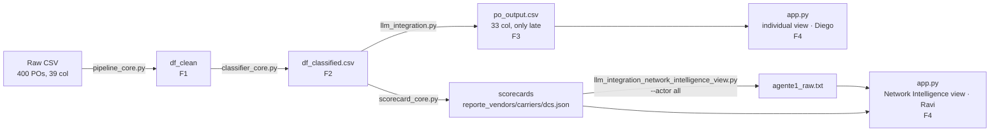

# Project Explanation — PO Delay Root Cause Analyzer

This document is the narrative synthesis of the project, organized by phase and intended to be read continuously: it connects the reasons for each decision —recorded in the ADRs— with the resulting logic and its implementation in the code. It does not replace the formal documents of the repository, the Software Requirements Specification (`SRS.en.md`) and the Software Architecture Document (`SAD.en.md`), which exhaustively and audibly enumerate what the system must do and how it is constructed; this document is the narrative entry point, the reference with which the project is explained and defended from start to finish.

## Executive Summary

The project analyzes Purchase Orders (POs) that arrived late at a distribution center and answers, for each, three questions: at what stage of the life cycle the delay originated, how severe it is, and what concrete action corrects it. The dataset is synthetic: 400 POs and 39 columns, of which 247 turn out to be late and are the population that the system explains.

The thesis that supports the method is that the timestamps of the life cycle are the source of truth, not human annotation. Each PO carries a `REASON_DSC` written by an operator, but that annotation is approximately 20% incorrect. The system calculates the responsible stage from the dates and contrasts it against the `REASON_DSC`: when they differ, the discrepancy is not an error of the method but evidence that the temporal computation corrects the inherited annotation. The goal is to detect the real reason for the delay, not to reproduce the reason that an operator noted; it is entirely possible that a previously accepted annotation is identified as incorrect once analyzed. That correction is the central finding of the project.

The solution combines deterministic rules and a language model, with a strict division of labor. The rules resolve all the arithmetic —which segment exceeded its threshold, how much, with what severity— and the LLM interprets that already resolved diagnosis to draft the explanation and action, without recalculating or inventing figures. The work is organized into four linked phases through data contracts: Phase 1 cleans the data and isolates its anomalies; Phase 2 classifies the responsible stage and assigns severity; Phase 3 generates the explanation in natural language; Phase 4 presents the results in a consumer application.

The figures that summarize the validated state of the project, all traceable to the documentation of metrics and validation:

- Breakdown of the 247 late POs by responsible stage: Vendor 53.0% (131), Carrier 16.2% (40), DC 15.0% (37), Indeterminate 15.8% (39).
- Stage accuracy 100% (208/208 evaluable) against the mentor's threshold of >80%.
- Reason agreement 88.8% (174/196 classifiable): the <100% is expected and desired, as it measures where the computation corrects human annotation.
- LLM Explanation Quality 5/5 (20/20) in the quality benchmark.
- Severity ranking 100% (14/14) against the threshold of >95%.
- Test suite: 251 tests in green as a merge gate.

## Phase 1 — Ingestion, Data Quality, and EDA

### Design

The decision that orders the entire phase is to treat the life cycle timestamps as the only source of truth, and to relegate the precalculated columns from the source CSV (`DELAY_DAYS`, `YARD_WAIT_HRS`, `DOCK_HRS`, `IS_LATE`) to mere cross-check (ADR-01). The evidence supporting this is concrete: `DOCK_HRS` disagrees with the actual computation in 11 POs, by up to 8.2 hours, because the source system recorded time investments as negative values. If those columns governed the logic, the error would propagate; used only for auditing, they serve to detect anomalies without inheriting them.

The second design decision is not to delete rows. Records with inconsistent or incomplete dates are not removed; they are isolated with quality flags. Deleting them would alter the statistical volume and induce bias; isolating them preserves the complete population and makes explicit which record is reliable for what calculation.

### Logic

The parsing of date columns is strict with safe recovery: `errors='coerce'` converts any invalid value to `NaT` instead of breaking the pipeline. Three quality flags that do not destroy rows are injected into the already typed data:

- `_ts_issue` marks the 12 orders with time investment (`CHECKOUT_DT < CHECKIN_DT`).
- `_trailer_arrive_null` marks the 27 orders without `TRAILER_ARRIVE_DT`.
- `_data_reliable` identifies the 361 totally clean records out of 400.

The 39 unreliable orders are the exact sum of those two groups —12 investments + 27 without trailer— with no overlap between them, and the baseline metrics are reported on the remaining 361.

Isolating the null trailer is important because, without it, calculating the carrier segment would yield `NaN` and the comparison against the threshold would be evaluated as `False` in silence: a false negative that would appear as compliance. The explicit flag allows those 27 orders to be removed from the denominator instead of counting them as if the carrier had complied.

The pipeline formally calculates responsibility segments from the native dates:

- `lead_time_days`: `PO_DT → STA_DT`, the purchase time.
- `carrier_lag_hrs`: `APPROVED_DT → TRAILER_ARRIVE_DT`, the carrier transit time.
- `yard_wait_calc_hrs`: `TRAILER_ARRIVE_DT → CHECKIN_DT`, the stay in the yard.
- `dock_calc_hrs`: `CHECKIN_DT → CHECKOUT_DT`, the unloading at the dock.
- `delay_days_calc`: `RECPT_DT − STA_DT`, the final delay, bounded to ≥ 0.
- `appt_lead_days`: `STA_DT − APPROVED_DT`, the appointment booking window.

The bounding to ≥ 0 truncates physically impossible durations produced by the 12 investments to zero instead of propagating negative times. The column `TRAILER_DEPART_DT` is formally excluded from any segment calculation: it occurs on average ~27 hours after receiving in 99.8% of cases, that is, outside the operational receiving cycle.

### Implementation

The logic resides in `pipeline_core.py`, with two core functions. `clean_po_data()` sequentially executes the parsing of timestamps, the injection of quality flags, the calculation of deltas, and the assignment of exploratory stage flags. `cross_validate_deltas()` audits the calculated segments against the precalculated columns and reports discrepancies before exporting.

The module runs with `python 01_data_pipeline_and_eda/pipeline_core.py`; it consumes `data/raw/po_root_cause_synthetic.csv` (out of version control) and produces the clean DataFrame that Phase 2 consumes. The thresholds that this phase injects as exploratory flags (carrier 4h, yard 4h, dock 6h) are preliminary and have been surpassed: the logic of production classification is consolidated in Phase 2 with the carrier threshold of 8h. The phase coverage is in `tests/test_pipeline_core.py`.

## Phase 2 — Stage Classification (Business Rules)

### Design

This phase assigns a responsible stage for the delay to each late PO and a severity, and validates both against independent references. The taxonomy and thresholds were finalized with the mentor and refined after an attribution consultation. Six decisions govern it:

Four stages are defined —Vendor, Carrier, DC, and Indeterminate (#39). Indeterminate is a valid and auditable category, not a dumping ground: forcing attribution without evidence would be to invent causality.

Vendor is measured by STA push (`APPROVED_DT > STA_DT`), not by residual (ADR-03b, which supersedes ADR-03a). The residual —subtracting carrier and DC from the total delay— assumes that the segments are additive and mutually exclusive, and in practice, they overlap. The direct signal is more robust and also works in the 27 POs without trailer time, because it does not need to measure carrier or DC to exist.

The carrier threshold is 8 hours, not 4 (ADR-04b, which supersedes ADR-04a), accompanied by a sensitivity table. The median of the carrier gap is around 3 hours, and the 75th percentile is 4.4, so 8 hours produces a carrier proportion consistent with a dataset of short trips. What supports the choice is not the number itself, but its traceability.

Appointment rescheduling and short-ship are modeled as context or aggravating factors, not as stages (ADR-05). A rescheduling describes an event, not a root cause; the classifier answers who caused the delay, not what happened.

Vendor has its own threshold of 24 hours (ADR-06b, which supersedes ADR-06a). It corrects a structural asymmetry: previously, vendor would trigger with any positive push while carrier, yard, and dock required surpassing their threshold, so vendor absorbed by default everything that others did not capture.

DC consolidates Yard and Dock into a single stage, with a subclass `dc_substage` that retains detail. The final responsible party is the same —the operations of the distribution center— so a stage is reported and the distinction is kept as informative subclassification.

Decision anchors: ADR-01, ADR-02 (hierarchy with multiple active flags), ADR-03b, ADR-04b, ADR-05, ADR-06b, and ADR-07 (taxonomy of Indeterminate); ADR-08 (`stage_modifiers`) was conceived and deleted.

### Logic

The primary stage is decided by excess over threshold, not by raw duration. For each measurable segment, the excess is `max(0, observed − threshold)` in hours, with the mentor's thresholds (carrier 8h, yard 4h, dock 6h). A segment that cannot be measured contributes 0 to the argmax, but its mask records "not measurable" to avoid confusing it with a real zero.

Vendor fits into the same scheme: its excess is `max(0, −appt_lead_days × 24 − 24h)`, where `appt_lead_days = STA − APPROVED` in days. That value is negative when the appointment was approved after the promised date, so the push in hours is positive, and only counts as excess above `vendor_gap_hrs = 24h`, just like the other segments have theirs. The primary stage is the argmax of {Vendor, Carrier, DC}.

When no segment applies, the PO falls into Indeterminate, with a subclass that states why: `sin_datos` if the PO is late but not measurable (without `TRAILER_ARRIVE_DT`), or `sin_causa_dominante` if it is measurable but no segment exceeds its threshold. The top label is Indeterminate; the reason lives in the subclass.

The thresholds are read by name from `rules_config.json`, never from the code; recalibrating means editing the JSON:

| Key                  | Value | Use                                                   |
|----------------------|-------|------------------------------------------------------|
| `vendor_gap_hrs`     | 24.0 h | Vendor excess (STA push) over this threshold         |
| `carrier_lag_hrs`    | 8.0 h | Carrier excess                                        |
| `yard_wait_hrs`      | 4.0 h | Yard excess                                          |
| `dock_hrs`           | 6.0 h | Dock excess                                          |
| `short_ship_fill_rate`| 0.9   | Below, short-ship (context)                          |
| `severity_delay_days` | 3.0 d | HIGH severity gate                                   |
| `severity_low_days`   | 1.0 d | LOW borderline cutoff                                 |

Severity is deterministic and auditable, separate from what the LLM later issues. It is HIGH when the PO is hot and arrived late (`HOT_PO_FLAG=1` and `IS_LATE`) and the delay exceeds 3 days; LOW when the delay is less than 1 day (borderline, almost on time); MEDIUM in the rest of the late cases. The aggravating factors `is_short_lead` or `is_short_ship` raise a level (LOW→MEDIUM, MEDIUM→HIGH), without exceeding HIGH: the actual HIGH gate remains hot plus strong delay.

The resulting breakdown over the 247 late POs is Vendor 131 (53.0%), Carrier 40 (16.2%), DC 37 (15.0%), and Indeterminate 39 (15.8%), where those 39 are broken down into 15 `sin_datos` and 24 `sin_causa_dominante`. The severity allocates MEDIUM 131, LOW 82, and HIGH 34.

That Vendor dominates with 53% —well above the ~20% anticipated at kickoff— is supported by the data, not the trigger rule. The distribution of the push is bimodal: 12 POs with almost no push (≤6h) and 141 with days' push (median 3.1 days), with an empty gap between 6 and 18 hours where no PO falls. Late orders are almost always late because the appointment was approved late. The correlation between push and total delay is high by construction —an early delay propagates— and for this reason is not used as evidence of causality; what it attributes is the excess by segment.

The two sensitivity analyses are the traceability that supports the thresholds. The carrier analysis shows that moving the threshold changes the raw flag significantly but hardly the stage distribution, because the vendor signal dominates the argmax:

| Carrier Threshold | `flag_carrier_calc` | Vendor / Carrier / DC / Indeterminate Distribution |
|-------------------|----------------------|----------------------------------------------------|
| 4 h               | 25.8% (103)          | 53.0 / 17.4 / 15.0 / 14.6                           |
| 6 h               | 12.8% (51)           | 53.0 / 16.2 / 15.0 / 15.8                           |
| 8 h               | 12.8% (51)           | 53.0 / 16.2 / 15.0 / 15.8                           |
| 12 h              | 11.2% (45)           | 53.0 / 14.6 / 15.0 / 17.4                           |

The vendor analysis justifies the 24 hours and, above all, shows that raising the threshold does not reattribute delays to other stages; it only separates the diffuse pushes:

| Vendor Threshold | Vendor | Vendor / Carrier / DC / sin_datos / sin_causa_dominante Distribution |
|-------------------|--------|----------------------------------------------------|
| 0 (no threshold)   | 141 (57.1%) | 141 / 40 / 37 / 15 / 14                               |
| 6–18 h            | 133 (53.8%) | 133 / 40 / 37 / 15 / 22                               |
| 24 h              | 131 (53.0%) | 131 / 40 / 37 / 15 / 24                               |
| 48 h              | 114 (46.2%) | 114 / 40 / 37 / 15 / 41                               |
| 72 h              | 76 (30.8%)  | 76 / 40 / 37 / 15 / 79                                |

24 hours are chosen for three reasons: it is the natural granularity of the data, since `STA_DT` is at the day level and measuring the push against a whole day is the unit in which the problem is expressed; it falls in the empty zone of the distribution, which makes it robust to perturbations; and it does not force the distribution towards the ~20% of kickoff, which the mentor advised against. The POs that cease being Vendor upon raising the threshold all migrate to `sin_causa_dominante`, none to Carrier or DC: the threshold does not reassign blame, it only isolates the pushes that do not reach to be signals.

The contrast with human annotation is the thesis of the project. The reason agreement is 88.8% over 196 classifiable; the 22 mismatched cases are evidence that the temporal computation surpasses the inherited annotation. Eight defensible cases covering two patterns are selected. In the star pattern, the operator blamed the visible link —carrier or yard— while the appointment had been approved days late and that segment had no excess at all. In the internal pattern, the computation detects a segment excess that the annotation confused. The stratified selection distributes the examples among the three attributable stages instead of taking the strongest ones outright, which would almost all be Vendor.

### Implementation

The logic lives in reusable functions, not in the notebook, which only presents. `classify_po_stages` in `classifier_core.py` orchestrates four steps: `_flags_por_umbral` (#44), `_etapa_primaria` (#45), `_capa_complementaria` (context flags), and `_severidad` (#48). The validations live in `metrics_core.py`: `stage_accuracy` (#46), `reason_agreement` (#47), `select_mismatches` and the sensitivity and severity functions.

The module consumes the clean DataFrame from Phase 1 and produces `data/processed/df_classified.csv`, which is not versioned and is regenerated by running the module. The coverage is in `tests/test_classifier_core.py` and `tests/test_metrics_core.py`.

## Phase 3 — LLM Integration

Phase 3 generates the root cause explanation in natural language. The project operates two complementary LLM surfaces: one per PO, which produces the deliverable evaluated by the mentor (`po_output.csv`), and a holistic one by actor, which produces a network executive synthesis (`agente1_raw.txt`). Both share a principle: the computation —rules or statistics— diagnoses, and the LLM interprets that already resolved diagnosis.

### Per PO Surface — the Evaluated Deliverable

#### Design

The guiding principle is that the LLM interprets, not recalculates (#91, ADR-14). All the arithmetic is resolved from the previous phases and the model only reads it to draft; the prompt explicitly forbids recalculating dates or hours and inventing figures, and requires quoting verbatim those provided, so the explanation can be audited against the data.

The severity is hybrid (ADR-10): the LLM issues it, and the deterministic rule from Phase 2 audits it. The official severity of the deliverable is that of the LLM; that of the rule is kept as an audit baseline in the internal artifact.

The prompt has a single source, `build_prompt()` (ADR-12). A previous plain text draft was removed because it had diverged —a taxonomy of six stages that were not the four states of Phase 2, instructions inviting calculation, a contradictory severity threshold— and keeping it risked it being reused without context. The production configuration is few-shot C3, three examples that teach the reasoning, validated at temperature 0.9 (ADR-13) without regression against the anchor 0.3. An instruction block called HOW TO REASON hardens the prompt against overfitting to few-shot (ADR-14): it prevents the model from copying the shape of the examples as a template. The severity thresholds that the prompt delivers are interpolated from `rules_config.json` (#121), the same single source used by Phase 2. The handling of the API keys follows the multi-provider secret policy (ADR-11): they live only in `.env`, never in the code, the versioned CLI, or the logs.

#### Logic

The process filters the late POs (`delay_days_calc > 0`) and, for each one, assembles a prompt by blocks: the DATA of the PO and its actors; the TIMELINE of raw dates, which the model reads to contrast and not to recalculate; the CALCULATED METRICS, with the delay, the yard and dock times, and the excess by stage; the AUTOMATIC CLASSIFICATION, where `stage_primary` of Phase 2 is the source of truth for the stage and the model does not re-decide it; and the ADDITIONAL CONTEXT with the aggravating factors, rescheduling as a neutral datum, the subclass of Indeterminate and the `REASON_DSC`. It closes with two instruction blocks: one prohibits recalculating and demands citation, and HOW TO REASON establishes that the classification sends the stage and that the `REASON_DSC` serves for contrast, never to replace the stage.

The response is a JSON with five keys —`causa_raiz`, `accion_recomendada`, `severidad`, `coincide_con_reason_code`, and `confianza`— and its parsing is centralized in `_parse_llm_json()` to avoid duplicating logic among backends. There are four: `openai` with `gpt-4o-mini` is the official backend of the deliverable; `local` with Qwen on Ollama does not incur API costs and serves for development; `claude` and `deepseek` are alternative comparisons. The local backend has a fallback to free text if the model does not return JSON; the cloud expects valid JSON. The C3 configuration deterministically selects three examples, one for each attributable stage, with `select_examples(3, ["Vendor","Carrier","DC"])` from the audited pool `fewshot_pool.json`. The examples come from real mismatches in Phase 2, are disjoint from the 20 PO benchmark to avoid contaminating the metric, and do not include the timeline of dates, because showing it would re-teach recalculation.

The figures for this surface: LLM Explanation Quality 5/5 (20/20) with C3 at temperature 0.9 and seed 42; severity ranking 100% (14/14), measured on the severity of the LLM. The divergence between the severity of the LLM and that of the rule from Phase 2 is a documented finding: they agree in 213 of 247 (86.2%) and diverge in 34 (13.8%), and those divergences always scale —30 LOW→MEDIUM and 4 MEDIUM→HIGH—, none downscales.

#### Implementation 

The logic lives in `llm_integration.py`: `build_prompt`, `add_llm_explanations`, `export_deliverable_csv`, `create_backend`, and `_parse_llm_json`, with the inference configuration in `llm_config.json` (temperature 0.9, seed 42). The `--mode` (test / full / custom), `--backend`, and `--zero-shot` flags control the run. The module consumes `df_classified.csv` and produces two artifacts: the internal `df_with_llm_*.csv`, which carries the severity from Phase 2 along with that of the LLM for audit, and the deliverable CSV `po_output.csv`. The coverage is in `tests/test_llm_integration.py` and `tests/test_handoff_f3.py`.

### Holistic Actor Surface — Network Executive Synthesis

#### Design

This surface answers a single directive question: where is the root cause of the delay and what operational implications does it have, hierarchized by risk zones for each of the three actors. The problem has two layers that are not solved separately. The first is who analyzes: an LLM fed with raw POs produces generic narratives, invents correlations, and ignores sample size. The second is with what input: feeding it only raw POs hands it data without diagnosis. The solution is not LLM or statistics, but a pipeline where the statistics produce a structured diagnosis —the scorecard, which is the numeric ground truth— and the LLM interprets it as an analyst.

The architecture features three specialized agents in sequence, one for each actor, each with its `ACTOR_CONFIG` of guiding thresholds, files, and title. The monolithic agent was discarded because the thresholds of operational health differ by actor, and mixing them forces averaging criteria, and it was also discarded to deliver raw POs as input, as the model would inherit and amplify its biases. The prompt separates what the model must think —an eight-step methodology and internal guides marked as "do not mention"— from what it must write: executive bullets with concrete actions in terms of time, responsible entity, and mode. The output is forced into a Pydantic schema (`ReporteEspecialista` with `AnalisisBloqueRiesgo` blocks) so that the frontend can parse it unambiguously, and homogeneity is treated as a finding: if all entities are practically the same, that is the main finding, not something to forcefully differentiate. The inference uses `temperature=0.1` and `max_tokens=1200` to minimize variability and force synthesis. Anchors: ADR-19, which delivers the executive synthesis by actor from lane 3 of ADR-16 —the conversational Q&A and the agentic lane 2 remain open—, in addition to ADR-10 and ADR-09.

#### Logic

`scorecard_core.py` produces, for each entity, a `reporte_{vendors,carriers,dcs}.json` with statistically robust metrics: explicit sample sizes (`n_POs_total`, `n_POs_causa_raiz`), credibility quantified by Z-scores, and a `Score_Riesgo_Normalizado`. This allows one not to compare in raw terms a vendor with 3 POs against one with 300. Each agent consumes its scorecard, not the POs, emits at least one risk block (High, Medium, or Low, without fixed limit), and `construir_segmento_texto` translates the Pydantic to text; the three segments accumulate and consolidate in `agente1_raw.txt` when invoked with `--actor all`. The reproducibility is asymmetric: the scorecard is byte-identical between runs because its date derives from the data and not from execution, while the narrative of the LLM is stable in tone due to the low temperature but is not anchored with seed, a minor debt recorded in ADR-19.

#### Implementation

`scorecard_core.py` takes `df_classified.csv` and an output directory; `llm_integration_network_intelligence_view.py`, invoked with `--actor all`, runs the three agents and consolidates the result. The chain is `df_classified.csv → scorecards JSON → agente1_raw.txt`.

### Differential Diagnosis Tier-2

Under the `--action-call` flag (ARD-16, lane 1), each PO receives a second call with `build_action_prompt()`: a planner role with decision authority that produces a hybrid contract —reasoning, main hypothesis with its immediate, corrective, and preventive action plan, alternative hypothesis with its discriminating step, and a second confidence— and undergoes a rule quality control. The first call diagnoses at the stage level; this one plans the mechanism below that level. It fills the nine tier-2 columns of `po_output.csv`; without the flag, those columns are empty, not absent, so the column contract remains stable with or without it. The complete contract is formalized in ARD-21.

## Phase 4 — App (Demo + Final Evaluation)

### Design

Phase 4 presents the results and does not produce new analysis: it reads the artifact from Phase 3 and displays it. The application is Streamlit, and all the logic of cleaning, classification, and explanation has already occurred upstream.

The design is organized by consumption mode, not by entity in the chain (ADR-09). Two personas are defined: Diego, who queries an individual PO, and Ravi, who reviews the portfolio by batch. This choice responds to the fact that the same data is used in two distinct ways —specific diagnosis versus aggregated executive reading— and organizing the app by persona instead of by vendor/carrier/DC avoids duplicating the same entity on three screens.

The rule that underpins the architecture is that the app reads, not recomputes (contract F3→F4, #100). It does not recompute the rules of Phase 1 or 2, nor does it call the LLM again; if a view requires a datum that the CSV does not bring, the contract is expanded in Phase 3, not recomputed in the app. The visual language and color coding of the taxonomy follow the Okabe-Ito palette with light and dark themes (ADR-17). Anchors: ADR-09, ADR-17, ADR-21 (the data contract), ADR-19 (the network view), and ADR-20 (the Telegram bot, in the roadmap).

### Logic

The F3→F4 contract is `po_output.csv` with 33 columns, only for late POs, divided into three blocks (ADR-21): a base contract of 16 columns —mentor identity and diagnosis, timeline, aggravating factors, and concordance with human annotation—, a tier-1 of 8 columns with enrichment already computed upstream (confidence, responsible entities, excess hours by stage), and a tier-2 of 9 columns with the differential diagnosis from ARD-16. The tier-2 is only populated with `--action-call`, but the 33 columns always exist, with or without the flag.

Diego's individual view consumes the prose per PO from `po_output.csv`: the timeline, the responsible stage, the LLM's explanation and action, the severity, and the concordance with the `REASON_DSC`. Ravi's aggregated view, the Network Intelligence view, consumes two distinct artifacts of that prose per PO: the scorecard JSONs, which are the numerical aggregates by entity, and the executive narrative `agente1_raw.txt`, the actor synthesis from the holistic surface. Both are generated offline, are regenerable, and are outside the mentor's contract and version control.

### Implementation

The app is launched with `streamlit run 04_app/app.py` and organizes its two surfaces into pages: the individual view (#163) and the Network Intelligence view (#164). `config.py` centralizes the canonical columns of the contract and the color coding of the taxonomy (ADR-17), and `styles.css` the visual theme. The app consumes `po_output.csv`, the `scorecards/reporte_*.json`, and `agente1_raw.txt`, all produced upstream. The coverage is in `tests/test_handoff_f3.py`, which locks the column contract, and `tests/test_app_smoke.py`.

## End-to-End Data Contract

The complete data chain, from raw source to final consumption:

Each boundary between phases is a contract, not an assumption: the CSV produced by one phase is functionally identical to the DataFrame that that phase leaves in memory, so that the next phase reads it and reconstructs the same state it would have if the chain were run all at once. Identity is functional, not typed —a CSV writes dates as text— so the contract is fulfilled when the value is the same, not when the dtype matches. This covers the two main boundaries, F1→F2 and F2→F3.

A limit case of that golden rule is the sentinel `"Ninguno"`. The column `stage_multi` uses `"Ninguno"` for POs without a secondary stage, and not the literal `"None"` or the empty string, because both are read from the CSV as NaN: F3 would lose the signal of "no second stage" and confuse it with an absent datum. `"Ninguno"` is a real value that survives the round-trip intact.

The F3→F4 contract (`po_output.csv`, ADR-21) has 33 columns and reaches only late POs (`delay_days_calc > 0`): a base block of 16 (identity and mentor diagnosis, timeline, aggravating factors, concordance with human annotation), a tier-1 of 8 (enrichment already computed), and a tier-2 of 9 (differential diagnosis, populated only with `--action-call`, but always present as a column). `agente1_raw.txt` is a parallel derived artifact: it shares lineage from Phase 3 but is not part of `po_output.csv` —it is produced by the holistic surface from the scorecards, not from the CSV— and its content is narrative text by actor, not tabular columns.

The rule governing the entire F3→F4 stretch is that the app reads and does not recompute: it does not rerun the rules of F1/F2 nor call the LLM again. Everything that each view needs is already in the artifacts it consumes.

## Validation and Quality

The project guarantees its results in four layers, each with its own what it guarantees, what it breaks if it fails, and how it reproduces. The complete method detail lives in `documentation/validacion-y-qa.md`; here its canonical table is cited, not recalculated.

**Layer A — Unit tests by phase.** Each function of the pipeline is tested in isolation, with synthetic fixtures of known expected value: `test_pipeline_core.py` for cleaning, `test_classifier_core.py` for stage and severity, `test_metrics_core.py` for validation metrics, `test_llm_integration.py` for prompt construction and parsing without touching the network. If it fails, a regression reaches main without anyone noticing.

**Layer B — Handoff contract between phases.** `test_handoff_contract.py` verifies the golden rule described above at the two boundaries F1→F2 and F2→F3. If it fails, running the phases separately would yield a different result than running them together.

**Layer C — Classification metrics against thresholds.** The headline figures are calculated from the timestamps, never from human annotation, and are contrasted against the mentor's acceptance thresholds:

| Metric              | Value           | Mentor Threshold | Denominator                                           |
|---------------------|-----------------|------------------|------------------------------------------------------|
| Stage accuracy       | 100% (208/208)  | > 80%            | 208 evaluable (247 late − 39 Indeterminates with no measurable gap) |
| Reason agreement      | 88.8% (174/196) | reference, not threshold | 196 classifiable (late with non-null human annotation) |
| Severity ranking      | 100% (14/14)    | > 95%            | 14 hot-late, on `po_output.csv` (severity = LLM)    |

Stage accuracy compares the stage by excess over threshold against the dominant gap —the segment of greatest raw duration—: it validates that the attribution does not stray from where time was physically spent, without forcing them to match by construction. Reason agreement, as established in Phase 2, has its <100% expected and desired: it measures where the computation corrects human annotation, not where the method fails.

**Layer D — CI as merge gate.** The workflow runs on each PR and on each push to main a smoke test of imports from the three core modules followed by the complete suite. The team merges without blocking human review, so the merge gate is the green check.

The anchor figures that a reviewer obtains in a clean environment: test suite at 251 (grew from 57 to 251 with each phase); stage accuracy 100% (208/208); reason agreement 88.8% (174/196); severity ranking 100% (14/14); LLM Explanation Quality 5/5 (20/20); LLM severity divergence versus rule 213/247 (86.2%) agree, 34/247 (13.8%) diverge —always scaling—.

Validation also covers limit cases where the data is partial or anomalous. Of the 27 POs without `TRAILER_ARRIVE_DT`, the vendor's STA push rule rescues 12 —because it measures late approval without needing the trailer—, and the remaining 15 are left as `sin_datos`. Of the 12 time investments, the pipeline truncates the affected segment to zero instead of propagating a negative duration. The figure 39 appears in two distinct populations that should not be confused: in F1 it is 39 unreliable POs (12 investments + 27 without trailer, out of 400); in F2 it is 39 Indeterminate POs (15 `sin_datos` + 24 `sin_causa_dominante`, out of 247 late). They match in number, not in set.

## Traceability Map

| Phase                | Decisions (ADR/ARD)                                                                         | Key Issues                    | Tests                                        |
|----------------------|--------------------------------------------------------------------------------------------|-------------------------------|----------------------------------------------|
| F1 — Pipeline and Quality | ADR-01                                                                                      | #4, #15, #16, #18             | `test_pipeline_core.py`                     |
| F2 — Classification  | ADR-01, ADR-02, ADR-03a▷ADR-03b, ADR-04a▷ADR-04b, ADR-05, ADR-06a▷ADR-06b, ADR-07, ADR-08 (superseded) | #39, #40, #41, #42, #44, #45, #46, #47, #48, #49 | `test_classifier_core.py`, `test_metrics_core.py` |
| F3 — LLM per PO     | ADR-10, ADR-11, ADR-12, ADR-13, ADR-14, ADR-15 (superseded by ADR-16)                  | #67, #91, #94, #99, #121, #135, #137, #143, #144, #151 | `test_llm_integration.py`, `test_handoff_f3.py` |
| F3 — Holistic / network  | ADR-16 (draft, lane 3), ADR-19                                                               | —                             | —                                            |
| F3 — Tier-2 (action) | ADR-16 (lane 1), ARD-21                                                                      | #158, #161                    | —                                            |
| F4 — App            | ADR-09, ADR-17, ADR-20 (draft), ADR-21                                                       | #100, #102, #103, #158, #161, #162, #163, #164, #174, #175, #176, #186, #187 | `test_handoff_f3.py`, `test_app_smoke.py`  |

The decisions superseded (marked ▷) are not edited or deleted: they chain to the current one that replaces them, according to the MADR standard adopted by the team. The complete record, with status and context links per decision, lives in `documentation/decisiones/README.md`.

## Open Work / Roadmap

What is described above is the submitted and validated state. There is, apart from that, draft or deferred work, documented separately to avoid mixing it with what has been produced:

ADR-16, lane 2 (agentic) and conversational Q&A in lane 3, remain open. The executive synthesis by actor in lane 3 is already delivered by ADR-19, but the conversational Q&A about the dataset is unresolved.

The conversational chatbot (#160) is deferred, distinct from the Telegram bot (ADR-20), which is an additional consumption channel for the already existing contract, not a new analytical surface.

ADR-20, the Telegram bot, is in draft: an additional consumption channel for `po_output.csv`, pending formal closure.

ADR-18, source canonical language and naming convention for bilingual documentation, is in draft; it governs the ES→EN translation of deliverables, which is outside this document.

Additionally, a minor debt recorded in ADR-19 remains: the narrative of the holistic surface is not anchored with seed (unlike the per PO surface, which does use `seed=42`), a second comparative table of thresholds among the three actors partially dilutes the isolation that the architecture demands, and there is a vocabulary inconsistency between two fields of the same Pydantic schema (`bloques` describes "Critical, Medium or Low" while `nivel_riesgo` requires "High, Medium or Low"). None of the three block the result; they are recorded as code improvements outside the scope of this document.

### Documentary Consistency with SRS and SAD

Upon closing this document, its relationship with the two formal specifications of the repository was reviewed, and two statements that had become outdated were corrected. The SAD described `llm_integration_network_intelligence_view.py` as an experimental component without references from the rest of the code; in reality it generates `agente1_raw.txt`, consumed in production by the Network Intelligence view (ADR-19, ARD-21), and the description was corrected to reflect that real dependency. The SRS and root README cited 4.75/5 as the figure of LLM Explanation Quality —the result of the benchmark that selected configuration C3, not the deliverable’s headline figure—; it was updated to 5/5 (20/20), the figure in force after revalidation at production temperature. Separately, `documentation/validacion-y-qa.md` cited an outdated test count; it was also synchronized.