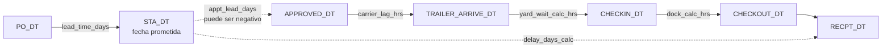
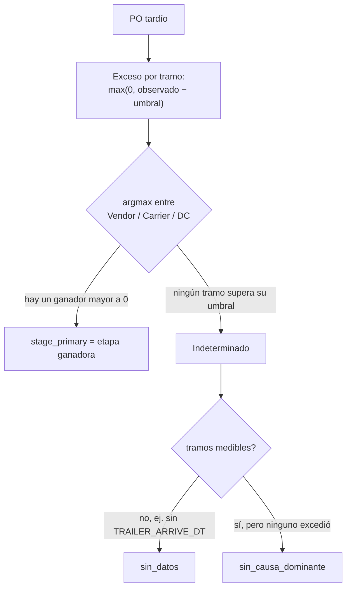
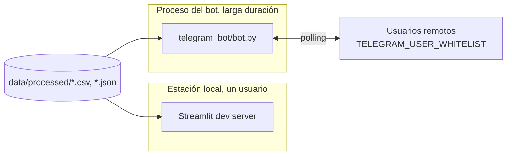
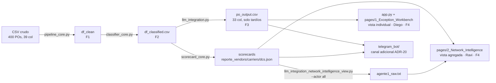

# Explicación del proyecto — PO Delay Root Cause Analyzer

Este documento es la síntesis narrativa del proyecto, organizada por fase y pensada para leerse de
corrido: conecta el porqué de cada decisión —registrado en los ADRs— con la lógica que resulta y su
implementación en el código. No sustituye a los documentos formales del repositorio, la Especificación
de Requisitos de Software ([SRS.md](SRS.md)) y el Documento de Arquitectura de Software
([SAD.md](SAD.md)), que enumeran de forma exhaustiva y auditable qué debe hacer el sistema y cómo está
construido; este documento es el punto de entrada narrativo, la referencia con la que el proyecto se
explica y se defiende de principio a fin.

## Resumen ejecutivo

El proyecto analiza Purchase Orders (POs) que llegaron tarde a un centro de distribución y responde,
para cada uno, tres preguntas: en qué etapa del ciclo de vida se originó el retraso, qué tan grave es,
y qué acción concreta lo corrige. El dataset es sintético: 400 POs y 39 columnas, de los cuales 247
resultan tardíos y son la población que el sistema explica.

La tesis que sostiene el método es que los timestamps del ciclo de vida son la fuente de verdad, y no
la anotación humana. Cada PO trae un `REASON_DSC` escrito por un operador, pero esa anotación es
aproximadamente un 20% incorrecta. El sistema calcula la etapa responsable desde las fechas y la
contrasta contra el `REASON_DSC`: cuando difieren, la discrepancia no es un error del método sino
evidencia de que el cómputo temporal corrige a la anotación heredada.

Un hallazgo concreto ilustra la tesis con una cifra que documentos previos del proyecto no citaban: el
propio notebook de EDA de Fase 1
([`data_pipeline_and_EDA.ipynb`](../01_data_pipeline_and_eda/data_pipeline_and_EDA.ipynb)), trabajando
sobre la columna precalculada `IS_LATE` (no sobre el cómputo de timestamps), reporta una tasa de
tardanza de 41.25% (~165 POs) y un 48.5% de mismatch con `REASON_DSC` (80 de 165). Esas cifras nunca se
reconcilian explícitamente en el texto del notebook con las canónicas de Fase 2 (247 tardíos vía
`delay_days_calc>0`, 88.8% de agreement) — es, sin buscarlo, una segunda demostración de la tesis del
proyecto: la fuente precalc y el cómputo de timestamps producen poblaciones y tasas distintas, y es el
cómputo el que se usa aguas abajo.

La solución combina reglas determinísticas y un modelo de lenguaje, con una división de trabajo
estricta. Las reglas resuelven toda la aritmética —qué tramo excedió su umbral, cuánto, con qué
severidad— y el LLM interpreta ese diagnóstico ya resuelto para redactar la explicación y la acción,
sin recalcular ni inventar cifras. El trabajo se organiza en cuatro fases encadenadas por contratos de
datos: la Fase 1 limpia el dato y aísla sus anomalías; la Fase 2 clasifica la etapa responsable y
asigna severidad; la Fase 3 genera la explicación en lenguaje natural (y, en una superficie paralela,
una síntesis ejecutiva por actor); la Fase 4 presenta los resultados en dos superficies de consumo —
una app Streamlit multipágina y un bot de Telegram como canal adicional de lectura.

Las cifras que resumen el estado validado del proyecto, todas trazables a su artefacto o conteo real:

- Reparto de los 247 POs tardíos por etapa responsable: Vendor 53.0% (131), Carrier 16.2% (40), DC
  15.0% (37), Indeterminado 15.8% (39, desglosados en 15 `sin_datos` + 24 `sin_causa_dominante`).
- Stage accuracy 100% (208/208 evaluables) frente al umbral del mentor de >80%.
- Reason agreement 88.8% (174/196 clasificables): el <100% es esperado y deseado.
- LLM Explanation Quality 5/5 (20/20) en el benchmark de calidad, few-shot C3 a temperatura 0.9.
- Severity ranking 100% (14/14) frente al umbral de >95%.
- Suite de pruebas: 266 casos que recolecta `pytest --collect-only -q` — 230 funciones `def test_` en
  13 archivos bajo [`tests/`](../tests/), algunas parametrizadas.
- Registro de decisiones: 28 ADR ([ADR-01](decisiones/ARD-01.md) a [ADR-25](decisiones/ARD-25.md), con
  tres números que llevan dos variantes encadenadas: 03a/03b, 04a/04b, 06a/06b), de los cuales 17 están
  Vigentes, 5 Superados y 6 en Borrador — registro completo en
  [documentation/decisiones/README.md](decisiones/README.md).

## Fase 1 — Ingesta, calidad de datos y EDA

### Diseño

La decisión que ordena toda la fase es tratar los timestamps del ciclo de vida como la única fuente
de verdad, y relegar las columnas precalculadas del CSV de origen (`DELAY_DAYS`, `YARD_WAIT_HRS`,
`DOCK_HRS`, `IS_LATE`) a mero cross-check ([ADR-01](decisiones/ARD-01.md)). La evidencia que la
respalda es concreta: `DOCK_HRS` discrepa del cómputo real en 11 POs, hasta 8.2 horas, porque el
sistema de origen registró inversiones temporales como valores negativos.

La segunda decisión de diseño es no borrar filas. Los registros con fechas inconsistentes o
incompletas no se eliminan, se aíslan con flags de calidad.

### Lógica

El parseo de las columnas de fecha usa `errors='coerce'`: un valor inválido se vuelve `NaT` en vez de
romper el pipeline — el resto del código tiene que anticipar ese `NaT` explícitamente en cada cálculo
que dependa de una fecha que pudo faltar. Sobre el dato ya tipado se inyectan tres flags de calidad
que no destruyen filas:

- `_ts_issue` marca las 12 órdenes con inversión temporal (cuatro condiciones distintas: `CHECKIN <
  TRAILER_ARRIVE`, `CHECKOUT < CHECKIN`, `RECPT < CHECKIN`, `STA < PO`).
- `_trailer_arrive_null` marca las 27 órdenes sin `TRAILER_ARRIVE_DT`.
- `_data_reliable` identifica los 361 registros totalmente limpios sobre los 400 (la conjunción de
  que ninguna de las dos flags anteriores sea cierta).

Las 39 órdenes no confiables son la suma exacta de esos dos grupos —12 inversiones + 27 sin
tráiler— sin solapamiento, y las métricas baseline se reportan sobre los 361 restantes.

El pipeline calcula seis tramos formalmente desde las fechas nativas:

| Tramo | Fórmula | Truncamiento |
|---|---|---|
| `lead_time_days` | `PO_DT → STA_DT` (tiempo de compra) | ≥ 0 |
| `carrier_lag_hrs` | `APPROVED_DT → TRAILER_ARRIVE_DT` (tránsito del transportista) | conserva signo |
| `yard_wait_calc_hrs` | `TRAILER_ARRIVE_DT → CHECKIN_DT` (estancia en patio) | ≥ 0 |
| `dock_calc_hrs` | `CHECKIN_DT → CHECKOUT_DT` (descarga en muelle) | ≥ 0 |
| `delay_days_calc` | `RECPT_DT − STA_DT` (retraso final) | ≥ 0 |
| `appt_lead_days` | `STA_DT − APPROVED_DT` (ventana de reserva de cita) | conserva signo |
| `total_dc_hrs` | `TRAILER_ARRIVE_DT → CHECKOUT_DT` (permanencia total en el CD, yard + dock) | ≥ 0 |



Un detalle de implementación que vale la pena resaltar: **no todos se truncan a cero**.
`carrier_lag_hrs` y `appt_lead_days` conservan su signo negativo deliberadamente — un valor negativo en
`appt_lead_days` (la cita se aprobó después de la fecha prometida) es justo la señal que Fase 2 usa
para detectar el "STA push" de vendor; truncarlo a cero destruiría esa señal. Los otros cuatro deltas
sí se acotan a `≥ 0` porque representan duraciones físicas que no pueden ser negativas salvo por un
error de captura. La columna `TRAILER_DEPART_DT` se excluye formalmente de todo cálculo de tramo:
ocurre en promedio ~27 horas después de la recepción en el 99.8% de los casos, fuera del ciclo
operativo de recepción que estos tramos miden.

`total_dc_hrs` no aparece como arista propia en el diagrama de flujo porque es una composición de dos
tramos ya mostrados (yard + dock, de `TRAILER_ARRIVE_DT` a `CHECKOUT_DT`), no un paso discreto
adicional. No es un cálculo muerto: Fase 3 lo consume en el scorecard de DC para derivar
`Dwell_Time_Net` — la métrica de permanencia neta del exceso de patio que alimenta la vista de Ravi
para el actor DC. El código tiene una ruta primaria (`total_dc_hrs − excess_yard_hrs`) y una de
fallback que compone `total_dc_hrs` como `excess_yard_hrs + excess_dock_hrs` cuando la columna no
viene en el input.

Las flags de clasificación exploratorias de esta fase (`flag_yard_congestion`, `flag_dock_backlog`,
`flag_carrier_miss`) tienen una asimetría sutil, verificada por tests: las dos primeras comparan
contra las columnas **precalculadas** del CSV (`YARD_WAIT_HRS`, `DOCK_HRS`), no contra los deltas
recién calculados — a propósito, porque en esta fase exploratoria el objetivo es comparar contra la
fuente precalc para detectar dónde discrepa, no sustituirla todavía. `flag_carrier_miss`, en cambio,
sí usa el delta calculado. Ninguna de estas tres flags es la clasificación de producción: son
exploratorias, con umbrales preliminares (carrier 4h, yard 4h, dock 6h) que Fase 2 supera con sus
propios umbrales (carrier 8h, definitivo).

### Implementación

La lógica vive en [`pipeline_core.py`](../01_data_pipeline_and_eda/pipeline_core.py), con dos
funciones núcleo: `clean_po_data()` (parseo, flags de calidad, deltas, flags exploratorias) y
`cross_validate_deltas()` (audita los tramos calculados contra las columnas precalculadas y reporta
discrepancias). Ambas funciones validan explícitamente su contrato de entrada
(`_REQUIRED_INPUT_COLUMNS`): si falta una columna, lanzan un `KeyError` que la nombra, en vez de fallar
aguas adentro con un mensaje opaco — un patrón de "fail fast con mensaje útil" aplicado
consistentemente.

El módulo se corre con:

```
python 01_data_pipeline_and_eda/pipeline_core.py
```

Consume `data/raw/po_root_cause_synthetic.csv` (fuera del control de versiones) y produce, vía
`save_clean_output()`, el CSV `data/processed/df_clean.csv` que consume la Fase 2 — el "contrato dual"
del handoff: el CSV persistido es idéntico al DataFrame en memoria (todas las columnas, mismo orden),
para que releerlo reconstruya exactamente lo que la cadena monolítica dejaría en memoria.

El notebook
[`data_pipeline_and_EDA.ipynb`](../01_data_pipeline_and_eda/data_pipeline_and_EDA.ipynb) (7 secciones,
de carga/inventario a guardado del output) solo presenta y narra el EDA; toda la lógica reutilizable
vive en el módulo, que el notebook importa sin reimplementar — evita que la lógica viva duplicada
entre notebook y módulo.

La cobertura de la fase está en [`tests/test_pipeline_core.py`](../tests/test_pipeline_core.py) (31
funciones), organizadas en bloques (smoke, parseo de fechas, flags de calidad, deltas, flags de
clasificación, métricas operacionales, cross-validation, robustez ante nulos). Un test en particular
(`test_flag_carrier_miss_silent_false_on_null_trailer`) documenta con detalle un hallazgo real: cuando
`TRAILER_ARRIVE_DT` es nulo, `carrier_lag_hrs` es `NaN`, y `NaN > 4.0` evalúa `False` en pandas — así
que un PO con carrier miss real queda marcado silenciosamente como "sin problema de carrier". Este es
exactamente el tipo de "NaN silencioso" contra el que Fase 2 se blinda explícitamente con la subclase
`sin_datos` de Indeterminado.

## Fase 2 — Clasificación por etapa (reglas de negocio)

### Diseño

Esta fase asigna a cada PO tardío la etapa responsable del retraso y una severidad, y valida ambas
contra referencias independientes. Seis decisiones la ordenan: cuatro etapas —Vendor, Carrier, DC e
Indeterminado (#39)—, Vendor medido por STA push y no por residual ([ADR-03b](decisiones/ARD-03b.md),
supera a [ADR-03a](decisiones/ARD-03a.md)), el umbral de carrier en 8 horas y no 4
([ADR-04b](decisiones/ARD-04b.md), supera a [ADR-04a](decisiones/ARD-04a.md)), reprogramación y
short-ship como contexto/agravante y no etapa ([ADR-05](decisiones/ARD-05.md)), un umbral propio de
vendor de 24 horas ([ADR-06b](decisiones/ARD-06b.md), supera a [ADR-06a](decisiones/ARD-06a.md)), y DC
consolidando Yard y Dock con una subclase informativa (`dc_substage`).

Una regla externa al método merece mención explícita: el README del repositorio original del mentor
definía "Late Shipment" como causa vendor vía `VENDOR_SHIP_DT > STA_DT`. Esa columna no existe entre
las 39 del CSV real, y el único proxy probado (`STA_DT − PO_DT < 3 días`, issue #17) disparó en 0% de
los casos sobre el dataset real — no discrimina nada. [ADR-24](decisiones/ARD-24.md) documenta el
descarte formalmente: la responsabilidad de vendor ya la cubre STA push (ADR-03b/06b), que no depende
de ninguna de las dos columnas en cuestión. El descarte no es total: ADR-24 conserva `lead_time_days`
(`STA_DT − PO_DT`) como candidato futuro de severidad, no de etapa — no se implementa en la función de
severidad actual, pero queda anotado como palanca a evaluar si el equipo decide ponderarla.

### Lógica

La etapa primaria se decide por **exceso sobre umbral**, no por duración bruta — una distinción
central: un tramo que dura mucho pero está dentro de lo normal no gana por ser largo en términos
absolutos. Para cada tramo medible, el exceso es `max(0, observado − umbral)` en horas, con los
umbrales del mentor externalizados en
[`rules_config.json`](../02_clasif_reglas_negocio/rules_config.json) (versión 3):

```json
{
  "version": 3,
  "vendor_gap_hrs": 24.0,
  "carrier_lag_hrs": 8.0,
  "yard_wait_hrs": 4.0,
  "dock_hrs": 6.0,
  "short_ship_fill_rate": 0.9,
  "severity_delay_days": 3.0,
  "severity_low_days": 1.0
}
```

Vendor se incorpora al mismo esquema con una transformación: su exceso es

```python
exceso_vendor_hrs = max(0, -appt_lead_days * 24 - vendor_gap_hrs)
```

negativo cuando la cita se aprobó después de la fecha prometida, así que el push en horas es positivo,
y solo cuenta como exceso por encima del umbral propio. La etapa primaria es el `argmax` entre
{Vendor, Carrier, DC}; cuando un tramo no es medible (por ejemplo, carrier sin `TRAILER_ARRIVE_DT`), su
exceso se fuerza a 0 vía una máscara de "medibilidad" (`_carrier_medible`, `_dc_medible`) — esa máscara
es lo que permite, más abajo, distinguir "no medible" de "medible pero sin exceso" en vez de
confundirlos en el mismo valor 0.



Un detalle que solo queda explicado fuera del módulo de producción: `excesos.idxmax(axis=1)` resuelve
un empate de exceso por el orden de las columnas del DataFrame (`{"Vendor", "Carrier", "DC"}`), es
decir, a favor de Vendor. `classifier_core.py` no comenta esa regla donde ocurre; la justificación de
negocio —un push tardío es causa probable de la disrupción aguas abajo, que propaga presión sobre
carrier y DC— vive únicamente en `metrics_core.py`, el módulo de análisis de sensibilidad, no el de
producción.

Cuando ningún tramo aplica, el PO cae en Indeterminado, con una subclase que dice por qué:
`sin_datos` (tardío pero no medible) o `sin_causa_dominante` (medible pero ningún tramo supera su
umbral) — [ADR-07](decisiones/ARD-07.md) documenta que la opción descartada fue enviar estos casos a
Vendor "por descarte", que reintroduciría sesgo silenciosamente.

El reparto resultante sobre los 247 tardíos es Vendor 131 (53.0%), Carrier 40 (16.2%), DC 37 (15.0%)
e Indeterminado 39 (15.8%, 15 `sin_datos` + 24 `sin_causa_dominante`). La severidad reparte MEDIUM
131, LOW 82, HIGH 34: HIGH cuando el PO es hot y el retraso supera 3 días, LOW cuando el retraso es
menor a 1 día, MEDIUM en el resto; los agravantes (`is_short_lead`, `is_short_ship`) suben un nivel
sin pasar de HIGH.

El análisis de sensibilidad que sostiene el umbral de 24h de vendor no es solo una tabla en un ADR:
es un bloque completo de funciones en
[`metrics_core.py`](../02_clasif_reglas_negocio/metrics_core.py) (`_simular_corte`,
`distribucion_gap_vendor`, `sensibilidad_vendor`, `destino_migracion_vendor`, `robustez_vendor`,
`agreement_por_umbral`, `umbral_vs_mismo_dia`) que reproduce la aritmética de la clasificación con un
umbral de vendor variable, sin tocar el clasificador real, y recorre una malla de candidatos
(0/6/12/18/24/48/72h) tabulando cómo cambia el reparto. Confirma que los POs que dejan de ser Vendor al
subir el umbral migran todos a `sin_causa_dominante`, nunca a Carrier ni DC — el umbral no reasigna
culpa, solo aísla los push que no alcanzan a ser señal.

El contraste con la anotación humana es la tesis del proyecto en su forma más medible: reason
agreement 88.8% sobre 196 clasificables. `select_mismatches()` extrae los mismatches ordenados por
"fuerza de señal" (el exceso de la etapa que el cómputo eligió), con un modo `stratify=True` que
reparte la selección entre las tres etapas atribuibles en vez de tomar los más fuertes en bruto (que
serían casi todos Vendor) — este modo es el que alimenta el pool few-shot de Fase 3.

El mapeo que sostiene esta comparación, `_REASON_DSC_MAP` (base de `reason_group_manual`), es un
diccionario fijo de 10 claves que debe calzar carácter por carácter con el texto de `REASON_DSC`: sin
normalización, cualquier variante de redacción cae silenciosamente en `"Unknown"`. No es un riesgo
activo sobre el dataset sintético actual, ya auditado, pero es una fragilidad real si la fuente
cambiara.

### Implementación

La lógica vive en
[`02_clasif_reglas_negocio/classifier_core.py`](../02_clasif_reglas_negocio/classifier_core.py),
orquestada por `classify_po_stages()` en cuatro pasos encadenados: `_flags_por_umbral` (#44) →
`_etapa_primaria` (#45) → `_capa_complementaria` (etiquetas multi-causa, flags de contexto) →
`_severidad` (#48, que necesita las flags de contexto y por eso va al final). Las validaciones viven en
[`metrics_core.py`](../02_clasif_reglas_negocio/metrics_core.py): `gap_dominante()` calcula, de forma
**independiente** de `stage_primary`, cuál tramo tuvo la mayor duración bruta sobre una secuencia
acotada de hitos (excluyendo el lead time de compra y todo lo posterior a checkout); `stage_accuracy()`
compara ambas métricas sobre la población evaluable — 100% (208/208) no es circular: converge porque
cuando hay STA push ese tramo es de días (domina la duración) y a la vez es la señal de exceso de
vendor, pero un desacuerdo sería multicausalidad, no un error del método.

El módulo produce `data/processed/df_classified.csv` (contrato dual, todas las columnas). La cobertura
está en [`tests/test_classifier_core.py`](../tests/test_classifier_core.py) (30 funciones) y
[`tests/test_metrics_core.py`](../tests/test_metrics_core.py) (14 funciones).

## Fase 3 — Integración LLM

La Fase 3 genera la explicación de causa raíz en lenguaje natural. El proyecto opera **tres
superficies** que conviene distinguir con precisión:

1. **Por PO** (la explicación + acción del entregable evaluado por el mentor).
2. **Holística por actor** (síntesis ejecutiva de red, scorecards estadísticos).
3. **Diagnóstico diferencial tier-2** (segunda llamada opt-in, un contrato híbrido de hipótesis y
   plan escalonado).

Es, con mucho, el bloque de código más grande del repositorio:
[`llm_integration.py`](../03_llm_integration/llm_integration.py) supera las 2500 líneas y concentra 98
de las 230 funciones de test de la suite (42.6%).

### Superficie por PO — el entregable evaluado

#### Diseño

El principio rector es que el LLM interpreta, no recalcula (#91, [ADR-14](decisiones/ARD-14.md)): el
prompt prohíbe explícitamente recalcular fechas u horas e inventar cifras, y exige citar textualmente
las que se le dan. La severidad es híbrida ([ADR-10](decisiones/ARD-10.md)): el LLM la emite y la
regla determinística de Fase 2 la audita; la severidad oficial del entregable es la del LLM.

El prompt tiene una sola fuente, `build_prompt()` ([ADR-12](decisiones/ARD-12.md)): un borrador
anterior en texto plano se eliminó porque había divergido (taxonomía de seis etapas obsoleta,
instrucciones que invitaban a calcular, un umbral de severidad contradictorio). La configuración de
producción es few-shot C3, tres ejemplos que enseñan el razonamiento (uno por etapa: Vendor, Carrier,
DC), validada a temperatura 0.9 ([ADR-13](decisiones/ARD-13.md)). Un bloque de instrucciones llamado
CÓMO RAZONAR (ADR-14, #143) endurece el prompt contra un problema medido y concreto: sin ese bloque, el
modelo aprendía de los tres ejemplos few-shot —todos casos de discrepancia humano↔cómputo— que "siempre
hay discrepancia", y copiaba esa forma como plantilla incluso cuando el PO real coincidía con la
anotación humana. El bloque fija que `stage_primary` es la fuente de verdad y que el `REASON_DSC` solo
sirve para contrastar, nunca para sustituir la etapa.

#### Lógica

El prompt se arma por bloques en orden fijo: DATOS → TIMELINE → MÉTRICAS CALCULADAS → CLASIFICACIÓN
AUTOMÁTICA → CONTEXTO ADICIONAL → [bloque de dominio opcional, #151] → [ejemplos few-shot opcionales]
→ INSTRUCCIONES → CÓMO RAZONAR → formato JSON. Un detalle poco visible pero importante: las líneas de
"exceso por etapa" en MÉTRICAS CALCULADAS se **omiten** cuando la etapa es Indeterminado, porque
mostrar un exceso crudo (por ejemplo, un push de vendor que sobrevive en un `sin_datos`) invitaría al
modelo a sobre-escribir el veredicto de Fase 2.

El contexto de dominio condicional (#151, `domain_kb.json`) es un mecanismo contra un problema medido
distinto: el LLM producía acciones correctas pero homogéneas dentro de una misma etapa. La solución no
es RAG con embeddings —se descartó explícitamente— sino un **lookup determinista**: como
`stage_primary` ya es la clave de ruteo calculada en Fase 2, basta un diccionario indexado por actor,
con condiciones que filtran qué "palancas" de contexto aplican a esta PO según la banda de magnitud de
su exceso (normalizada por el propio umbral de Fase 2 de ese tramo) y sus flags. Con `kb=None` (el
default histórico), el prompt es byte-idéntico al zero-shot original.

La respuesta es un JSON de cinco claves, parseado por `_parse_llm_json()` (centralizado para no
duplicar lógica entre los cuatro backends):

```json
{
  "causa_raiz": "...",
  "accion_recomendada": "...",
  "severidad": "LOW | MEDIUM | HIGH",
  "coincide_con_reason_code": true,
  "confianza": 0.0
}
```

`create_backend()` — un Factory Pattern en términos de [SAD.md](SAD.md) §2.2 — instancia uno de cuatro
backends según la configuración:

| Backend | Modelo | Costo | Fallback si no parsea JSON |
|---|---|---|---|
| `openai` | `gpt-4o-mini` | de pago — backend oficial del entregable | ninguno, JSON estricto esperado |
| `claude` | `claude-sonnet-4-6` | de pago — comparación | ninguno, JSON estricto esperado |
| `deepseek` | `deepseek-chat` | de pago — comparación | ninguno, JSON estricto esperado |
| `local` | `qwen2.5:7b` vía Ollama | sin costo | dict de emergencia por regex (`fallback=True`) |

La decisión de fijar la temperatura en 0.9 (ADR-13) viene de un barrido en dos rondas sobre C3 (3
ejemplos few-shot), backend `gpt-4o-mini`, los mismos 20 POs del benchmark (semilla 42), a
0.3/0.5/0.7/0.9. La primera ronda, con el prompt sin endurecer (pre-ADR-14/#143), no mostró efecto
medible de la temperatura en diversidad. Tras el bloque CÓMO RAZONAR, la segunda ronda sí lo midió: la
diversidad léxica de las acciones Vendor sube de forma monótona, 0.312 (0.3) → 0.375 (0.5) → 0.458
(0.7) → 0.567 (0.9), con el check automático en 20/20 salvo 19/20 a 0.7 (un PO Indeterminado copió la
etapa del `REASON_DSC`, el modo de fallo que ADR-14 corrige, y reincidió transitoriamente). La
ganancia de diversidad vive en la causa citada, no en la estructura de la acción: el molde "Solicitar
al proveedor un plan de recuperación..." persiste en las ocho acciones Vendor a todas las
temperaturas.

Las cifras de esta superficie: LLM Explanation Quality 5/5 (20/20) con C3 a temperatura 0.9 y semilla
42; severity ranking 100% (14/14). La divergencia entre la severidad del LLM y la de la regla de Fase
2 es un hallazgo documentado: coinciden en 213 de 247 (86.2%) y divergen en 34 (13.8%), siempre
escalando —30 casos LOW→MEDIUM y 4 MEDIUM→HIGH—, ninguna desescala.

Existe una segunda métrica de desacuerdo AI-vs-humano, distinta del reason agreement de Fase 2.
`llm_coincide_con_reason` es un juicio binario que el propio LLM emite por PO comparando su
diagnóstico contra `REASON_DSC`. Sobre las 247 filas de `po_output.csv`: 152 `True` / 95 `False`,
38.5% de desacuerdo. Es una cifra correlacionada pero no intercambiable con el reason agreement de
Fase 2 (88.8% sobre 196 clasificables): distinto método (juicio del LLM vs. regla determinística de
`metrics_core.py`), distinto denominador (247 vs. 196) y distinta fuente.

#### Implementación

La lógica vive en [`llm_integration.py`](../03_llm_integration/llm_integration.py): `build_prompt`,
`add_llm_explanations`, `export_deliverable_csv`, `create_backend` y `_parse_llm_json`, con la
configuración de inferencia en [`llm_config.json`](../03_llm_integration/llm_config.json) (temperatura
0.9, semilla 42). Los flags `--mode` (test / full / custom), `--backend` y `--zero-shot` controlan la
corrida:

```
python 03_llm_integration/llm_integration.py --mode test --backend openai
```

El módulo consume `df_classified.csv` y produce dos artefactos: el interno `df_with_llm_*.csv`, que
lleva la severidad de Fase 2 junto a la del LLM para auditoría, y el CSV entregable `po_output.csv`. La
cobertura está en [`tests/test_llm_integration.py`](../tests/test_llm_integration.py) (98 funciones, el
archivo más grande de la suite) y [`tests/test_fewshot.py`](../tests/test_fewshot.py) (8 funciones).

### Diagnóstico diferencial tier-2 (ADR-16, carril 1)

Bajo el flag `--action-call`, cada PO recibe una **segunda llamada** con `build_action_prompt()`: un
rol de "planner de abastecimiento con autoridad de decisión" (no "analista que asesora" — el antídoto
directo a que el modelo delegue la acción en vez de decidirla) que recibe el diagnóstico de la
llamada 1 como dato fijo y produce un contrato híbrido con llaves en orden obligatorio:

```
razonamiento
→ hipotesis_principal { hipotesis, evidencia, plan { inmediata, correctiva, preventiva } }
→ hipotesis_alternativa { hipotesis, paso_discriminante }
→ confianza
```

Reducirlo a "pasa por un control de calidad por reglas" se queda corto: es en realidad un sistema de
**siete checks deterministas** (`run_action_checks`), no un juez-LLM: esquema completo, orden de llaves
verificado sobre el texto crudo, ausencia de "verbos meta" (revisar/analizar/investigar/monitorear)
como acción principal, que toda cifra citada en la salida exista entre las cifras del prompt
(extracción por regex y comparación de sets), que la evidencia de la hipótesis cite al menos una cifra,
que un short-ship tenga una decisión explícita sobre el faltante, y que la etapa nombrada coincida con
`stage_primary` (con alias en español y reconocimiento explícito de Indeterminado). Si hay defectos, el
ciclo (`call_action_with_qa`) re-llama citando **exactamente** cuáles fallaron, hasta dos
regeneraciones; si persisten, no bloquea — devuelve la última salida utilizable con sus `qa_flags`
visibles, en vez de fallar la corrida completa por un PO problemático.

Puebla las nueve columnas tier-2 de `po_output.csv`; sin el flag, esas columnas salen **vacías, no
ausentes** (el contrato de columnas es estable con o sin él). El contrato completo se formaliza en
[ADR-21](decisiones/ARD-21.md) (aún en Borrador).

### Superficie holística por actor — síntesis ejecutiva de red

#### Diseño

Responde una pregunta directiva distinta: dónde está la causa raíz del retraso por actor
(Vendor/Carrier/DC) y qué implica operativamente. El problema tiene dos capas: quién analiza (un LLM
alimentado con POs crudas produce narrativas genéricas e ignora el tamaño de muestra) y con qué input
(alimentarlo con POs crudas es entregarle datos sin diagnóstico). La solución es un pipeline donde la
estadística produce el diagnóstico estructurado —el scorecard— y el LLM lo interpreta como analista
([ADR-19](decisiones/ARD-19.md)).

Un matiz de alcance que conviene declarar: esta superficie y la superficie por-PO operan sobre
poblaciones distintas bajo el mismo nombre de entidad. `scorecard_core.py` lee `df_classified.csv`
por defecto —400 POs, incluidos los 153 On-Time—, mientras que `po_output.csv` —que consumen Diego y
el contrato tier-1/tier-2— solo trae los 247 tardíos. Un scorecard de vendor/carrier/DC en la vista de
Ravi puede reflejar entregas a tiempo de esa entidad que la vista de Diego nunca ve. Es coherente con
que el propósito de cada superficie es distinto —diagnóstico agregado por actor vs. explicación por
excepción tardía—, pero es una asimetría real de alcance que vale la pena hacer explícita.

#### Lógica

[`scorecard_core.py`](../03_llm_integration/scorecard_core.py) produce, por entidad, métricas
robustecidas con dos técnicas estadísticas no triviales — en términos de [SAD.md](SAD.md) §2.2, un
Estimator Pattern que expone `build_all_scorecards` como interfaz única sobre ambas: un **estimador de
encogimiento empírico-Bayes** (`_credibility_from_raw`, `_rate_efron_morris`) que "acerca" el promedio
de una entidad con pocos datos hacia la media del grupo (con un peso `z = n/(n+k)` que depende del
tamaño de muestra), evitando que un vendor con 2 POs tenga un promedio tan creíble como uno con 300; y
un **ajuste de pesos vía regresión Ridge** (`_ridge_weight_adjustment`) que combina un prior de negocio
fijo (40/30/15/15 entre Delay/Excess/Reschedule/Responsabilidad) con lo que los datos sugieren, acotado
a ±30% del prior — un híbrido "prior + evidencia acotada". Los cortes de riesgo (bajo/medio/alto) se
derivan de una mezcla gaussiana de 3 componentes sobre la distribución de `delay_days_calc`, con
fallback a percentiles fijos si el ajuste no converge.

`llm_integration_network_intelligence_view.py` usa el SDK `openai-agents` para tres agentes
especializados en secuencia (uno por actor), cada uno con su propia tabla de referencias orientativas
marcadas explícitamente "NO MENCIONAR EN OUTPUT". La salida se fuerza a un esquema Pydantic
(`ReporteEspecialista` con bloques `AnalisisBloqueRiesgo`). Un detalle de diseño destacable: el prompt
trata la **homogeneidad entre entidades como un hallazgo, no como un fallo a corregir** — si todas las
entidades de un bloque son prácticamente iguales, el prompt exige decirlo explícitamente ("no forzar
diferenciaciones donde no existen"), una defensa activa contra un patrón de alucinación conocido
(inventar variación donde no la hay). Los tres agentes corren **secuencialmente** pese a usar `asyncio`
— una oportunidad de paralelismo no aprovechada, ya que son independientes entre sí.

#### Implementación

[`scorecard_core.py`](../03_llm_integration/scorecard_core.py) toma `df_classified.csv` y produce
`reporte_{vendors,carriers,dcs}.json`;
[`llm_integration_network_intelligence_view.py`](../03_llm_integration/llm_integration_network_intelligence_view.py),
con `--actor all`, corre los tres agentes y consolida `agente1_raw.txt`. Ninguno de los dos módulos
tiene un archivo de test dedicado en `tests/` (a diferencia de `pipeline_core.py`, `classifier_core.py`
y `llm_integration.py`) — es la brecha de cobertura más significativa del proyecto, dado que
`scorecard_core.py` contiene la única lógica de ajuste estadístico no trivial del repositorio.

Los scripts `eval_*.py` (`eval_quality.py`, `eval_severity_ranking.py`, `eval_diversity.py`,
`eval_differentiation.py`, `eval_mismatches.py`) son el instrumento de validación de esta fase, no
código de producción: separan deliberadamente **generar** el artefacto (gasta API) de **medir** sobre
el artefacto ya generado (no gasta nada, solo lee CSV/markdown en disco) — permite iterar la métrica
sin repetir llamadas al LLM. Dos de estos scripts tienen cobertura propia:
[`tests/test_eval_diversity.py`](../tests/test_eval_diversity.py) (9 funciones) y
[`tests/test_eval_quality.py`](../tests/test_eval_quality.py) (15 funciones).

## Fase 4 — App (demo + evaluación final) y bot de Telegram

### Diseño

La Fase 4 presenta los resultados y no produce análisis nuevo. El diseño se organiza por modo de
consumo, no por entidad de la cadena ([ADR-09](decisiones/ARD-09.md)): Diego consulta un PO individual,
Ravi revisa el portafolio por lote — la comparación completa de ambas personas, incluidos sus criterios
de confianza, vive en [`user_personas.md`](user_personas.md). La regla que sostiene la arquitectura es
que la app **lee, no recomputa** (contrato F3→F4): no recalcula las reglas de Fase 1/2 ni vuelve a
llamar al LLM. El lenguaje visual sigue la paleta Okabe-Ito con una separación de canal por tipo de
variable ([ADR-17](decisiones/ARD-17.md)): la etapa —una variable **nominal**, sin orden— usa hue
categórico; la severidad y la confianza —**ordinales**— usan una rampa acromática de luminancia más
ícono/forma más texto, sin competir por el canal de color con la etapa. ADR-17 ancla esa elección en
tres marcos: Munzner (*What–Why–How*, elegir el canal por la tarea) sobre la jerarquía de efectividad
de canales de Cleveland–McGill (posición y longitud se decodifican con menos error que color o área),
y WCAG 2.1 §1.4.3/§1.4.11 para los requisitos de contraste de texto y de objetos no textuales,
respectivamente. Los cortes de la rampa de confianza son Alta 0.80-1.00, Media 0.50-0.79 y Baja
0.00-0.49. La app está bloqueada a tema
claro en esta fase (el modo oscuro ya existe en código, dormido, diferido a una export estática
futura).

Diego confía cuando la explicación respeta el orden de timestamps, la evidencia está completa y la
causa es consistente con cómo opera el proceso; desconfía ante salidas vagas, un solo evento que
arrastra toda la conclusión, o datos faltantes — de ahí que el timeline sea evidencia primaria en su
vista y el indicador de confianza sea visible. Ravi confía cuando la atribución es repetible a través
de muchas órdenes y el desacuerdo se ve sistemático, no aleatorio; desconfía cuando las etiquetas se
ven ruidosas o el desacuerdo parece azar — de ahí que su vista eleve la tasa de desacuerdo con
`REASON_DSC` a métrica de primera clase.

Un canal adicional, el **bot de Telegram** ([ADR-20](decisiones/ARD-20.md), en Borrador pero
funcionalmente completo), ofrece comandos fijos de lectura del mismo contrato — no es un chat
conversacional ni una superficie analítica nueva; el chatbot conversacional (#160) sigue diferido,
distinto de este bot. La app y el bot difieren en topología de despliegue, no solo en superficie: el
dashboard Streamlit es un proceso local, mono-usuario, sin concurrencia; el bot es un proceso
independiente de larga duración, alcanzable de forma remota y simultánea por cualquier usuario en
`TELEGRAM_USER_WHITELIST`, sin supervisión de proceso (sin reinicio automático ante caída). Ambos leen
los mismos archivos planos en `data/processed/` sin una capa de servicio de datos intermedia (detalle
completo en [SAD.md](SAD.md) §3.4):



### Lógica

**La app es multipágina nativa**, no un único `app.py` monolítico como una lectura superficial del
nombre del archivo de entrada podría sugerir: `app.py` es solo la landing (dos cards de persona + canal
de Telegram), y las dos superficies reales viven en `pages/1_🔍_Exception_Workbench.py` (Diego) y
`pages/2_📊_Network_Intelligence.py` (Ravi) — Streamlit detecta la carpeta `pages/` y genera la
navegación automáticamente.

El contrato de datos vive en
[`shared/data_contract.py`](../04_app/shared/data_contract.py), compartido entre la app y el bot de
Telegram. Su historia está documentada en el propio código: antes de este módulo, `04_app/config.py` y
`telegram_bot/config.py` mantenían **dos copias manuales** de las columnas del contrato que ya habían
divergido (al bot le faltaban las columnas de exceso por etapa). El bot resuelve la colisión de
nombres (`config`/`services` existen en ambos árboles) cargando el módulo compartido por **ruta de
archivo explícita** (`importlib.util.spec_from_file_location`), sin tocar `sys.path` — una técnica más
avanzada que el `sys.path.insert()` usado en el resto del repo, necesaria porque el escenario de
colisión ya se había manifestado en la práctica.

La vista individual de Diego consume la prosa por PO de `po_output.csv`: timeline de 7 eventos,
diagnóstico (etapa/severidad/confianza/concordancia con REASON_DSC), el exceso de la etapa asignada, y
—condicionalmente, si `llm_hipotesis` está poblado— el panel de diagnóstico diferencial tier-2
(hipótesis principal + evidencia, hipótesis alternativa + paso discriminante, plan escalonado en tres
pasos). La vista agregada de Ravi combina KPIs y distribuciones en HTML/CSS puro
([`services/data_service.py`](../04_app/services/data_service.py) actúa como Facade en términos de
[SAD.md](SAD.md) §2.2: simplifica la carga, codificación e indexación para ambas páginas), una
tendencia temporal en Plotly con granularidad data-driven (semanal si el corte cabe en ~medio año,
mensual si no) y etiquetado directo sin leyenda, y una sección de "Diagnóstico Estratégico" que parsea
`agente1_raw.txt` con un parser regex (`parse_informe_completo`) — el propio código se autodescribe
como "PARSER ULTRA-ROBUSTO" y "REGEX MAESTRA CORREGIDA", una señal de que ya pasó por varias
iteraciones de arreglos ante formatos que no calzaban; es, con diferencia, el punto más frágil de
Fase 4: no tiene test unitario propio, y el único smoke test de la página corre explícitamente en el
escenario donde `agente1_raw.txt` no existe, así que el parser nunca se ejerce en CI.

El bot de Telegram reusa exactamente el mismo `po_output.csv` y los mismos scorecards, con
autenticación **fail-closed** (una whitelist vacía significa que nadie está autorizado, no que todos
lo estén) y dos perfiles (Diego/Ravi) que determinan qué comandos responde. Un `DEMO_MODE` explícito
permite un bypass total pensado solo para presentaciones, con un warning en el log si queda activo.

### Implementación

El contrato F3→F4 es `po_output.csv` con 33 columnas, solo para POs tardíos, partido en tres bloques
([ADR-21](decisiones/ARD-21.md), en Borrador): un contrato base de 16 columnas (identidad, diagnóstico
del mentor, timeline, agravantes, concordancia), un tier-1 de 8 columnas (confianza, entidades, exceso
por etapa) y un tier-2 de 9 columnas (diagnóstico diferencial). `agente1_raw.txt` es un artefacto
derivado paralelo: comparte linaje de Fase 3 pero no es parte de `po_output.csv`.

[`04_app/config.py`](../04_app/config.py) centraliza el sistema de diseño;
[`assets/styles.css`](../04_app/assets/styles.css) los tokens visuales;
[`services/data_service.py`](../04_app/services/data_service.py) la carga (`@st.cache_data`),
delegando la lectura del CSV en [`shared/data_loader.py`](../04_app/shared/data_loader.py) —compartido
con el bot de Telegram—: intenta `po_output.csv` real y cae a `data/samples/po_output_sample.csv` si
no se corrió Fase 3 localmente; si ninguno existe, el error da las dos rutas buscadas y el comando
exacto para regenerar el artefacto; prueba encodings en orden `utf-8`/`cp1252`/`latin-1`/`iso-8859-1`,
con `errors="replace"` como último recurso, para un CSV que puede regenerarse en máquinas distintas
del equipo; `components/` los
fragmentos de UI reusables (badges, timeline, navbar, metric cards). El bot vive en
[`04_app/telegram_bot/`](../04_app/telegram_bot/) con su propia estructura paralela (`bot.py`,
`handlers/{common,diego,ravi}.py`, `services/{auth,chart_service,data_service}.py`).

```
streamlit run 04_app/app.py
python 04_app/telegram_bot/bot.py
```

La cobertura de Fase 4 es la más delgada del proyecto:
[`tests/test_app_smoke.py`](../tests/test_app_smoke.py) (1 función parametrizada en 2 casos, una por
página) solo verifica que cada página cargue sin lanzar una excepción, sin afirmar nada sobre contenido
o layout; [`tests/test_sample_artifact.py`](../tests/test_sample_artifact.py) (5 funciones) blinda la
forma de la muestra versionada; [`tests/test_qr_service.py`](../tests/test_qr_service.py) (2 funciones)
y [`tests/test_telegram_auth.py`](../tests/test_telegram_auth.py) (4 funciones, autenticación
fail-closed y bypass de demo) cubren piezas puntuales del bot. No hay test para los handlers de
comando del bot (`cmd_po`, `cmd_kpi`, etc.) ni para el parser de Network Intelligence.

## Contrato de datos end-to-end



Cada frontera entre fases es un contrato, no un supuesto: el CSV que produce una fase es funcionalmente
idéntico al DataFrame que esa fase deja en memoria — la identidad es funcional, no de tipado (un CSV
escribe las fechas como texto), así que el contrato se cumple cuando el valor es el mismo, no cuando el
dtype coincide. En términos de [SAD.md](SAD.md) §2.2, es el Contract / Dual Contract Pattern del
proyecto, verificado con tests dedicados a cada frontera:
[`tests/test_handoff_contract.py`](../tests/test_handoff_contract.py) (4 funciones, F1→F2 y F2→F3)
normaliza explícitamente las diferencias de tipado (fechas reparsedas, faltantes unificados a un
centinela común) antes de comparar; [`tests/test_handoff_f3.py`](../tests/test_handoff_f3.py) (9
funciones) hace lo propio para F3→F4, verificando además que las cinco columnas del mentor van primero
y en orden.

Un caso límite de esa regla de oro es el centinela `"Ninguno"` en `stage_multi`: no es el literal
`"None"` ni la cadena vacía, porque ambos se leen desde el CSV como NaN — `"Ninguno"` es un valor real
que sobrevive intacto el round-trip.

## Validación y calidad

El proyecto garantiza sus resultados en cuatro capas (detalle completo en
[`validacion-y-qa.md`](validacion-y-qa.md)):

**Capa A — tests unitarios por fase.** [`test_pipeline_core.py`](../tests/test_pipeline_core.py) (31),
[`test_classifier_core.py`](../tests/test_classifier_core.py) (30),
[`test_metrics_core.py`](../tests/test_metrics_core.py) (14),
[`test_llm_integration.py`](../tests/test_llm_integration.py) (98),
[`test_fewshot.py`](../tests/test_fewshot.py) (8) prueban cada función aislada con fixtures sintéticos
de valor esperado conocido. El fixture central ([`tests/conftest.py`](../tests/conftest.py)) construye
un DataFrame donde **cada fila es un escenario deliberado** identificado por un `PO_NBR` descriptivo
(`PO-CLEAN`, `PO-CARRIER-LATE`, `PO-VENDOR-SUBUMBRAL`, etc.), con datetimes en offsets redondos para
que el valor esperado se pueda calcular a mano — evita la circularidad de "confiar en el propio código
para saber qué debería dar".

**Capa B — contrato de handoff entre fases.**
[`test_handoff_contract.py`](../tests/test_handoff_contract.py) (4) y
[`test_handoff_f3.py`](../tests/test_handoff_f3.py) (9) verifican la regla de oro en las tres fronteras
F1→F2, F2→F3 y F3→F4.

**Capa C — métricas de clasificación contra umbrales.**

| Métrica | Valor | Umbral mentor | Denominador |
|---|---|:--:|---|
| Stage accuracy | 100% (208/208) | > 80% | 208 evaluables |
| Reason agreement | 88.8% (174/196) | referencia, no umbral | 196 clasificables |
| Severity ranking | 100% (14/14) | > 95% | 14 hot-late, sobre `po_output.csv` |

**Capa D — CI como gate de merge.** El workflow
([`.github/workflows/ci.yml`](../.github/workflows/ci.yml)) corre en cada PR y en cada push a main
**cinco** pasos de import-smoke aislados: `pipeline_core`, `classifier_core`, `llm_integration`,
`llm_integration_network_intelligence_view` (la vista de red) y `bot` (el bot de Telegram), cada uno
con su propio `PYTHONPATH` mínimo porque las carpetas de fase empiezan con dígito y no son paquetes
Python importables por nombre. Después corre la suite completa (`pytest`, que toma su configuración de
`pyproject.toml`). El workflow documenta explícitamente, en su propio comentario de cabecera, que la
ausencia de un gate de lint/formato/type-check (`ruff`/`black`/`mypy`) es una **decisión consciente**,
no un olvido: el estándar de estilo se sostiene por convención interna revisada en self-review del PR.

La suite de pruebas son 266 casos que recolecta `pytest --collect-only -q`, sobre 230 funciones
`def test_` en los 13 archivos de [`tests/`](../tests/) que las definen — la diferencia son los casos
que expanden `@pytest.mark.parametrize` en `test_pipeline_core.py`, `test_telegram_auth.py` y
`test_app_smoke.py`.

## Mapa de trazabilidad

| Fase | Decisiones (ADR/ARD) | Issues clave | Tests |
|---|---|---|---|
| F1 — Pipeline y calidad | [ADR-01](decisiones/ARD-01.md) | #4, #15, #16, #18 | `test_pipeline_core.py` (31) |
| F2 — Clasificación | [ADR-01](decisiones/ARD-01.md), [ADR-02](decisiones/ARD-02.md), [ADR-03a](decisiones/ARD-03a.md)▷[ADR-03b](decisiones/ARD-03b.md), [ADR-04a](decisiones/ARD-04a.md)▷[ADR-04b](decisiones/ARD-04b.md), [ADR-05](decisiones/ARD-05.md), [ADR-06a](decisiones/ARD-06a.md)▷[ADR-06b](decisiones/ARD-06b.md), [ADR-07](decisiones/ARD-07.md), [ADR-08](decisiones/ARD-08.md) (superado, sin reemplazo directo), [ADR-24](decisiones/ARD-24.md) | #39-#49 | `test_classifier_core.py` (30), `test_metrics_core.py` (14) |
| F3 — LLM por-PO | [ADR-10](decisiones/ARD-10.md), [ADR-11](decisiones/ARD-11.md), [ADR-12](decisiones/ARD-12.md), [ADR-13](decisiones/ARD-13.md), [ADR-14](decisiones/ARD-14.md), [ADR-15](decisiones/ARD-15.md) (superado por [ADR-16](decisiones/ARD-16.md)) | #67, #91, #94, #99, #121, #135, #137, #143, #144, #151 | `test_llm_integration.py` (98), `test_handoff_f3.py` (9) |
| F3 — Holística / red | [ADR-16](decisiones/ARD-16.md) (borrador, carril 3), [ADR-19](decisiones/ARD-19.md) | — | *(sin test dedicado — brecha de cobertura, ver roadmap)* |
| F3 — Tier-2 (acción) | [ADR-16](decisiones/ARD-16.md) (carril 1, cerrado), [ADR-21](decisiones/ARD-21.md) (borrador) | #158, #161 | incluido en `test_llm_integration.py` |
| F4 — App + Bot | [ADR-09](decisiones/ARD-09.md), [ADR-17](decisiones/ARD-17.md), [ADR-20](decisiones/ARD-20.md) (borrador), [ADR-21](decisiones/ARD-21.md) (borrador), [ADR-22](decisiones/ARD-22.md) (borrador), [ADR-23](decisiones/ARD-23.md) (borrador), [ADR-25](decisiones/ARD-25.md) (borrador) | #100, #102, #103, #158, #161-#164, #174-#176, #186, #187, #193, #194, #196 | `test_handoff_f3.py`, `test_app_smoke.py` (1), `test_sample_artifact.py` (5), `test_qr_service.py` (2), `test_telegram_auth.py` (4) |

Registro completo con estado y enlaces por decisión: [documentation/decisiones/README.md](decisiones/README.md).

## Trabajo abierto / roadmap

Lo descrito arriba es el estado enviado y validado. Queda, aparte, trabajo en borrador o diferido:

[ADR-16](decisiones/ARD-16.md), carril 2 (agéntico) y Q&A conversacional del carril 3, siguen abiertos.
El chatbot conversacional (#160) queda diferido, distinto del bot de Telegram
([ADR-20](decisiones/ARD-20.md)), que ya está construido como canal adicional de consumo, pendiente
solo de cerrarse formalmente como decisión.

[ADR-21](decisiones/ARD-21.md) (contrato tier-1/tier-2), [ADR-22](decisiones/ARD-22.md) (spec de
rework de interfaz) y [ADR-23](decisiones/ARD-23.md) (mockups base de ese rework) están en Borrador —
formalmente sin cerrar, aunque el código que implementan ya está en producción.

[ADR-18](decisiones/ARD-18.md) (idioma fuente canónico bilingüe) gobierna la traducción ES→EN de los
entregables, fuera del alcance de este documento.

[ADR-25](decisiones/ARD-25.md), la decisión más reciente del registro (2026-07-20, en Borrador),
declara tres frentes de mejora post-entregable sin comprometer fechas:

1. **Localización (app bilingüe ES/EN).** El *chrome* de la interfaz es trivial de traducir porque las
   categóricas (`severity`, `stage`, `llm_confianza`) ya se almacenan como código y la app asigna la
   etiqueta. El costo real es el texto libre que genera el LLM (`explanation`, `action`, hipótesis),
   generado en español: una app genuinamente en inglés exige decidir entre re-generar esos outputs en
   inglés (costo de API), traducirlos offline, o aceptar una interfaz mixta.
2. **Temas / modo oscuro.** Bloqueado en claro (commit `c726f23`) porque Streamlit no permite un
   toggle manual instantáneo con CSS propio: usa emotion/React sin un hook estable en el DOM, y
   cambiar el tema nativo no ejecuta el script Python, por lo que la inyección de tokens queda
   desfasada; un toggle con fidelidad a los mockups requeriría una capa de exportación estática
   (HTML/CSS/JS) fuera de Streamlit.
3. **Chatbot conversacional** (#160, carril 3 de [ADR-16](decisiones/ARD-16.md)). Distinto del bot de
   Telegram ya entregado (comandos fijos de solo-lectura, sin LLM en tiempo de consulta): es Q&A en
   lenguaje libre donde el LLM razona sobre el dataset en tiempo de consulta, con guardrails contra
   alucinación y costo de API por consulta.

Deudas menores identificadas, ninguna bloqueante del resultado:

- La narrativa de la superficie holística no está anclada con semilla (a diferencia de la superficie
  por PO, que sí usa `seed=42`).
- `scorecard_core.py` (la única lógica de ajuste estadístico no trivial del repo: encogimiento
  empírico-Bayes, regresión Ridge, mezcla gaussiana) no tiene test dedicado.
- El parser de `agente1_raw.txt` en la vista Network Intelligence (`parse_informe_completo`) es la
  pieza más frágil de Fase 4 —un parser regex sobre texto generado por LLM, sin schema compartido con
  su productor— y tiene cobertura de test cero.
- La verificación de perfil "solo Ravi" del bot de Telegram está implementada dos veces (decorador +
  chequeo manual en el despacho de menú de texto), con riesgo de divergencia futura si se actualiza
  una sin la otra.
- No hay una estrategia de logging estandarizada entre fases: el proceso batch de Fase 3 reporta
  progreso con `print()` a stdout, sin un módulo `logging` con niveles ni persistencia a archivo
  (detalle en [SAD.md](SAD.md) §5).
- `_ridge_weight_adjustment()` (Fase 3, `scorecard_core.py`) usa `Ridge(alpha=1.0, random_state=42)` y
  `MAX_WEIGHT_ADJUST=0.30` sin un comentario que cite un ADR o issue — a diferencia de los umbrales de
  Fase 2, que sí tienen ADR y análisis de sensibilidad completo.
- El escape de texto del LLM es inconsistente entre las dos páginas de Fase 4: `Exception_Workbench`
  escapa explícitamente el texto tier-2 antes de interpolarlo en HTML (`_t2()`, con comentario del
  porqué); `Network_Intelligence` no usa `html.escape` en ningún punto pese a interpolar texto del LLM
  (`analisis`/`accion`) vía `unsafe_allow_html`. Riesgo real bajo dado el dataset sintético y el
  formato de salida controlado, pero es una inconsistencia de higiene entre dos páginas del mismo
  sistema.
- Tres diccionarios de etiqueta de etapa coexisten a propósito, uno por canal: `STAGE_DISPLAY`
  (`04_app/config.py`), `STAGE_LABELS` (`telegram_bot/config.py`) y `_STAGE_ALIASES`
  (`llm_integration.py`, para comparación de texto en los checks de acción, no para UI). Es un patrón
  consciente —una fuente de datos, múltiples presentaciones por canal—, no una inconsistencia, pero si
  la taxonomía de etapas cambiara habría que actualizar los tres lugares.
- `_REASON_DSC_MAP` (Fase 2) exige calce exacto de texto contra `REASON_DSC`, sin normalización; una
  variante de redacción no vista cae silenciosamente en `"Unknown"`. No es un riesgo activo sobre el
  dataset actual, ya auditado, pero es frágil si la fuente cambiara.

### Consistencia documental con SRS y SAD

Contrastado contra el texto real de [SRS.md](SRS.md) y [SAD.md](SAD.md):

- **Ninguno de los dos documentos cita una cifra de tests desactualizada.** Ni SRS.md ni SAD.md
  mencionan "251"; esa cifra vieja quedó confinada históricamente a este documento y al `README.md`
  raíz, ambos ya corregidos.
- **SAD.md ya corrige** la caracterización de `llm_integration_network_intelligence_view.py` como
  dependencia real de Fase 3→Fase 4 (§3.3), citando explícitamente [ADR-21](decisiones/ARD-21.md) y
  aclarando que una versión anterior del propio SAD lo describía —incorrectamente— como componente
  aislado.
- **SRS.md ya corrige** la cifra de LLM Explanation Quality a 5/5 (20/20), con una nota explícita de
  que 4.75/5 fue la cifra del benchmark que seleccionó C3 frente a C1/C2, no la del entregable final.
- **SRS.md y SAD.md ya documentan el bot de Telegram con detalle formal**: SRS.md lo declara como
  RF-17 (§3.1), lo integra al diagrama de casos de uso (§2.4) y a la tabla de trazabilidad RF→test
  (§3.4); SAD.md lo incluye en el diagrama de capas (§2.1), como clase `TelegramBot` en la vista
  lógica (§3.1), en la vista de desarrollo (§3.3) y, de forma más significativa, en la vista de
  despliegue (§3.4): distingue el dashboard como proceso local mono-usuario del bot como proceso
  remoto multi-usuario, sin supervisión de proceso. Esta cobertura se agregó en una sesión de
  correcciones posterior a versiones previas de este mismo documento, que señalaban esto como una
  laguna — ya no lo es.

### Divergencias verificadas entre ADR y código

Auditoría de las 23 decisiones no superadas (🟢 Vigente + 🔵 Borrador) contra el comportamiento real
del repo: se leyó la sección Decisión completa de cada `ARD-NN.md` y se verificó cada afirmación
contra código/config/tests, no contra otra documentación. 20 de 23 cumplen sin matices, o —en el caso
de [ADR-25](decisiones/ARD-25.md), roadmap prospectivo— describen correctamente el estado actual que
contrastan. Tres tienen una divergencia real entre lo decidido o afirmado y el comportamiento
verificado del código:

- [ADR-03b](decisiones/ARD-03b.md) (etapa Vendor por señal directa STA push) afirmaba que la medición
  **funciona en los 27 POs sin hora de tráiler**. El gate `decidible` de
  `02_clasif_reglas_negocio/classifier_core.py` excluía de la atribución a Vendor a toda PO sin
  `TRAILER_ARRIVE_DT`, aunque el gap de vendor (`excess_vendor_hrs`) no depende de esa columna. De las
  15 POs tardías sin tráiler, 8 (53%) tenían un exceso claro (22.6-92.5h, muy por encima del umbral de
  24h) y caían igual en `Indeterminado/sin_datos` en vez de `Vendor`. **Corregido** (nota de cierre
  ARD-03b, 2026-07-22): el gate ahora reconoce el exceso de vendor por sí solo; reparto actualizado
  sobre 247 tardíos: Vendor 139 (56.3%), Indeterminado 31 = 7 `sin_datos` + 24 `sin_causa_dominante`
  (antes 131/39/15/24). Ver `02_clasif_reglas_negocio/README.md` §2/§5.
- [ADR-06b](decisiones/ARD-06b.md) (umbral de vendor = 24h) tiene el umbral bien implementado y
  verificado (distribución bimodal recomputada: 12 POs ≤6h, hueco 6h-18h vacío, 141 POs ≥18h), pero
  citaba en Consecuencias una mejora de Reason agreement de **88.7% a 89.7%** al adoptarlo. Recalculando
  la métrica sobre el dataset real, el umbral de 24h efectivamente adoptado da 88.8% (coincide con
  `02_clasif_reglas_negocio/README.md` §5.4, prácticamente igual al baseline); 89.7% corresponde al
  escenario de 72h, que el propio ADR descarta a favor de 24h. **Corregido** (nota de cierre ARD-06b,
  2026-07-22, sin reabrir la decisión del umbral).
- [ADR-17](decisiones/ARD-17.md) (lenguaje visual y color de la taxonomía) afirmaba haber **verificado
  por cálculo de luminancia relativa** que las combinaciones fondo/marca cumplen la razón de contraste
  3:1 exigida por WCAG 2.1 §1.4.11. Calculando esa misma razón contra los tres fondos reales de
  `04_app/assets/styles.css`, el swatch de Carrier (`#E69F00`) y el de severidad/confianza Baja
  (`#A8A8A8`) daban 2.05-2.38:1 — por debajo del umbral, en los tres fondos. **Corregido** (nota de
  cierre ARD-17, 2026-07-22): recoloreados a `#B88000` (Carrier) y `#8A8A8A` (Baja), ≈3.1-3.5:1 en los
  tres fondos; también se corrigió la pill de texto del timeline, antes limitada al primer segmento
  resaltado de un PO.

*(Nota: los tres reflejan cifras y valores ya corregidos en el código/ADRs correspondientes al cierre
de esta misma auditoría, 2026-07-22. Las cifras que dependen de la clasificación de Vendor —Reparto de
etapas, Reason agreement, Stage accuracy, sensibilidad de vendor/carrier— quedan actualizadas aquí y en
`02_clasif_reglas_negocio/README.md` y `documentation/metricas-proyecto.md`; su propagación al resto de
los ~25-28 archivos que las citan (SRS, data dictionary, hallazgos-ai-vs-humano, presentación final,
model cards, reportes de evaluación de Fase 3) queda diferida como seguimiento explícito.)*

Aparte, dos ADR en Borrador citan un seguimiento propio que ya quedó obsoleto por trabajo posterior —no
una divergencia de código, sino texto del ADR sin actualizar tras un cierre posterior—:
[ADR-20](decisiones/ARD-20.md) dice que `04_app/telegram_bot/README.md` está "hoy inexistente"; ya
existe, agregado el mismo día en un commit posterior. [ADR-21](decisiones/ARD-21.md) dice en Negativas
que `03_llm_integration/README.md` "sigue con el contrato desactualizado (16/33 columnas)"; ya se
sincronizó a 33 columnas en un commit posterior del mismo día.
