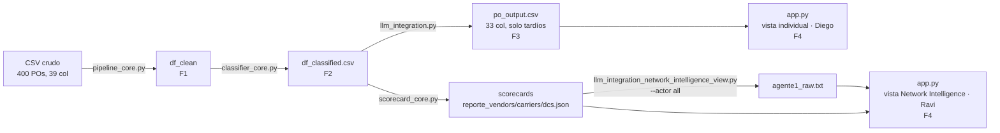

# Explicación del proyecto — PO Delay Root Cause Analyzer

Este documento es la síntesis narrativa del proyecto, organizada por fase y pensada para leerse de corrido: conecta el porqué de cada decisión —registrado en los ADRs— con la lógica que resulta y su implementación en el código. No sustituye a los documentos formales del repositorio, la Especificación de Requisitos de Software (`SRS.md`) y el Documento de Arquitectura de Software (`SAD.md`), que enumeran de forma exhaustiva y auditable qué debe hacer el sistema y cómo está construido; este documento es el punto de entrada narrativo, la referencia con la que el proyecto se explica y se defiende de principio a fin.

## Resumen ejecutivo

El proyecto analiza Purchase Orders (POs) que llegaron tarde a un centro de distribución y responde, para cada uno, tres preguntas: en qué etapa del ciclo de vida se originó el retraso, qué tan grave es, y qué acción concreta lo corrige. El dataset es sintético: 400 POs y 39 columnas, de los cuales 247 resultan tardíos y son la población que el sistema explica.

La tesis que sostiene el método es que los timestamps del ciclo de vida son la fuente de verdad, y no la anotación humana. Cada PO trae un `REASON_DSC` escrito por un operador, pero esa anotación es aproximadamente un 20% incorrecta. El sistema calcula la etapa responsable desde las fechas y la contrasta contra el `REASON_DSC`: cuando difieren, la discrepancia no es un error del método sino evidencia de que el cómputo temporal corrige a la anotación heredada. El objetivo es detectar la razón real del retraso, no reproducir la razón que un operador anotó; es enteramente posible que una anotación previamente aceptada se identifique como equivocada una vez analizada. Esa corrección es el hallazgo central del proyecto.

La solución combina reglas determinísticas y un modelo de lenguaje, con una división de trabajo estricta. Las reglas resuelven toda la aritmética —qué tramo excedió su umbral, cuánto, con qué severidad— y el LLM interpreta ese diagnóstico ya resuelto para redactar la explicación y la acción, sin recalcular ni inventar cifras. El trabajo se organiza en cuatro fases encadenadas por contratos de datos: la Fase 1 limpia el dato y aísla sus anomalías; la Fase 2 clasifica la etapa responsable y asigna severidad; la Fase 3 genera la explicación en lenguaje natural; la Fase 4 presenta los resultados en una aplicación de consumo.

Las cifras que resumen el estado validado del proyecto, todas trazables a la documentación de métricas y validación:

- Reparto de los 247 POs tardíos por etapa responsable: Vendor 53.0% (131), Carrier 16.2% (40), DC 15.0% (37), Indeterminado 15.8% (39).
- Stage accuracy 100% (208/208 evaluables) frente al umbral del mentor de >80%.
- Reason agreement 88.8% (174/196 clasificables): el <100% es esperado y deseado, porque mide dónde el cómputo corrige a la anotación humana.
- LLM Explanation Quality 5/5 (20/20) en el benchmark de calidad.
- Severity ranking 100% (14/14) frente al umbral de >95%.
- Suite de pruebas: 251 tests en verde como gate de merge.

## Fase 1 — Ingesta, calidad de datos y EDA

### Diseño

La decisión que ordena toda la fase es tratar los timestamps del ciclo de vida como la única fuente de verdad, y relegar las columnas precalculadas del CSV de origen (`DELAY_DAYS`, `YARD_WAIT_HRS`, `DOCK_HRS`, `IS_LATE`) a mero cross-check (ADR-01). La evidencia que la respalda es concreta: `DOCK_HRS` discrepa del cómputo real en 11 POs, hasta 8.2 horas, porque el sistema de origen registró inversiones temporales como valores negativos. Si esas columnas gobernaran la lógica, el error se propagaría; usadas solo para auditar, sirven para detectar la anomalía sin heredarla.

La segunda decisión de diseño es no borrar filas. Los registros con fechas inconsistentes o incompletas no se eliminan, se aíslan con flags de calidad. Borrarlos alteraría el volumen estadístico e induciría sesgo; aislarlos preserva la población completa y deja explícito qué registro es confiable para qué cálculo.

### Lógica

El parseo de las columnas de fecha es estricto con recuperación segura: `errors='coerce'` convierte cualquier valor inválido en `NaT` en vez de romper el pipeline. Sobre el dato ya tipado se inyectan tres flags de calidad que no destruyen filas:

- `_ts_issue` marca las 12 órdenes con inversión temporal (`CHECKOUT_DT < CHECKIN_DT`).
- `_trailer_arrive_null` marca las 27 órdenes sin `TRAILER_ARRIVE_DT`.
- `_data_reliable` identifica los 361 registros totalmente limpios sobre los 400.

Las 39 órdenes no confiables son la suma exacta de esos dos grupos —12 inversiones + 27 sin tráiler— sin solapamiento entre ellos, y las métricas baseline se reportan sobre los 361 restantes.

El aislamiento del tráiler nulo importa porque, sin él, el cálculo del tramo de carrier daría `NaN` y la comparación contra el umbral se evaluaría como `False` en silencio: un falso negativo que parecería cumplimiento. La flag explícita permite sacar esas 27 órdenes del denominador en vez de contarlas como si el carrier hubiera cumplido.

El pipeline calcula formalmente los tramos de responsabilidad desde las fechas nativas:

- `lead_time_days`: `PO_DT → STA_DT`, el tiempo de compra.
- `carrier_lag_hrs`: `APPROVED_DT → TRAILER_ARRIVE_DT`, el tránsito del transportista.
- `yard_wait_calc_hrs`: `TRAILER_ARRIVE_DT → CHECKIN_DT`, la estancia en patio.
- `dock_calc_hrs`: `CHECKIN_DT → CHECKOUT_DT`, la descarga en muelle.
- `delay_days_calc`: `RECPT_DT − STA_DT`, el retraso final, acotado a ≥ 0.
- `appt_lead_days`: `STA_DT − APPROVED_DT`, la ventana de reserva de cita.

El acotamiento a ≥ 0 trunca a cero las duraciones físicamente imposibles que producen las 12 inversiones, en vez de propagar tiempos negativos. La columna `TRAILER_DEPART_DT` se excluye formalmente de todo cálculo de tramo: ocurre en promedio ~27 horas después de la recepción en el 99.8% de los casos, es decir fuera del ciclo operativo de recepción.

### Implementación

La lógica vive en `pipeline_core.py`, con dos funciones núcleo. `clean_po_data()` ejecuta en secuencia el parseo de timestamps, la inyección de flags de calidad, el cálculo de los deltas y la asignación de flags de etapa exploratorias. `cross_validate_deltas()` audita los tramos calculados contra las columnas precalculadas y reporta las discrepancias antes de exportar.

El módulo se corre con `python 01_data_pipeline_and_eda/pipeline_core.py`; consume `data/raw/po_root_cause_synthetic.csv` (fuera del control de versiones) y produce el DataFrame limpio que consume la Fase 2. Los umbrales que esta fase inyecta como flags exploratorias (carrier 4h, yard 4h, dock 6h) son preliminares y quedaron superados: la lógica de clasificación de producción se consolida en la Fase 2 con el umbral de carrier de 8h. La cobertura de la fase está en `tests/test_pipeline_core.py`.

## Fase 2 — Clasificación por etapa (reglas de negocio)

### Diseño

Esta fase asigna a cada PO tardío la etapa responsable del retraso y una severidad, y valida ambas contra referencias independientes. La taxonomía y los umbrales se cerraron con el mentor y se afinaron tras una consulta de atribución. Seis decisiones la ordenan:

Se definen cuatro etapas —Vendor, Carrier, DC e Indeterminado (#39)—. Indeterminado es una categoría válida y auditable, no un cajón de descarte: forzar una atribución sin evidencia sería inventar causalidad.

Vendor se mide por STA push (`APPROVED_DT > STA_DT`), no por residual (ADR-03b, que supera a ADR-03a). El residual —restar carrier y DC al retraso total— asume que los tramos son aditivos y mutuamente excluyentes, y en la práctica se solapan. La señal directa es más sólida y, además, funciona en los 27 POs sin hora de tráiler, porque no necesita medir carrier ni DC para existir.

El umbral de carrier es de 8 horas, no de 4 (ADR-04b, que supera a ADR-04a), acompañado de una tabla de sensibilidad. La mediana del gap de carrier ronda las 3 horas y el percentil 75 las 4.4, así que 8 horas produce una proporción de carrier consistente con un dataset de trayectos cortos. Lo que sostiene la elección no es el número en sí, sino su trazabilidad.

La reprogramación de cita y el short-ship se modelan como contexto o agravante, no como etapa (ADR-05). Una reprogramación describe un evento, no una causa raíz; el clasificador responde quién causó el retraso, no qué ocurrió.

Vendor lleva un umbral propio de 24 horas (ADR-06b, que supera a ADR-06a). Corrige una asimetría de construcción: antes vendor disparaba con cualquier push positivo mientras carrier, yard y dock exigían superar su umbral, de modo que vendor absorbía por defecto todo lo que los demás no capturaban.

DC consolida Yard y Dock en una sola etapa, con una subclase `dc_substage` que conserva el detalle. El responsable final es el mismo —las operaciones del centro de distribución—, así que se reporta una etapa y se guarda la distinción como subclasificación informativa.

Anclas de decisión: ADR-01, ADR-02 (jerarquía con múltiples flags activas), ADR-03b, ADR-04b, ADR-05, ADR-06b y ADR-07 (taxonomía de Indeterminado); ADR-08 (`stage_modifiers`) quedó concebido y eliminado.

### Lógica

La etapa primaria se decide por exceso sobre umbral, no por duración bruta. Para cada tramo medible, el exceso es `max(0, observado − umbral)` en horas, con los umbrales del mentor (carrier 8h, yard 4h, dock 6h). Un tramo que no se puede medir aporta 0 al argmax, pero su máscara registra el "no se pudo medir" para no confundirlo con un cero real.

Vendor se incorpora al mismo esquema: su exceso es `max(0, −appt_lead_days × 24 − 24h)`, donde `appt_lead_days = STA − APPROVED` en días. Ese valor es negativo cuando la cita se aprobó después de la fecha prometida, así que el push en horas es positivo, y solo cuenta como exceso por encima de `vendor_gap_hrs = 24h`, igual que los demás tramos tienen el suyo. La etapa primaria es el argmax de {Vendor, Carrier, DC}.

Cuando ningún tramo aplica, el PO cae en Indeterminado, con una subclase que dice por qué: `sin_datos` si el PO es tardío pero no medible (sin `TRAILER_ARRIVE_DT`), o `sin_causa_dominante` si es medible pero ningún tramo supera su umbral. La etiqueta superior es Indeterminado; la razón vive en la subclase.

Los umbrales se leen por nombre desde `rules_config.json`, nunca desde el código; recalibrar es editar el JSON:

| Clave | Valor | Uso |
|-------|-------|-----|
| `vendor_gap_hrs` | 24.0 h | Exceso de vendor (STA push) sobre este umbral |
| `carrier_lag_hrs` | 8.0 h | Exceso de carrier |
| `yard_wait_hrs` | 4.0 h | Exceso de yard |
| `dock_hrs` | 6.0 h | Exceso de dock |
| `short_ship_fill_rate` | 0.9 | Por debajo, short-ship (contexto) |
| `severity_delay_days` | 3.0 d | Gate HIGH de severidad |
| `severity_low_days` | 1.0 d | Corte LOW (borderline) |

La severidad es determinística y auditable, separada de la que luego emite el LLM. Es HIGH cuando el PO es hot y llegó tarde (`HOT_PO_FLAG=1` e `IS_LATE`) y el retraso supera 3 días; LOW cuando el retraso es menor a 1 día (borderline, casi a tiempo); MEDIUM en el resto de los tardíos. Los agravantes `is_short_lead` o `is_short_ship` suben un nivel (LOW→MEDIUM, MEDIUM→HIGH), sin pasar de HIGH: el gate HIGH real sigue siendo hot más retraso fuerte.

El reparto resultante sobre los 247 tardíos es Vendor 131 (53.0%), Carrier 40 (16.2%), DC 37 (15.0%) e Indeterminado 39 (15.8%), donde esos 39 se desglosan en 15 `sin_datos` y 24 `sin_causa_dominante`. La severidad reparte MEDIUM 131, LOW 82 y HIGH 34.

Que Vendor domine con 53% —muy por encima del ~20% que anticipaba el kickoff— lo soporta el dato, no la regla de disparo. La distribución del push es bimodal: 12 POs con push casi nulo (≤6h) y 141 con push de días (mediana 3.1 días), con un hueco vacío entre las 6 y las 18 horas donde no cae ningún PO. Las órdenes tardías lo son casi siempre porque la cita se aprobó tarde. La correlación entre el push y el retraso total es alta por construcción —un retraso temprano se propaga— y por eso no se usa como evidencia de causalidad; lo que atribuye es el exceso por tramo.

Los dos análisis de sensibilidad son la trazabilidad que sostiene los umbrales. El de carrier muestra que mover el umbral cambia mucho la flag bruta pero apenas el reparto de etapas, porque la señal de vendor domina el argmax:

| Umbral carrier | `flag_carrier_calc` | Reparto Vendor / Carrier / DC / Indeterminado |
|--------|-----|-----|
| 4 h | 25.8% (103) | 53.0 / 17.4 / 15.0 / 14.6 |
| 6 h | 12.8% (51) | 53.0 / 16.2 / 15.0 / 15.8 |
| 8 h | 12.8% (51) | 53.0 / 16.2 / 15.0 / 15.8 |
| 12 h | 11.2% (45) | 53.0 / 14.6 / 15.0 / 17.4 |

El de vendor justifica las 24 horas y, sobre todo, muestra que subir el umbral no reatribuye retrasos a otras etapas, solo separa los push difusos:

| Umbral vendor | Vendor | Reparto Vendor / Carrier / DC / sin_datos / sin_causa_dominante |
|--------|-----|-----|
| 0 (sin umbral) | 141 (57.1%) | 141 / 40 / 37 / 15 / 14 |
| 6–18 h | 133 (53.8%) | 133 / 40 / 37 / 15 / 22 |
| 24 h | 131 (53.0%) | 131 / 40 / 37 / 15 / 24 |
| 48 h | 114 (46.2%) | 114 / 40 / 37 / 15 / 41 |
| 72 h | 76 (30.8%) | 76 / 40 / 37 / 15 / 79 |

Se eligen 24 horas por tres razones: es el grano natural del dato, porque `STA_DT` está a nivel de día y medir el push contra un día completo es la unidad en que el problema está expresado; cae en la zona vacía de la distribución, lo que la hace robusta a perturbaciones; y no fuerza el reparto hacia el ~20% del kickoff, que el mentor desaconsejó. Los POs que dejan de ser Vendor al subir el umbral migran todos a `sin_causa_dominante`, ninguno a Carrier ni DC: el umbral no reasigna culpa, solo aísla los push que no alcanzan a ser señal.

El contraste con la anotación humana es la tesis del proyecto. El reason agreement es 88.8% sobre 196 clasificables; los 22 mismatches restantes son la evidencia de que el cómputo temporal supera a la anotación heredada. Se seleccionan ocho casos defendibles que cubren dos patrones. En el patrón estrella, el operador culpó al eslabón visible —carrier o yard— mientras la cita se había aprobado días tarde y ese tramo no tenía exceso alguno. En el patrón interno, el cómputo detecta un exceso de tramo que la anotación confundió. La selección estratificada reparte los ejemplos entre las tres etapas atribuibles en vez de tomar los más fuertes en bruto, que serían casi todos Vendor.

### Implementación

La lógica vive en funciones reusables, no en el notebook, que solo presenta. `classify_po_stages` en `classifier_core.py` orquesta cuatro pasos: `_flags_por_umbral` (#44), `_etapa_primaria` (#45), `_capa_complementaria` (las flags de contexto) y `_severidad` (#48). Las validaciones viven en `metrics_core.py`: `stage_accuracy` (#46), `reason_agreement` (#47), `select_mismatches` y las funciones de sensibilidad y severidad.

El módulo consume el DataFrame limpio de la Fase 1 y produce `data/processed/df_classified.csv`, que no se versiona y se regenera ejecutando el módulo. La cobertura está en `tests/test_classifier_core.py` y `tests/test_metrics_core.py`.

## Fase 3 — Integración LLM

La Fase 3 genera la explicación de causa raíz en lenguaje natural. El proyecto opera dos superficies LLM complementarias: una por PO, que produce el entregable que evalúa el mentor (`po_output.csv`), y una holística por actor, que produce una síntesis ejecutiva de red (`agente1_raw.txt`). Ambas comparten un principio: el cómputo —reglas o estadística— diagnostica, y el LLM interpreta ese diagnóstico ya resuelto.

### Superficie por PO — el entregable evaluado

#### Diseño

El principio rector es que el LLM interpreta, no recalcula (#91, ADR-14). Toda la aritmética llega resuelta desde las fases anteriores y el modelo solo la lee para redactar; el prompt le prohíbe explícitamente recalcular fechas u horas e inventar cifras, y le exige citar textualmente las que se le dan, para que la explicación sea auditable contra los datos.

La severidad es híbrida (ADR-10): el LLM la emite y la regla determinística de la Fase 2 la audita. La severidad oficial del entregable es la del LLM; la de la regla se conserva como línea base de auditoría en el artefacto interno.

El prompt tiene una sola fuente, `build_prompt()` (ADR-12). Un borrador anterior en texto plano se eliminó porque había divergido —una taxonomía de seis etapas que no eran los cuatro estados de la Fase 2, instrucciones que invitaban a calcular, un umbral de severidad contradictorio— y conservarlo arriesgaba que se reutilizara sin contexto. La configuración de producción es few-shot C3, tres ejemplos que enseñan el razonamiento, validada a temperatura 0.9 (ADR-13) sin regresión frente al ancla 0.3. Un bloque de instrucciones llamado CÓMO RAZONAR endurece el prompt contra el overfitting al few-shot (ADR-14): evita que el modelo copie la forma de los ejemplos como plantilla. Los umbrales de severidad que el prompt entrega se interpolan desde `rules_config.json` (#121), la misma fuente única que usa la Fase 2. El manejo de las API keys sigue la política de secretos multi-proveedor (ADR-11): viven solo en `.env`, nunca en el código, la CLI versionada ni los logs.

#### Lógica

El proceso filtra los POs tardíos (`delay_days_calc > 0`) y, para cada uno, arma un prompt por bloques: los DATOS de la PO y sus actores; el TIMELINE de fechas crudas, que el modelo lee para contrastar y no para recalcular; las MÉTRICAS CALCULADAS, con el retraso, los tiempos de yard y dock y el exceso por etapa; la CLASIFICACIÓN AUTOMÁTICA, donde `stage_primary` de la Fase 2 es la fuente de verdad de la etapa y el modelo no la re-decide; y el CONTEXTO ADICIONAL con los agravantes, la reprogramación como dato neutro, la subclase de Indeterminado y el `REASON_DSC`. Cierran dos bloques de instrucciones: uno prohíbe recalcular y exige citar, y CÓMO RAZONAR fija que la etapa la manda la clasificación y que el `REASON_DSC` sirve para contrastar, nunca para sustituir la etapa.

La respuesta es un JSON de cinco claves —`causa_raiz`, `accion_recomendada`, `severidad`, `coincide_con_reason_code`, `confianza`— y su parseo está centralizado en `_parse_llm_json()` para no duplicar lógica entre backends. Hay cuatro: `openai` con `gpt-4o-mini` es el backend oficial del entregable; `local` con Qwen sobre Ollama no gasta API y sirve para desarrollo; `claude` y `deepseek` son alternativas de comparación. El backend local tiene fallback a texto libre si el modelo no devuelve JSON; los cloud esperan JSON válido. La configuración C3 selecciona tres ejemplos de forma determinista, uno por etapa atribuible, con `select_examples(3, ["Vendor","Carrier","DC"])` desde el pool auditado `fewshot_pool.json`. Los ejemplos provienen de mismatches reales de la Fase 2, son disjuntos del benchmark de 20 POs para no contaminar la métrica, y no incluyen el timeline de fechas, porque mostrarlo reenseñaría a recalcular.

Las cifras de esta superficie: LLM Explanation Quality 5/5 (20/20) con C3 a temperatura 0.9 y semilla 42; severity ranking 100% (14/14), medido sobre la severidad del LLM. La divergencia entre la severidad del LLM y la de la regla de la Fase 2 es un hallazgo documentado: coinciden en 213 de 247 (86.2%) y divergen en 34 (13.8%), y esas divergencias siempre escalan —30 casos LOW→MEDIUM y 4 MEDIUM→HIGH—, ninguna desescala.

#### Implementación

La lógica vive en `llm_integration.py`: `build_prompt`, `add_llm_explanations`, `export_deliverable_csv`, `create_backend` y `_parse_llm_json`, con la configuración de inferencia en `llm_config.json` (temperatura 0.9, semilla 42). Los flags `--mode` (test / full / custom), `--backend` y `--zero-shot` controlan la corrida. El módulo consume `df_classified.csv` y produce dos artefactos: el interno `df_with_llm_*.csv`, que lleva la severidad de la Fase 2 junto a la del LLM para auditoría, y el CSV entregable `po_output.csv`. La cobertura está en `tests/test_llm_integration.py` y `tests/test_handoff_f3.py`.

### Superficie holística por actor — síntesis ejecutiva de red

#### Diseño

Esta superficie responde una pregunta directiva única: dónde está la causa raíz del retraso y qué implica operativamente, jerarquizada por zonas de riesgo para cada uno de los tres actores. El problema tiene dos capas que no se resuelven por separado. La primera es quién analiza: un LLM alimentado con POs crudas produce narrativas genéricas, inventa correlaciones e ignora el tamaño de muestra. La segunda es con qué input: alimentarlo solo con POs crudas es entregarle datos sin diagnóstico. La solución no es LLM o estadística, sino un pipeline donde la estadística produce el diagnóstico estructurado —el scorecard, que es el ground truth numérico— y el LLM lo interpreta como analista.

La arquitectura es de tres agentes especializados en secuencia, uno por actor, cada uno con su `ACTOR_CONFIG` de umbrales orientativos, archivos y título. Se descartó el agente monolítico, porque los umbrales de salud operativa difieren por actor y mezclarlos fuerza a promediar criterios, y se descartó entregar POs crudas como input, porque el modelo heredaría y amplificaría sus sesgos. El prompt separa lo que el modelo debe pensar —una metodología de ocho pasos y guías internas marcadas como "no mencionar"— de lo que debe escribir: viñetas ejecutivas con acciones concretas de tiempo, responsable y modo. La salida se fuerza a un esquema Pydantic (`ReporteEspecialista` con bloques `AnalisisBloqueRiesgo`) para que el frontend la parsee sin ambigüedad, y la homogeneidad se trata como hallazgo: si todas las entidades son prácticamente iguales, ese es el hallazgo principal, no algo que forzar a diferenciar. La inferencia usa `temperature=0.1` y `max_tokens=1200` para minimizar variabilidad y forzar síntesis. Anclas: ADR-19, que entrega la parte de síntesis ejecutiva por actor del carril 3 de ADR-16 —el Q&A conversacional y el carril 2 agéntico siguen abiertos—, además de ADR-10 y ADR-09.

#### Lógica

`scorecard_core.py` produce, por cada entidad, un `reporte_{vendors,carriers,dcs}.json` con métricas robustecidas estadísticamente: tamaños de muestra explícitos (`n_POs_total`, `n_POs_causa_raiz`), credibilidad cuantificada por puntajes Z y un `Score_Riesgo_Normalizado`. Eso permite no comparar en crudo a un vendor con 3 POs contra uno con 300. Cada agente consume su scorecard, no las POs, emite al menos un bloque de riesgo (Alto, Medio o Bajo, sin tope fijo) y `construir_segmento_texto` traduce el Pydantic a texto; los tres segmentos se acumulan y se consolidan en `agente1_raw.txt` cuando se invoca con `--actor all`. La reproducibilidad es asimétrica: el scorecard es byte-idéntico entre corridas porque su fecha se deriva del dato y no de la ejecución, mientras que la narrativa del LLM es estable en tono por la temperatura baja pero no está anclada con semilla, una deuda menor registrada en ADR-19.

#### Implementación

`scorecard_core.py` toma `df_classified.csv` y un directorio de salida; `llm_integration_network_intelligence_view.py`, invocado con `--actor all`, corre los tres agentes y consolida el resultado. La cadena es `df_classified.csv → scorecards JSON → agente1_raw.txt`.

### Diagnóstico diferencial tier-2

Bajo el flag `--action-call` (ARD-16, carril 1), cada PO recibe una segunda llamada con `build_action_prompt()`: un rol de planner con autoridad de decisión que produce un contrato híbrido —razonamiento, hipótesis principal con su plan escalonado de acción inmediata, correctiva y preventiva, hipótesis alternativa con su paso discriminante, y una segunda confianza— y pasa por un control de calidad por reglas. La primera llamada diagnostica al nivel de etapa; esta planifica el mecanismo por debajo de ese nivel. Puebla las nueve columnas tier-2 de `po_output.csv`; sin el flag, esas columnas salen vacías, no ausentes, de modo que el contrato de columnas es estable con o sin él. El contrato completo se formaliza en ARD-21.

## Fase 4 — App (demo + evaluación final)

### Diseño

La Fase 4 presenta los resultados y no produce análisis nuevo: lee el artefacto de la Fase 3 y lo muestra. La aplicación es Streamlit y toda la lógica de limpieza, clasificación y explicación ya ocurrió aguas arriba.

El diseño se organiza por modo de consumo, no por entidad de la cadena (ADR-09). Se definen dos personas: Diego, que consulta un PO individual, y Ravi, que revisa el portafolio por lote. Esa elección responde a que un mismo dato se usa de dos maneras distintas —diagnóstico puntual frente a lectura ejecutiva agregada—, y organizar la app por persona en vez de por vendor/carrier/DC evita duplicar la misma entidad en tres pantallas.

La regla que sostiene la arquitectura es que la app lee, no recomputa (contrato F3→F4, #100). No recalcula las reglas de la Fase 1 o 2 ni vuelve a llamar al LLM; si una vista necesita un dato que el CSV no trae, se amplía el contrato en la Fase 3, no se recomputa en la app. El lenguaje visual y la codificación de color de la taxonomía siguen la paleta Okabe-Ito con tema claro y oscuro (ADR-17). Anclas: ADR-09, ADR-17, ADR-21 (el contrato de datos), ADR-19 (la vista de red) y ADR-20 (el bot de Telegram, en roadmap).

### Lógica

El contrato F3→F4 es `po_output.csv` con 33 columnas, solo para POs tardíos, partido en tres bloques (ADR-21): un contrato base de 16 columnas —identidad y diagnóstico del mentor, timeline, agravantes y concordancia con la anotación humana—, un tier-1 de 8 columnas con enriquecimiento ya computado aguas arriba (confianza, entidades responsables, exceso de horas por etapa) y un tier-2 de 9 columnas con el diagnóstico diferencial de ARD-16. El tier-2 se puebla solo con `--action-call`, pero las 33 columnas existen siempre, con o sin el flag.

La vista individual de Diego consume la prosa por PO de `po_output.csv`: el timeline, la etapa responsable, la explicación y la acción del LLM, la severidad y la concordancia con el `REASON_DSC`. La vista agregada de Ravi, la de Network Intelligence, consume dos artefactos distintos de esa prosa por PO: los scorecards JSON, que son los agregados numéricos por entidad, y la narrativa ejecutiva `agente1_raw.txt`, la síntesis por actor de la superficie holística. Ambos se generan offline, son regenerables y quedan fuera del contrato del mentor y del control de versiones.

### Implementación

La app se lanza con `streamlit run 04_app/app.py` y organiza sus dos superficies en páginas: la vista individual (#163) y la de Network Intelligence (#164). `config.py` centraliza las columnas canónicas del contrato y la codificación de color de la taxonomía (ADR-17), y `styles.css` el tema visual. La app consume `po_output.csv`, los `scorecards/reporte_*.json` y `agente1_raw.txt`, todos producidos aguas arriba. La cobertura está en `tests/test_handoff_f3.py`, que blinda el contrato de columnas, y `tests/test_app_smoke.py`.

## Contrato de datos end-to-end

La cadena completa de datos, de la fuente cruda al consumo final:

Cada frontera entre fases es un contrato, no un supuesto: el CSV que produce una fase es funcionalmente idéntico al DataFrame que esa fase deja en memoria, de modo que la siguiente fase lo relee y reconstruye el mismo estado que tendría si la cadena corriera de una sola vez. La identidad es funcional, no de tipado —un CSV escribe las fechas como texto—, así que el contrato se cumple cuando el valor es el mismo, no cuando el dtype coincide. Esto cubre las dos fronteras principales, F1→F2 y F2→F3.

Un caso límite de esa regla de oro es el centinela `"Ninguno"`. La columna `stage_multi` usa `"Ninguno"` para los POs sin etapa secundaria, y no el literal `"None"` ni la cadena vacía, porque ambos se leen desde el CSV como NaN: F3 perdería la señal de "no hay segunda etapa" y la confundiría con un dato ausente. `"Ninguno"` es un valor real que sobrevive intacto el round-trip.

El contrato F3→F4 (`po_output.csv`, ADR-21) tiene 33 columnas y alcanza solo POs tardíos (`delay_days_calc > 0`): un bloque base de 16 (identidad y diagnóstico del mentor, timeline, agravantes, concordancia con la anotación humana), un tier-1 de 8 (enriquecimiento ya computado) y un tier-2 de 9 (diagnóstico diferencial, poblado solo con `--action-call`, pero presente siempre como columna). `agente1_raw.txt` es un artefacto derivado paralelo: comparte linaje de la Fase 3 pero no es parte de `po_output.csv` —lo produce la superficie holística a partir de los scorecards, no del CSV— y su contenido es texto narrativo por actor, no columnas tabulares.

La regla que gobierna todo el tramo F3→F4 es que la app lee y no recomputa: no vuelve a correr las reglas de F1/F2 ni llama de nuevo al LLM. Todo lo que cada vista necesita ya está en los artefactos que consume.

## Validación y calidad

El proyecto garantiza sus resultados en cuatro capas, cada una con su propio qué garantiza, qué rompe si falla y cómo se reproduce. El detalle completo del método vive en `documentation/validacion-y-qa.md`; aquí se cita su tabla canónica, no se recalcula.

**Capa A — tests unitarios por fase.** Cada función del pipeline se prueba aislada, con fixtures sintéticos de valor esperado conocido: `test_pipeline_core.py` para la limpieza, `test_classifier_core.py` para la etapa y la severidad, `test_metrics_core.py` para las métricas de validación, `test_llm_integration.py` para la construcción del prompt y el parseo sin tocar la red. Si falla, una regresión llega a main sin que nadie lo note.

**Capa B — contrato de handoff entre fases.** `test_handoff_contract.py` verifica la regla de oro descrita arriba en las dos fronteras F1→F2 y F2→F3. Si falla, correr las fases por separado daría un resultado distinto a correrlas juntas.

**Capa C — métricas de clasificación contra umbrales.** Las cifras cabecera se calculan desde los timestamps, nunca desde la anotación humana, y se contrastan contra los umbrales de aceptación del mentor:

| Métrica | Valor | Umbral mentor | Denominador |
|---|---|:--:|---|
| Stage accuracy | 100% (208/208) | > 80% | 208 evaluables (247 tardíos − 39 Indeterminados sin gap medible) |
| Reason agreement | 88.8% (174/196) | referencia, no umbral | 196 clasificables (tardíos con anotación humana no nula) |
| Severity ranking | 100% (14/14) | > 95% | 14 hot-late, sobre `po_output.csv` (severidad = LLM) |

Stage accuracy compara la etapa por exceso sobre umbral contra el gap dominante —el tramo de mayor duración bruta—: valida que la atribución no se aleje de dónde físicamente se fue el tiempo, sin forzar que coincidan por construcción. Reason agreement, como se estableció en la Fase 2, tiene su <100% esperado y deseado: mide dónde el cómputo corrige a la anotación humana, no dónde falla el método.

**Capa D — CI como gate de merge.** El workflow corre en cada PR y en cada push a main un smoke de import de los tres módulos núcleo seguido de la suite completa. El equipo mergea sin revisión humana bloqueante, así que el gate de merge es el check en verde.

Las cifras ancla que un revisor obtiene en entorno limpio: suite de pruebas en 251 (creció de 57 a 251 con cada fase); stage accuracy 100% (208/208); reason agreement 88.8% (174/196); severity ranking 100% (14/14); LLM Explanation Quality 5/5 (20/20); divergencia de severidad LLM vs regla 213/247 (86.2%) coinciden, 34/247 (13.8%) divergen —siempre escalando—.

La validación cubre también los casos límite donde el dato es parcial o anómalo. De los 27 POs sin `TRAILER_ARRIVE_DT`, la regla de vendor por STA push rescata 12 —porque mide la aprobación tardía sin necesitar el tráiler—, y los 15 restantes quedan como `sin_datos`. De las 12 inversiones temporales, el pipeline trunca el tramo afectado a cero en vez de propagar una duración negativa. Y la cifra 39 aparece en dos poblaciones distintas que no deben confundirse: en F1 son 39 POs no confiables (12 inversiones + 27 sin tráiler, sobre 400); en F2 son 39 POs Indeterminado (15 `sin_datos` + 24 `sin_causa_dominante`, sobre 247 tardíos). Coinciden en número, no en conjunto.

## Mapa de trazabilidad

| Fase | Decisiones (ADR/ARD) | Issues clave | Tests |
|---|---|---|---|
| F1 — Pipeline y calidad | ADR-01 | #4, #15, #16, #18 | `test_pipeline_core.py` |
| F2 — Clasificación | ADR-01, ADR-02, ADR-03a▷ADR-03b, ADR-04a▷ADR-04b, ADR-05, ADR-06a▷ADR-06b, ADR-07, ADR-08 (superado) | #39, #40, #41, #42, #44, #45, #46, #47, #48, #49 | `test_classifier_core.py`, `test_metrics_core.py` |
| F3 — LLM por PO | ADR-10, ADR-11, ADR-12, ADR-13, ADR-14, ADR-15 (superado por ADR-16) | #67, #91, #94, #99, #121, #135, #137, #143, #144, #151 | `test_llm_integration.py`, `test_handoff_f3.py` |
| F3 — Holística / red | ADR-16 (borrador, carril 3), ADR-19 | — | — |
| F3 — Tier-2 (acción) | ADR-16 (carril 1), ARD-21 | #158, #161 | — |
| F4 — App | ADR-09, ADR-17, ADR-20 (borrador), ADR-21 | #100, #102, #103, #158, #161, #162, #163, #164, #174, #175, #176, #186, #187 | `test_handoff_f3.py`, `test_app_smoke.py` |

Las decisiones superadas (marcadas ▷) no se editan ni se borran: se encadenan hacia la vigente que las reemplaza, conforme al estándar MADR adoptado por el equipo. El registro completo, con estado y enlaces de contexto por decisión, vive en `documentation/decisiones/README.md`.

## Trabajo abierto / roadmap

Lo descrito arriba es el estado enviado y validado. Queda, aparte, trabajo en borrador o diferido, que se documenta por separado para no mezclarlo con lo producido:

ADR-16, carril 2 (agéntico) y Q&A conversacional del carril 3, siguen abiertos. La síntesis ejecutiva por actor del carril 3 ya la entrega ADR-19, pero el Q&A conversacional sobre el dataset no está resuelto.

El chatbot conversacional (#160) queda diferido, distinto del bot de Telegram (ADR-20), que es un canal adicional de consumo del contrato ya existente, no una nueva superficie analítica.

ADR-20, el bot de Telegram, está en borrador: canal adicional de consumo de `po_output.csv`, pendiente de cerrar formalmente.

ADR-18, idioma fuente canónico y convención de nombres para documentación bilingüe, está en borrador; gobierna la traducción ES→EN de los entregables, que queda fuera de este documento.

Queda además una deuda menor registrada en ADR-19: la narrativa de la superficie holística no está anclada con semilla (a diferencia de la superficie por PO, que sí usa `seed=42`), una segunda tabla comparativa de umbrales entre los tres actores diluye parcialmente el aislamiento que la arquitectura reclama, y hay una inconsistencia de vocabulario entre dos campos del mismo esquema Pydantic (`bloques` describe "Crítico, Medio o Bajo" mientras `nivel_riesgo` exige "Alto, Medio o Bajo"). Ninguna de las tres bloquea el resultado; quedan registradas como mejoras de código fuera del alcance de este documento.

### Consistencia documental con SRS y SAD

Al cerrar este documento se revisó su relación con las dos especificaciones formales del repositorio, y se corrigieron dos afirmaciones que habían quedado desactualizadas. El SAD describía `llm_integration_network_intelligence_view.py` como un componente experimental sin referencias desde el resto del código; en realidad genera `agente1_raw.txt`, consumido en producción por la vista Network Intelligence (ADR-19, ARD-21), y la descripción se corrigió para reflejar esa dependencia real. El SRS y el README raíz citaban 4.75/5 como cifra de LLM Explanation Quality —el resultado del benchmark que seleccionó la configuración C3, no la cifra titular del entregable—; se actualizó a 5/5 (20/20), la cifra vigente tras la revalidación a temperatura de producción. Por separado, `documentation/validacion-y-qa.md` citaba un conteo de tests desactualizado; se sincronizó también.
