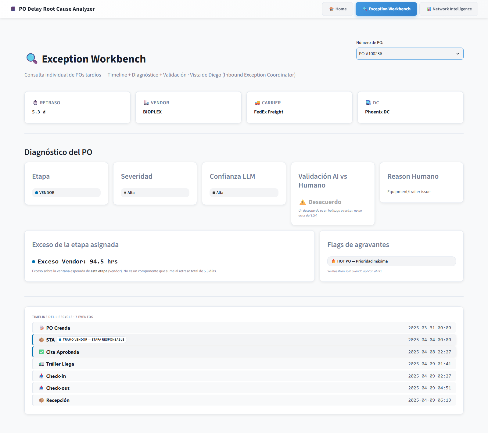
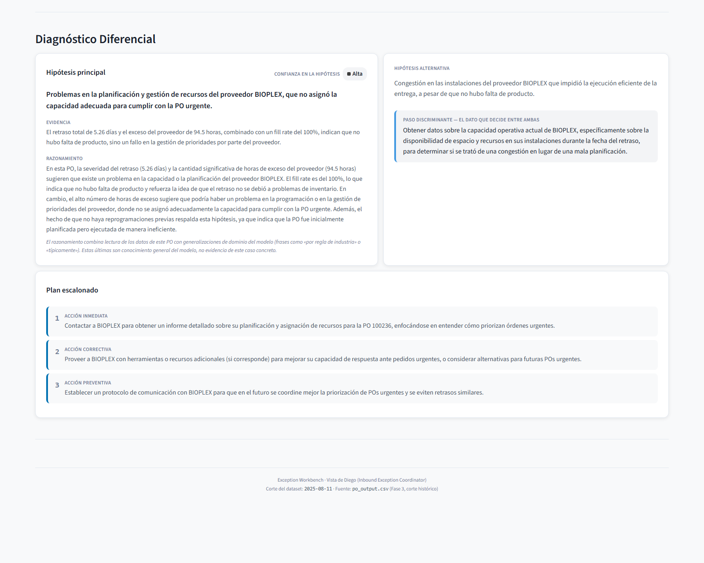
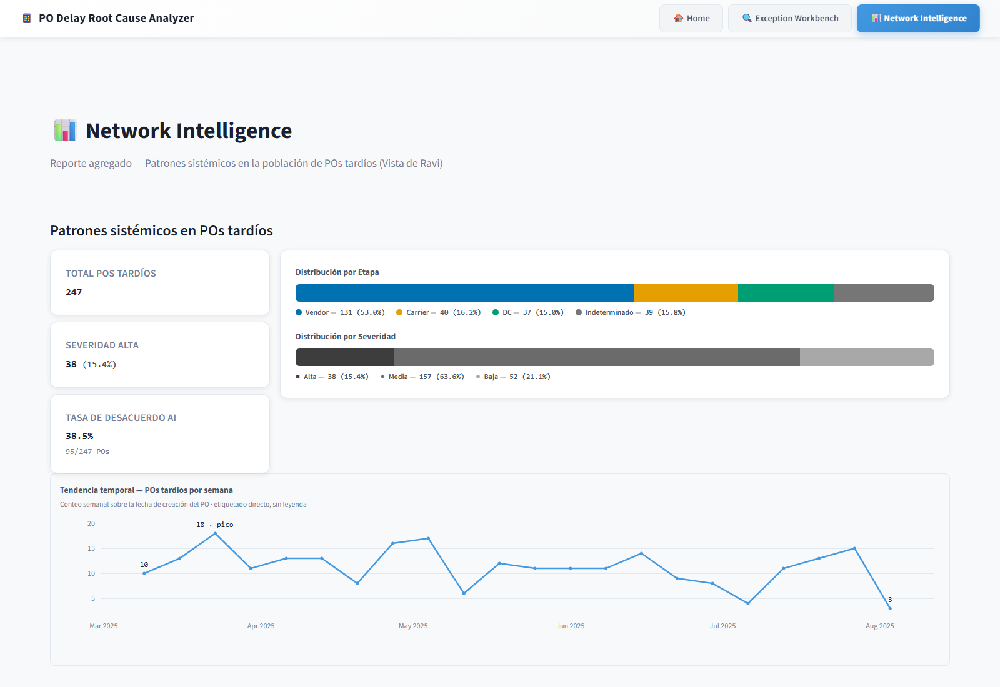
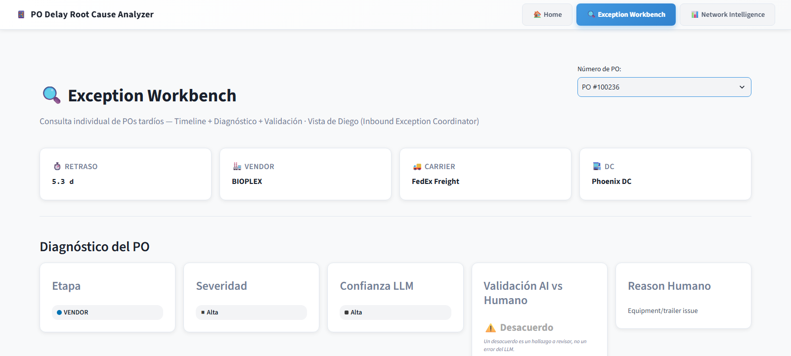

# Presentación final — outline y guion (ES)

Este documento es la fuente de contenido para la presentación final del colloquium
(entregable [1] del mentor, issue #106). No es un archivo `.pptx`: es el outline slide por
slide —título, contenido y notas del orador— a partir del cual se arman las slides en
PowerPoint. Extiende `documentation/PO_Delay_Analyzer_v1.pptx` (commit `abe35e2`, 9 slides,
solo español): conserva su esqueleto y su enfoque ejecutivo, y agrega lo que faltaba contra
la rúbrica de evaluación y el requisito de demo del mentor. La versión en inglés derivada es
`presentacion-final.en.md`; el guion de demo vive aparte en `guion-demo.md` /
`guion-demo.en.md`.

Cada cifra citada abajo traza a un artefacto ya versionado —
`documentation/explicacion-proyecto.md`, `documentation/metricas-proyecto.md`,
`documentation/validacion-y-qa.md`, `documentation/hallazgos-ai-vs-humano.md`,
`03_llm_integration/mismatches_ai_vs_humano.md`— o al CSV real del entregable
(`data/processed/po_output.csv`). Ninguna cifra se recalcula ni se inventa aquí.

## Auditoría de v1 contra la rúbrica y el requisito de demo

v1 tiene 9 slides: Portada, Agenda, Resumen, Problemática, Solución (arquitectura
desacoplada), Vista Diego, Vista Ravi, Integración Telegram, Conclusiones. No trae notas de
orador. Cita una sola cifra de validación —"tasa de acuerdo del 88%"— en la slide de
Conclusiones.

| Criterio (peso) | Cobertura en v1 |
|---|---|
| Data Ingestion & Pipeline Quality (10%) | Ausente. Ninguna mención del volumen del dataset (400 POs, 39 columnas), la limpieza, las flags de calidad ni el cross-validation. |
| Delay Taxonomy & Rule-Based Classification (20%, el de mayor peso) | Débil. La slide de Problemática nombra el síntoma (~20% de inconsistencia humana) pero no explica las cuatro etapas, los umbrales ni el reparto resultante. El criterio de mayor peso es el peor cubierto. |
| LLM Integration & Prompt Engineering (10%) | Parcial. La slide de Solución resume en una frase que "el LLM interpreta el diagnóstico"; no hay mención de few-shot, temperatura ni el esquema de salida. |
| Explanation & Recommendation Quality (10%) | Parcial. La slide de Vista Diego describe causa raíz y acción de forma cualitativa; falta la cifra del benchmark de calidad (5/5, 20/20). |
| Validation & Analytical Rigor (10%) | Débil. Solo aparece reason agreement (88%); faltan las otras dos métricas que sí superan su umbral —stage accuracy 100% contra >80%, severity ranking 100% contra >95%—. |
| Demo / Application Usability (10%) | Ausente. Las slides de Vista Diego y Vista Ravi describen las pantallas de forma estática; no existe un guion de "seleccionar un PO y ver la explicación en vivo", que es el mandato literal del kickoff (slide 10 de `kickoff_po_root_cause.html`: "Slides + demo: seleccionar un PO delayed y ver la explicación del AI en vivo"). |
| Business Relevance & Stakeholder Insight (5%) | Cubierto. Las slides de Vista Diego y Vista Ravi mapean a los dos perfiles de uso, aunque no nombran el ejercicio formal de user personas que las sustenta. |
| Communication & Documentation (10%) | Débil. El deck es monolingüe (la rúbrica pide audiencia mixta); no referencia la documentación formal ya versionada (SRS, SAD, ADRs). |
| Collaboration & Professionalism (10%) | No aplica a contenido de slides. Este criterio se evalúa por el proceso y el comportamiento del equipo, no por el contenido del deck; ninguna slide adicional lo cubre, y se deja constancia de eso en vez de simular cobertura. |
| Innovation & Insight (5%) | Cubierto. La slide de Problemática reclama la auditoría cognitiva con LLM como la innovación, y Conclusiones cierra con "decisiones basadas en datos, no en percepciones". La tesis central del proyecto —que el cómputo corrige a la anotación humana— aparece, pero en una sola frase. |

## Elección del caso de demo: PO #100236

El guion de demo (`guion-demo.md`) necesita un PO concreto que muestre un mismatch entre el
cómputo y la anotación humana —lo pide explícitamente el DoD de #106 ("un caso de mismatch
que luzca la tesis")—. En vez de elegir un PO nuevo sin revisar, se reutiliza uno de los ocho
mismatches ya narrados y versionados en `03_llm_integration/mismatches_ai_vs_humano.md`
(insumo de `documentation/hallazgos-ai-vs-humano.md`, la evidencia central de la tesis del
proyecto).

PO #100236: la etapa computada es Vendor (BIOPLEX), con un exceso de 94.5 horas sobre el
umbral de aprobación tardía. El `REASON_DSC` que anotó el staff del DC es "Equipment/trailer
issue" —culpa al eslabón visible—, mientras la aprobación de la cita ya llegaba tarde desde
antes. Es uno de los tres casos Vendor del patrón "eslabón visible" documentado como evidencia
central de la tesis. Además: `HOT_PO_FLAG=1`, severidad HIGH, confianza del LLM 0.85, y
diagnóstico diferencial (tier-2) completo en el CSV real —hipótesis, evidencia, hipótesis
alterna, paso discriminante y plan de tres pasos—, verificado sin gastar API contra
`data/processed/po_output.csv`. Aparece además en la tabla "POs con Desacuerdo AI vs Humano"
de la vista Ravi, lo que permite un demo de un solo flujo (Ravi → drill-down → Diego) sin
clicks perdidos. El detalle paso a paso está en `guion-demo.md`.

Reutilizar un caso ya narrado en vez de introducir uno nuevo mantiene consistente la
evidencia entre los hallazgos, los mismatches documentados y la demo en vivo.

## Nota sobre las dos cifras de "desacuerdo" (no confundir en el guion)

El proyecto reporta dos cifras distintas bajo la idea de "desacuerdo con el humano", y la
presentación y el guion de demo las citan por separado para no confundirlas:

- **Reason agreement (la cifra canónica, con umbral del mentor):** 88.8% (174/196). La
  calcula `metrics_core.py` en la Fase 2 comparando `stage_primary` (el cómputo) contra
  `reason_group_manual` (una agrupación curada de `REASON_DSC`). Es la cifra que cita la
  slide de Validación y Métricas.
- **La KPI "Tasa de Desacuerdo AI" que se ve en vivo en la vista Ravi:** hoy 38.5% (95/247,
  verificado contra el CSV real). Es `llm_coincide_con_reason`, un juicio binario que el
  propio LLM emite por PO al redactar su explicación —uno de los cinco campos del JSON que
  produce la Fase 3—, no el mismo cálculo que el anterior. Está correlacionada con la cifra
  canónica, pero no es intercambiable con ella.

La slide de Validación y Métricas cita solo la primera. El guion de demo, al pasar por la KPI
de Ravi, aclara en una frase que la cifra en pantalla mide algo relacionado pero distinto.

## Outline de slides

Convención: **[conserva]** = contenido de v1 sin cambio de fondo · **[enriquece]** = slide de
v1 con contenido añadido · **[nueva]**. Los bullets son el contenido a llevar a la slide; las
notas del orador son contexto para quien presenta, no van en pantalla.

### 1. Portada — [conserva]

Sin cambio: "PO Delay Root Cause Analyzer / Un enfoque Ejecutivo".

Notas del orador: encuadre de apertura — quién presenta, en qué evaluación se enmarca esta
presentación (colloquium, entregable [1] del mentor, issue #106) y duración esperada. Es el
único momento para fijar el tono ejecutivo antes de entrar a la auditoría técnica.

### 2. Agenda — [enriquece]

1. Resumen
2. Fase 1 — Pipeline de datos y calidad (técnico)
3. Problemática
4. Solución: arquitectura desacoplada
5. Fase 3 — Integración LLM (técnico)
6. Taxonomía y reglas de clasificación
7. Fase 2 — Motor de clasificación (técnico)
8. Vista Diego: gestión individual de excepciones
9. Vista Ravi: inteligencia de red
10. Fase 4 — Arquitectura de la aplicación (técnico)
11. Demo en vivo
12. Integración Telegram
13. Validación y métricas
14. Conclusiones
15. Roadmap / Trabajo futuro

Notas del orador: los 15 puntos cubren los 10 criterios de la rúbrica (ver Apéndice) más el
cierre de roadmap; las cuatro slides marcadas "(técnico)" son la respuesta directa a que el
criterio de mayor peso —Delay Taxonomy & Rule-Based Classification, 20%— llegaba débil en v1:
cada fase del pipeline recibe ahora su propia evidencia técnica, no solo la narrativa
ejecutiva.

### 3. Resumen del Proyecto — [enriquece]

- El PO Delay Root Cause Analyzer es un sistema de auditoría retrospectiva que identifica,
  clasifica y explica retrasos en órdenes de compra (PO).
- Dataset: 400 POs, 39 columnas; 247 resultan tardíos y son la población que el sistema
  explica.
- Los timestamps del ciclo de vida son la fuente de verdad, no la anotación humana
  (`REASON_DSC`): el mentor reporta que esa anotación es ~20% incorrecta.
- Calidad de datos sin borrar filas: 361 POs completamente confiables y 39 aislados con flags
  (12 inversiones temporales + 27 sin hora de tráiler).

Notas del orador: el punto de la fuente de verdad es la tesis que sostiene todo el proyecto;
vale la pena decirlo despacio aquí porque el resto de la presentación lo da por establecido.

Fuente: `documentation/explicacion-proyecto.md` (Resumen ejecutivo, Fase 1).

### 4. Fase 1 — Pipeline de Datos y Calidad (técnico) — [nueva]

- Fuente de verdad: los indicadores se recalculan dinámicamente desde los timestamps de
  auditoría (`*_calc`), nunca desde las flags `precalc` que trae el origen — trazabilidad
  end-to-end en vez de una caja negra sujeta a cambios de lógica aguas arriba.
- Jerarquía cuando varios tramos muestran delay a la vez: el tramo primario se asigna por
  `argmax` (mayor exceso en horas sobre su propio umbral), no por una prioridad fija
  arbitraria; el resto de tramos activos queda en un vector multi-causa complementario, sin
  perderse.
- Regla "Late Shipment" del README original del mentor, descartada formalmente: la columna
  `VENDOR_SHIP_DT` no existe en las 39 columnas reales del dataset, y el proxy de lead-time
  probado (`STA_DT − PO_DT < 3 días`) no discrimina (0% de disparo sobre el dataset real). La
  señal de Vendor queda cubierta por STA Push, que no depende de ninguna de las dos.

Notas del orador: este es el punto exacto donde un panelista puede preguntar "¿por qué no
usan la regla del README original?" — la respuesta ya está aquí, con las dos razones
independientes del descarte, no hace falta improvisar.

Fuente: `documentation/decisiones/ARD-01.md`, `ARD-02.md`, `ARD-24.md`.

### 5. Problemática — [conserva]

Sin cambio: quién tiene la culpa y qué implica operativamente; datos con ruido (~20% de
inconsistencia humana); las IA sobre datos crudos generan narrativas genéricas.

Notas del orador: la inconsistencia humana (~20%) es el gancho que justifica todo el
proyecto — es la brecha que la fuente de verdad por timestamps (Fase 1, slide anterior) viene
a cerrar. Conectar ambas slides en el discurso, aunque no compartan contenido en pantalla.

### 6. Solución: Arquitectura Desacoplada — [enriquece]

- Arquitectura de 4 fases que separa la estadística del análisis narrativo: la estadística
  establece el "ground truth" numérico; el LLM actúa como el analista que interpreta el
  diagnóstico.
- El LLM interpreta, no recalcula: el prompt prohíbe recalcular fechas u horas e inventar
  cifras, y exige citar textualmente las que se le entregan.
- Configuración de producción: few-shot con 3 ejemplos (uno por etapa atribuible: Vendor,
  Carrier, DC), temperatura 0.9, backend oficial `gpt-4o-mini`.
- Salida estructurada: JSON de 5 claves (causa raíz, acción recomendada, severidad, si
  coincide con el reason code, confianza).

Notas del orador: enfatizar la división de trabajo —las reglas hacen toda la aritmética, el
LLM solo redacta sobre el diagnóstico ya resuelto— porque es lo que hace auditable la
explicación.

Fuente: `documentation/explicacion-proyecto.md` (Fase 3, Superficie por PO).

### 7. Fase 3 — Integración LLM (técnico) — [nueva]

- Diseño del prompt few-shot: combinación C3 (un ejemplo por etapa atribuible — Vendor,
  Carrier, DC), endurecido después contra el sobreajuste a la plantilla — bloque "HOW TO
  REASON" que enseña la combinatoria del dominio, autoridad del `stage_primary` sobre el
  `REASON_DSC` (nunca al revés, ni siquiera cuando el reason nombra una etapa), y exceso por
  etapa mostrado solo cuando hay etapa atribuida.
- Temperatura de inferencia: barrido 0.3 → 0.9 en dos rondas. La primera ronda (prompt sin
  endurecer) no mostró sensibilidad medible a la temperatura — el problema era de diseño del
  prompt, no de muestreo. Tras el endurecimiento, la diversidad de las acciones subió de
  forma monótona (0.312 → 0.567 en el subconjunto Vendor); **0.9** se fija como valor de
  producción.
- Manejo de secretos: las API keys viven solo en `.env` (nunca en código ni en CLI
  versionado), con backend configurable multi-proveedor (`llm_integration.py` soporta
  OpenAI, Claude, DeepSeek).
- Salida estructurada: JSON de 5 claves (causa raíz, acción recomendada, severidad, si
  coincide con el reason code, confianza) — el mismo esquema que consume la Fase 4.

Notas del orador: esta es la slide para defender por qué el LLM "no alucina" ante un
panelista escéptico — el diseño del prompt y la medición de temperatura son evidencia
reproducible, no una promesa. Si preguntan por qué 0.9 y no un valor más conservador, la
respuesta está en la tabla de diversidad del ARD-13.

Fuente: `documentation/decisiones/ARD-11.md`, `ARD-12.md`, `ARD-13.md`, `ARD-14.md`.

### 8. Taxonomía y Reglas de Clasificación — [nueva]

- Cuatro etapas responsables: Vendor, Carrier, DC, Indeterminado.
- La etapa se decide por exceso sobre una ventana esperada, no por duración bruta: vendor 24h
  (aprobación tardía de la cita), carrier 8h, yard 4h, dock 6h. Los umbrales están respaldados
  por un análisis de sensibilidad, no elegidos a mano.
- Reparto resultante sobre los 247 tardíos: Vendor 53.0% (131), Carrier 16.2% (40), DC 15.0%
  (37), Indeterminado 15.8% (39). Indeterminado se desglosa en 15 sin datos (sin hora de
  tráiler) y 24 sin causa dominante (medibles, pero ningún tramo excede su umbral).
- Severidad determinística: HIGH si el PO es urgente ("hot") y el retraso supera 3 días; LOW
  si el retraso es menor a 1 día (borderline); MEDIUM en el resto. Reparto: MEDIUM 131, LOW
  82, HIGH 34.

Notas del orador: el punto de "no elegido a mano" es defendible con la tabla de sensibilidad
de `02_clasif_reglas_negocio/README.md` si un panelista pregunta por qué 24h y no otro
número.

Fuente: `documentation/explicacion-proyecto.md` (Fase 2).

### 9. Fase 2 — Motor de Clasificación (técnico) — [nueva]

- Medición de Vendor por señal directa STA Push (`APPROVED_DT > STA_DT`), no por residuo
  operacional: la señal cubre el 100% del dataset, incluidos los 27 PO sin registro de
  tráiler, que un modelo por residuo no podía resolver.
- Taxonomía de Indeterminado: sub-categoría `indeterminado_substage` con dos criterios
  mutuamente excluyentes — `sin_datos` (15 PO, falta un dato atómico en el origen) vs.
  `sin_causa_dominante` (24 PO, datos completos pero ningún tramo excede su umbral) —
  decisión explícita del mentor (Ronda 2, 2026-06-18) para no forzar una atribución por
  eliminación.

Notas del orador: enfatizar que "Indeterminado" no es un cajón de errores del sistema — cada
PO ahí adentro tiene una razón auditable y distinta, documentada en el propio dato
(`indeterminado_substage`).

Fuente: `documentation/decisiones/ARD-03b.md`, `ARD-07.md`.

### 10. Vista Diego: Exception Workbench — [enriquece]

- Enfoque: gestión individual de POs tardíos, caso por caso.
- Flujo real: se busca el PO por número (dropdown filtrable); arriba, las tarjetas de
  identidad (retraso, vendor, carrier, DC) y de diagnóstico (etapa, severidad, confianza,
  validación contra el humano); debajo, el timeline del ciclo de vida (7 eventos) con el
  tramo responsable resaltado.
- Causa raíz redactada por el LLM (hipótesis principal, evidencia, razonamiento), con acción
  recomendada en un plan de tres pasos (inmediata, correctiva, preventiva).
- Flag de validación contra el `REASON_DSC` humano, prominente: un desacuerdo es un hallazgo
  a revisar, no un error del LLM.
- Panel de diagnóstico diferencial (tier-2): hipótesis alternativa y el paso discriminante —
  el dato concreto que decidiría entre ambas hipótesis si alguien lo fuera a levantar.
- Calidad de la explicación: 5/5 (20/20) en el benchmark de evaluación humana, contra un
  umbral del mentor de 4/5.

Notas del orador: esta es la vista que se usa en la demo en vivo (slide 11); no hace falta
detenerse mucho aquí en texto porque se va a mostrar funcionando. El paso discriminante del
panel diferencial es un buen gancho si un panelista pregunta "¿y ahora qué hace alguien con
esto?" — la respuesta es literalmente ese campo.

Fuente: `documentation/user_personas.md` (Persona A — Diego); `documentation/metricas-proyecto.md`.

### 11. Vista Ravi: Network Intelligence — [enriquece]

- Enfoque: análisis agregado de la población completa de POs tardíos, por patrón sistémico.
- Flujo real: se entra viendo el reparto por etapa y por severidad y la tendencia temporal de
  POs tardíos; debajo, tres bloques de scorecards por entidad (Vendors, Carriers,
  Distribution Centers) con nivel de riesgo y recomendación de acción.
- Tasa de desacuerdo AI vs. humano como KPI de primera clase (ver la nota de las dos cifras
  arriba: no es la misma cifra que Reason Code Agreement).
- Drill-down a un PO individual desde la tabla de desacuerdos: el puente hacia la vista de
  Diego — es literalmente el flujo que se muestra en la demo.

Notas del orador: esta vista es el punto de partida de la demo en vivo (slide 11); el
drill-down hacia Diego es literalmente el flujo que se va a mostrar.

Fuente: `documentation/user_personas.md` (Persona B — Ravi).

### 12. Fase 4 — Arquitectura de la Aplicación (técnico) — [nueva]

- Contrato de datos único F3→F4: `po_output.csv` (33 columnas) — contrato base (16,
  identidad + diagnóstico del mentor) + tier-1 (8, enriquecimiento ya calculado: confianza,
  entidades responsables, horas de exceso por etapa) + tier-2 (9, diagnóstico diferencial:
  hipótesis, evidencia, hipótesis alterna, paso discriminante, plan escalonado). La app nunca
  recalcula: solo lee artefactos ya producidos aguas arriba.
- Sistema de diseño: paleta Okabe-Ito (categórica, segura para daltonismo) para la etapa;
  severidad y confianza codificadas por luminancia + ícono + texto — un canal ordinal que no
  compite por matiz con la etapa. Marco de selección: Munzner (canal según la tarea) y
  Cleveland-McGill (jerarquía de efectividad perceptual), no una elección estética.
- Segundo canal de consumo: bot de Telegram con comandos fijos (`/po`, `/kpi`, `/hot`,
  `/mismatches`...) sobre el mismo contrato de datos, sin invocar al LLM en el momento de la
  consulta — distinto del chatbot conversacional diferido.

Notas del orador: puente hacia la slide de Demo — lo que se va a mostrar en vivo corre sobre
exactamente este contrato de datos y este sistema de diseño, no sobre una maqueta.

Fuente: `documentation/decisiones/ARD-17.md`, `ARD-20.md`, `ARD-21.md`.

### 13. Demo en vivo — [nueva]

Slide de transición, sin más contenido que la entrada al guion:

- A continuación: PO #100236 — BIOPLEX (Vendor), PO urgente ("hot"), severidad HIGH.
- El DC anotó "Equipment/trailer issue"; el cómputo dice Vendor, con 94.5 horas de exceso.
- Se muestra: patrón agregado en Ravi → drill-down → diagnóstico completo en Diego.
- Sin llamadas a API: todo se lee de artefactos ya generados.

Notas del orador: el guion completo, paso a paso, vive en `guion-demo.md` — esta slide es
solo el gancho antes de cambiar a la aplicación real.

### 14. Integración Telegram — [conserva]

Sin cambio: bot de alertas de riesgo; detección de PO con severidad HIGH; mensaje automático
con causa raíz; enlace directo a la aplicación web.

- Uso real: Ravi recibe una alerta HOT sin abrir el navegador; `/po 100236` responde con el
  mismo diagnóstico que la vista Diego, leído del mismo CSV — no es una app aparte, es un
  segundo front-end sobre el mismo contrato de datos.

Notas del orador: distinguir, si preguntan, entre este bot (comandos fijos, sin LLM en el
momento de la consulta, ya construido y en producción) y el chatbot conversacional de
diagnóstico —razonamiento libre en lenguaje natural sobre el dataset— que está explícitamente
diferido y no es parte de este entregable. Confundir ambos le haría creer al panelista que ya
existe una capacidad que todavía no se construyó, o que el bot de Telegram (que sí existe) no
cuenta como avance.

### 15. Validación y Métricas — [nueva]

| Métrica | Valor | Umbral del mentor |
|---|---|:--:|
| Stage accuracy | 100% (208/208) | > 80% ✅ |
| Reason agreement | 88.8% (174/196) | referencia, no umbral (es el hallazgo central) |
| Severity Ranking | 100% (14/14) | > 95% ✅ |
| LLM Explanation Quality | 5/5 (20/20) | 4/5 (80%) ✅ |

- Suite de pruebas: 251 tests en verde, gate de merge en cada PR.
- Los denominadores no son intercambiables: 208 evaluables, 196 clasificables, 14 hot-late y
  20 muestreados responden preguntas distintas (detalle en `metricas-proyecto.md`).

Notas del orador: esta slide reemplaza la única cifra que traía v1 (88% suelto en
Conclusiones) por las tres métricas contra las que el mentor mide el proyecto, más el
benchmark de calidad como cuarto dato de respaldo.

Fuente: `documentation/metricas-proyecto.md`; `documentation/validacion-y-qa.md` (Capa C).

### 16. Conclusiones — [enriquece]

- Decisiones basadas en datos, no en percepciones.
- Reason agreement de 88.8% entre el cómputo y el experto humano (cifra específica, ya no
  "88%" suelto).
- Separación total de responsabilidades: la estadística diagnostica, el LLM interpreta.
- El dashboard siempre sirve información instantánea, sin recomputar nada en caliente.
- Cada decisión citada en esta presentación está respaldada por documentación formal y
  versionada: especificación de requisitos, documento de arquitectura, y el registro completo
  de decisiones de diseño (ADRs).

Notas del orador: el último bullet es nuevo y cierra el punto de que nada de lo mostrado es
improvisado — hay un rastro documental completo detrás de cada cifra y cada regla.

### 17. Roadmap / Trabajo Futuro — [nueva]

- Trabajo futuro / mejoras potenciales, sin compromiso de fechas: lo evaluado en este
  entregable es la app actual, no una promesa de lo que sigue.
- Localización (app bilingüe ES/EN): las categóricas ya son código, la app asigna la
  etiqueta — el costo real está en el texto libre del LLM, generado en español.
- Temas / modo oscuro: la app quedó bloqueada en claro porque Streamlit no permite un toggle
  manual instantáneo con CSS propio; un modo oscuro fiel a los mockups requiere una capa de
  presentación fuera de Streamlit.
- Chatbot conversacional (#160): evolución futura diferida, distinta del bot de Telegram ya
  entregado — Q&A en lenguaje libre con el LLM razonando sobre el dataset en tiempo de
  consulta, en vez de comandos fijos sobre datos precalculados.

Notas del orador: si un panelista pregunta "¿por qué no tiene modo oscuro?" o "¿por qué no es
bilingüe?", la respuesta es que es una decisión de alcance ya documentada, no un olvido — se
evaluó y se descartó comprometer fechas (Opción C del ARD-25) precisamente para no elevar el
riesgo de la presentación con promesas de calendario.

Fuente: `documentation/decisiones/ARD-25.md`.

## Apéndice — cobertura de los 10 criterios de la rúbrica

Esta tabla es la verificación de que los 10 criterios quedan cubiertos, aunque no exista una
slide dedicada a cada uno.

| Criterio | Dónde queda cubierto |
|---|---|
| 1. Data Ingestion & Pipeline Quality | Slide 3 + Slide 4 (técnico) |
| 2. Delay Taxonomy & Rule-Based Classification | Slide 8 + Slide 9 (técnico) |
| 3. LLM Integration & Prompt Engineering | Slide 6 + Slide 7 (técnico) |
| 4. Explanation & Recommendation Quality | Slide 10 + demo en vivo |
| 5. Validation & Analytical Rigor | Slide 15 |
| 6. Demo / Application Usability | Slide 13 + Slide 12 (arquitectura técnica de la app) + guion de demo ejecutado en vivo |
| 7. Business Relevance & Stakeholder Insight | Slides 10 y 11 |
| 8. Communication & Documentation | Slide 16 + el propio deck bilingüe ES/EN |
| 9. Collaboration & Professionalism | No cubierto por contenido de slides — se evalúa por proceso de equipo, no por el deck |
| 10. Innovation & Insight | Slides 5 y 16 |

## Relación con otros documentos

Consume `documentation/explicacion-proyecto.md` (síntesis narrativa por fase),
`documentation/metricas-proyecto.md` (tabla única de métricas), `documentation/validacion-y-qa.md`
(método de validación), `documentation/hallazgos-ai-vs-humano.md` (lectura de negocio de los
mismatches) y `documentation/decisiones/ARD-25.md` (roadmap de trabajo futuro, slide de
cierre). El guion de demo paso a paso vive en `guion-demo.md`. Cierra el issue #106.

La slide 17 (Roadmap) no mapea a ningún criterio de la rúbrica de los 10 listados en el
Apéndice — es cierre del entregable, no evidencia de evaluación; no se agrega fila nueva a esa
tabla por esa razón.
